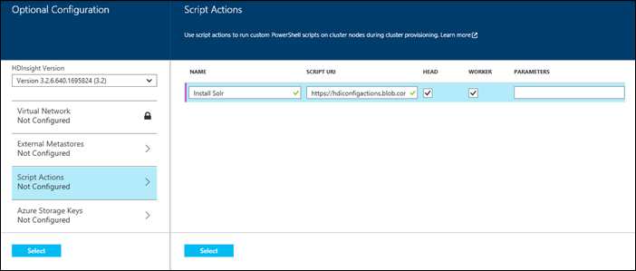

<!-- not suitable for Mooncake -->

<properties
	pageTitle="使用脚本操作在 Hadoop 群集上安装 Solr | Azure"
	description="了解如何使用 Solr 通过脚本操作自定义 HDInsight 群集。"
	services="hdinsight"
	documentationCenter=""
	authors="nitinme"
	manager="paulettm"
	editor="cgronlun"
	tags="azure-portal"/>

<tags
	ms.service="hdinsight"
	ms.date="02/05/2016"
	wacn.date="02/06/2017"/>

# 在 HDInsight Hadoop 群集上安装并使用 Solr

了解如何使用 Solr 通过脚本操作自定义基于 Windows 的 HDInsight 群集，以及如何使用 Solr 搜索数据。有关在基于 Linux 的群集中使用 Solr 的信息，请参阅[在 HDInsight Hadoop 群集 (Linux) 上安装和使用 Solr](/documentation/articles/hdinsight-hadoop-solr-install-linux/)。
 
你可以使用*脚本操作*，在 Azure HDInsight 的任何群集类型（Hadoop、Storm、HBase、Spark）上安装 Solr。用于在 HDInsight 群集上安装 Solr 的示例脚本可通过 [https://hdiconfigactions.blob.core.windows.net/solrconfigactionv01/solr-installer-v01.ps1](https://hdiconfigactions.blob.core.windows.net/solrconfigactionv01/solr-installer-v01.ps1) 上的只读 Azure 存储 Blob 获得。

示例脚本仅适用于 HDInsight 群集版本 3.1。有关 HDInsight 群集版本的详细信息，请参阅 [HDInsight 群集版本](/documentation/articles/hdinsight-component-versioning/)。

本主题中使用的示例脚本将使用特定配置创建基于 Windows 的 Solr 群集。如果你要使用不同集合、分片、架构、副本等配置 Solr 群集，则必须相应地修改脚本和 Solr 二进制文件。

**相关文章**

- [在 HDInsight Hadoop 群集 (Linux) 上安装和使用 Solr](/documentation/articles/hdinsight-hadoop-solr-install-linux/)
- [在 HDInsight 中创建 Hadoop 群集](/documentation/articles/hdinsight-provision-clusters/)：有关创建 HDInsight 群集的一般信息。
- [使用脚本操作自定义 HDInsight 群集][hdinsight-cluster-customize]：有关使用脚本操作自定义 HDInsight 群集的一般信息。
- [为 HDInsight 开发脚本操作脚本](/documentation/articles/hdinsight-hadoop-script-actions/)。

## 什么是 Solr？

<a href="http://lucene.apache.org/solr/features.html" target="_blank">Apache Solr</a> 是一种企业搜索平台，用于对数据实现功能强大的全文搜索。虽然 Hadoop 可用于存储和管理大量数据，但是，Apache Solr 提供了快速检索数据的搜索功能。

## 使用门户安装 Solr

[AZURE.INCLUDE [hdinsight-azure-preview-portal](../includes/hdinsight-azure-preview-portal.md)]

* [在 HDInsight 群集上安装 Solr](/documentation/articles/hdinsight-hadoop-solr-install-linux/)

1. 如[在 HDInsight 中创建 Hadoop 群集](/documentation/articles/hdinsight-provision-clusters/)中所述，使用“自定义创建”选项开始创建群集。
2. 在向导的“脚本操作”页上，单击“添加脚本操作”，以提供有关脚本操作的详细信息，如下所示：

	

	<table border='1'>
		<tr><th>属性</th><th>值</th></tr>
		<tr><td>Name</td>
			<td>指定脚本操作的名称。例如 <b>Install Solr</b>。</td></tr>
		<tr><td>脚本 URI</td>
			<td>指定调用以自定义群集的脚本的统一资源标识符 (URI)。例如 <i>https://hdiconfigactions.blob.core.windows.net/solrconfigactionv01/solr-installer-v01.ps1</i></td></tr>
		<tr><td>节点类型</td>
			<td>指定在其上运行自定义脚本的节点。你可以选择“所有节点”<b></b>、“仅限头节点”<b></b>或“仅限工作节点”<b></b>。
		<tr><td>参数</td>
			<td>根据脚本的需要，指定参数。用于安装 Solr 的脚本不需要任何参数，因此，你可以将此项保留为空。</td></tr>
	</table>

	你可以添加多个脚本操作，以在群集上安装多个组件。在添加了脚本后，单击复选标记以开始创建群集。

## 使用 Solr

你必须从使用一些数据文件为 Solr 编制索引开始。然后，可以使用 Solr 对索引数据运行搜索查询。执行以下步骤，以在 HDInsight 群集中使用 Solr：

1. **使用远程桌面协议 (RDP) 远程连接到安装有 Solr 的 HDInsight 群集**。在 Azure 门户预览中，对你创建的安装有 Solr 的群集启用远程桌面，然后远程连接到该群集。有关说明，请参阅[使用 RDP 连接到 HDInsight 群集](/documentation/articles/hdinsight-administer-use-management-portal/#connect-to-clusters-using-rdp)。

2. **通过上传数据文件为 Solr 编制索引**。在为 Solr 编制索引时，你应将可能需要搜索的文档放置在其中。若要为 Solr 编制索引，请使用 RDP 远程连接到群集、导航到桌面、打开 Hadoop 命令行，然后导航到 **C:\\apps\\dist\\solr-4.7.2\\example\\exampledocs**。运行以下命令：

		java -jar post.jar solr.xml monitor.xml

	你将会在控制台上看到以下输出：

		POSTing file solr.xml
		POSTing file monitor.xml
		2 files indexed.
		COMMITting Solr index changes to http://localhost:8983/solr/update..
		Time spent: 0:00:01.624

	post.jar 实用工具通过以下两个示例文档为 Solr 编制索引：**solr.xml** 和 **monitor.xml**。post.jar 实用工具和示例文档随 Solr 安装一起提供。

3. **使用 Solr 仪表板在索引文档中搜索**。在连接到 HDInsight 群集的 RDP 会话中，打开 Internet Explorer，然后启动位于 ****http://headnodehost:8983/solr/#/** 的 Solr 仪表板。在左侧窗格的“核心选择器”下拉列表中，选择**“collection1”**，然后在其中单击“查询”。作为示例，若要在 Solr 中选择并返回所有文档，请提供以下值：

	* 在 **q** 文本框中，输入 ***:***。这将返回所有已在 Solr 中编制索引的文档。如果你要在文档中搜索特定字符串，则可以在此处输入该字符串。
	
	* 在 **wt** 文本框中，选择输出格式。默认值为 **json**。单击“执行查询”。

	
	
	输出返回两个我们用于为 Solr 编制索引的文档。输出如下所示：

			"response": {
			    "numFound": 2,
			    "start": 0,
			    "maxScore": 1,
			    "docs": [
			      {
			        "id": "SOLR1000",
			        "name": "Solr, the Enterprise Search Server",
			        "manu": "Apache Software Foundation",
			        "cat": [
			          "software",
			          "search"
			        ],
			        "features": [
			          "Advanced Full-Text Search Capabilities using Lucene",
			          "Optimized for High Volume Web Traffic",
			          "Standards Based Open Interfaces - XML and HTTP",
			          "Comprehensive HTML Administration Interfaces",
			          "Scalability - Efficient Replication to other Solr Search Servers",
			          "Flexible and Adaptable with XML configuration and Schema",
			          "Good unicode support: héllo (hello with an accent over the e)"
			        ],
			        "price": 0,
			        "price_c": "0,USD",
			        "popularity": 10,
			        "inStock": true,
			        "incubationdate_dt": "2006-01-17T00:00:00Z",
			        "_version_": 1486960636996878300
			      },
			      {
			        "id": "3007WFP",
			        "name": "Dell Widescreen UltraSharp 3007WFP",
			        "manu": "Dell, Inc.",
			        "manu_id_s": "dell",
			        "cat": [
			          "electronics and computer1"
			        ],
			        "features": [
			          "30" TFT active matrix LCD, 2560 x 1600, .25mm dot pitch, 700:1 contrast"
			        ],
			        "includes": "USB cable",
			        "weight": 401.6,
			        "price": 2199,
			        "price_c": "2199,USD",
			        "popularity": 6,
			        "inStock": true,
			        "store": "43.17614,-90.57341",
			        "_version_": 1486960637584081000
			      }
			    ]
			  }

4. **建议：将索引数据从 Solr 备份到与 HDInsight 群集关联的 Azure Blob 存储**。作为一种很好的做法，你应该将索引数据从 Solr 群集节点备份到 Azure Blob 存储上。执行以下步骤来完成此操作：

	1. 在 RDP 会话中，打开 Internet Explorer，然后指向以下 URL：

			http://localhost:8983/solr/replication?command=backup

		你应该看到如下所示的响应：

			<?xml version="1.0" encoding="UTF-8"?>
			<response>
			  <lst name="responseHeader">
			    <int name="status">0</int>
			    <int name="QTime">9</int>
			  </lst>
			  <str name="status">OK</str>
			</response>

	2. 在远程会话中，导航到 {SOLR\_HOME}{Collection}\\data。对于通过示例脚本创建的群集，该目录应该是 **C:\\apps\\dist\\solr-4.7.2\\example\\solr\\collection1\\data**。在此位置，你应该会看到使用类似于 **snapshot.*timestamp*** 的名称创建的快照文件夹。

	3. 压缩快照文件夹，并将其上传到 Azure Blob 存储。从 Hadoop 命令行，通过使用以下命令导航到快照文件夹所在的位置：

			  hadoop fs -CopyFromLocal snapshot._timestamp_.zip /example/data

		此命令会将快照复制到与群集关联的默认存储帐户中容器下方的 /example/data/。

## 使用 Azure PowerShell 安装 Solr

请参阅[使用脚本操作自定义 HDInsight 群集](/documentation/articles/hdinsight-hadoop-customize-cluster/#call_scripts_using_powershell)。此示例演示如何使用 Azure PowerShell 安装 Spark。你需要自定义脚本以使用 [https://hdiconfigactions.blob.core.windows.net/solrconfigactionv01/solr-installer-v01.ps1](https://hdiconfigactions.blob.core.windows.net/solrconfigactionv01/solr-installer-v01.ps1)。

## 使用 .NET SDK 安装 Solr

请参阅[使用脚本操作自定义 HDInsight 群集](/documentation/articles/hdinsight-hadoop-customize-cluster/#call-scripts-using-azure-powershell)。此示例演示如何使用 .NET SDK 安装 Spark。你需要自定义脚本以使用 [https://hdiconfigactions.blob.core.windows.net/solrconfigactionv01/solr-installer-v01.ps1](https://hdiconfigactions.blob.core.windows.net/solrconfigactionv01/solr-installer-v01.ps1)。

## 另请参阅

- [在 HDInsight Hadoop 群集 (Linux) 上安装和使用 Solr](/documentation/articles/hdinsight-hadoop-solr-install-linux/)
- [在 HDInsight 中创建 Hadoop 群集](/documentation/articles/hdinsight-provision-clusters/)：有关创建 HDInsight 群集的一般信息。
- [使用脚本操作自定义 HDInsight 群集][hdinsight-cluster-customize]：有关使用脚本操作自定义 HDInsight 群集的一般信息。
- [为 HDInsight 开发脚本操作脚本](/documentation/articles/hdinsight-hadoop-script-actions/)。
- [在 HDInsight 群集上安装和使用 Spark][hdinsight-install-spark]：有关安装 Spark 的脚本操作示例。
- [在 HDInsight 群集上安装 R][hdinsight-install-r]：有关安装 R 的脚本操作示例。
- [在 HDInsight 群集上安装 Giraph](/documentation/articles/hdinsight-hadoop-giraph-install/)：有关安装 Giraph 的脚本操作示例。

[powershell-install-configure]: /documentation/articles/powershell-install-configure/
[hdinsight-provision]: /documentation/articles/hdinsight-provision-clusters/
[hdinsight-install-r]: /documentation/articles/hdinsight-hadoop-r-scripts/
[hdinsight-install-spark]: /documentation/articles/hdinsight-hadoop-spark-install/
[hdinsight-cluster-customize]: /documentation/articles/hdinsight-hadoop-customize-cluster/

<!---HONumber=Mooncake_Quality_Review_1215_2016-->