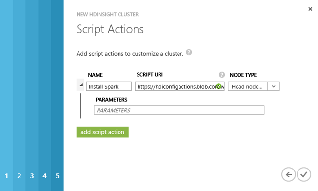
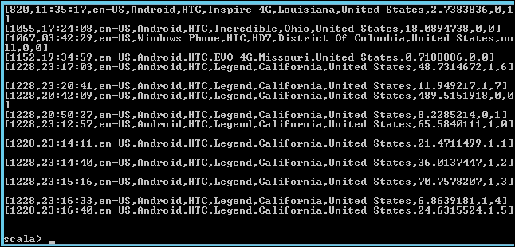

<properties 
	pageTitle="使用脚本操作在 Hadoop 群集上安装 Spark | Azure" 
	description="了解如何使用 Spark 自定义 HDInsight 群集。你将使用脚本操作配置选项来通过脚本安装 Spark。" 
	services="hdinsight" 
	documentationCenter="" 
	authors="nitinme" 
	manager="paulettm" 
	editor="cgronlun"/>

<tags 
	ms.service="hdinsight" 
	ms.date="07/11/2015" 
	wacn.date="02/06/2017" />

# 在 HDInsight Hadoop 群集上安装并使用 Spark

你可以通过使用**脚本操作**群集自定义在 Azure HDInsight 上 Hadoop 中任何类型的群集上安装 Spark。仅当创建群集时，你才能通过脚本操作运行脚本来自定义群集。有关详细信息，请参阅[使用脚本操作自定义 HDInsight 群集][hdinsight-cluster-customize]。

在本主题中，你将学习如何通过使用脚本操作安装 Spark。在安装了 Spark 后，你还将学习如何在 HDInsight 群集上运行 Spark 查询。

## 什么是 Spark？

<a href="http://spark.apache.org/docs/latest/index.html" target="_blank">Apache Spark</a> 是一种开放源代码并行处理框架，支持内存中处理，以提升大数据分析应用程序的性能。Spark 的内存中计算功能使其成为机器学习和图形计算中的迭代算法的最佳选择。

Spark 还可用于执行基于磁盘的传统数据处理。Spark 改进了传统的 MapReduce 框架，因为在中间阶段不必写入到磁盘。另外，Spark 与 Hadoop 分布式文件系统 (HDFS) 和 Azure Blob 存储兼容，以便现有的数据可通过 Spark 进行轻松处理。

本主题提供有关如何自定义 HDInsight 群集以安装 Spark 的说明。

## 可以安装哪个版本的 Spark？

在本主题中，我们使用脚本操作自定义脚本在 HDInsight 群集上安装 Spark。此脚本可以安装 Spark 1.2.0 或 Spark 1.0.2，具体视你设置的 HDInsight 群集的版本而定。

- 如果你在预配 **HDInsight 3.2** 群集时使用脚本，则该脚本将安装 **Spark 1.2.0**。
- 如果你在预配 **HDInsight 3.1** 群集时使用脚本，则该脚本将安装 **Spark 1.0.2**。 

你可以修改此脚本，或创建自己的脚本，以安装其他版本的 Spark。

## 如何安装 Spark？

用于在 HDInsight 群集上安装 Spark 的示例脚本可通过 [https://hdiconfigactions.blob.core.windows.net/sparkconfigactionv03/spark-installer-v03.ps1](https://hdiconfigactions.blob.core.windows.net/sparkconfigactionv03/spark-installer-v03.ps1) 上的只读 Azure 存储 Blob 获得。本部分提供有关如何在通过使用 Azure 门户预览设置群集时使用示例脚本的说明。

> [AZURE.NOTE]该示例脚本仅适用于 HDInsight 3.1 和 3.2 群集。有关 HDInsight 群集版本的详细信息，请参阅 [HDInsight 群集版本](/documentation/articles/hdinsight-component-versioning/)。

1. 根据[使用自定义选项预配群集](/documentation/articles/hdinsight-provision-clusters/)中的说明，使用“自定义创建”选项开始预配群集。选取群集版本，具体视以下内容而定：

	- 如果你要安装 **Spark 1.2.0**，请预配 HDInsight 3.2 群集。
	- 如果你要安装 **Spark 1.0.2**，请预配 HDInsight 3.1 群集。

2. 在向导的“脚本操作”页上，单击“添加脚本操作”，以提供有关脚本操作的详细信息，如下所示：

	
	
	<table border='1'>
	<tr><th>属性</th><th>值</th></tr>
	<tr><td>Name</td>
		<td>指定脚本操作的名称。例如，<b>Install Spark</b>。</td></tr>
	<tr><td>脚本 URI</td>
		<td>指定调用以自定义群集的脚本的统一资源标识符 (URI)。例如，<i>https://hdiconfigactions.blob.core.windows.net/sparkconfigactionv03/spark-installer-v03.ps1</i></td></tr>
	<tr><td>节点类型</td>
		<td>指定在其上运行自定义脚本的节点。你可以选择“所有节点”、“仅限头节点”或“仅限从节点”<b></b><b></b><b></b>。
	<tr><td>Parameters</td>
		<td>根据脚本的需要，指定参数。用于安装 Spark 的脚本不需要任何参数，因此，你可以将此项保留为空。</td></tr>
	</table>

你可以添加多个脚本操作，以在群集上安装多个组件。在添加了脚本后，单击复选标记以开始设置群集。

你还可以通过 Azure PowerShell 或 HDInsight .NET SDK 使用脚本在 HDInsight 上安装 Spark。本主题后面将提供有关这些过程的说明。

## 如何在 HDInsight 中使用 Spark？
Spark 提供用 Scala、Python 和 Java 编写的 API。你还可以使用交互式 Spark shell 来运行 Spark 查询。本部分提供有关如何通过不同方法来使用 Spark 的说明：

- [使用 Spark shell 来运行交互式查询](#sparkshell)
- [使用 Spark shell 来运行 Spark SQL 查询](#sparksql) 
- [使用独立的 Scala 程序](#standalone)

### 使用 Spark shell 来运行交互式查询
执行以下步骤以从交互式 Spark shell 运行 Spark 查询。在本部分中，我们将对默认情况下在 HDInsight 群集上可用的示例数据文件 (/example/data/gutenberg/davinci.txt) 运行 Spark 查询。

1. 在 Azure 门户预览中，对你创建的安装有 Spark 的群集启用远程桌面，然后远程连接到该群集。有关说明，请参阅<a href="/documentation/articles/hdinsight-administer-use-management-portal/#connect-to-clusters-using-rdp" target="_blank">使用 RDP 连接到 HDInsight 群集</a>。

2. 在远程桌面协议 (RDP) 会话中，从桌面打开 Hadoop 命令行（通过桌面快捷方式），然后导航到 Spark 的安装位置；例如，**C:\apps\dist\spark-1.2.0**。

3. 运行以下命令以启动 Spark shell：

		 .\bin\spark-shell --master yarn

	在命令完成运行后，你应该获取 Scala 提示符：

		 scala>

5. 在 Scala 提示符中，输入如下所示的 Spark 查询。此查询会计算每个单词在 davinci.txt 文件中出现的次数，该文件位于与群集关联的 Azure Blob 存储上的 /example/data/gutenberg/ 位置处。

		val file = sc.textFile("/example/data/gutenberg/davinci.txt")
		val counts = file.flatMap(line => line.split(" ")).map(word => (word, 1)).reduceByKey(_ + _)
		counts.toArray().foreach(println)

6. 输出应如下所示：

	
		

7. 输入 :q 以退出 Scala 提示符。

		:q

### 使用 Spark shell 来运行 Spark SQL 查询

Spark SQL 允许你使用 Spark 运行以结构化查询语言 (SQL)、HiveQL 或 Scala 表达的关系查询。在本部分中，我们将了解如何使用 Spark 对示例 Hive 表运行 Hive 查询。在预配群集时，本部分中使用的 Hive 表（称为 **hivesampletable**）默认为可用。

>[AZURE.NOTE]以下示例是根据 **Spark 1.2.0** 创建的，如果你在预配 HDInsight 3.2 群集时运行脚本操作，则将安装该程序。

1. 在 Azure 门户预览中，对你创建的安装有 Spark 的群集启用远程桌面，然后远程连接到该群集。有关说明，请参阅<a href="/documentation/articles/hdinsight-administer-use-management-portal/#connect-to-clusters-using-rdp" target="_blank">使用 RDP 连接到 HDInsight 群集</a>。

2. 在 RDP 会话中，从桌面打开 Hadoop 命令行（通过桌面快捷方式），并导航到 Spark 的安装位置；例如，**C:\apps\dist\spark-1.2.0**。

3. 运行以下命令以启动 Spark shell：

		 .\bin\spark-shell --master yarn

	在命令完成运行后，你应该获取 Scala 提示符：

		 scala>

4. 在出现 Scala 提示符时，设置 Hive 上下文。这是通过 Spark 使用 Hive 查询所必需的。

		val hiveContext = new org.apache.spark.sql.hive.HiveContext(sc)

	请注意，**sc** 是启动 Spark shell 时设置的默认 Spark 上下文。

5. 通过使用 Hive 上下文运行 Hive 查询，并将输出打印到控制台。查询将检索特定 make 的设备上的数据，并将检索到的记录数限制为 20。

		hiveContext.sql("""SELECT * FROM hivesampletable WHERE devicemake LIKE "HTC%" LIMIT 20""").collect().foreach(println)

6. 你应该看到如下输出：

	

7. 输入 :q 以退出 Scala 提示符。

		:q

### 使用独立的 Scala 程序

在本部分中，我们将编写 Scala 应用程序，以计算在示例数据文件 (/example/data/gutenberg/davinci.txt) 中包含字母“a”和“b”的行数。默认情况下，该文件在 HDInsight 群集上提供。若要在使用 Spark 安装自定义的群集上编写并使用独立的 Scala 程序，你必须执行以下步骤：

- 编写 Scala 程序
- 构建 Scala 程序以获取 .jar 文件
- 在群集上运行作业

#### 编写 Scala 程序
在本部分中，你将编写 Scala 程序，以计算在示例数据文件中包含字母“a”和“b”的行数。

1. 打开文本编辑器，并粘贴以下代码：

		/* SimpleApp.scala */
		import org.apache.spark.SparkContext
		import org.apache.spark.SparkContext._
		import org.apache.spark.SparkConf
		
		object SimpleApp {
		  def main(args: Array[String]) {
		    val logFile = "/example/data/gutenberg/davinci.txt"			//Location of the sample data file on Azure Blob storage
		    val conf = new SparkConf().setAppName("SimpleApplication")
		    val sc = new SparkContext(conf)
		    val logData = sc.textFile(logFile, 2).cache()
		    val numAs = logData.filter(line => line.contains("a")).count()
		    val numBs = logData.filter(line => line.contains("b")).count()
		    println("Lines with a: %s, Lines with b: %s".format(numAs, numBs))
		  }
		}

2. 使用名称 **SimpleApp.scala** 保存文件。

#### 构建 Scala 程序
在本部分中，你将使用<a href="http://www.scala-sbt.org/0.13/docs/index.html" target="_blank">简单的构建工具</a>（或 sbt）构建 Scala 程序。sbt 需要 Java 1.6 或更高版本，因此，要确保你安装有正确版本的的 Java，然后才能继续完成本部分的内容。

1. 从 http://www.scala-sbt.org/0.13/tutorial/Installing-sbt-on-Windows.html 安装 sbt。
2. 创建名为 **SimpleScalaApp** 的文件夹，并在此文件夹中创建名为 **simple.sbt** 的文件。这是包含有关 Scala 版本和库依赖项等内容的信息的配置文件。将以下内容粘贴到 simple.sbt 文件中并保存它：

		name := "SimpleApp"
	
		version := "1.0"
	
		scalaVersion := "2.10.4"
	
		libraryDependencies += "org.apache.spark" %% "spark-core" % "1.2.0"

	>[AZURE.NOTE]确保你在该文件中保留有空行。

	
3. 在 **SimpleScalaApp** 文件夹下，创建目录结构 **\src\main\scala**，并粘贴你以前在 \src\main\scala 文件夹下创建的 Scala 程序 (**SimpleApp.scala**)。
4. 打开命令提示符，导航到 SimpleScalaApp 目录，然后输入以下命令：

		sbt package

	在编译了应用程序后，你将在 **\target\scala-2.10** 目录下的根 SimpleScalaApp 文件夹中看到 **simpleapp_2.10-1.0.jar** 文件。

#### 在群集上运行作业
在本部分中，你将远程连接到安装有 Spark 的群集，然后复制 SimpleScalaApp 项目的目标文件夹。然后，你将使用 **spark-submit** 命令在群集上提交作业。

1. 远程连接到安装有 Spark 的群集。从你编写和构建 SimpleApp.scala 程序的计算机，复制 **SimpleScalaApp\target** 文件夹，并将其粘贴到群集上的某个位置。
2. 在 RDP 会话中，从桌面打开 Hadoop 命令行，然后导航到你将 **target** 文件夹粘贴到的位置。
3. 输入以下命令以运行 SimpleApp.scala 程序：

		C:\apps\dist\spark-1.2.0\bin\spark-submit --class "SimpleApp" --master local target/scala-2.10/simpleapp_2.10-1.0.jar

4. 在程序完成运行后，输出将显示在控制台上。

		Lines with a: 21374, Lines with b: 11430

## 通过使用 Azure PowerShell 在 HDInsight Hadoop 群集上安装 Spark

在本部分中，我们使用 **<a href = "http://msdn.microsoft.com/zh-cn/library/dn858088.aspx" target="_blank">Add-AzureHDInsightScriptAction</a>** cmdlet 通过脚本操作来调用脚本，以自定义群集。在继续前，确保你已安装并配置 Azure PowerShell。有关配置工作站以运行适用于 HDInsight 的 Azure Powershell cmdlet 的信息，请参阅[安装和配置 Azure PowerShell][powershell-install-configure]。

执行以下步骤：

1. 打开 Azure PowerShell 窗口，并声明以下变量：

		# Provide values for these variables
		$subscriptionName = "<SubscriptionName>"		# Name of the Azure subscription
		$clusterName = "<HDInsightClusterName>"			# HDInsight cluster name
		$storageAccountName = "<StorageAccountName>"	# Azure Storage account that hosts the default container
		$storageAccountKey = "<StorageAccountKey>"      # Key for the Storage account
		$containerName = $clusterName
		$location = "<MicrosoftDataCenter>"				# Location of the HDInsight cluster. It must be in the same data center as the Storage account.
		$clusterNodes = <ClusterSizeInNumbers>			# Number of nodes in the HDInsight cluster
		$version = "<HDInsightClusterVersion>"          # For example, "3.2"
	
2. 指定配置值，例如群集中的节点，以及要使用的默认存储。

		# Specify the configuration options
		Select-AzureSubscription $subscriptionName
		$config = New-AzureHDInsightClusterConfig -ClusterSizeInNodes $clusterNodes
		$config.DefaultStorageAccount.StorageAccountName="$storageAccountName.blob.core.chinacloudapi.cn"
		$config.DefaultStorageAccount.StorageAccountKey=$storageAccountKey
		$config.DefaultStorageAccount.StorageContainerName=$containerName
	
3. 使用 **Add-AzureHDInsightScriptAction** cmdlet 将脚本操作添加到群集配置。稍后，在创建群集时，将执行脚本操作。

		# Add a script action to the cluster configuration
		$config = Add-AzureHDInsightScriptAction -Config $config -Name "Install Spark" -ClusterRoleCollection HeadNode -Uri https://hdiconfigactions.blob.core.windows.net/sparkconfigactionv03/spark-installer-v03.ps1

	**Add-AzureHDInsightScriptAction** cmdlet 采用以下参数：

	<table style="border-color: #c6c6c6; border-width: 2px; border-style: solid; border-collapse: collapse;">
<tr>
<th style="border-color: #c6c6c6; border-width: 2px; border-style: solid; border-collapse: collapse; width:90px; padding-left:5px; padding-right:5px;">参数</th>
<th style="border-color: #c6c6c6; border-width: 2px; border-style: solid; border-collapse: collapse; width:550px; padding-left:5px; padding-right:5px;">定义</th></tr>
<tr>
<td style="border-color: #c6c6c6; border-width: 2px; border-style: solid; border-collapse: collapse; padding-left:5px;">Config</td>
<td style="border-color: #c6c6c6; border-width: 2px; border-style: solid; border-collapse: collapse; padding-left:5px; padding-right:5px;">脚本操作信息添加到的配置对象。</td></tr>
<tr>
<td style="border-color: #c6c6c6; border-width: 2px; border-style: solid; border-collapse: collapse; padding-left:5px;">Name</td>
<td style="border-color: #c6c6c6; border-width: 2px; border-style: solid; border-collapse: collapse; padding-left:5px;">脚本操作的名称。</td></tr>
<tr>
<td style="border-color: #c6c6c6; border-width: 2px; border-style: solid; border-collapse: collapse; padding-left:5px;">ClusterRoleCollection</td>
<td style="border-color: #c6c6c6; border-width: 2px; border-style: solid; border-collapse: collapse; padding-left:5px;">指定在其上运行自定义脚本的节点。有效值为 HeadNode（在头节点上安装）或 DataNode（在所有数据节点上安装）。你可以使用任一值或两个值。</td></tr>
<tr>
<td style="border-color: #c6c6c6; border-width: 2px; border-style: solid; border-collapse: collapse; padding-left:5px;">Uri</td>
<td style="border-color: #c6c6c6; border-width: 2px; border-style: solid; border-collapse: collapse; padding-left:5px;">指定执行的脚本的 URI。</td></tr>
<tr>
<td style="border-color: #c6c6c6; border-width: 2px; border-style: solid; border-collapse: collapse; padding-left:5px;">Parameters</td>
<td style="border-color: #c6c6c6; border-width: 2px; border-style: solid; border-collapse: collapse; padding-left:5px;">脚本所需的参数。本主题中使用的示例脚本不需要任何参数，因此，你在上述代码段中看不到此参数。
</td></tr>
</table>
	
4. 最后，开始设置安装有 Spark 的自定义群集。
	
		# Start provisioning a cluster with Spark installed
		New-AzureHDInsightCluster -Config $config -Name $clusterName -Location $location -Version $version 

出现提示时，请输入群集的凭据。创建群集可能需要几分钟时间。

## 通过使用 .NET SDK 在 HDInsight Hadoop 群集上安装 Spark

HDInsight .NET SDK 提供 .NET 客户端库，可简化从 .NET 应用程序使用 HDInsight 的操作。本部分提供有关如何使用 SDK 中的脚本操作来设置安装有 Spark 的群集的说明。必须执行以下过程：

- 安装 HDInsight .NET SDK
- 创建自签名证书
- 创建控制台应用程序
- 运行应用程序

**安装 HDInsight .NET SDK**

可以从 [NuGet](http://nuget.codeplex.com/wikipage?title=Getting%20Started) 安装该 SDK 的最新发行版。下一过程中将显示说明。

**创建自签名证书**

创建自签名证书，将其安装到工作站上，然后将其上传到你的 Azure 订阅。

**创建 Visual Studio 应用程序**

1. 打开 Visual Studio 2013。

2. 在“文件”菜单中，单击“新建”，然后单击“项目”。

3. 在“新建项目”中，键入或选择以下值：
	
	<table style="border-color: #c6c6c6; border-width: 2px; border-style: solid; border-collapse: collapse;">
<tr>
<th style="border-color: #c6c6c6; border-width: 2px; border-style: solid; border-collapse: collapse; width:90px; padding-left:5px; padding-right:5px;">属性</th>
<th style="border-color: #c6c6c6; border-width: 2px; border-style: solid; border-collapse: collapse; width:90px; padding-left:5px; padding-right:5px;">值</th></tr>
<tr>
<td style="border-color: #c6c6c6; border-width: 2px; border-style: solid; border-collapse: collapse; padding-left:5px;">类别</td>
<td style="border-color: #c6c6c6; border-width: 2px; border-style: solid; border-collapse: collapse; padding-left:5px; padding-right:5px;">模板/Visual C#/Windows</td></tr>
<tr>
<td style="border-color: #c6c6c6; border-width: 2px; border-style: solid; border-collapse: collapse; padding-left:5px;">模板</td>
<td style="border-color: #c6c6c6; border-width: 2px; border-style: solid; border-collapse: collapse; padding-left:5px;">控制台应用程序</td></tr>
<tr>
<td style="border-color: #c6c6c6; border-width: 2px; border-style: solid; border-collapse: collapse; padding-left:5px;">Name</td>
<td style="border-color: #c6c6c6; border-width: 2px; border-style: solid; border-collapse: collapse; padding-left:5px;">CreateSparkCluster</td></tr>
</table>

4. 单击“确定”以创建该项目。

5. 在“工具”菜单中，单击“Nuget Package Manager”，然后单击“Package Manager Console”。

6. 在控制台中运行下列命令以安装程序包：

		Install-Package Microsoft.WindowsAzure.Management.HDInsight

	此命令将从当前 Visual Studio 项目添加 .NET 库以及对这些库的引用。

7. 在“解决方案资源管理器”中，双击 **Program.cs** 将其打开。

8. 将下列 using 语句添加到文件顶部：

		using System.Security.Cryptography.X509Certificates;
		using Microsoft.WindowsAzure.Management.HDInsight;
		using Microsoft.WindowsAzure.Management.HDInsight.ClusterProvisioning;
		using Microsoft.WindowsAzure.Management.HDInsight.Framework.Logging;
	
9. 在 Main() 函数中，复制并粘贴以下代码，然后提供变量值：
		
        var clusterName = args[0];

        // Provide values for the variables
        string thumbprint = "<CertificateThumbprint>";  
        string subscriptionId = "<AzureSubscriptionID>";
        string location = "<MicrosoftDataCenterLocation>";
        string storageaccountname = "<AzureStorageAccountName>.blob.core.chinacloudapi.cn";
        string storageaccountkey = "<AzureStorageAccountKey>";
        string username = "<HDInsightUsername>";
        string password = "<HDInsightUserPassword>";
        int clustersize = <NumberOfNodesInTheCluster>;

        // Provide the certificate thumbprint to retrieve the certificate from the certificate store 
        X509Store store = new X509Store();
        store.Open(OpenFlags.ReadOnly);
        X509Certificate2 cert = store.Certificates.Cast<X509Certificate2>().First(item => item.Thumbprint == thumbprint);

        // Create an HDInsight client object
        HDInsightCertificateCredential creds = new HDInsightCertificateCredential(new Guid(subscriptionId), cert);
        var client = HDInsightClient.Connect(creds);
		client.IgnoreSslErrors = true;
        
        // Provide the cluster information
		var clusterInfo = new ClusterCreateParameters()
        {
            Name = clusterName,
            Location = location,
            DefaultStorageAccountName = storageaccountname,
            DefaultStorageAccountKey = storageaccountkey,
            DefaultStorageContainer = clusterName,
            UserName = username,
            Password = password,
            ClusterSizeInNodes = clustersize,
            Version = "3.2"
        };        

10. 将以下代码追加到 Main() 函数，以使用 [ScriptAction](http://msdn.microsoft.com/zh-cn/library/microsoft.windowsazure.management.hdinsight.clusterprovisioning.data.scriptaction.aspx) 类通过调用自定义脚本来安装 Spark。

		// Add the script action to install Spark
        clusterInfo.ConfigActions.Add(new ScriptAction(
          "Install Spark", // Name of the config action
          new ClusterNodeType[] { ClusterNodeType.HeadNode }, // List of nodes to install Spark on
          new Uri("https://hdiconfigactions.blob.core.windows.net/sparkconfigactionv03/spark-installer-v03.ps1"), // Location of the script to install Spark.
		  null //Because the script used does not require any parameters
        ));

11. 最后，创建群集。

		client.CreateCluster(clusterInfo);

11. 将更改保存到应用程序并构建解决方案。

**运行应用程序**

打开 Azure PowerShell 控制台，导航到保存 Visual Studio 项目的位置，导航到项目中的 \bin\debug 目录，然后运行以下命令：

	.\CreateSparkCluster <cluster-name>

提供群集名称，然后按 ENTER 以设置安装有 Spark 的群集。

## 另请参阅##
- [在 HDinsight 群集上安装 R][hdinsight-install-r]：提供有关如何使用群集自定义在 HDInsight Hadoop 群集上安装和使用 R 的说明。R 是一种用于统计计算的开放源代码语言和环境。它提供了数百个内置统计函数及其自己的编程语言，可结合各方面的函数编程和面向对象的编程。它还提供了各种图形功能。
- [在 HDInsight 群集上安装 Giraph](/documentation/articles/hdinsight-hadoop-giraph-install/)。使用群集自定义在 HDInsight Hadoop 群集上安装 Giraph。Giraph 可让你通过使用 Hadoop 执行图形处理，并可以在 Azure HDInsight 上使用。
- [在 HDInsight 群集上安装 Solr](/documentation/articles/hdinsight-hadoop-solr-install/)。使用群集自定义在 HDInsight Hadoop 群集上安装 Solr。Solr 允许你对存储的数据执行功能强大的搜索操作。

[hdinsight-provision]: /documentation/articles/hdinsight-provision-clusters/
[hdinsight-install-r]: /documentation/articles/hdinsight-hadoop-r-scripts/
[hdinsight-cluster-customize]: /documentation/articles/hdinsight-hadoop-customize-cluster/
[powershell-install-configure]: https://docs.microsoft.com/powershell/azureps-cmdlets-docs

<!---HONumber=67-->