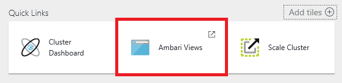
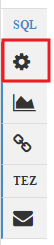
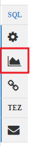
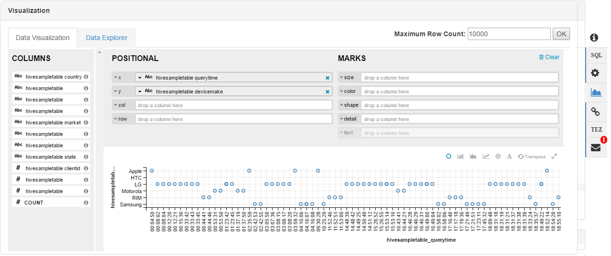
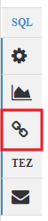
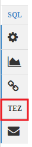
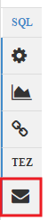

<properties
    pageTitle="使用 Ambari 视图来操作 HDInsight (Hadoop) 上的 Hive | Azure"
    description="了解如何从 Web 浏览器中使用 Hive 视图来提交 Hive 查询。Hive 视图是随基于 Linux 的 HDInsight 群集提供的 Ambari Web UI 的一部分。"
    services="hdinsight"
    documentationcenter=""
    author="Blackmist"
    manager="jhubbard"
    editor="cgronlun"
    tags="azure-portal" />
<tags
    ms.assetid="1abe9104-f4b2-41b9-9161-abbc43de8294"
    ms.service="hdinsight"
    ms.devlang="na"
    ms.topic="article"
    ms.tgt_pltfrm="na"
    ms.workload="big-data"
    ms.date="02/08/2017"
    wacn.date="03/10/2017"
    ms.author="larryfr" />  

# 将 Hive 视图与 HDInsight 中的 Hadoop 配合使用

[AZURE.INCLUDE [hive-selector](../../includes/hdinsight-selector-use-hive.md)]

Ambari 是一个管理和监控实用程序，随基于 Linux 的 HDInsight 群集一起提供。通过 Ambari 提供的功能之一是可用于运行 Hive 查询的 Web UI。这就是“Hive 视图”，它是随 HDInsight 群集一起提供的 Ambari 视图的一部分。

> [AZURE.NOTE]
Ambari 还有许多本文档中未讨论的功能。有关详细信息，请参阅 [Manage HDInsight clusters by using the Ambari Web UI](/documentation/articles/hdinsight-hadoop-manage-ambari/)（使用 Ambari Web UI 管理 HDInsight 群集）。

## 先决条件

* 基于 Linux 的 HDInsight 群集。有关创建群集的信息，请参阅[基于 Linux 的 HDInsight 入门](/documentation/articles/hdinsight-hadoop-linux-tutorial-get-started/)。

> [AZURE.IMPORTANT]
本文档中的步骤需要使用 Linux 的 HDInsight 群集。Linux 是在 HDInsight 3.4 版或更高版本上使用的唯一操作系统。有关详细信息，请参阅 [HDInsight 在 Windows 上弃用](/documentation/articles/hdinsight-component-versioning/#hdi-version-33-nearing-deprecation-date)。

## 打开 Hive 视图

可从 Azure 门户预览中获取 Ambari 视图；选择 HDInsight 群集，然后从“快速链接”部分选择“Ambari 视图”。

  

还可以通过在 Web 浏览器中转到 https://CLUSTERNAME.azurehdinsight.cn 来直接导航到 Ambari。将 **CLUSTERNAME** 替换为 HDInsight 群集的名称。从“管理”链接旁边的页面菜单中选择一组方块来列出可用视图。选择“Hive 视图”。

。

> [AZURE.NOTE]
访问 Ambari 时，系统将提示向该站点进行身份验证。请输入创建群集时使用的管理员（默认为 `admin`）帐户名和密码。

你应看到类似于下面的页面：

  

## 查看表
在页面的“数据库资源管理器”部分中，选择“数据库”选项卡上的“默认”条目。这将显示默认数据库中的表列表。对于新的 HDInsight 群集，只应存在一个表；**hivesampletable**。

  

由于表是通过执行本文档中的步骤添加的，因此可使用数据库资源管理器右上角的刷新图标来刷新该列表。

## 查询编辑器

使用以下步骤从 Hive 视图执行 Hive 查询。

1. 在此页面的“查询编辑器”中，将以下 HiveQL 语句粘贴到工作表中：

        DROP TABLE log4jLogs;
        CREATE EXTERNAL TABLE log4jLogs(t1 string, t2 string, t3 string, t4 string, t5 string, t6 string, t7 string)
        ROW FORMAT DELIMITED FIELDS TERMINATED BY ' '
        STORED AS TEXTFILE LOCATION '/example/data/';
        SELECT t4 AS sev, COUNT(*) AS cnt FROM log4jLogs WHERE t4 = '[ERROR]' GROUP BY t4;

    这些语句可执行以下操作：
   
    * **DROP TABLE** - 删除表和数据文件（如果该表已存在）。

    * **CREATE EXTERNAL TABLE** - 在 Hive 中创建新的外部表。外部表仅在 Hive 中存储表定义。数据将保留在原始位置。

    * **ROW FORMAT** - 告知 Hive 如何设置数据的格式。在本例中，每个日志中的字段以空格分隔。

    * **STORED AS TEXTFILE LOCATION** - 告知 Hive 数据的存储位置（example/data 目录），且数据已存储为文本。

    * **SELECT** - 选择 t4 列包含值 [ERROR] 的所有行的计数。
     
     > [AZURE.NOTE]
     当需要外部源更新基础数据时，应使用外部表。例如，自动执行的数据上载过程，或其他 MapReduce 操作。删除外部表*不会*删除数据，只会删除表定义。

2. 若要启动查询，请单击查询编辑器底部的“执行”按钮。该按钮将变为橙色并且文本将更改为“停止执行”。“查询进程结果”部分应出现在“查询编辑器”下方，并显示有关作业的信息。
   
    > [AZURE.IMPORTANT]
    某些浏览器可能无法正确刷新日志或结果信息。如果运行一个作业，而它看上去似乎会永久运行下去而不更新日志或返回结果，请尝试改为使用 Mozilla FireFox 或 Google Chrome。
 
3. 查询完成后，“查询进程结果”部分将显示该操作的结果。查询完成后，“停止执行”按钮也将变回绿色“执行”按钮。“结果”选项卡应包含以下信息：
   
        sev       cnt
        [ERROR]   3
   
    “日志”选项卡可用于查看作业创建的日志记录信息。
   
    > [AZURE.TIP]
    T“查询进程结果”部分右上角的“保存结果”下拉对话框允许你下载或保存结果。

4. 选择此查询的前四行，然后选择“执行”。请注意，作业完成时没有结果。在选择了查询的一部分时使用“执行”按钮只会运行所选语句。在这种情况下，所选内容不包括会从表中检索行的最后一条语句。如果只选择该行并使用“执行”，应该会看到预期的结果。

5. 若要添加新工作表，请使用**查询编辑器**底部的“新建工作表”按钮。在新工作表中，输入以下 HiveQL 语句：

        CREATE TABLE IF NOT EXISTS errorLogs (t1 string, t2 string, t3 string, t4 string, t5 string, t6 string, t7 string) STORED AS ORC;
        INSERT OVERWRITE TABLE errorLogs SELECT t1, t2, t3, t4, t5, t6, t7 FROM log4jLogs WHERE t4 = '[ERROR]';

    这些语句可执行以下操作：
   
    * **CREATE TABLE IF NOT EXISTS** - 创建表（如果该表不存在）。由于未使用 **EXTERNAL** 关键字，因此这是一个内部表，它存储在 Hive 数据仓库中并完全由 Hive 管理。与外部表不同，删除内部表会同时删除基础数据。
    * **STORED AS ORC** - 以优化行纵栏表 (ORC) 格式存储数据。这是高度优化且有效的 Hive 数据存储格式。
    * **INSERT OVERWRITE ...SELECT** - 从包含 [ERROR] 的 **log4jLogs** 表中选择行，然后将数据插入 **errorLogs** 表中。
     
     使用“执行”按钮运行此查询。“结果”选项卡不会包含任何信息，因为此查询未返回任何行，但状态应显示为“已成功”。

### Hive 设置

选择编辑器右侧的“设置”图标。

  

“设置”可用于更改各种 Hive 设置，例如将 Hive 的执行引擎从 Tez（默认值）更改为 MapReduce。

### 可视化

选择编辑器右侧的“可视化效果”图标。

  

这将打开可视化界面，用户可以在其中创建从查询返回的数据的可视化效果。以下是使用 HDInsight 附带的 `hivesampletable` 的数据的示例可视化效果。

  

### Visual explain

选择编辑器右侧的“Visual Explain”图标。

  

这是查询的“Visual Explain”视图，可以帮助理解复杂查询的流程。可以使用“查询编辑器”中的“说明”按钮查看此视图的文本等效内容。

  

### Tez

选择编辑器右侧的“Tez”图标。

  

这将显示 Tez 用于此查询的有向无环图 (DAG)（如果有可用的）。如果想要查看过去已运行的查询的 DAG，或调试 Tez 进程，请改用 [Tez 视图](/documentation/articles/hdinsight-debug-ambari-tez-view/)。

### 通知

选择编辑器右侧的“通知”图标。

  

通知是运行查询时生成的消息。例如，当提交查询或发生错误时，会收到通知。

## 已保存的查询

1. 在“查询编辑器”中，创建一个工作表，并输入以下查询：

        SELECT * from errorLogs;

    执行查询以验证其是否正常工作。结果类似于以下示例：
   
        errorlogs.t1     errorlogs.t2     errorlogs.t3     errorlogs.t4     errorlogs.t5     errorlogs.t6     errorlogs.t7
        2012-02-03     18:35:34     SampleClass0     [ERROR]     incorrect     id     
        2012-02-03     18:55:54     SampleClass1     [ERROR]     incorrect     id     
        2012-02-03     19:25:27     SampleClass4     [ERROR]     incorrect     id

2. 使用编辑器底部的“另存为”按钮。将此查询命名为“错误日志”，然后选择“确定”。工作表的名称将更改为 **Errorlogs**。

3. 选择 Hive 视图页面顶部的“已保存的查询”选项卡。**Errorlogs** 现列为已保存的查询。它会保留在此列表中，直至被删除。选择名称将在查询编辑器中打开查询。

## 查询历史记录

可使用 Hive 视图顶部的“历史记录”按钮查看先前运行过的查询。现在使用该按钮，并选择之前运行过的一些查询。选定一个查询后，它会在“查询编辑器”中打开。

## 用户定义的函数 (UDF)

还可以通过**用户定义的函数 (UDF)** 扩展 Hive。UDF 允许你实现 HiveQL 中不容易建模的功能或逻辑。

使用 Hive 视图顶部的 UDF 选项卡可声明并保存一组可用于“查询编辑器”的 UDF。

将 UDF 添加到 Hive 视图后，“查询编辑器”底部会显示一个“插入 UDF”按钮。选择此选项卡将显示 Hive 视图中定义的 UDF 的下拉列表。选择一个 UDF 可向查询添加 HiveQL 语句以启用 UDF。

例如，如果定义了一个具有以下属性的 UDF：

* 资源名称：myudfs

* 资源路径：/myudfs.jar

* UDF 名称：myawesomeudf

* UDF 类名称：com.myudfs.Awesome

使用“插入 UDF”按钮将显示一个名为 **myudfs** 的条目，以及另一个为该资源定义的每个 UDF 的下拉列表。在本例中，为 **myawesomeudf**。选择此条目将在查询的开头添加以下内容：

    add jar /myudfs.jar;
    create temporary function myawesomeudf as 'com.myudfs.Awesome';

然后便可在查询中使用 UDF。例如，`SELECT myawesomeudf(name) FROM people;`。

有关如何将 UDF 与 HDInsight 上的 Hive 配合使用的详细信息，请参阅以下资源：

* [在 HDInsight 中将 Python 与 Hive 和 Pig 配合使用](/documentation/articles/hdinsight-python/)
* [如何将自定义 Hive UDF 添加到 HDInsight](http://blogs.msdn.com/b/bigdatasupport/archive/2014/01/14/how-to-add-custom-hive-udfs-to-hdinsight.aspx)

## 后续步骤
有关 HDInsight 中的 Hive 的一般信息：

* [将 Hive 与 HDInsight 上的 Hadoop 配合使用](/documentation/articles/hdinsight-use-hive/)

有关 HDInsight 上 Hadoop 的其他使用方法的信息：

* [将 Pig 与 HDInsight 上的 Hadoop 配合使用](/documentation/articles/hdinsight-use-pig/)
* [将 MapReduce 与 HDInsight 上的 Hadoop 配合使用](/documentation/articles/hdinsight-use-mapreduce/)

<!---HONumber=Mooncake_0306_2017-->
<!--Update_Description: add information about HDInsight Windows is going to be abandoned and add "visualization"-->