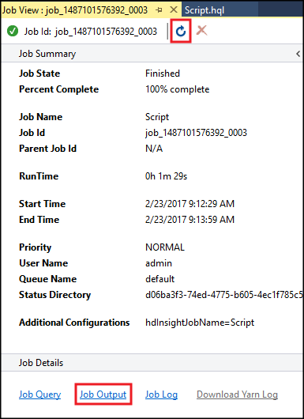

<properties
    pageTitle="使用 Hadoop Tools for Visual Studio 执行 Hive 查询 | Azure"
    description="了解如何通过 Visual Studio Hadoop 工具将 Hive 与 HDInsight 中的 Hadoop 配合使用。"
    services="hdinsight"
    documentationcenter=""
    author="Blackmist"
    manager="jhubbard"
    editor="cgronlun"
    tags="azure-portal" />
<tags
    ms.assetid="2b3e672a-1195-4fa5-afb7-b7b73937bfbe"
    ms.service="hdinsight"
    ms.devlang="na"
    ms.topic="article"
    ms.tgt_pltfrm="na"
    ms.workload="big-data"
    ms.date="02/28/2017"
    wacn.date="03/31/2017"
    ms.author="larryfr" />

# 使用适用于 Visual Studio 的 HDInsight 工具运行 Hive 查询

[AZURE.INCLUDE [hive-selector](../../includes/hdinsight-selector-use-hive.md)]

[AZURE.INCLUDE [azure-sdk-developer-differences](../../includes/azure-sdk-developer-differences.md)]

了解如何使用用于 Visual Studio 的 HDInsight 工具将 Hive 查询提交到 HDInsight 群集。

[AZURE.INCLUDE [azure-sdk-developer-differences](../../includes/azure-visual-studio-login-guide.md)]

## 先决条件

若要完成本文中的步骤，需要以下项。

* Azure HDInsight（HDInsight 上的 Hadoop）群集

    > [AZURE.IMPORTANT]
    Linux 是在 HDInsight 3.4 版或更高版本上使用的唯一操作系统。有关详细信息，请参阅 [HDInsight 在 Windows 上弃用](/documentation/articles/hdinsight-component-versioning/#hdi-version-32-and-33-nearing-deprecation-date)。

* Visual Studio（以下版本之一）：
  
    * 包含 [Update 4](https://www.microsoft.com/download/details.aspx?id=44921) 的 Visual Studio 2013 Community/Professional/Premium/Ultimate
  
    * Visual Studio 2015（任何版本）

    * Visual Studio 2017（任何版本）

* 用于 Visual Studio 的 HDInsight 工具或用于 Visual Studio 的 Azure Data Lake 工具。有关安装和配置这些工具的信息，请参阅[开始使用适用于 HDInsight 的 Visual Studio Hadoop 工具](/documentation/articles/hdinsight-hadoop-visual-studio-tools-get-started/)。

##  使用 Visual Studio 运行 Hive 查询

1. 打开 Visual Studio，然后选择“新建”>“项目”>“Azure Data Lake”>“HIVE”>“Hive 应用程序”。为此项目提供一个名称。

2. 打开在创建此项目时产生的 **Script.hql** 文件，并在其中粘贴以下 HiveQL 语句：

        set hive.execution.engine=tez;
        DROP TABLE log4jLogs;
        CREATE EXTERNAL TABLE log4jLogs (t1 string, t2 string, t3 string, t4 string, t5 string, t6 string, t7 string)
        ROW FORMAT DELIMITED FIELDS TERMINATED BY ' '
        STORED AS TEXTFILE LOCATION '/example/data/';
        SELECT t4 AS sev, COUNT(*) AS count FROM log4jLogs WHERE t4 = '[ERROR]' AND  INPUT__FILE__NAME LIKE '%.log' GROUP BY t4;

    这些语句可执行以下操作：
   
    * `DROP TABLE`：如果该表存在，此语句会将其删除。

    * `CREATE EXTERNAL TABLE`：在 Hive 中创建一个新的“外部”表。外部表仅在 Hive 中存储表定义；数据会保留在原始位置。
     
        > [AZURE.NOTE]
        如果希望以外部源更新基础数据（例如自动化数据上载过程），或以其他 MapReduce 操作更新基础数据，但希望 Hive 查询始终使用最新数据，则必须使用外部表。
        > 
  
        > 删除外部表**不会**删除数据，只会删除表定义。

    * `ROW FORMAT`：告知 Hive 如何设置数据的格式。在此情况下，每个日志中的字段以空格分隔。

    * `STORED AS TEXTFILE LOCATION`：告知 Hive 数据的存储位置（example/data 目录），以及数据以文本形式存储。

    * `SELECT`：选择其第 `t4` 列包含值 `[ERROR]` 的所有行计数。此语句会返回值 `3`，因为有三个行包含此值。

    * `INPUT__FILE__NAME LIKE '%.log'` - 告知 Hive，我们只应返回以 .log 结尾的文件中的数据。此子句将搜索限定为包含数据的 sample.log 文件。

3. 从工具栏中，选择要用于此查询的 **HDInsight 群集**。选择“提交”以 Hive 作业形式运行语句。

      

4. “Hive 作业摘要”会出现并显示有关正在运行的作业的信息。在“作业状态”更改为“已完成”之前，使用“刷新”链接刷新作业信息。

      

5. 使用“作业输出”链接查看此作业的输出。它显示 `[ERROR] 3`，这是此查询返回的值。

6. 也可以运行 Hive 查询，无需创建项目。使用“服务器资源管理器”，展开“Azure”>“HDInsight”，右键单击 HDInsight 服务器，然后选择“编写 Hive 查询”。

7. 在出现的 **temp.hql** 文档中，添加以下 HiveQL 语句：

        set hive.execution.engine=tez;
        CREATE TABLE IF NOT EXISTS errorLogs (t1 string, t2 string, t3 string, t4 string, t5 string, t6 string, t7 string) STORED AS ORC;
        INSERT OVERWRITE TABLE errorLogs SELECT t1, t2, t3, t4, t5, t6, t7 FROM log4jLogs WHERE t4 = '[ERROR]' AND INPUT__FILE__NAME LIKE '%.log';

    这些语句可执行以下操作：
   
    * `CREATE TABLE IF NOT EXISTS`：如果表尚不存在，则将创建表。由于未使用 `EXTERNAL` 关键字，因此此语句将创建内部表。内部表存储在 Hive 数据仓库中，并由 Hive 托管。
     
        > [AZURE.NOTE]
        与 `EXTERNAL` 表不同，删除内部表会同时删除基础数据。

    * `STORED AS ORC`：以优化的行纵栏式 (ORC) 格式存储数据。ORC 是高度优化且有效的 Hive 数据存储格式。

    * `INSERT OVERWRITE ... SELECT`：从包含 `[ERROR]` 的 `log4jLogs` 表中选择行，然后将数据插入 `errorLogs` 表中。

8. 从工具栏中，选择“提交”以运行该作业。使用“作业状态”确定作业是否已成功完成。

9. 若要确认作业已创建新表，请使用“服务器资源管理器”，展开“Azure”>“HDInsight”> HDInsight 群集 >“Hive 数据库”>“默认值”。将列出 **errorLogs** 表和 **log4jLogs** 表。

## 后续步骤

如你所见，用于 Visual Studio 的 HDInsight 工具提供了在 HDInsight 上使用 Hive 查询的轻松方式。

有关 HDInsight 中的 Hive 的一般信息：

* [将 Hive 与 HDInsight 上的 Hadoop 配合使用](/documentation/articles/hdinsight-use-hive/)

有关 HDInsight 上 Hadoop 的其他使用方法的信息：

* [将 Pig 与 HDInsight 上的 Hadoop 配合使用](/documentation/articles/hdinsight-use-pig/)

* [将 MapReduce 与 HDInsight 上的 Hadoop 配合使用](/documentation/articles/hdinsight-use-mapreduce/)

有关适用于 Visual Studio 的 HDInsight 工具的详细信息：

* [适用于 Visual Studio 的 HDInsight 工具入门](/documentation/articles/hdinsight-hadoop-visual-studio-tools-get-started/)

[hdinsight-sdk-documentation]: http://msdn.microsoft.com/zh-cn/library/dn479185.aspx

[azure-purchase-options]: /pricing/overview/
[azure-member-offers]: /pricing/member-offers/
[azure-trial]: /pricing/1rmb-trial/

[apache-tez]: http://tez.apache.org
[apache-hive]: http://hive.apache.org/
[apache-log4j]: http://zh.wikipedia.org/wiki/Log4j
[hive-on-tez-wiki]: https://cwiki.apache.org/confluence/display/Hive/Hive+on+Tez
[import-to-excel]: /documentation/articles/hdinsight-connect-excel-power-query/

[hdinsight-use-oozie]: /documentation/articles/hdinsight-use-oozie/
[hdinsight-analyze-flight-data]: /documentation/articles/hdinsight-analyze-flight-delay-data/

[hdinsight-storage]: /documentation/articles/hdinsight-hadoop-use-blob-storage/

[hdinsight-provision]: /documentation/articles/hdinsight-hadoop-provision-linux-clusters/
[hdinsight-submit-jobs]: /documentation/articles/hdinsight-submit-hadoop-jobs-programmatically/
[hdinsight-upload-data]: /documentation/articles/hdinsight-upload-data/
[hdinsight-get-started]: /documentation/articles/hdinsight-hadoop-linux-tutorial-get-started/

[powershell-here-strings]: http://technet.microsoft.com/zh-cn/library/ee692792.aspx

[image-hdi-hive-powershell]: ./media/hdinsight-use-hive/HDI.HIVE.PowerShell.png
[img-hdi-hive-powershell-output]: ./media/hdinsight-use-hive/HDI.Hive.PowerShell.Output.png
[image-hdi-hive-architecture]: ./media/hdinsight-use-hive/HDI.Hive.Architecture.png

<!---HONumber=Mooncake_0327_2017-->
<!--Update_Description: wording update-->