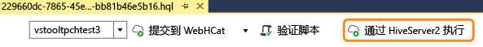
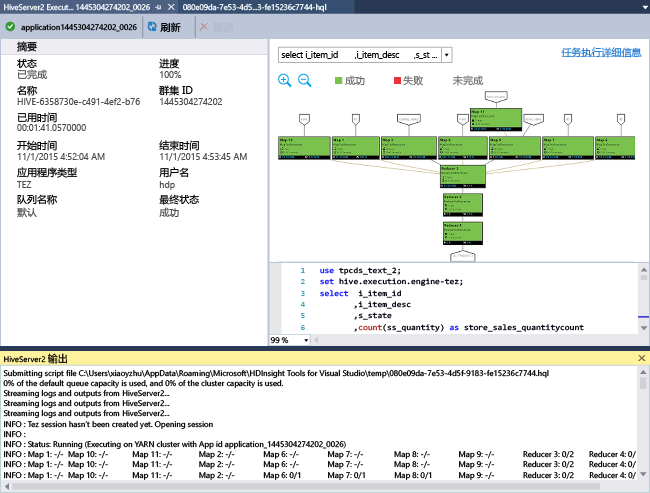
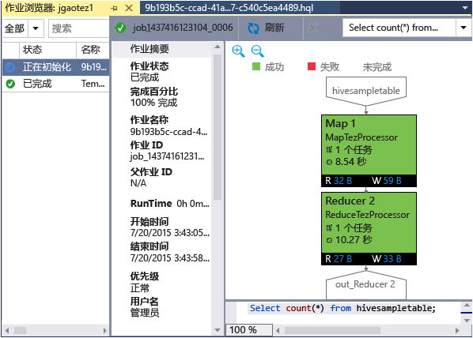
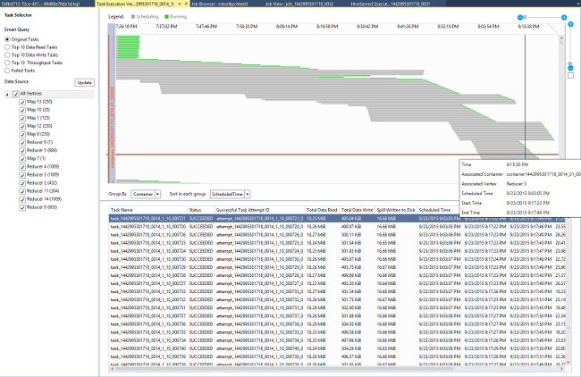

<properties
    pageTitle="学习使用用于 Visual Studio 的 Data Lake (HDInsight) 工具 | Azure"
    description="了解如何安装和使用用于 Visual Studio 的 Data Lake (HDInsight) 工具连接到 Hadoop 群集及运行 Hive 查询。"
    keywords="hadoop 工具,hive 查询,visual studio"
    services="HDInsight"
    documentationcenter=""
    tags="azure-portal"
    author="mumian"
    manager="jhubbard"
    editor="cgronlun" />
<tags
    ms.assetid="ce9c572a-1e98-46bf-9581-13a9767f1fa5"
    ms.service="hdinsight"
    ms.devlang="na"
    ms.topic="get-started-article"
    ms.tgt_pltfrm="na"
    ms.workload="big-data"
    ms.date="02/06/2017"
    wacn.date="03/28/2017"
    ms.author="jgao" />  

# 开始使用用于 Visual Studio 的 Azure Data Lake (HDInsight) 工具来运行 Hive 查询

[AZURE.INCLUDE [azure-sdk-developer-differences](../../includes/azure-sdk-developer-differences.md)]

了解如何使用用于 Visual Studio 的 Data Lake (HDInsight) 工具连接到 HDInsight 群集和提交 Hive 查询。有关使用 HDInsight 的详细信息，请参阅 [HDInsight 简介][hdinsight.introduction]和[开始使用 HDInsight][hdinsight.get.started]。有关连接到 Storm 群集的详细信息，请参阅[使用 Visual Studio 在 HDInsight 上针对 Apache Storm 开发 C# 拓扑][hdinsight.storm.visual.studio.tools]。

用于 Visual Studio 的 Data Lake 工具可用于访问 HDInsight。

[AZURE.INCLUDE [azure-sdk-developer-differences](../../includes/azure-visual-studio-login-guide.md)]

**先决条件**

若要完成本教程并使用 Visual Studio 中的 Data Lake 工具，需要以下项：

* Azure HDInsight 群集：基于 Linux 或 Windows 的群集可用于本文档中的步骤。有关创建群集的详细信息，请参阅下列主题之一：
  
    * [开始使用基于 Linux 的 HDInsight](/documentation/articles/hdinsight-hadoop-linux-tutorial-get-started/)
    * [开始使用基于 Windows 的 HDInsight](/documentation/articles/hdinsight-hadoop-tutorial-get-started-windows/)
* 安装有以下软件的工作站：
  
    * Windows 8.1、Windows 8 或 Windows 7
    * Visual Studio（以下版本之一）：
    
        * 包含 [Update 4](https://www.microsoft.com/download/details.aspx?id=44921) 的 Visual Studio 2013 Community/Professional/Premium/Ultimate
        * Visual Studio 2015 (Community/Enterprise)
    
        > [AZURE.NOTE]
        目前，用于 Visual Studio 的 Data Lake 工具仅有英文版本。
        > 
        > 

##  安装用于 Visual Studio 的 Data Lake 工具
可以使用 [Web 平台安装程序](https://www.microsoft.com/web/downloads/)来安装 Data Lake 工具。你必须选择与你的 Visual Studio 版本匹配的版本。如果尚未安装 Visual Studio，则可使用 [Web 平台安装程序](https://www.microsoft.com/web/downloads/)安装最新 Visual Studio Community 和 Azure SDK：

![用于 Visual Studio 的 Data Lake 工具 Web 平台安装程序。][1]  

## 连接到 Azure 订阅
用于 Visual Studio 的 HDInsight 工具允许用户连接到 HDInsight 群集，执行一些基本的管理操作，并运行 Hive 查询。

> [AZURE.NOTE]
有关连接到常规 Hadoop 群集的信息，请参阅 [Write and submit Hive queries using Visual Studio](http://blogs.msdn.com/b/xiaoyong/archive/2015/05/04/how-to-write-and-submit-hive-queries-using-visual-studio.aspx)（使用 Visual Studio 编写和提交 Hive 查询）。
> 
> 

**连接到 Azure 订阅**

1. 打开 Visual Studio。
2. 在“视图”菜单中，单击“服务器资源管理器”，以打开“服务器资源管理器”窗口。
3. 依次展开“Azure”和“HDInsight”。
   
    > [AZURE.NOTE]
    请注意，应打开“HDInsight 任务列表”窗口。如果你未看到它，则在“视图”菜单中，单击“其他窗口”，然后单击“HDInsight 任务列表”窗口。
    > 
    > 
4. 输入 Azure 订阅凭据，然后单击“登录”。仅当尚未从此工作站上的 Visual Studio 连接到 Azure 订阅时，才需要此凭据。
5. 在“服务器资源管理器”中，你将看到现有 HDInsight 群集的列表。如果没有任何群集，则可以通过使用 Azure 门户预览、Azure PowerShell 或 HDInsight SDK 创建群集。有关详细信息，请参阅[创建 HDInsight 群集][hdinsight-create-clusters]。
   
    ![用于 Visual Studio 的 Data Lake 工具服务器资源管理器群集列表][5]  

6. 展开 HDInsight 群集。你将看到“Hive 数据库”、默认存储帐户、链接的存储帐户，以及“Hadoop 服务日志”。你可以进一步展开条目。

连接到 Azure 订阅后，可以执行以下操作：

**从 Visual Studio 连接到 Azure 门户预览**

* 在“服务器资源管理器”中，展开“Azure”>“HDInsight”，右键单击 HDInsight 群集，然后单击“在 Azure 门户预览中管理群集”。

**通过 Visual Studio 提出问题并提供反馈**

* 在“工具”菜单中，单击“HDInsight”，然后单击“MSDN 论坛”，以提出问题，或单击“提供反馈”。

##  导航链接的资源
在“服务器资源管理器”中，你可以看到默认存储帐户和任何链接的存储帐户。如果你展开默认存储帐户，则可以看到存储帐户中的容器。默认存储帐户和默认容器将处于标记状态。你也可以右键单击任何容器以查看内容。

![用于 Visual Studio 的 Data Lake 工具服务器资源管理器群集列表][2]  

打开容器后，可使用以下按钮来上载、删除和下载 Blob：

  

## 运行 Hive 查询
[Apache Hive][apache.hive] 是基于 Hadoop 构建的数据仓库基础结构，用于提供数据摘要、查询和分析。用于 Visual Studio 的 Data Lake 工具支持从 Visual Studio 运行 Hive 查询。有关 Hive 的详细信息，请参阅[将 Hive 与 HDInsight 配合使用][hdinsight.hive]。

对 HDInsight 群集测试 Hive 脚本比较费时。它可能需要几分钟或更长时间。用于 Visual Studio 的 Data Lake 工具可以在本地验证 Hive 脚本，而无需连接到活动群集。

用于 Visual Studio 的 Data Lake 工具还让用户可通过以下方式查看 Hive 作业中的内容：收集和显示某些 Hive 作业的 YARN 日志。

### 查看 **hivesampletable**
所有 HDInsight 群集都提供了一个名为 *hivesampletable* 的示例 Hive 表。我们将使用此表向你说明如何列出 Hive 表、如何查看表架构，以及如何列出 Hive 表中的行。

**列出 Hive 表和查看 Hive 表架构**

1. 在“服务器资源管理器”中，展开“Azure”>“HDInsight”> 所选的群集 >“Hive 数据库”>“默认值”>“hivesampletable”，以查看表架构。
2. 右键单击“hivesampletable”，然后单击“查看前 100 行”以列出行。这相当于使用 Hive ODBC 驱动程序运行以下 Hive 查询：
   
        SELECT * FROM hivesampletable LIMIT 100
   
    你可以自定义行计数。
   
    ![Data Lake 工具：HDinsight Hive Visual Studio 架构查询][6]

### 创建 Hive 表
你可以使用 GUI 创建 Hive 表或使用 Hive 查询。有关使用 Hive 查询的信息，请参阅[运行 Hive 查询](#run.queries)。

**创建 Hive 表**

1. 在“服务器资源管理器”中，展开“Azure”>“HDInsight 群集” > HDInsight 群集 >“Hive 数据库”，然后右键单击“默认值”，再单击“创建表”。
2. 配置该表。
3. 单击“创建表”来提交创建新 Hive 表的作业。
   
    ![Data Lake 工具：HDInsight Visual Studio 工具创建 hive 表][7]

### 验证和运行 Hive 查询
你可以使用两种方法创建和运行 Hive 查询：

* 创建临时查询
* 创建 Hive 应用程序

**创建、验证和运行临时查询**

1. 在“服务器资源管理器”中，展开“Azure”，然后展开“HDInsight 群集”。
2. 右键单击要运行查询的群集，然后单击“编写 Hive 查询”。
3. 输入 Hive 查询。请注意，Hive 编辑器支持 IntelliSense。用于 Visual Studio 的 Data Lake 工具支持在用户编辑 Hive 脚本时加载远程元数据。例如，当你键入“SELECT * FROM”时，IntelliSense 将列出所有建议的表名称。在指定表名称后，IntelliSense 将列出列名称。该工具几乎支持所有 Hive DML 语句、子查询和内置 UDF。
   
    ![Data Lake 工具：HDInsight Visual Studio Tools IntelliSense][13]  

    ![Data Lake 工具：HDInsight Visual Studio Tools IntelliSense][14]
   
    > [AZURE.NOTE]
    只建议 HDInsight 工具栏中已选择的群集元数据。
    > 
    > 
4. （可选）：单击“验证脚本”以检查脚本语法错误。
   
    ![Data Lake 工具：用于 Visual Studio 的 Data Lake 工具本地验证][10]
5. 单击“提交”或“提交(高级)”。使用高级提交选项，可针对脚本配置“作业名称”、“参数”、“其他配置”和“状态目录”：
   
    ![HDInsight Hadoop hive 查询][9]
   
    在提交作业后，你会看到“Hive 作业摘要”窗口。
   
    ![HDInsight Hadoop Hive 查询摘要][8]
6. 使用“刷新”按钮来更新状态，直到作业状态更改为“已完成”。
7. 单击底部的链接可查看以下内容：**作业查询**、**作业输出**、**作业日志**或 **Yarn 日志**。

**创建和运行 Hive 解决方案**

1. 在“文件”菜单中，单击“新建”，然后单击“项目”。
2. 从左窗格中选择“HDInsight”，在中间窗格中选择“Hive 应用程序”，输入属性，然后单击“确定”。
   
    ![Data Lake 工具：HDInsight Visual Studio 工具新建 hive 项目][11]
3. 在“解决方案资源管理器”中，双击 **Script.hql** 以将其打开。
4. 若要验证 Hive 脚本，可单击“验证脚本”按钮，或在 Hive 编辑器中右键单击该脚本，然后在上下文菜单中单击“验证脚本”。

### 查看 Hive 作业
你可以查看作业查询、作业输出、作业日志和 Hive 作业的 Yarn 日志。有关详细信息，请参阅以前的屏幕截图。

最新版本的工具允许用户通过收集和显示 YARN 日志来查看 Hive 作业的内容。YARN 日志可以帮助你调查性能问题。有关 HDInsight 如何收集 YARN 日志的详细信息，请参阅[以编程方式访问 HDInsight 应用程序日志][hdinsight.access.application.logs]。

**查看 Hive 作业**

1. 在“服务器资源管理器”中，展开“Azure”，然后展开“HDInsight”。
2. 右键单击 HDInsight 群集，然后单击“查看作业”。你将会看到群集上运行的 Hive 作业的列表。
3. 单击作业列表中的作业以将其选定，然后使用“Hive 作业摘要”窗口以打开“作业查询”、“作业输出”、“作业日志”或“Yarn 日志”。
   
    ![Data Lake 工具：HDInsight Visual Studio 工具新建 hive 作业][12]

### 通过 HiveServer2 的更快路径 Hive 执行

[AZURE.INCLUDE [hdinsight-linux-acn-version.md](../../includes/hdinsight-linux-acn-version.md)]

> [AZURE.NOTE]
此功能仅适用于 HDInsight 群集 3.2 和更高版本。
> 
> 

Data Lake 工具用于通过 [WebHCat](https://cwiki.apache.org/confluence/display/Hive/WebHCat)（也称为 Templeton）提交 Hive 作业。返回作业详细信息和错误信息所需的时间很长。为了解决此性能问题，Data Lake 工具通过 HiveServer2 直接在群集中运行 Hive 作业，以便绕过 RDP/SSH。Tez 图形不仅可提升性能，还可用于查看 Hive 和任务详细信息。

使用 HDInsight 群集 3.2 或更高版本时，可以看到“通过 HiveServer2 执行”按钮：

  

如果在 Tez 中执行 Hive 查询，还可实时查看流式传输回的日志和作业图形。

  

**通过 HiveServer2 执行查询与通过 WebHCat 提交查询之间的差别**

虽然通过 HiveServer2 执行查询可以带来许多性能方面的优点，但此方法仍有一些限制。某些限制不适用于生产用途。下表显示了两种方法的差异：

| | 通过 HiveServer2 执行 | 通过 WebHCat 提交 |
| --- | --- | --- |
| 执行查询 |消除了 WebHCat 的开销（WebHCat 启动名为“TempletonControllerJob”的 MapReduce 作业）。 |只要通过 WebHCat 执行查询，WebHCat 就会启动一个 MapReduce 作业，从而造成额外的开销。 |
| 向后流式传输日志 |接近实时进行。 |仅当作业完成时才提供作业执行日志。 |
| 查看作业历史记录 |如果查询是通过 HiveServer2 执行的，系统将不保留查询的作业历史记录（作业日志、作业输出）。可以在 YARN UI 中查看应用程序的有限信息。 |如果查询是通过 WebHCat 执行的，系统将保留查询的作业历史记录（作业日志、作业输出），可以使用 Visual Studio/HDInsight SDK/PowerShell 查看这些记录。 |
| 关闭窗口 |通过 HiveServer2 执行是一种“同步”方式，因此必须保持窗口打开状态；如果窗口关闭，将会取消执行查询。 |通过 WebHCat 提交是一种“异步”方式，因此可通过 WebHCat 提交查询，然后关闭 Visual Studio。随时可以返回查看结果。 |

### Tez Hive 作业性能图
Data Lake 工具支持显示 Tez 执行引擎运行的 Hive 作业的性能图。有关启用 Tez 的信息，请参阅[使用 HDInsight 中的 Hive][hdinsight.hive]。提交 Visual Studio 中的 Hive 作业后，Visual Studio 将在作业完成时显示图形。你可能需要单击“刷新”按钮来获取最新的作业状态。

> [AZURE.NOTE]
此功能仅适用于高于 3.2.4.593 版的 HDInsight 群集，并且只能用于已完成的作业（如果你通过 WebHCat 提交作业，将在通过 HiveServer2 执行查询时显示此图形）。它适用于基于 Windows 和 Linux 的群集。
> 
> 

  

为了帮助用户更好地了解 Hive 查询，该工具在此版中添加了“Hive 运算符”视图。只需双击作业图的相应顶点，即可查看顶点中的所有运算符。也可将鼠标悬停在特定运算符上方，以查看该运算符的更多详细信息。

### 适用于 Tez 上的 Hive 作业的任务执行视图
适用于 Tez 上的 Hive 作业的任务执行视图可用于获取结构化和可视化 Hive 作业的信息，以及获取更多作业详细信息。出现性能问题时，可以使用此视图来获取更多详细信息。例如，获取每个任务的运行方式和有关每个任务的详细信息（数据读取/写入、计划/开始时间/结束时间等），以便根据可视化信息优化作业配置或系统体系结构。

## 运行 Pig 脚本
用于 Visual Studio 的 Data Lake 工具支持创建 Pig 脚本并将其提交到 HDInsight 群集。用户可基于模板创建 Pig 项目，然后将脚本提交到 HDInsight 群集。

## 反馈和已知问题
* 目前 HiveServer2 结果以纯文本形式显示，这不是很理想。我们正在努力解决该问题。
* 如果结果以 NULL 值开头，则目前不会显示结果。我们已解决此问题，如果你受此问题的困扰，欢迎给我们发送电子邮件，或与支持团队联系。
* Visual Studio 创建的 HQL 脚本将会根据用户的本地区域设置进行编码。如果用户以二进制文件形式将脚本上传到群集，脚本可能无法正常执行。

## 后续步骤
在本文中，你已学习如何使用 Data Lake (HDInsight) 工具包从 Visual Studio 连接到 HDInsight 群集，以及如何运行 Hive 查询。有关详细信息，请参阅：

* [在 HDInsight 中使用 Hadoop Hive][hdinsight.hive]
* [开始在 HDInsight 中使用 Hadoop][hdinsight.get.started]
* [在 HDInsight 中提交 Hadoop 作业][hdinsight.submit.jobs]

<!--Anchors-->
[Installation]: #installation
[Connect to your Azure subscription]: #connect-to-your-azure-subscription
[Navigate the linked resources]: #navigate-the-linked-resources
[Run Hive queries]: #run-hive-queries
[Next steps]: #next-steps

<!--Image references-->
[1]: ./media/hdinsight-hadoop-visual-studio-tools-get-started/hdinsight.visual.studio.tools.wpi.png
[2]: ./media/hdinsight-hadoop-visual-studio-tools-get-started/hdinsight.visual.studio.tools.linked.resources.png
[5]: ./media/hdinsight-hadoop-visual-studio-tools-get-started/hdinsight.visual.studio.tools.server.explorer.png
[6]: ./media/hdinsight-hadoop-visual-studio-tools-get-started/hdinsight.visual.studio.tools.hive.schema.png
[7]: ./media/hdinsight-hadoop-visual-studio-tools-get-started/hdinsight.visual.studio.tools.create.hive.table.png
[8]: ./media/hdinsight-hadoop-visual-studio-tools-get-started/hdinsight.visual.studio.tools.run.hive.job.summary.png
[9]: ./media/hdinsight-hadoop-visual-studio-tools-get-started/hdinsight.visual.studio.tools.submit.jobs.advanced.png
[10]: ./media/hdinsight-hadoop-visual-studio-tools-get-started/hdinsight.visual.studio.tools.validate.hive.script.png
[11]: ./media/hdinsight-hadoop-visual-studio-tools-get-started/hdinsight.visual.studio.tools.new.hive.project.png
[12]: ./media/hdinsight-hadoop-visual-studio-tools-get-started/hdinsight.visual.studio.tools.view.hive.jobs.png
[13]: ./media/hdinsight-hadoop-visual-studio-tools-get-started/hdinsight.visual.studio.tools.intellisense.table.names.png
[14]: ./media/hdinsight-hadoop-visual-studio-tools-get-started/hdinsight.visual.studio.tools.intellisense.column.names.png

<!--Link references-->

[hdinsight-create-clusters]: /documentation/articles/hdinsight-hadoop-provision-linux-clusters/
[hdinsight.introduction]: /documentation/articles/hdinsight-hadoop-introduction/
[hdinsight.get.started]: /documentation/articles/hdinsight-hadoop-linux-tutorial-get-started/
[hdinsight.hive]: /documentation/articles/hdinsight-use-hive/
[hdinsight.submit.jobs]: /documentation/articles/hdinsight-submit-hadoop-jobs-programmatically/
[hdinsight.storm.visual.studio.tools]: /documentation/articles/hdinsight-storm-develop-csharp-visual-studio-topology/
[hdinsight.access.application.logs]: /documentation/articles/hdinsight-hadoop-access-yarn-app-logs/

[apache.hive]: http://hive.apache.org

<!---HONumber=Mooncake_0120_2017-->
<!--Update_Description: update from ASM to ARM-->