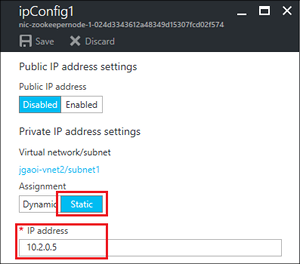

<properties
    pageTitle="配置 HBase 复制 | Azure"
    description="了解如何配置 HBase 复制，以实现负载均衡、高可用性、在不造成任何停机的情况下从一个 HDInsight 版本迁移/更新到另一个版本，以及灾难恢复。"
    services="hdinsight,virtual-network"
    documentationcenter=""
    author="mumian"
    manager="jhubbard"
    editor="cgronlun" />
<tags 
    ms.service="hdinsight"
    ms.devlang="na"
    ms.topic="article"
    ms.tgt_pltfrm="na"
    ms.workload="big-data"
    ms.date="12/21/2016"
    wacn.date="01/25/2017"
    ms.author="jgao" />

# 配置 HBase 复制

了解如何在一个虚拟网络 (VNet) 内部或者在两个虚拟网络之间配置 HBase 复制。

群集复制使用源推送方法。HBase 群集可以是一个源或目标，也可以同时充当这两个角色。复制是异步的，复制的目标是保持最终一致性。当源接收到对列系列的编辑并启用复制时，该编辑将传播到所有目标群集。当数据从一个群集复制到另一个群集时，会跟踪源群集和所有已使用数据的群集，防止复制循环。

在本教程中，你将要配置源-目标复制。对于其他群集拓扑，请参阅 [Apache HBase 参考指南](http://hbase.apache.org/book.html#_cluster_replication)。

单个虚拟网络的 HBase 复制用例：

* 负载均衡 - 例如，在目标群集上运行扫描或 MapReduce 作业，在源群集上引入数据
* 高可用性
* 在不同的 HBase 群集之间迁移数据
* 将 Azure HDInsight 群集从一个版本升级到另一个版本

两个虚拟网络的 HBase 复制用例：

* 灾难恢复
* 对应用程序进行负载均衡和分区
* 高可用性

使用 [GitHub](https://github.com/Azure/hbase-utils/tree/master/replication) 上的[脚本操作](/documentation/articles/hdinsight-hadoop-customize-cluster-linux/)脚本复制群集。

## 先决条件
在开始学习本教程之前，你必须有一个 Azure 订阅。请参阅[获取 Azure 试用版](/pricing/1rmb-trial/)。

## 配置环境

有三种可能的配置：

- 一个 Azure 虚拟网络中有两个 HBase 群集
- 同一区域内两个不同的虚拟网络中有两个 HBase 群集
- 两个不同区域内两个不同的虚拟网络中有两个 HBase 群集（异地复制）

为了方便配置环境，我们创建了一些 [Azure Resource Manager 模板](/documentation/articles/resource-group-overview/)。如果想要使用其他方法配置环境，请参阅：

- [在 HDInsight 中创建基于 Linux 的 Hadoop 群集](/documentation/articles/hdinsight-hadoop-provision-linux-clusters/)
- [在 Azure 虚拟网络中创建 HBase 群集](/documentation/articles/hdinsight-hbase-provision-vnet/)

### 配置一个虚拟网络

单击下图，在同一个虚拟网络中创建两个 HBase 群集。模板存储在公共 Azure Blob 容器中。

>[AZURE.NOTE] 必须修改从 GitHub 存储库“azure-quickstart-templates”下载的模板，以适应 Azure 中国云环境。例如，替换某些终结点（将“blob.core.windows.net”替换为“blob.core.chinacloudapi.cn”，将“cloudapp.azure.com”替换为“chinacloudapp.cn”）；把允许的地域改成“China North”和“China East”；把 HDInsight Linux 版本改为 Azure 中国所支持的 3.5。

### 在同一区域中配置两个虚拟网络

单击下图，在同一区域中创建两个使用 VNet 对等互连的虚拟网络和两个 HBase 群集。模板存储在公共 Azure Blob 容器中。

>[AZURE.NOTE] 必须修改从 GitHub 存储库“azure-quickstart-templates”下载的模板，以适应 Azure 中国云环境。例如，替换某些终结点（将“blob.core.windows.net”替换为“blob.core.chinacloudapi.cn”，将“cloudapp.azure.com”替换为“chinacloudapp.cn”）；把允许的地域改成“China North”和“China East”；把 HDInsight Linux 版本改为 Azure 中国所支持的 3.5。

此方案需要 [VNet 对等互连](/documentation/articles/virtual-network-peering-overview/)。使用模板启用 VNet 对等互连。

HBase 复制使用 ZooKeeper VM 的 IP 地址。必须为目标 HBase ZooKeeper 节点配置静态 IP 地址。

**配置静态 IP 地址**

1. 登录 [Azure 门户预览](https://portal.azure.cn)。
2. 在左侧菜单中，单击“资源组”。
3. 单击包含目标 HBase 群集的资源组。这是使用 Resource Manager 模板创建环境时指定的资源组。可以使用筛选器减少列表中的结果。可以看到包含两个虚拟网络的资源列表。
4. 单击包含目标 HBase 群集的虚拟网络。例如，单击 **xxxx-vnet2**。可以看到名称以“nic-zookeepermode-”开头的三个设备。这三个设备是 ZooKeeper VM。
5. 单击其中一个 ZooKeeper VM。
6. 单击“IP 配置”。
7. 在列表中单击“ipConfig1”。
8. 单击“静态”，记下实际 IP 地址。运行脚本操作启用复制时，需要用到该 IP 地址。

      

9. 重复步骤 6，为另外两个 ZooKeeper 节点设置静态 IP 地址。

在跨 VNet 方案中，调用 **hdi\_enable\_replication.sh** 脚本操作时，必须使用 **-ip** 开关。

### 在两个不同区域中配置两个虚拟网络

单击下图，在两个不同区域中创建两个虚拟网络。模板存储在公共 Azure Blob 容器中。

>[AZURE.NOTE] 必须修改从 GitHub 存储库“azure-quickstart-templates”下载的模板，以适应 Azure 中国云环境。例如，替换某些终结点（将“blob.core.windows.net”替换为“blob.core.chinacloudapi.cn”，将“cloudapp.azure.com”替换为“chinacloudapp.cn”）；把允许的地域改成“China North”和“China East”；把 HDInsight Linux 版本改为 Azure 中国所支持的 3.5。

在两个虚拟网络之间创建 VPN 网关。有关说明，请参阅 [Create a VNet with a site-to-site connection](/documentation/articles/vpn-gateway-howto-site-to-site-resource-manager-portal/)（创建使用站点到站点连接的 VNet）。

HBase 复制使用 ZooKeeper VM 的 IP 地址。必须为目标 HBase ZooKeeper 节点配置静态 IP 地址。若要配置静态 IP，请参阅本文中的“在同一区域中配置两个虚拟网络”部分。

在跨 VNet 方案中，调用 **hdi\_enable\_replication.sh** 脚本操作时，必须使用 **-ip** 开关。

## 加载测试数据

复制群集时，必须指定要复制的表。在本部分中，要将一些数据载入源群集。在下一部分，将在两个群集之间启用复制。

遵照 [HBase 教程：开始在 HDInsight 中将 Apache HBase 与基于 Linux 的 Hadoop 配合使用](/documentation/articles/hdinsight-hbase-tutorial-get-started-linux/)中的说明，创建一个“联系人”表并在其中插入一些数据。

##  启用复制

以下步骤说明如何从 Azure 门户预览调用脚本操作脚本。若要使用 Azure PowerShell 和 Azure 命令行接口 (CLI) 运行脚本操作，请参阅[使用脚本操作自定义基于 Linux 的 HDInsight 群集](/documentation/articles/hdinsight-hadoop-customize-cluster-linux/)。

**从 Azure 门户预览启用 HBase 复制**

1. 登录 [Azure 门户预览](https://portal.azure.cn)。
2. 打开源 HBase 群集。
3. 在群集菜单中，单击“脚本操作”。
4. 单击边栏选项卡顶部的“提交新项”。
5. 选择或输入以下信息：

    - **名称**：输入“启用复制”。
    - **Bash 脚本 URL**：输入 **https://raw.githubusercontent.com/Azure/hbase-utils/master/replication/hdi_enable_replication.sh**。
    - **头**：保持选中状态。清除其他节点类型。
    - **参数**：以下示例参数将对所有现有表启用复制，并将源群集中的所有数据复制到目标群集：

            -m hn1 -s <source cluster DNS name> -d <destination cluster DNS name> -sp <source cluster Ambari password> -dp <destination cluster Ambari password> -copydata

6. 单击“创建”。运行该脚本可能需要一段时间，尤其是在使用 -copydata 参数的情况下。

必需参数：

|名称|说明|
|----|-----------|
|-s、--src-cluster | 指定源 HBase 群集的 DNS 名称。例如：-s hbsrccluster、--src-cluster=hbsrccluster |
|-d、--dst-cluster | 指定目标（副本）HBase 群集的 DNS 名称。例如：-s dsthbcluster、--src-cluster=dsthbcluster |
|-sp、--src-ambari-password | 指定源 HBase 群集上的 Ambari 管理员密码。 |
|-dp、--dst-ambari-password | 指定目标 HBase 群集上的 Ambari 管理员密码。|

可选参数：

|名称|说明|
|----|-----------|
|-su、--src-ambari-user | 指定源 HBase 群集上的 Ambari 管理员用户名。默认值为 **admin**。 |
|-du、--dst-ambari-user | 指定目标 HBase 群集上的 Ambari 管理员用户名。默认值为 **admin**。 |
|-t、--table-list | 指定要复制的表。例如：--table-list="table1;table2;table3"。如果未指定表，则将复制所有现有 HBase 表。|
|-m、--machine | 指定要在其中运行脚本操作的头节点。值为 hn1 或 hn0。由于 hn0 通常较为繁忙，因此建议使用 hn1。在 HDInsight 门户或 Azure Powershell 中以脚本操作的形式运行 $0 脚本时，需使用此选项。|
|-ip | 在两个虚拟网络之间启用复制时，需使用此参数。此参数充当一个开关，它使用副本群集中 ZooKeeper 节点的静态 IP 而不是 FQDN 名称。在启用复制之前，需要预先配置静态 IP。 |
|-cp、-copydata | 针对已启用复制的表中的现有数据启用迁移。 |
|-rpm、-replicate-phoenix-meta | 针对 Phoenix 系统表启用复制。  *请慎用此选项。* 我们建议在使用此脚本之前，在副本群集上重新创建 Phoenix 表。 |
|-h、--help | 显示用法信息。 |

该[脚本](https://github.com/Azure/hbase-utils/blob/master/replication/hdi_enable_replication.sh)的 print\_usage() 节提供了详细的参数说明。

成功部署脚本操作后，可以使用 SSH 连接到目标 HBase 群集，验证是否已复制数据。

### 复制方案

以下列表显示了一些普通用例及其参数设置：

- **针对两个群集之间的所有表启用复制**。此方案不需要复制/迁移表中的现有数据，也不使用 Phoenix 表。使用以下参数：

        -m hn1 -s <source cluster DNS name> -d <destination cluster DNS name> -sp <source cluster Ambari password> -dp <destination cluster Ambari password>  

- **针对特定的表启用复制**。使用以下参数针对 table1、table2 和 table3 启用复制：

        -m hn1 -s <source cluster DNS name> -d <destination cluster DNS name> -sp <source cluster Ambari password> -dp <destination cluster Ambari password> -t "table1;table2;table3"

- **针对特定的表启用复制并复制现有数据**。使用以下参数针对 table1、table2 和 table3 启用复制：

        -m hn1 -s <source cluster DNS name> -d <destination cluster DNS name> -sp <source cluster Ambari password> -dp <destination cluster Ambari password> -t "table1;table2;table3" -copydata

- **针对包含 phoenix 复制元数据的所有表启用从源到目标的复制**。Phoenix 元数据复制并不完善，应谨慎启用。

        -m hn1 -s <source cluster DNS name> -d <destination cluster DNS name> -sp <source cluster Ambari password> -dp <destination cluster Ambari password> -t "table1;table2;table3" -replicate-phoenix-meta

## 复制并迁移数据

启用复制后，可以使用两个单独的脚本操作脚本来复制/迁移数据：

- [用于小型表的脚本](https://raw.githubusercontent.com/Azure/hbase-utils/master/replication/hdi_copy_table.sh)（几个 GB 的大小，在不到一小时内就有望完成整个复制）

- [用于大型表的脚本](https://raw.githubusercontent.com/Azure/hbase-utils/master/replication/nohup_hdi_copy_table.sh)（预计需要一小时以上才能完成复制）

可以遵循[启用复制](#enable-replication)中的相同过程来结合以下参数调用脚本操作：

    -m hn1 -t <table1:start_timestamp:end_timestamp;table2:start_timestamp:end_timestamp;...> -p <replication_peer> [-everythingTillNow]

该[脚本](https://github.com/Azure/hbase-utils/blob/master/replication/hdi_copy_table.sh)的 print\_usage() 节提供了详细的参数说明。

### 方案

- **复制特定表（test1、test2 和 test3）中到目前为止（当前时间戳）编辑的所有行**：

        -m hn1 -t "test1::;test2::;test3::" -p "zk5-hbrpl2;zk1-hbrpl2;zk5-hbrpl2:2181:/hbase-unsecure" -everythingTillNow
    或

        -m hn1 -t "test1::;test2::;test3::" --replication-peer="zk5-hbrpl2;zk1-hbrpl2;zk5-hbrpl2:2181:/hbase-unsecure" -everythingTillNow

- **复制指定时间范围内的特定表**：

        -m hn1 -t "table1:0:452256397;table2:14141444:452256397" -p "zk5-hbrpl2;zk1-hbrpl2;zk5-hbrpl2:2181:/hbase-unsecure"

## 禁用复制

若要禁用复制，可以使用 [GitHub](https://raw.githubusercontent.com/Azure/hbase-utils/master/replication/hdi_disable_replication.sh) 上提供的另一个脚本操作脚本。可以遵循[启用复制](#enable-replication)中的相同过程来结合以下参数调用脚本操作：

    -m hn1 -s <source cluster DNS name> -sp <source cluster Ambari Password> <-all|-t "table1;table2;...">  

该[脚本](https://raw.githubusercontent.com/Azure/hbase-utils/master/replication/hdi_disable_replication.sh)的 print\_usage() 节提供了详细的参数说明。

### 方案

- **对所有表禁用复制**：

        -m hn1 -s <source cluster DNS name> -sp Mypassword\!789 -all
    或

        --src-cluster=<source cluster DNS name> --dst-cluster=<destination cluster DNS name> --src-ambari-user=<source cluster Ambari username> --src-ambari-password=<source cluster Ambari password>

- **对指定的表（table1、table2 和 table3）禁用复制**：

        -m hn1 -s <source cluster DNS name> -sp <source cluster Ambari password> -t "table1;table2;table3"

## 后续步骤

本教程已经介绍了如何跨两个数据中心配置 HBase 复制。要了解有关 HDInsight 和 HBase 的详细信息，请参阅：

* [开始在 HDInsight 中使用 Apache HBase][hdinsight-hbase-get-started]
* [HDInsight HBase 概述][hdinsight-hbase-overview]
* [在 Azure 虚拟网络中创建 HBase 群集][hdinsight-hbase-provision-vnet]
* [使用 HDInsight (Hadoop) 中的 Storm 和 HBase 分析传感器数据][hdinsight-sensor-data]

[hdinsight-hbase-geo-replication-vnet]: /documentation/articles/hdinsight-hbase-geo-replication-configure-vnets/
[hdinsight-hbase-geo-replication-dns]: /documentation/articles/hdinsight-hbase-geo-replication-configure-VNet/

[img-vnet-diagram]: ./media/hdinsight-hbase-geo-replication/HDInsight.HBase.Replication.Network.diagram.png

[powershell-install]: https://docs.microsoft.com/powershell/azureps-cmdlets-docs
[hdinsight-hbase-get-started]: /documentation/articles/hdinsight-hbase-tutorial-get-started-linux/
[hdinsight-manage-portal]: /documentation/articles/hdinsight-administer-use-management-portal/
[hdinsight-provision]: /documentation/articles/hdinsight-provision-clusters/
[hdinsight-sensor-data]: /documentation/articles/hdinsight-storm-sensor-data-analysis/
[hdinsight-hbase-overview]: /documentation/articles/hdinsight-hbase-overview/
[hdinsight-hbase-provision-vnet]: /documentation/articles/hdinsight-hbase-provision-vnet/

<!---HONumber=Mooncake_0120_2017-->