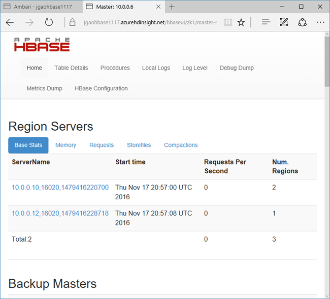

<properties
    pageTitle="HBase 教程：Hadoop 中基于 Linux 的 HBase 群集入门 | Azure"
    description="遵循本 HBase 教程开始在 HDInsight 中将 Apache HBase 与 Hadoop 配合使用。从 HBase shell 创建表，然后使用 Hive 查询这些表。"
    keywords="apache hbase,hbase,hbase shell,hbase 教程"
    services="hdinsight"
    documentationcenter=""
    author="mumian"
    manager="jhubbard"
    editor="cgronlun" />
<tags 
    ms.assetid="4d6a2658-6b19-4268-95ee-822890f5a33a"
    ms.service="hdinsight"
    ms.workload="big-data"
    ms.tgt_pltfrm="na"
    ms.devlang="na"
    ms.topic="get-started-article"
    ms.date="11/23/2016"
    wacn.date="03/28/2017"
    ms.author="jgao" />

# HBase 教程：开始使用在 HDInsight 中的 Apache HBase

了解如何使用 Hive 在 HDInsight 中创建 HBase 群集、创建 HBase 表和查询表。有关 HBase 的一般信息，请参阅 [HDInsight HBase 概述][hdinsight-hbase-overview]。

[AZURE.INCLUDE [delete-cluster-warning](../../includes/hdinsight-delete-cluster-warning.md)]

## 先决条件
在开始阅读本 HBase 教程前，你必须具有：

* **一个 Azure 订阅**。请参阅[获取 Azure 试用版](/pricing/1rmb-trial/)。
* [安全外壳 (SSH)](/documentation/articles/hdinsight-hadoop-linux-use-ssh-unix/)。
* [curl](http://curl.haxx.se/download.html)。

### 访问控制要求
[AZURE.INCLUDE [access-control](../../includes/hdinsight-access-control-requirements.md)]

##  创建 HBase 群集
以下过程使用 Azure Resource Manager 模板创建 3.5 版基于 Linux 的 HBase 群集和从属默认 Azure 存储帐户。若要了解该过程与其他群集创建方法中使用的参数，请参阅[在 HDInsight 中创建基于 Linux 的 Hadoop 群集](/documentation/articles/hdinsight-hadoop-provision-linux-clusters/)。

1. 单击下面的图像可在 Azure 门户预览中打开模板。模板位于公共 blob 容器中。
   
    

    >[AZURE.NOTE] 必须修改从 GitHub 存储库“azure-quickstart-templates”下载的模板，以适应 Azure 中国云环境。例如，替换某些终结点（将“blob.core.windows.net”替换为“blob.core.chinacloudapi.cn”，将“cloudapp.azure.com”替换为“chinacloudapp.cn”）；把允许的地域改成“China North”和“China East”；把 HDInsight Linux 版本改为 Azure 中国所支持的 3.5。

2. 在“自定义部署”边栏选项卡中输入以下项：
   
    * **订阅**：选择将用于创建此群集的 Azure 订阅。
    * **资源组**：创建新的 Azure 资源管理组或使用现有组。
    * **位置**：指定资源组的位置。
    * **ClusterName**：为要创建的 HBase 群集输入名称。
    * **群集登录名和密码**：默认登录名是 **admin**。
    * **SSH 用户名和密码**：默认用户名是 **sshuser**。可以重命名它。
     
        其他参数是可选的。
     
        每个群集都有一个 Azure Blob 存储帐户依赖项。删除群集后，数据将保留在存储帐户中。群集的默认存储帐户名为群集名称后接“store”。该名称已在模板 variables 节中硬编码。
3. 选中“我同意上述条款和条件”，然后单击“购买”。创建群集大约需要 20 分钟时间。

> [AZURE.NOTE]
删除 HBase 群集后，可使用同一默认 Blob 容器创建另一 HBase 群集。新群集将选取你在原始群集中创建的 HBase 表。为了避免不一致，建议你在删除群集之前先禁用 HBase 表。
> 
> 

## 创建表和插入数据
可以使用 SSH 连接到 HBase 群集，然后使用 HBase Shell 来创建 HBase 表、插入数据和查询数据。有关使用 SSH 的信息，请参阅[在 Linux、Unix 或 OS X 中的 HDInsight 上将 SSH 与基于 Linux 的 Hadoop 配合使用](/documentation/articles/hdinsight-hadoop-linux-use-ssh-unix/)以及[在 Windows 中的 HDInsight 上将 SSH 与基于 Linux 的 Hadoop 配合使用](/documentation/articles/hdinsight-hadoop-linux-use-ssh-windows/)。

对于大多数人而言，数据以表格形式显示：

![HDInsight HBase 表格数据][img-hbase-sample-data-tabular]

在 HBase（BigTable 的一种实现）中，相同的数据看起来类似于：

![HDInsight HBase BigTable 数据][img-hbase-sample-data-bigtable]  

在完成下一过程后，数据将更易于理解。

**使用 HBase shell**

1. 从 SSH 运行以下命令：
   
        hbase shell
2. 创建包含两个列系列的 HBase：
   
        create 'Contacts', 'Personal', 'Office'
        list
3. 插入一些数据：
   
        put 'Contacts', '1000', 'Personal:Name', 'John Dole'
        put 'Contacts', '1000', 'Personal:Phone', '1-425-000-0001'
        put 'Contacts', '1000', 'Office:Phone', '1-425-000-0002'
        put 'Contacts', '1000', 'Office:Address', '1111 San Gabriel Dr.'
        scan 'Contacts'
   
    ![HDInsight Hadoop HBase shell][img-hbase-shell]
4. 获取单个行
   
        get 'Contacts', '1000'
   
    你将看到与使用扫描命令相同的结果，因为只有一个行。
   
    有关 Hbase 表架构的详细信息，请参阅 [HBase 架构设计简介][hbase-schema]。有关 HBase 命令的详细信息，请参阅 [Apache HBase 参考指南][hbase-quick-start]。
5. 退出 shell
   
        exit

**在联系人 HBase 表中批量加载数据**

HBase 提供了多种将数据载入表中的方法。有关详细信息，请参阅[批量加载](http://hbase.apache.org/book.html#arch.bulk.load)。

已将示例数据文件上传到公共 blob 容器 *wasbs://hbasecontacts@hditutorialdata.blob.core.windows.net/contacts.txt*。该数据文件的内容为：

    8396    Calvin Raji      230-555-0191    230-555-0191    5415 San Gabriel Dr.
    16600   Karen Wu         646-555-0113    230-555-0192    9265 La Paz
    4324    Karl Xie         508-555-0163    230-555-0193    4912 La Vuelta
    16891   Jonn Jackson     674-555-0110    230-555-0194    40 Ellis St.
    3273    Miguel Miller    397-555-0155    230-555-0195    6696 Anchor Drive
    3588    Osa Agbonile     592-555-0152    230-555-0196    1873 Lion Circle
    10272   Julia Lee        870-555-0110    230-555-0197    3148 Rose Street
    4868    Jose Hayes       599-555-0171    230-555-0198    793 Crawford Street
    4761    Caleb Alexander  670-555-0141    230-555-0199    4775 Kentucky Dr.
    16443   Terry Chander    998-555-0171    230-555-0200    771 Northridge Drive

如果需要，你可以创建一个文本文件并将该文件上载到自己的存储帐户。有关说明，请参阅[在 HDInsight 中为 Hadoop 作业上载数据][hdinsight-upload-data]。

> [AZURE.NOTE]
此过程使用你在上一个过程中创建的“联系人”HBase 表。
> 
> 

1. 从 SSH 运行以下命令，将数据文件转换成 StoreFiles 并将其存储在 Dimporttsv.bulk.output 指定的相对路径：如果你在 HBase Shell 中操作，请使用退出命令退出。
   
        hbase org.apache.hadoop.hbase.mapreduce.ImportTsv -Dimporttsv.columns="HBASE_ROW_KEY,Personal:Name,Personal:Phone,Office:Phone,Office:Address" -Dimporttsv.bulk.output="/example/data/storeDataFileOutput" Contacts wasbs://hbasecontacts@hditutorialdata.blob.core.windows.net/contacts.txt
2. 运行以下命令，将数据从 /example/data/storeDataFileOutput 上载到 HBase 表：
   
        hbase org.apache.hadoop.hbase.mapreduce.LoadIncrementalHFiles /example/data/storeDataFileOutput Contacts
3. 你可以打开 HBase Shell，并使用扫描命令来列出表内容。

## 使用 Hive 查询 HBase
你可以使用 Hive 查询 HBase 表中的数据。本部分将创建映射到 HBase 表的 Hive 表，并使用该表来查询 HBase 表中的数据。

> [AZURE.NOTE]
如果 Hive 和 HBase 位于同一 VNet 的不同群集中，则需在调用 Hive shell 时传递 zookeeper 仲裁：
>

> `hive --hiveconf hbase.zookeeper.quorum=zk0-xxxx.xxxxxxxxxxxxxxxxxxxxxxx.cx.internal.chinacloudapp.cn,zk1-xxxx.xxxxxxxxxxxxxxxxxxxxxxx.cx.internal.chinacloudapp.cn,zk2-xxxx.xxxxxxxxxxxxxxxxxxxxxxx.cx.internal.chinacloudapp.cn --hiveconf zookeeper.znode.parent=/hbase-unsecure`
>
>

1. 打开 **PuTTY** 并连接到群集。参阅前一过程中的说明。
2. 打开 Hive shell。
   
        hive
       
3. 运行以下 HiveQL 脚本，以创建映射到 HBase 表的 Hive 表。确保已创建本教程中前面引用的示例表，方法是在运行此语句前使用 HBase Shell。
   
        CREATE EXTERNAL TABLE hbasecontacts(rowkey STRING, name STRING, homephone STRING, officephone STRING, officeaddress STRING)
        STORED BY 'org.apache.hadoop.hive.hbase.HBaseStorageHandler'
        WITH SERDEPROPERTIES ('hbase.columns.mapping' = ':key,Personal:Name,Personal:Phone,Office:Phone,Office:Address')
        TBLPROPERTIES ('hbase.table.name' = 'Contacts');
4. 运行以下 HiveQL 脚本，以查询 HBase 表中的数据：
   
        SELECT count(*) FROM hbasecontacts;

## 通过 Curl 使用 HBase REST API
> [AZURE.NOTE]
使用 Curl 或者与 WebHCat 进行任何其他形式的 REST 通信时，必须提供 HDInsight 群集管理员用户名和密码对请求进行身份验证。此外，还必须使用群集名称作为用来向服务器发送请求的统一资源标识符 (URI) 的一部分。
> 

> 对本部分中的所有命令，请将 **USERNAME** 替换为在群集上进行身份验证的用户，并将 **PASSWORD** 替换为用户帐户的密码。将 **CLUSTERNAME** 替换为群集名称。
> 

> REST API 通过[基本身份验证](http://en.wikipedia.org/wiki/Basic_access_authentication)进行保护。你始终应该使用安全 HTTP (HTTPS) 来发出请求，以确保安全地将凭据发送到服务器。
> 
> 

1. 在命令行中，使用以下命令验证是否可以连接到 HDInsight 群集。
   
        curl -u <UserName>:<Password> \
        -G https://<ClusterName>.azurehdinsight.cn/templeton/v1/status
   
    你应会收到类似于下面的响应：
   
        {"status":"ok","version":"v1"}
   
    此命令中使用的参数如下：
   
    * **-u** - 用来对请求进行身份验证的用户名和密码。
    * **-G** - 指出这是 GET 请求。
2. 使用以下命令列出现有的 HBase 表：
   
        curl -u <UserName>:<Password> \
        -G https://<ClusterName>.azurehdinsight.cn/hbaserest/
3. 使用以下命令创建包含两个列系列的新 HBase 表：
   
        curl -u <UserName>:<Password> \
        -X PUT "https://<ClusterName>.azurehdinsight.cn/hbaserest/Contacts1/schema" \
        -H "Accept: application/json" \
        -H "Content-Type: application/json" \
        -d "{\"@name\":\"Contact1\",\"ColumnSchema\":[{\"name\":\"Personal\"},{\"name\":\"Office\"}]}" \
        -v
   
    架构将以 JSON 格式提供。
4. 使用以下命令插入一些数据：
   
        curl -u <UserName>:<Password> \
        -X PUT "https://<ClusterName>.azurehdinsight.cn/hbaserest/Contacts1/false-row-key" \
        -H "Accept: application/json" \
        -H "Content-Type: application/json" \
        -d "{\"Row\":[{\"key\":\"MTAwMA==\",\"Cell\":[{\"column\":\"UGVyc29uYWw6TmFtZQ==\", \"$\":\"Sm9obiBEb2xl\"}]}]}" \
        -v
   
    必须使用 base64 来为 -d 参数中指定的值编码。在本示例中：
   
    * MTAwMA==: 1000
    * UGVyc29uYWw6TmFtZQ==: Personal:Name
    * Sm9obiBEb2xl: John Dole
     
        使用 [false-row-key](https://hbase.apache.org/apidocs/org/apache/hadoop/hbase/rest/package-summary.html#operation_cell_store_single) 可以插入多个（批处理）值。
5. 使用以下命令获取行：
   
        curl -u <UserName>:<Password> \
        -X GET "https://<ClusterName>.azurehdinsight.cn/hbaserest/Contacts1/1000" \
        -H "Accept: application/json" \
        -v

有关 HBase Rest 的详细信息，请参阅 [Apache HBase Reference Guide](https://hbase.apache.org/book.html#_rest)（Apache HBase 参考指南）。

## 检查群集状态
HDInsight 中的 HBase 随附了一个 Web UI 用于监视群集。使用该 Web UI 可以请求有关区域的统计或信息。

**访问 HBase Master UI**

1. 打开 Ambari Web UI（网址为 https://&lt;Clustername>.azurehdinsight.cn）。
2. 在左侧菜单中，单击“HBase”。
3. 单击页面顶部的“快速链接”，指向活动 Zookeeper 节点链接，然后单击“HBase Master UI”。在另一个浏览器标签页中打开 UI：

      

    HBase Master UI 包含以下部分：

    - 区域服务器
    - 备份主机
    - 表
    - 任务
    - 软件属性

## 删除群集
为了避免不一致，建议你在删除群集之前先禁用 HBase 表。

[AZURE.INCLUDE [delete-cluster-warning](../../includes/hdinsight-delete-cluster-warning.md)]

## 后续步骤
在针对 HDInsight 的本 HBase 教程中，已学习了如何创建 HBase 群集、如何创建表以及如何从 HBase shell 查看这些表中的数据。还学习了如何对 HBase 表中的数据使用 Hive 查询，以及如何使用 HBase C# REST API 创建 HBase 表并从该表中检索数据。

要了解更多信息，请参阅以下文章：

* [HDInsight HBase 概述][hdinsight-hbase-overview]：HBase 是构建于 Hadoop 上的 Apache 开源 NoSQL 数据库，用于为大量非结构化和半结构化数据提供随机访问和高度一致性。

[hdinsight-manage-portal]: /documentation/articles/hdinsight-administer-use-management-portal-v1/
[hdinsight-upload-data]: /documentation/articles/hdinsight-upload-data/
[hbase-reference]: http://hbase.apache.org/book.html#importtsv
[hbase-schema]: http://0b4af6cdc2f0c5998459-c0245c5c937c5dedcca3f1764ecc9b2f.r43.cf2.rackcdn.com/9353-login1210_khurana.pdf
[hbase-quick-start]: http://hbase.apache.org/book.html#quickstart

[hdinsight-hbase-overview]: /documentation/articles/hdinsight-hbase-overview/
[hdinsight-hbase-provision-vnet-v1]: /documentation/articles/hdinsight-hbase-provision-vnet-v1/
[hdinsight-versions]: /documentation/articles/hdinsight-component-versioning-v1/
[azure-purchase-options]: /pricing/overview/
[azure-member-offers]: /pricing/member-offers/
[azure-trial]: /pricing/1rmb-trial/
[azure-portal]: https://portal.azure.cn/
[azure-create-storageaccount]: /documentation/articles/storage-create-storage-account/

[img-hdinsight-hbase-cluster-quick-create]: ./media/hdinsight-hbase-tutorial-get-started-linux/hdinsight-hbase-quick-create.png
[img-hdinsight-hbase-hive-editor]: ./media/hdinsight-hbase-tutorial-get-started-linux/hdinsight-hbase-hive-editor.png
[img-hdinsight-hbase-file-browser]: ./media/hdinsight-hbase-tutorial-get-started-linux/hdinsight-hbase-file-browser.png
[img-hbase-shell]: ./media/hdinsight-hbase-tutorial-get-started-linux/hdinsight-hbase-shell.png
[img-hbase-sample-data-tabular]: ./media/hdinsight-hbase-tutorial-get-started-linux/hdinsight-hbase-contacts-tabular.png
[img-hbase-sample-data-bigtable]: ./media/hdinsight-hbase-tutorial-get-started-linux/hdinsight-hbase-contacts-bigtable.png

<!---HONumber=Mooncake_0103_2017-->