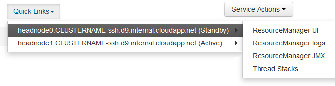

<properties
    pageTitle="Hadoop 的高可用性 - Azure HDInsight | Azure"
    description="了解 HDInsight 群集如何使用附加的头节点提高可靠性和可用性。 了解这种方式对 Ambari 和 Hive 等 Hadoop 服务造成怎样的影响，以及如何使用 SSH 分别连接到每个头节点。"
    services="hdinsight"
    editor="cgronlun"
    manager="jhubbard"
    author="Blackmist"
    documentationcenter=""
    tags="azure-portal"
    keywords="hadoop 高可用性" />
<tags
    ms.assetid="99c9f59c-cf6b-4529-99d1-bf060435e8d4"
    ms.service="hdinsight"
    ms.custom="hdinsightactive,hdiseo17may2017"
    ms.workload="big-data"
    ms.tgt_pltfrm="na"
    ms.devlang="multiple"
    ms.topic="article"
    ms.date="04/03/2017"
    wacn.date="06/05/2017"
    ms.author="v-dazen"
    ms.translationtype="Human Translation"
    ms.sourcegitcommit="08618ee31568db24eba7a7d9a5fc3b079cf34577"
    ms.openlocfilehash="c1d3e6d57a21c5ace31a2e74b875db63f3156288"
    ms.contentlocale="zh-cn"
    ms.lasthandoff="05/26/2017" />

# HDInsight 中 Hadoop 群集的可用性和可靠性

HDInsight 群集提供两个头节点，提升 Hadoop 服务和作业运行的可用性与可靠性。

Hadoop 通过将服务和数据复制到群集中的多个节点来实现高可用性和可靠性。 不过，Hadoop 的标准分发功能通常只能有一个头节点。 单个头节点发生任何中断都可能导致群集停止工作。 HDInsight 提供了两个头节点来提高 Hadoop 的可用性和可靠性。

[AZURE.INCLUDE [hdinsight-linux-acn-version.md](../../includes/hdinsight-linux-acn-version.md)]

> [AZURE.IMPORTANT]
> Linux 是在 HDInsight 3.4 版或更高版本上使用的唯一操作系统。 有关详细信息，请参阅 [HDInsight 在 Windows 上即将弃用](/documentation/articles/hdinsight-component-versioning/#hdi-version-33-nearing-deprecation-date)。

## 节点的可用性和可靠性

HDInsight 群集中的节点是使用 Azure 虚拟机实现的。 如果一个节点发生故障，该节点将会脱机，同时会创建一个新节点来取代有故障的节点。 当节点脱机时，将使用相同类型的另一个节点，直到新节点联机。

> [AZURE.NOTE]
> 如果节点发生故障时正在分析数据，其作业进度将会丢失。 作业将重新提交到另一个节点。

以下部分介绍可配合 HDInsight 使用的节点类型。 并非所有节点类型都可用于某个群集类型。 例如，Hadoop 群集类型就没有任何 Nimbus 节点。 有关 HDInsight 群集类型使用的节点详细信息，请参阅[在 HDInsight 中创建基于 Linux 的 Hadoop 群集](/documentation/articles/hdinsight-hadoop-provision-linux-clusters/#cluster-types)文档的“群集类型”部分。

### 头节点

为确保 Hadoop 服务的高可用性，HDInsight 提供了两个头节点。 这两个头节点同时处于活动状态并在 HDInsight 群集中运行。 某些服务，例如 HDFS 或 YARN，在任何给定的时间仅能在其中一个头节点上处于“活动”状态。 HiveServer2 或 Hive MetaStore 等其他服务同时在这两个头节点上处于活动状态。

头节点（以及 HDInsight 中的其他节点）的主机名中包含一个数字值。 例如 `hn0-CLUSTERNAME` 或 `hn4-CLUSTERNAME`。

> [AZURE.IMPORTANT]
> 请勿将数字值与某个节点是主节点还是辅助节点相关联。 使用数字值是为了为每个节点提供唯一名称。

### Nimbus 节点

Storm 群集提供了 Nimbus 节点。 Nimbus 节点通过在辅助角色节点之间分发和监视处理资源来提供类似于 Hadoop JobTracker 的功能。 HDInsight 为 Storm 群集提供了两个 Nimbus 节点

### Zookeeper 节点

[ZooKeeper](http://zookeeper.apache.org/) 节点用于对头节点上的主服务进行领导选拨。 它们还用来确保服务、数据（辅助角色）节点和网关知道主服务在哪个头节点上处于活动状态。 默认情况下，HDInsight 提供三个 ZooKeeper 节点。

### 辅助角色节点

将作业提交到群集时，辅助角色节点执行实际的数据分析。 如果辅助角色节点发生故障，它执行的任务将提交到另一个辅助角色节点。 默认情况下，HDInsight 创建四个辅助角色节点。 可以在群集创建过程中以及之后根据需要更改此数字。

### 边缘节点

边缘节点不主动参与群集内的数据分析。 在使用 Hadoop 时，它由开发人员或数据科学家使用。 边缘节点与群集中的其他节点一样驻留在同一个 Azure 虚拟网络中，可直接访问其他所有节点。 可以在不将资源带离关键的 Hadoop 服务或分析作业的情况下使用边缘节点。

目前，HDInsight 上的 R Server 是默认提供边缘节点的唯一群集类型。 对于 R Server on HDInsight 而言，边缘节点用于在将 R 代码提交到群集进行分布式处理之前，在本地节点上对这些代码进行测试。

若要了解如何将边缘节点与 R 服务器之外的群集类型配合使用，请参阅[在 HDInsight 中使用边缘节点](/documentation/articles/hdinsight-apps-use-edge-node/)文档。

## 访问节点

可以通过公共网关经 Internet 访问群集。 访问仅限连接到头节点和边缘节点（如果存在）。 访问头节点上运行的服务不会受存在多个头节点的影响。 公共网关将请求路由到托管所请求服务的头节点。 例如，如果 Ambari 当前托管在辅助头节点上，网关会将 Ambari 收到的请求路由到该节点。

通过公共网关进行访问仅限端口 443 (HTTPS)、22 和 23。

* 端口 __443__ 用于访问托管在头节点上的 Ambari 和其他 Web UI 或 REST API。

* 端口 __22__ 用于通过 SSH 访问主头节点或边缘节点。

* 端口 __23__ 用于通过 SSH 访问辅助头节点。 例如，`ssh username@mycluster-ssh.azurehdinsight.cn` 连接到群集名为 **mycluster** 的主头节点。

有关如何使用 SSH 的详细信息，请参阅[将 SSH 与 HDInsight 配合使用](/documentation/articles/hdinsight-hadoop-linux-use-ssh-unix/)文档。

### 内部完全限定的域名 (FQDN)

HDInsight 群集中的节点具有内部 IP 地址和 FQDN，这些只能从群集访问。 使用内部 FQDN 或 IP 地址访问群集上的服务时，应该使用 Ambari 来验证访问服务时使用的 IP 或 FQDN。

例如，Oozie 服务只能在一个头节点上运行，而且从 SSH 会话使用 `oozie` 命令需要有该服务的 URL。 可以通过 Ambari 使用以下命令来检索该 URL：

    curl -u admin:PASSWORD "https://CLUSTERNAME.azurehdinsight.cn/api/v1/clusters/CLUSTERNAME/configurations?type=oozie-site&tag=TOPOLOGY_RESOLVED" | grep oozie.base.url

该命令将返回类似以下命令的值，其中包含要在 `oozie` 命令中使用的内部 URL：

    "oozie.base.url": "http://hn0-CLUSTERNAME-randomcharacters.cx.internal.chinacloudapp.cn:11000/oozie"

若要详细了解如何使用 Ambari REST API，请参阅[使用 Ambari REST API 监视和管理 HDInsight](/documentation/articles/hdinsight-hadoop-manage-ambari-rest-api/)。

### 访问其他节点类型

可以使用以下方法连接到无法直接通过 Internet 访问的节点：

* **SSH**：使用 SSH 连接到头节点后，可以从头节点使用 SSH 连接到群集中的其他节点。 有关详细信息，请参阅[将 SSH 与 HDInsight 配合使用](/documentation/articles/hdinsight-hadoop-linux-use-ssh-unix/)文档。

* **SSH 隧道**：如果需要访问托管在某个节点上的 Web 服务，并且该服务不在 Internet 上公开，则必须使用 SSH 隧道。 有关详细信息，请参阅[将 SSH 隧道与 HDInsight 配合使用](/documentation/articles/hdinsight-linux-ambari-ssh-tunnel/)文档。

* **Azure 虚拟网络**：如果 HDInsight 群集是 Azure 虚拟网络的一部分，则同一虚拟网络中的任何资源都可以直接访问该群集中的所有节点。 有关详细信息，请参阅[使用 Azure 虚拟网络扩展 HDInsight](/documentation/articles/hdinsight-extend-hadoop-virtual-network/) 文档。

## 如何检查服务状态

若要检查头节点中运行的服务的状态，请使用 Ambari Web UI 或 Ambari REST API。

### Ambari Web UI

Ambari Web UI 在 https://CLUSTERNAME.azurehdinsight.cn 上显示。 将 **CLUSTERNAME** 替换为群集名称。 如果出现提示，请输入群集的 HTTP 用户凭据。 默认 HTTP 用户名为 **admin**，密码是创建群集时输入的密码。

出现 Ambari 页面时，该页的左侧将列出已安装的服务。

服务旁边可能会出现一系列表示状态的图标。 可以使用页面顶部的“警报”链接查看与服务相关的任何警报。 可以选择每个服务来查看其详细信息。

尽管服务页提供了有关每个服务的状态和配置的信息，但并不提供有关该服务正在哪个头节点上运行的信息。 若要查看此信息，请使用页面顶部的“主机”链接。 此页会显示群集内的主机，包括头节点。

选择一个头节点的链接会显示该节点上运行的服务与组件。

有关如何使用 Ambari 的详细信息，请参阅[使用 Ambari Web UI 监视和管理 HDInsight](/documentation/articles/hdinsight-hadoop-manage-ambari/)。

### Ambari REST API

Ambari REST API 可以通过 Internet 使用。 HDInsight 公共网关处理以当前托管着 REST API 的头节点为目的地的路由请求。

可以通过 Ambari REST API 使用以下命令来检查服务的状态：

    curl -u admin:PASSWORD https://CLUSTERNAME.azurehdinsight.cn/api/v1/clusters/CLUSTERNAME/services/SERVICENAME?fields=ServiceInfo/state

* 将 **PASSWORD** 替换为 HTTP 用户 (admin) 帐户密码。
* 将 **CLUSTERNAME** 替换为群集的名称。
* 将 **SERVICENAME** 替换为要检查其状态的服务的名称。

例如，若要检查名为 **mycluster** 的群集上的、密码为 **password** 的 **HDFS** 服务的状态，可使用以下命令：

    curl -u admin:password https://mycluster.azurehdinsight.cn/api/v1/clusters/mycluster/services/HDFS?fields=ServiceInfo/state

响应类似于以下 JSON：

    {
      "href" : "http://hn0-CLUSTERNAME.randomcharacters.cx.internal.chinacloudapp.cn:8080/api/v1/clusters/mycluster/services/HDFS?fields=ServiceInfo/state",
      "ServiceInfo" : {
        "cluster_name" : "mycluster",
        "service_name" : "HDFS",
        "state" : "STARTED"
      }
    }

该 URL 表示，服务当前在名为 **hn0-CLUSTERNAME** 的头节点上运行。

该状态表示，此服务目前正在运行，或“已启动”。

如果不知道有哪些服务安装在该群集上，可以使用以下命令检索列表：

    curl -u admin:PASSWORD https://CLUSTERNAME.azurehdinsight.cn/api/v1/clusters/CLUSTERNAME/services

若要详细了解如何使用 Ambari REST API，请参阅[使用 Ambari REST API 监视和管理 HDInsight](/documentation/articles/hdinsight-hadoop-manage-ambari-rest-api/)。

#### 服务组件

服务可能包含你想要单独检查状态的组件。 例如，HDFS 包含 NameNode 组件。 若要查看有关组件的信息，请使用以下命令：

    curl -u admin:PASSWORD https://CLUSTERNAME.azurehdinsight.cn/api/v1/clusters/CLUSTERNAME/services/SERVICE/components/component

如果不知道服务提供了哪些组件，可以使用以下命令检索列表：

    curl -u admin:PASSWORD https://CLUSTERNAME.azurehdinsight.cn/api/v1/clusters/CLUSTERNAME/services/SERVICE/components/component

## 如何访问头节点上的日志文件

### SSH

通过 SSH 连接到头节点时，可以在 **/var/log**中找到日志文件。 例如， **/var/log/hadoop-yarn/yarn** 包含 YARN 的日志。

每个头节点可能具有唯一的日志条目，因此你应该检查两个头节点上的日志。

### SFTP

也可以使用 SSH 文件传输协议或安全文件传输协议 (SFTP) 连接到头节点并直接下载日志。

与使用 SSH 客户端一样，在连接到群集时，必须提供 SSH 用户帐户名和群集的 SSH 地址。 例如，`sftp username@mycluster-ssh.azurehdinsight.cn`。 在出现提示时，提供帐户密码或使用 `-i` 参数提供公钥。

建立连接后，会出现 `sftp>` 提示符。 在此提示符下，可以更改目录以及上传和下载文件。 例如：以下命令将目录切换到 **/var/log/hadoop/hdfs** 目录，然后下载该目录中的所有文件。

    cd /var/log/hadoop/hdfs
    get *

有关可用命令的列表，请在 `sftp>` 提示符下输入 `help`。

> [AZURE.NOTE]
> 使用 SFTP 连接时，还会出现一个图形界面用于可视化文件系统。 例如，通过 [MobaXTerm](http://mobaxterm.mobatek.net/) 可以使用类似于 Windows 资源管理器的界面浏览文件系统。

### Ambari

> [AZURE.NOTE]
> 若要通过 Ambari 访问日志文件，必须使用 SSH 隧道。 单个服务的 Web 界面不在 Internet 上公开。 有关使用 SSH 隧道的信息，请参阅[使用 SSH 隧道](/documentation/articles/hdinsight-linux-ambari-ssh-tunnel/)文档。

在 Ambari Web UI 中选择要查看其日志的服务（例如 YARN）。 然后，使用“快速链接”选择要查看其日志的头节点。

## 如何配置节点大小

只能在创建群集期间选择节点大小。 可以在 [HDInsight 定价页](/pricing/details/hdinsight/)上找到 HDInsight 可用的不同 VM 大小的列表。

创建群集时，可以指定节点的大小。 以下信息介绍了如何使用 [Azure 门户][preview-portal]、[Azure PowerShell][azure-powershell] 和 [Azure CLI][azure-cli] 指定大小：

* **Azure 门户**：创建群集时，可以设置群集所用节点的大小：

    

* **Azure CLI**：使用 `azure hdinsight cluster create` 命令时，可以使用 `--headNodeSize`、`--workerNodeSize` 和 `--zookeeperNodeSize` 参数设置头节点、辅助角色节点与 ZooKeeper 节点的大小。

* **Azure PowerShell**：使用 `New-AzureRmHDInsightCluster` cmdlet 时，可以使用 `-HeadNodeVMSize`、`-WorkerNodeSize` 和 `-ZookeeperNodeSize` 参数设置头节点、辅助角色节点与 ZooKeeper 节点的大小。

## 后续步骤

请使用以下链接深入了解本文档中所述的内容。

* [Ambari REST 参考](https://github.com/apache/ambari/blob/trunk/ambari-server/docs/api/v1/index.md)
* [安装和配置 Azure CLI](/documentation/articles/cli-install-nodejs/)
* [安装和配置 Azure PowerShell](https://docs.microsoft.com/zh-cn/powershell/azure/overview)
* [使用 Ambari 管理 HDInsight](/documentation/articles/hdinsight-hadoop-manage-ambari/)
* [配置基于 Linux 的 HDInsight 群集](/documentation/articles/hdinsight-hadoop-provision-linux-clusters/)

[preview-portal]: https://portal.azure.cn/
[azure-powershell]: https://docs.microsoft.com/zh-cn/powershell/azureps-cmdlets-docs
[azure-cli]: /documentation/articles/cli-install-nodejs/

<!--Update_Description: wording update-->