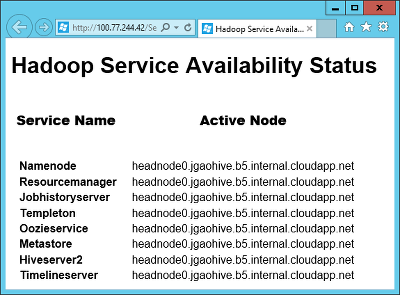

<properties
	pageTitle="HDInsight 中 Hadoop 群集的可用性 | Azure"
	description="HDInsight 可部署包含附加头节点的高度可用且可靠的群集。"
	services="hdinsight"
	tags="azure-portal"
	editor="cgronlun"
	manager="paulettm"
	authors="mumian"
	documentationCenter=""/>

<tags
	ms.service="hdinsight"
	ms.date="04/27/2016"
	wacn.date="06/29/2016"/>

#HDInsight 中 Hadoop 群集的可用性和可靠性

HDInsight 可让客户部署各种不同的群集类型，用于不同的数据分析工作负荷。目前提供的群集类型包括用于查询和分析工作负荷的 Hadoop 群集、用于 NoSQL 工作负荷的 HBase 群集，以及用于实时事件处理工作负荷的 Storm 群集。在给定的群集类型中，不同的节点有不同的角色。例如：

- HDInsight 的 Hadoop 群集是使用两个角色部署的：
	- 头节点（2 个节点）
	- 数据节点（至少 1 个节点）

- HDInsight 的 HBase 群集是使用三个角色部署的：
	- 头服务器（2 个节点）
	- 区域服务器（至少 1 个节点）
	- 主控/Zookeeper 节点（3 个节点）

- HDInsight 的 Storm 群集是使用三个角色部署的：
	- Nimbus 节点（2 个节点）
	- Supervisor 服务器（至少 1 个节点）
	- Zookeeper 节点（3 个节点）

Hadoop 群集的标准实现通常具有单个头节点。HDInsight 通过添加辅助头节点/头服务器/Nimbus 节点来提高管理工作负荷所需的服务可用性和可靠性，从而消除了此单点故障。这些头节点/头服务器/Nimbus 节点设计为顺畅管理辅助节点故障，不过在头节点上运行的主服务的任何停机都会导致群集停止工作。

[ZooKeeper](http://zookeeper.apache.org/) 节点 (ZK) 已添加，用于头节点的主导选择，并确保辅助节点和网关 (GW) 知道在活动头节点 (Head Node0) 处于非活动状态的情况下何时故障转移到辅助头节点 (Head Node1)。

## 检查活动头节点服务的状态
若要确定哪个头节点处于活动状态，并检查该头节点上运行的服务状态，你必须通过使用远程桌面协议 (RDP) 连接到 Hadoop 群集。有关 RDP 说明，请参阅[使用 Azure 经典管理门户管理 HDInsight 中的 Hadoop 群集](/documentation/articles/hdinsight-administer-use-management-portal-v1/#connect-to-hdinsight-clusters-by-using-rdp)。一旦远程连接到了该群集，请双击位于桌面上的“Hadoop 服务可用状态”图标，以便通过相关状态来了解 Namenode、Jobtracker、Templeton、Oozieservice、Metastore 和 Hiveserver2 服务正在哪个头节点上运行，如果是 HDI 3.0，则可通过相关状态来了解 Namenode、Resource Manager、History Server、Templeton、Oozieservice、Metastore 和 Hiveserver2 服务正在哪个头节点上运行。

在屏幕截图中，活动头节点是 *headnode0* 。

## 访问辅助头节点上的日志文件

当辅助头节点变为活动头节点时，可以通过浏览 JobTracker UI 来访问辅助头节点上的作业日志，就像是在主活动节点上操作一样。若要访问 JobTracker，你必须通过使用 RDP 连接到 Hadoop 群集，如以上部分中所述。在远程连接到了该群集后，双击位于桌面上的“Hadoop 名称节点状态”图标，然后单击“NameNode 日志”，即可转到辅助头节点上的日志目录。

## 配置头节点大小
默认情况下，头节点分配作为大型虚拟机 (VM)。管理在群集上运行的大多数 Hadoop 作业只需要这种大小。但是有时，头节点可能需要超大 VM。例如，当群集需要管理大量的小型 Oozie 作业时。

超大 VM 可通过使用 Azure PowerShell cmdlet 或 HDInsight SDK 来配置。

通过使用 Azure PowerShell 创建和预配群集的过程记录在[使用 PowerShell 管理 HDInsight](/documentation/articles/hdinsight-administer-use-powershell/) 中。配置超大头节点需要将 `-HeadNodeVMSize ExtraLarge` 参数添加到此代码中使用的 `New-AzureHDInsightcluster` cmdlet。

    # Create a new HDInsight cluster in Azure PowerShell
	# Configured with an ExtraLarge head-node VM
    New-AzureHDInsightCluster `
				-Name $clusterName ` 
				-Location $location `
				-HeadNodeVMSize ExtraLarge `
				-DefaultStorageAccountName "$storageAccountName.blob.core.chinacloudapi.cn" `
				-DefaultStorageAccountKey $storageAccountKey `
				-DefaultStorageContainerName $containerName  `
				-ClusterSizeInNodes $clusterNodes

对于 SDK，情况也是如此。通过使用 SDK 创建和预配群集的过程记录在[使用 HDInsight .NET SDK](/documentation/articles/hdinsight-provision-clusters-v1/#sdk) 中。配置超大头节点需要将 `HeadNodeSize = NodeVMSize.ExtraLarge` 参数添加到此代码中使用的 `ClusterCreateParameters()` 方法。

    # Create a new HDInsight cluster with the HDInsight SDK
	# Configured with an ExtraLarge head-node VM
    ClusterCreateParameters clusterInfo = new ClusterCreateParameters()
    {
		Name = clustername,
		Location = location,
		HeadNodeSize = NodeVMSize.ExtraLarge,
		DefaultStorageAccountName = storageaccountname,
		DefaultStorageAccountKey = storageaccountkey,
		DefaultStorageContainer = containername,
		UserName = username,
		Password = password,
		ClusterSizeInNodes = clustersize
    };

## 后续步骤

- [Apache ZooKeeper](http://zookeeper.apache.org/)
- [使用 RDP 连接到 HDInsight 群集](/documentation/articles/hdinsight-administer-use-management-portal-v1/#rdp)
- [使用 HDInsight .NET SDK](/documentation/articles/hdinsight-provision-clusters-v1/#sdk)

<!---HONumber=Mooncake_0307_2016-->