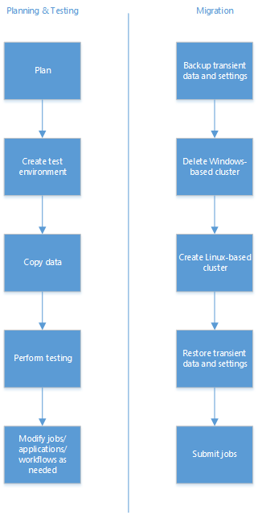

<!-- not suitable for Mooncake -->

<properties
    pageTitle="从基于 Windows 的 HDInsight 迁移到基于 Linux 的 HDInsight | Azure"
    description="了解如何从基于 Windows 的 HDInsight 群集迁移到基于 Linux 的 HDInsight 群集。"
    services="hdinsight"
    documentationcenter=""
    author="Blackmist"
    manager="jhubbard"
    editor="cgronlun" />
<tags 
    ms.assetid="ff35be59-bae3-42fd-9edc-77f0041bab93"
    ms.service="hdinsight"
    ms.devlang="na"
    ms.topic="article"
    ms.tgt_pltfrm="na"
    ms.workload="big-data"
    ms.date="10/28/2016"
    wacn.date="02/06/2017"
    ms.author="larryfr" />

# 从基于 Windows 的 HDInsight 群集迁移到基于 Linux 的群集
尽管基于 Windows 的 HDInsight 提供在云中轻松使用 Hadoop 的方法，你可能会将发现，需要有一个基于 Linux 的群集才能利用解决方案所需的工具和技术。Hadoop 生态系统中的许多功能都是基于 Linux 的系统开发的，因此某些功能可能无法用于基于 Windows 的 HDInsight。除此之外，许多针对 Hadoop 的书籍、视频及其他培训材料都假设使用的是 Linux 系统。

本文档提供 Windows 和 Linux 上 HDInsight 差异的详细信息，以及如何将现有工作负荷迁移到基于 Linux 的群集的指导。

> [AZURE.NOTE]
HDInsight 群集使用 Ubuntu 长期支持 (LTS) 作为群集中节点的操作系统。有关 HDInsight 提供的 Ubuntu 版本的信息以及其他版本控制组件的信息，请参阅 [HDInsight 组件版本](/documentation/articles/hdinsight-component-versioning/)。
>
>

## 迁移任务
以下是一般迁移工作流。

1. 请阅读本文档的每个部分，以了解将现有工作流和作业等迁移到基于 Linux 的群集时，可能需要进行的更改。
2. 创建基于 Linux 的群集作为测试/质量保证环境。有关创建基于 Linux 的群集的详细信息，请参阅 [Create Linux-based clusters in HDInsight](/documentation/articles/hdinsight-hadoop-provision-linux-clusters/)（在 HDInsight 中创建基于 Linux 的群集）。
3. 将现有作业、数据源及接收器复制到新环境。有关详细信息，请参阅“将数据复制到测试环境”部分。
4. 执行验证测试，以确保作业在新群集上按预期工作。

验证一切都按预期工作后，请为迁移安排停机时间。在停机期间，请执行以下操作。

1. 备份所有存储在本地群集节点上的暂时性数据。例如，如果你的数据直接存储在头节点上。
2. 删除基于 Windows 的群集。
3. 使用与基于 Windows 的群集使用的相同默认数据存储，创建基于 Linux 的群集。这样，新群集便可根据现有生产数据继续运行。
4. 导入任何已备份的暂时性数据。
5. 使用新群集启动作业/继续处理。

### 将数据复制到测试环境
复制数据和作业的方法有很多，不过，本部分所述的两种方法是将文件直接移到测试群集的最简单方法。

#### HDFS DFS 复制
可在以下步骤中使用 Hadoop HDFS 命令，直接将数据从现有生产群集的存储复制到新测试群集的存储。

1. 查找现有群集的存储帐户和默认容器信息。为此，可以使用以下 Azure PowerShell 脚本。

        $clusterName="Your existing HDInsight cluster name"
        $clusterInfo = Get-AzureRmHDInsightCluster -ClusterName $clusterName
        write-host "Storage account name: $clusterInfo.DefaultStorageAccount.split('.')[0]"
        write-host "Default container: $clusterInfo.DefaultStorageContainer"
2. 根据“Create Linux-based clusters in HDInsight”（在 HDInsight 中创建基于 Linux 的群集）文档中的步骤创建新测试环境。在创建群集之前停止，并改为选择“可选配置”。
3. 从“可选配置”边栏选项卡中，选择“链接的存储帐户”。
4. 选择“添加存储密钥”，并在出现提示时选择步骤 1 中由 PowerShell 脚本返回的存储帐户。在每个边栏选项卡上单击“选择”可关闭该边栏选项卡。最后，创建群集。
5. 创建群集后，使用 **SSH** 连接到该群集。 如果你不熟悉配合 HDInsight 使用 SSH 的方式，请参阅以下文章。

    * [Use SSH with Linux-based HDInsight from Windows clients（在 Windows 客户端中将 SSH 与基于 Linux 的 HDInsight 配合使用）](/documentation/articles/hdinsight-hadoop-linux-use-ssh-windows/)
    * [Use SSH with Linux-based HDInsight from Linux, Unix, and Mac clients（在 Linux、Unix 和 Mac 客户端中将 SSH 与基于 Linux 的 HDInsight 配合使用）](/documentation/articles/hdinsight-hadoop-linux-use-ssh-unix/)
6. 从 SSH 会话中，使用以下命令来将文件从链接的存储帐户复制到新的默认存储帐户。将 CONTAINER 和 ACCOUNT 替换为步骤 1 中由 PowerShell 脚本返回的容器和帐户信息。将数据的路径替换为数据文件的路径。

        hdfs dfs -cp wasbs://CONTAINER@ACCOUNT.blob.core.chinacloudapi.cn/path/to/old/data /path/to/new/location

    [AZURE.NOTE] 如果包含数据的目录结构不在测试环境中，你可以使用以下命令创建它。

        hdfs dfs -mkdir -p /new/path/to/create

    `-p` 开关用于在路径中创建所有目录。

#### 在 Azure 存储 Blob 之间直接复制
或者，你可能想要使用 `Start-AzureStorageBlobCopy` Azure PowerShell cmdlet 在 HDInsight 以外的存储帐户之间复制 Blob。有关详细信息，请参阅“Using Azure PowerShell with Azure Storage”（在 Azure 存储空间中使用 Azure PowerShell）一文中的“How to manage Azure Blobs”（如何管理 Azure Blob）部分。

## 客户端技术
一般而言，客户端技术（例如 [Azure PowerShell cmdlet](/documentation/articles/powershell-install-configure/)、[Azure CLI](/documentation/articles/xplat-cli-install/) 或 [.NET SDK for Hadoop](https://hadoopsdk.codeplex.com/)）在基于 Linux 的群集上都将以相同的方式运行，因为在这两个群集 OS 类型中，它们依赖的 REST API 相同。

## 服务器端技术
以下表提供了迁移 Windows 特定的服务器端组件的指导。

| 如果你使用此技术... | 请执行此操作... |
| --- | --- |
| **PowerShell**（服务器端脚本，包含群集创建期间使用的脚本操作） |重新编写为 Bash 脚本。有关脚本操作，请参阅 [Customize Linux-based HDInsight with Script Actions](/documentation/articles/hdinsight-hadoop-customize-cluster-linux/)（使用脚本操作自定义基于 Linux 的 HDInsight 群集）和 [Script action development for Linux-based HDInsight](/documentation/articles/hdinsight-hadoop-script-actions-linux/)（针对基于 Linux 的 HDInsight 的脚本操作开发）。 |
| **Azure CLI**（服务器端脚本） |尽管 Azure CLI 可在 Linux 上使用，但它并没有预先安装在 HDInsight 群集头节点上。如果需要使用它来编写服务器端脚本，请参阅 [Install the Azure CLI](/documentation/articles/xplat-cli-install/)（安装 Azure CLI），了解如何在基于 Linux 的平台上进行安装。 |
| **.NET 组件** |基于 Linux 的 HDInsight 群集不完全支持 .NET。2017 年 10 月 28 日以后创建的 HDInsight 群集上基于 Linux 的 Storm 使用 SCP.NET 框架支持 C# Storm 拓扑。在将来的更新中将添加对 .NET 的其他支持。 |
| **Win32 组件或其他仅限 Windows 的技术** |具体的指导取决于组件或技术；需要找到与 Linux 兼容的版本、找到替代解决方案，或者重新编写此组件。 |

## 群集创建
本部分提供群集创建的差异的信息。

### SSH 用户
基于 Linux 的 HDInsight 使用**安全 Shell (SSH)** 协议来为群集节点提供远程访问功能。与基于 Windows 的群集的远程桌面不同，大多数 SSH 客户端并不提供图形化用户体验，而是提供用于在群集上运行命令的命令行。某些客户端（例如 [MobaXterm](http://mobaxterm.mobatek.net/)）除了提供远程命令行以外，还提供图形化文件系统浏览器。

在群集创建期间，必须提供 SSH 用户，以及**密码**或**公钥证书**以进行身份验证。

我们建议使用公钥证书，因为它比密码更安全。证书身份验证将生成已签名的公钥/私钥对，然后在创建群集时提供公钥。使用 SSH 连接到服务器时，客户端上的私钥将会为连接提供身份验证。

有关配合 HDInsight 使用 SSH 的详细信息，请参阅：

* [Use SSH with HDInsight from Windows clients（在 Windows 客户端中将 SSH 与 HDInsight 配合使用）](/documentation/articles/hdinsight-hadoop-linux-use-ssh-windows/)
* [Use SSH with HDInsight from Linux, Unix, and OS X clients（在 Linux、Unix 和 OS X 客户端中将 SSH 与 HDInsight 配合使用）](/documentation/articles/hdinsight-hadoop-linux-use-ssh-unix/)

### 群集自定义
配合基于 Linux 的群集使用的**脚本操作**必须以 Bash 脚本编写。尽管脚本操作可在群集创建期间使用，它们也可以用于在基于 Linux 的群集已启动并开始运行之后进行自定义。有关详细信息，请参阅 [Customize Linux-based HDInsight with Script Actions](/documentation/articles/hdinsight-hadoop-customize-cluster-linux/)（使用脚本操作自定义基于 Linux 的 HDInsight 群集）和 [Script action development for Linux-based HDInsight](/documentation/articles/hdinsight-hadoop-script-actions-linux/)（针对基于 Linux 的 HDInsight 的脚本操作开发）。

另一个自定义功能是 **bootstrap**。对于 Windows 群集，这可让你指定其他配合 Hive 使用的库的位置。在创建群集后，这些库可自动配合 Hive 查询使用，而无需使用 `ADD JAR`。

对于基于 Linux 的群集，bootstrap 并不提供此功能。请改用 [Add Hive libraries during cluster creation](/documentation/articles/hdinsight-hadoop-add-hive-libraries/)（在创建群集期间添加 Hive 库）中所述的脚本操作。

### 虚拟网络
基于 Windows 的 HDInsight 仅支持经典虚拟网络，而基于 Linux 的 HDInsight 则需要 Resource Manager 虚拟网络。如果资源位于基于 Linux 的 HDInsight 群集必须连接到的经典虚拟网络中，请参阅 [Connecting a Classic Virtual Network to a Resource Manager Virtual Network](/documentation/articles/vpn-gateway-connect-different-deployment-models-portal/)（将经典虚拟网络连接到 Resource Manager 虚拟网络）。

有关将 Azure 虚拟网络与 HDInsight 配合使用时所要满足的配置要求的详细信息，请参阅 [Extend HDInsight capabilities by using a Virtual Network](/documentation/articles/hdinsight-extend-hadoop-virtual-network/)（使用 Azure 虚拟网络扩展 HDInsight 功能）。

## 监视和管理
与基于 Windows 的 HDInsight 配合使用的许多 Web UI（例如作业历史记录或 Yarn UI）均可通过 Ambari 使用。此外，Ambari Hive 视图提供使用 Web 浏览器运行 Hive 查询的方法。基于 Linux 的群集可通过以下位置使用 Ambari Web UI：https://CLUSTERNAME.azurehdinsight.cn。

有关使用 Ambari 的详细信息，请参阅以下文档：

* [Ambari Web](/documentation/articles/hdinsight-hadoop-manage-ambari/)
* [Ambari REST API](/documentation/articles/hdinsight-hadoop-manage-ambari-rest-api/)

### Ambari 警报
Ambari 提供能够通知群集潜在问题的警报系统。警报将以红色或黄色条目出现在 Ambari Web UI 中，你也可以通过 REST API 检索警报。

> [AZURE.IMPORTANT]
Ambari 警报表示*可能*有问题，而不表示*已发生*问题。例如，你可能会收到无法访问 HiveServer2 的警报，但实际上仍可以正常访问它。
>

> 许多警报都是针对某项服务实现为基于间隔的查询，并预期在特定的时间范围内收到响应。因此警报本身并不代表服务已关闭，而只是单纯表示该服务没有在预期时间范围内返回结果。
>
>

一般情况下，你应该先评估某个警报是否已长时间持续发生，或者是否与用户先前针对群集报告的某个问题有关联，然后对它采取措施。

## 文件系统位置
Linux 群集文件系统的布局与基于 Windows 的 HDInsight 群集不同。使用下表来查找常用的文件。

| 我需要查找... | 文件位于... |
| --- | --- |
| 配置 |`/etc`。例如 `/etc/hadoop/conf/core-site.xml` |
| 日志文件 |`/var/logs` |
| Hortonworks 数据平台 (HDP) |`/usr/hdp`。此处有两个目录，一个是当前 HDP 版本（例如 `2.2.9.1-1`），另一个是 `current`。`current` 目录包含位于版本号目录中的文件和目录的符号链接，可作为方便访问 HDP 文件的方法，因为版本号将随 HDP 版本的更新而更改。 |
| hadoop-streaming.jar |`/usr/hdp/current/hadoop-mapreduce-client/hadoop-streaming.jar` |

一般而言，如果你知道文件的名称，则可以从 SSH 会话使用以下命令来查找文件路径：

    find / -name FILENAME 2>/dev/null

也可以对文件名使用通配符。例如，`find / -name *streaming*.jar 2>/dev/null` 将返回文件名包含“streaming”的任何 Jar 文件的路径。

## Hive、Pig 和 MapReduce
基于 Linux 的群集上的 Pig 和 MapReduce 工作负荷与基于 Windows 的版本非常相似，主要差别在于，如果你使用远程桌面连接到基于 Windows 的群集并运行作业，则需要针对基于 Linux 的群集使用 SSH。

* [将 Pig 与 SSH 配合使用](/documentation/articles/hdinsight-hadoop-use-pig-ssh/)
* [将 MapReduce 与 SSH 配合使用](/documentation/articles/hdinsight-hadoop-use-mapreduce-ssh/)

### Hive
下图提供了迁移 Hive 工作负荷的指导。

| 对于基于 Windows 的群集，我使用... | 对于基于 Linux 的群集... |
| --- | --- |
| **Hive 编辑器** |Ambari 中的 Hive 视图 |
| 运行 `set hive.execution.engine=tez;` 以启用 Tez |Tez 是基于 Linux 的群集的默认执行引擎，因此不再需要 set 语句。 |
| 服务器上的 CMD 文件或脚本作为 Hive 作业的一部分调用 |使用 Bash 脚本 |
| 从远程桌面运行 `hive` 命令 |使用 [Beeline](/documentation/articles/hdinsight-hadoop-use-hive-beeline/)，或者[从 SSH 会话使用 Hive](/documentation/articles/hdinsight-hadoop-use-hive-ssh/) |

## Storm
| 对于基于 Windows 的群集，我使用... | 对于基于 Linux 的群集... |
| --- | --- |
| Storm 仪表板 |Storm 仪表板不可用。请参阅 [Deploy and Manage Storm topologies on Linux-based HDInsight](/documentation/articles/hdinsight-storm-deploy-monitor-topology/)（在基于 Linux 的 HDInsight 上部署和管理 Storm 拓扑），了解提交拓扑的方法 |
| Storm UI |Storm UI 位于 https://CLUSTERNAME.azurehdinsight.cn/stormui |
| 使用 Visual Studio 创建、部署和管理 C# 或混合拓扑 |在 2017 年 10 月 28 日以后创建的 HDInsight 群集上基于 Linux 的 Storm 中，可以使用 Visual Studio 创建、部署和管理 C# (SCP.NET) 或混合拓扑。 |

## HBase
在基于 Linux 的群集上，HBase 的 znode 父级为 `/hbase-unsecure`。必须在使用本机 HBase Java API 的任何 Java 客户端应用程序的配置中设置此值。

有关用于设置此值的示例客户端，请参阅 [Build a Java-based HBase application](/documentation/articles/hdinsight-hbase-build-java-maven/)（构建基于 Java 的 HBase 应用程序）。

## Spark
在预览期，Spark 群集可在 Windows 群集上使用；但是，在正式版中，Spark 只能在基于 Linux 的群集上使用。基于 Windows 的 Spark 预览群集与基于 Linux 的 Spark 正式版群集之间没有迁移路径。

## 已知问题

### 行尾
一般情况下，基于 Windows 的系统上的行尾使用 CRLF，而基于 Linux 的系统使用 LF。如果你生成的数据带有 CRLF 行尾或者你预期会出现这种行尾，可能需要修改生成器或使用方才能处理 LF 行尾。

例如，使用 Azure PowerShell 来在基于 Windows 的群集上查询 HDInsight，将返回带有 CRLF 的数据。在基于 Linux 的群集上使用相同的查询将返回 LF。在许多情况下，这对数据使用方来说并不重要，但是在迁移到基于 Linux 的群集之前，仍然应该予以调查。

如果你的脚本需直接在 Linux 群集节点上执行（例如配合 Hive 或 MapReduce 作业使用的 Python 脚本），你始终应该使用 LF 作为行尾。如果使用 CRLF，可能会在基于 Linux 的群集上运行脚本时遇到错误。

如果你知道脚本中不存在内嵌 CR 字符的字符串，可以使用以下方法之一来批量更改行尾：

* **如果你打算将脚本上载群集**，请在将脚本上载到群集之前，使用以下 PowerShell 语句将行尾从 CRLF 更改为 LF。

        $original\_file ='c:\\path\\to\\script.py' 
        $text = [IO.File]::ReadAllText($original\_file) -replace "`r`n", "`n" 
        [IO.File]::WriteAllText($original\_file, $text)
* **如果脚本已在群集使用的存储中**，可以针对基于 Linux 的群集，通过 SSH 会话使用以下命令来修改脚本。

        hdfs dfs -get wasbs:///path/to/script.py oldscript.py 
        tr -d '\\r' < oldscript.py > script.py 
        hdfs dfs -put -f script.py wasbs:///path/to/script.py

## 后续步骤
* [了解如何创建基于 Linux 的 HDInsight 群集](/documentation/articles/hdinsight-hadoop-provision-linux-clusters/)
* [从 Windows 客户端使用 SSH 连接到基于 Linux 的群集](/documentation/articles/hdinsight-hadoop-linux-use-ssh-windows/)
* [从 Linux、Unix，或 Mac 客户端使用 SSH 连接到基于 Linux 的群集](/documentation/articles/hdinsight-hadoop-linux-use-ssh-unix/)
* [使用 Ambari 管理基于 Linux 的群集](/documentation/articles/hdinsight-hadoop-manage-ambari/)

<!---HONumber=Mooncake_1205_2016-->