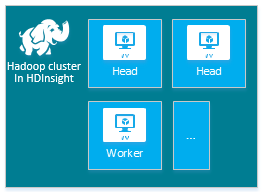
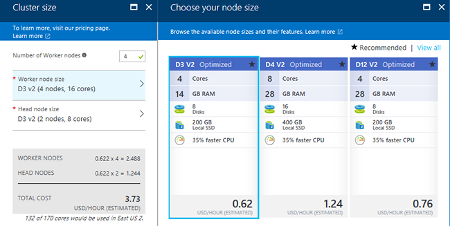

<!-- not suitable for Mooncake -->

<properties
    pageTitle="在 HDInsight 中创建基于 Windows 的 Hadoop 群集 | Azure"
    description="了解如何创建 Azure HDInsight 的群集。"
    services="hdinsight"
    documentationcenter=""
    tags="azure-portal"
    author="mumian"
    manager="jhubbard"
    editor="cgronlun" />
<tags 
    ms.assetid="a311f7e0-9333-4886-a726-def79e5db8cb"
    ms.service="hdinsight"
    ms.devlang="na"
    ms.topic="article"
    ms.tgt_pltfrm="na"
    ms.workload="big-data"
    ms.date="10/21/2016"
    wacn.date="02/06/2017"
    ms.author="jgao" />

# 在 HDInsight 中创建基于 Windows 的 Hadoop 群集
[AZURE.INCLUDE [选择器](../../includes/hdinsight-selector-create-clusters.md)]

Hadoop 群集由用于对群集中的任务进行分布式处理的多个虚拟机（节点）组成。Azure 已将各个节点的安装和配置的实现细节精简化，因此只需提供常规配置信息。在本文中，你会了解这些配置设置。

> [AZURE.NOTE]
本文档中的信息与基于 Windows 的 Azure HDInsight 群集相关。有关基于 Linux 的群集的信息，请参阅 [Create Linux-based Hadoop clusters in HDInsight](/documentation/articles/hdinsight-hadoop-provision-linux-clusters/)（在 HDInsight 中创建基于 Linux 的 Hadoop 群集）。
> 
> 

## 访问控制要求
[AZURE.INCLUDE [access-control](../../includes/hdinsight-access-control-requirements.md)]

##  群集类型
当前，HDInsight 提供四种不同类型的群集，每种类型都具有一组用于提供特定功能的组件。

| 群集类型 | 功能 |
| --- | --- |
| Hadoop |查询和分析（批处理作业） |
| HBase |NoSQL 数据存储 |
| Storm |实时事件处理 |
| Spark（预览版） |内存中处理、交互式查询、微批流处理 |

每个群集类型具有自身的节点数目，在群集中使用自身的节点术语，对每个节点类型具有默认的 VM 大小。下表中的括号内列出了每个节点类型的节点数目。

| 类型 | 节点（节点数） | 图表 |
| --- | --- | --- |
| Hadoop |头节点 (2)，数据节点 (1+) | |
| HBase |头服务器 (2)，区域服务器 (1+)，主控/ZooKeeper 节点 (3) | |
| Storm |Nimbus 节点 (2)，监督程序服务器 (1+)，ZooKeeper 节点 (3) | |
| Spark |头节点 (2)，辅助角色节点 (1+)，ZooKeeper 节点 (3)（对于 A1 ZooKeeper VM 大小免费） | |

> [AZURE.IMPORTANT]
如果计划使用 32 个以上的工作节点（在创建群集时配置或者是在创建之后通过扩展群集来配置），必须选择至少具有 8 个核心和 14 GB RAM 的头节点大小。
> 
> 

可以使用[脚本操作](#customize-clusters-using-script-action)向这些基本类型添加其他组件，如 Hue 或 R。

> [AZURE.IMPORTANT]
HDInsight 群集有各种类型，分别与针对其优化群集的工作负荷或技术相对应。没有任何方法支持创建组合多种类型的群集，如一个群集同时具有 Storm 和 HBase 类型。
> 
> 

如果你的解决方案需要分布在多种 HDInsight 群集类型上的技术，则应创建 Azure 虚拟网络，并创建虚拟网络中所需的群集类型。这允许群集以及部署到群集的任何代码直接相互通信。

有关将 Azure 虚拟网络与 HDInsight 配合使用的详细信息，请参阅[使用 Azure 虚拟网络扩展 HDInsight](/documentation/articles/hdinsight-extend-hadoop-virtual-network/)。

有关在 Azure 虚拟网络中使用两种群集类型的示例，请参阅[使用 Storm 和 HBase 分析传感器数据](/documentation/articles/hdinsight-storm-sensor-data-analysis/)。

## 基本配置选项
下面是创建 HDInsight 群集所需的基本配置选项。

### 群集名称
群集名称用于标识群集。群集名称必须全局唯一，并且遵守以下命名准则：

* 字段必须是包含 3 到 63 个字符的字符串
* 字段只能包含字母、数字和连字符。

### 群集类型
请参阅[群集类型](#cluster-types)。

### 操作系统
可以在以下两个操作系统之一上创建 HDInsight 群集：

* Linux 上的 HDInsight。HDInsight 提供在 Azure 上配置 Linux 群集的选项。如果熟悉 Linux 或 Unix，要从现有的基于 Linux 的 Hadoop 解决方案进行迁移，或者想要轻松集成针对 Linux 构建的 Hadoop 生态系统组件，请配置 Linux 群集。有关详细信息，请参阅[在 HDInsight 中的 Linux 上开始使用 Hadoop](/documentation/articles/hdinsight-hadoop-linux-tutorial-get-started/)。
* Windows 上的 HDInsight (Windows Server 2012 R2 Datacenter)。

### HDInsight 版本
HDInsight 版本用于确定此群集所用的 HDInsight 版本。有关详细信息，请参阅 [Hadoop cluster versions and components in HDInsight](/documentation/articles/hdinsight-component-versioning/)（HDInsight 中的 Hadoop 群集版本和组件）。

### 订阅名称
每个 HDInsight 群集与一个 Azure 订阅绑定。

### 资源组名称
使用 [Azure Resource Manager](/documentation/articles/resource-group-overview/) 可为应用程序部署、更新、监视或删除资源。

### 凭据
使用 HDInsight 群集时，可以在群集创建期间配置三个用户帐户。

* 可以借助 [Azure Resource Manager](/documentation/articles/resource-group-overview/) 以组（称为 Azure 资源组）的形式处理应用程序中的资源。可以通过一个协调的操作为应用程序部署、更新、监视或删除所有资源。
* HTTP 用户。默认用户名是在 Azure 门户预览上使用基本配置创建的 *admin*，有时，默认称作“群集用户”。
* RDP 用户（Windows 群集）使用 RDP 连接到群集。创建帐户时，必须将过期日期设置在从帐户创建日期算起的 90 天内。
* SSH 用户（Linux 群集）。使用 SSH 连接到群集。群集创建后，可以根据[在 Linux、Unix 或 OS X 中的 HDInsight 上将 SSH 与基于 Linux 的 Hadoop 配合使用](/documentation/articles/hdinsight-hadoop-linux-use-ssh-unix/)中的步骤创建更多 SSH 用户帐户。

### 数据源
原始 Hadoop 分布式文件系统 (HDFS) 在群集上使用许多本地磁盘。HDInsight 将 Azure Blob 存储用于数据存储。Azure Blob 存储是一种稳健、通用的存储解决方案，它与 HDInsight 无缝集成。通过 HDFS 界面，可以针对 Blob 存储中的结构化或非结构化数据直接运行 HDInsight 中的整套组件。如果将数据存储在 Blob 存储中，则可以安全删除用于计算的 HDInsight 群集，而不会丢失用户数据。

在配置期间，你必须指定 Azure 存储帐户，并在该 Azure 存储帐户中指定 Azure Blob 存储容器。某些创建过程要求事先创建 Azure 存储帐户和 Blob 存储容器。群集使用该 Blob 存储容器作为默认存储位置。也可以选择指定群集可访问的其他 Azure 存储帐户（链接的存储）。群集还可以访问任何配置有完全公共读取权限或仅限对 Blob 的公共读取权限的 Blob 存储容器。有关详细信息，请参阅[管理对 Azure 存储资源的访问](/documentation/articles/storage-manage-access-to-resources/)。

> [AZURE.NOTE]
Blob 存储容器提供一组 Blob 集，如下图所示。
> 
> 

在配置期间，你必须指定 Azure 存储帐户，并在该 Azure 存储帐户中指定 Azure Blob 存储容器。某些创建过程要求事先创建 Azure 存储帐户和 Blob 存储容器。群集使用该 Blob 存储容器作为默认存储位置。也可以选择指定群集可访问的其他 Azure 存储帐户（链接的存储）。群集还可以访问任何配置有完全公共读取权限或仅限对 Blob 的公共读取权限的 Blob 容器。有关详细信息，请参阅[管理对 Azure 存储资源的访问](/documentation/articles/storage-manage-access-to-resources/)。

不建议使用默认 Blob 存储容器来存储业务数据。良好的做法是每次使用之后删除默认 Blob 存储容器以降低存储成本。默认容器包含应用程序日志和系统日志。请确保在删除该容器之前检索日志。

> [AZURE.WARNING]
HDInsight 不支持多个群集共享同一个 Blob 存储容器。
> 
> 

有关辅助 Blob 存储的详细信息，请参阅 [HDFS-compatible Azure Blob storage with Hadoop in HDInsight](/documentation/articles/hdinsight-hadoop-use-blob-storage/)（将 HDFS 兼容的 Azure Blob 存储与 HDInsight 中的 Hadoop 配合使用）。

### 位置（区域）
HDInsight 群集与其默认存储帐户必须位于相同的 Azure 位置。

有关受支持区域的列表，请单击 [HDInsight 定价](/pricing/details/hdinsight/)中的“区域”下拉列表。

###  节点定价层
客户需根据群集的生存期，支付这些节点的使用费。创建群集后便开始计费，删除群集后停止计费。无法取消分配群集或将其置于暂停状态。

不同群集类型具有不同的节点类型、节点数和节点大小。例如，Hadoop 群集类型具有两个*头节点*和四个*数据节点*（默认值），而 Storm 群集类型具有两个 *nimbus 节点*、三个 *ZooKeeper 节点*和四个 *supervisor 节点*（默认值）。HDInsight 群集的成本取决于节点数和节点的虚拟机大小。例如，如果你知道将执行需要大量内存的操作，则可能要选择具有更多内存的计算资源。为便于学习，建议使用一个数据节点。有关 HDInsight 定价的详细信息，请参阅 [HDInsight 定价](/pricing/details/hdinsight/)。

> [AZURE.NOTE]
群集大小限制因 Azure 订阅而异。要提高限制的大小，请联系计费支持人员。
> 

> 群集使用的节点不视为虚拟机，因为用于节点的虚拟机映像是 HDInsight 服务的实现细节。但是，节点使用的计算核心会计入可供订阅使用的计算核心总数。创建 HDInsight 群集时，可以在“节点定价层”边栏选项卡的摘要部分中查看可用核心数以及群集要使用的核心数。
> 
> 

使用 Azure 门户预览配置群集时，可通过“节点定价层”边栏选项卡查看节点大小。还可以查看不同节点大小的相关成本。以下屏幕截图显示了基于 Linux 的 Hadoop 群集的选项。

下表显示 HDInsight 群集支持的大小和它们提供的容量。

### 标准层：A 系列
在经典部署模型中，某些 VM 大小在 PowerShell 和 CLI 中稍有不同。

* Standard\_A3 是大型
* Standard\_A4 是超大型

| 大小 | CPU 核心数 | 内存 | NIC 数（最大值） | 最大磁盘大小 | 最大数据磁盘（每个 1023 GB） | 最大IOPS（每个磁盘 500 次） |
| --- | --- | --- | --- | --- | --- | --- |
| Standard\_A3\\大型 |4 |7 GB |2 |临时磁盘 = 285 GB |8 |8x500 |
| Standard\_A4\\超大型 |8 |14 GB |4 |临时磁盘 = 605 GB |16 |16x500 |
| Standard\_A6 |4 |28 GB |2 |临时磁盘 = 285 GB |8 |8x500 |
| Standard\_A7 |8 |56 GB |4 |临时磁盘 = 605 GB |16 |16x500 |

### 标准层：D 系列
| 大小 | CPU 核心数 | 内存 | NIC 数（最大值） | 最大磁盘大小 | 最大数据磁盘（每个 1023 GB） | 最大IOPS（每个磁盘 500 次） |
| --- | --- | --- | --- | --- | --- | --- |
| Standard\_D3 |4 |14 GB |4 |临时磁盘 (SSD) = 200 GB |8 |8x500 |
| Standard\_D4 |8 |28 GB |8 |临时磁盘 (SSD) = 400 GB |16 |16x500 |
| Standard\_D12 |4 |28 GB |4 |临时磁盘 (SSD) = 200 GB |8 |8x500 |
| Standard\_D13 |8 |56 GB |8 |临时磁盘 (SSD) = 400 GB |16 |16x500 |
| Standard\_D14 |16 |112 GB |8 |临时磁盘 (SSD) = 800 GB |32 |32x500 |

### 标准层：Dv2 系列
| 大小 | CPU 核心数 | 内存 | NIC 数（最大值） | 最大磁盘大小 | 最大数据磁盘（每个 1023 GB） | 最大IOPS（每个磁盘 500 次） |
| --- | --- | --- | --- | --- | --- | --- |
| Standard\_D3\_v2 |4 |14 GB |4 |临时磁盘 (SSD) = 200 GB |8 |8x500 |
| Standard\_D4\_v2 |8 |28 GB |8 |临时磁盘 (SSD) = 400 GB |16 |16x500 |
| Standard\_D12\_v2 |4 |28 GB |4 |临时磁盘 (SSD) = 200 GB |8 |8x500 |
| Standard\_D13\_v2 |8 |56 GB |8 |临时磁盘 (SSD) = 400 GB |16 |16x500 |
| Standard\_D14\_v2 |16 |112 GB |8 |临时磁盘 (SSD) = 800 GB |32 |32x500 |

有关在计划使用这些资源时要考虑的部署注意事项，请参阅 [Sizes for virtual machines](/documentation/articles/virtual-machines-windows-sizes/)（虚拟机的大小）。有关不同大小的定价信息，请参阅 [HDInsight Pricing](/pricing/details/hdinsight/)（HDInsight 定价）。

> [AZURE.IMPORTANT]
如果计划使用 32 个以上的辅助角色节点（在创建群集时配置或者是在创建之后通过扩展群集来配置），则必须选择至少具有 8 个核心和 14 GB RAM 的头节点大小。
> 
> 

创建群集后便开始计费，删除群集后停止计费。有关定价的详细信息，请参阅 [HDInsight pricing details](/pricing/details/hdinsight/)（HDInsight 定价详细信息）。

| 大小 | CPU 核心数 | 内存 | NIC 数（最大值） | 最大磁盘大小 | 最大数据磁盘（每个 1023 GB） | 最大IOPS（每个磁盘 500 次） |
| --- | --- | --- | --- | --- | --- | --- |
| Standard\_D3\_v2 |4 |14 GB |4 |临时磁盘 (SSD) = 200 GB |8 |8x500 |
| Standard\_D4\_v2 |8 |28 GB |8 |临时磁盘 (SSD) = 400 GB |16 |16x500 |
| Standard\_D12\_v2 |4 |28 GB |4 |临时磁盘 (SSD) = 200 GB |8 |8x500 |
| Standard\_D13\_v2 |8 |56 GB |8 |临时磁盘 (SSD) = 400 GB |16 |16x500 |
| Standard\_D14\_v2 |16 |112 GB |8 |临时磁盘 (SSD) = 800 GB |32 |32x500 |

有关在计划使用这些资源时要考虑的部署注意事项，请参阅 [Sizes for virtual machines](/documentation/articles/virtual-machines-windows-sizes/)（虚拟机的大小）。有关不同大小的定价信息，请参阅 [HDInsight Pricing](/pricing/details/hdinsight/)（HDInsight 定价）。

> [AZURE.IMPORTANT]
如果计划使用 32 个以上的工作节点（在创建群集时配置或者是在创建之后通过扩展群集来配置），必须选择至少具有 8 个核心和 14 GB RAM 的头节点大小。
> 
> 

 创建群集后便开始计费，删除群集后停止计费。有关定价的详细信息，请参阅 [HDInsight pricing details](/pricing/details/hdinsight/)（HDInsight 定价详细信息）。

##  添加更多存储
在某些情况下，可能要在群集中添加更多存储。例如，为不同地理区域或不同服务创建了多个 Azure 存储帐户，但想要使用 HDInsight 分析所有这些帐户。

有关辅助 Blob 存储的详细信息，请参阅 [Use HDFS-compatible Azure Blob storage with Hadoop in HDInsight](/documentation/articles/hdinsight-hadoop-use-blob-storage/)（将 HDFS 兼容的 Azure Blob 存储与 HDInsight 中的 Hadoop 配合使用）。

## 使用 Hive/Oozie 元存储
如果希望在删除 HDInsight 群集后保留 Hive 表，则强烈建议使用自定义元存储，以便将来可将该元存储附加到另一个 HDInsight 群集。

> [AZURE.IMPORTANT]
HDInsight 元存储无法向后兼容。例如，无法使用 HDInsight 3.3 群集的元存储来创建 HDInsight 3.2 群集。
> 
> 

元存储包含 Hive 和 Oozie 元数据，例如 Hive 表、分区、架构和列。元存储可帮助保留 Hive 和 Oozie 元数据。创建新群集时，不需要重新创建 Hive 表或 Oozie 作业。默认情况下，Hive 使用嵌入的 Azure SQL 数据库存储此信息。在删除群集时，嵌入的数据库无法保留元数据。例如，如果在包含 Hive 元存储的群集中创建了 Hive 表，则在删除并重新创建具有相同 Hive 元存储的群集时，可以看到这些表。

元存储配置不可用于 HBase 群集类型。

> [AZURE.IMPORTANT]
创建自定义元存储时，请勿使用包含短划线或连字符的数据库名称，因为这可能会导致群集创建过程失败。
> 
> 

## 使用 Azure 虚拟网络
[Azure 虚拟网络](/documentation/services/networking/)可帮助创建包含解决方案所需资源的安全持久性网络。使用虚拟网络可以：

* 在专用网络（仅限云）中将云资源连接在一起。
  
    
* 使用虚拟专用网络 (VPN) 将云资源连接到本地数据中心网络（站点到站点，或点到站点）。

| 站点到站点配置 | 点到站点配置 |
| --- | --- |
| 借助站点到站点配置，可以使用硬件 VPN 或路由和远程访问服务将多个资源从数据中心连接到 Azure 虚拟网络。  |借助点到站点配置，可以使用软件 VPN 将特定资源连接到 Azure 虚拟网络。  |

基于 Windows 的群集需要经典虚拟网络，基于 Linux 的群集需要 Azure Resource Manager 虚拟网络。如果没有正确的网络类型，创建群集时它将不能使用。

有关如何将 HDInsight 与虚拟网络配合使用的详细信息（包括虚拟网络的特定配置要求），请参阅 [Extend HDInsight capabilities by using Azure Virtual Network](/documentation/articles/hdinsight-extend-hadoop-virtual-network/)（使用 Azure 虚拟网络扩展 HDInsight 功能）。

## 使用 HDInsight 群集自定义功能来自定义群集 (bootstrap)
有时需要配置以下配置文件：

* clusterIdentity.xml
* core-site.xml
* gateway.xml
* hbase-env.xml
* hbase-site.xml
* hdfs-site.xml
* hive-env.xml
* hive-site.xml
* mapred-site
* oozie-site.xml
* oozie-env.xml
* storm-site.xml
* tez-site.xml
* webhcat-site.xml
* yarn-site.xml

若要在群集生存期保留更改，你可以在创建过程中使用 HDInsight 群集自定义。也可以在基于 Linux 的群集中使用 Ambari。有关详细信息，请参阅 [Customize HDInsight clusters by using Bootstrap](/documentation/articles/hdinsight-hadoop-customize-cluster-bootstrap/)（使用 Bootstrap 自定义 HDInsight 群集）。

> [AZURE.NOTE]
基于 Windows 的群集无法保留重置映像所造成的更改。有关详细信息，请参阅[重新启动角色实例进行 OS 升级](http://blogs.msdn.com/b/kwill/archive/2012/09/19/role-instance-restarts-due-to-os-upgrades.aspx)。若要在群集的整个生存期内保留更改，必须在创建过程中使用 HDInsight 群集自定义。
> 
> 

##  使用脚本操作自定义群集
你可以在创建期间通过使用脚本安装其他组件或自定义群集配置。此类脚本可通过**脚本操作**调用，脚本操作是一种配置选项，可通过 Azure 门户预览、HDInsight Windows PowerShell cmdlet 或 HDInsight .NET SDK 使用。有关详细信息，请参阅 [Customize a HDInsight cluster by using Script Action](/documentation/articles/hdinsight-hadoop-customize-cluster/)（使用脚本操作自定义 HDInsight 群集）。

##  群集创建方法
在本文中，你了解了有关创建基于 Windows 的 HDInsight 群集的基本信息。使用下表查找具体信息，了解如何使用最合适的方法创建群集。

| 群集创建方法 | Web 浏览器 | 命令行 | REST API | SDK | Linux、Mac OS X 或 Unix | Windows |
| --- |:---:|:---:|:---:|:---:|:---:|:---:|
| [Azure 门户预览](/documentation/articles/hdinsight-hadoop-create-windows-clusters-portal/) |✔ |&nbsp; |&nbsp; |&nbsp; |✔ |✔ |
| [Azure CLI](/documentation/articles/hdinsight-hadoop-create-windows-clusters-cli/) |&nbsp; |✔ |&nbsp; |&nbsp; |✔ |✔ |
| [Azure PowerShell](/documentation/articles/hdinsight-hadoop-create-windows-clusters-powershell/) |&nbsp; |✔ |&nbsp; |&nbsp; |✔ |✔ |
| [cURL](/documentation/articles/hdinsight-hadoop-create-linux-clusters-curl-rest/) |&nbsp; |✔ |✔ |&nbsp; |✔ |✔ |
| [.NET SDK](/documentation/articles/hdinsight-hadoop-create-windows-clusters-dotnet-sdk/) |&nbsp; |&nbsp; |&nbsp; |✔ |✔ |✔ |
| [Azure Resource Manager 模板](/documentation/articles/hdinsight-hadoop-create-windows-clusters-arm-templates/) |&nbsp; |✔ |&nbsp; |&nbsp; |✔ |✔ |

<!---HONumber=Mooncake_1205_2016-->