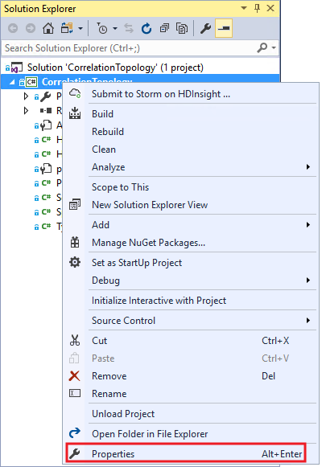
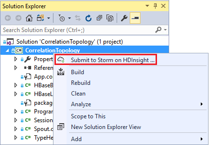
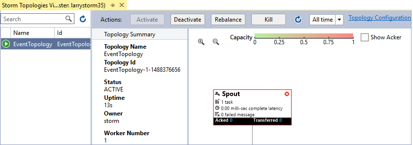

<properties
    pageTitle="使用 HDInsight 上的 Storm 和 HBase 按时间关联事件"
    description="了解如何使用 HDInsight 上的 Storm 和 HBase 将不同时间到达的事件关联起来。"
    services="hdinsight"
    documentationcenter=""
    author="Blackmist"
    manager="jhubbard"
    editor="cgronlun"
    tags="azure-portal" />
<tags
    ms.assetid="17d11479-2d02-4790-8d29-05fb38351479"
    ms.service="hdinsight"
    ms.devlang="dotnet"
    ms.topic="article"
    ms.tgt_pltfrm="na"
    ms.workload="big-data"
    ms.date="11/18/2016"
    wacn.date="01/25/2017"
    ms.author="larryfr" />

# 使用 HDInsight 上的 Storm 和 HBase 按时间关联事件

[AZURE.INCLUDE [azure-sdk-developer-differences](../../includes/azure-sdk-developer-differences.md)]

通过使用 Apache Storm 的持久数据存储，可以将不同时间到达的数据条目关联起来。例如，将用户会话的登录事件和注销事件关联起来，即可计算该会话的持续时间。

本文介绍如何创建基本的 C# Storm 拓扑来跟踪用户会话的登录事件和注销事件，从而计算出会话的持续时间。拓扑使用 HBase 作为永久性数据存储。HBase 还可用于对历史数据执行批查询，以便获得额外的信息，例如在特定的时段有多少用户会话启动或结束。

## 先决条件

* Visual Studio 和适用于 Visual Studio 的 HDInsight 工具：有关安装信息，请参阅[开始使用适用于 Visual Studio 的 HDInsight 工具](/documentation/articles/hdinsight-hadoop-visual-studio-tools-get-started/)。

* Apache Storm on HDInsight 群集（基于 Windows）。这将运行 Storm 拓扑，以便处理传入的数据并将其存储在 HBase 中。

* HDInsight 群集上的 Apache HBase（基于 Windows）。这是本示例的数据存储。

* [Java](https://java.com) 1.7 或更高版本，适用于开发环境。将拓扑提交到 HDInsight 群集时，可以使用 Java 将拓扑打包。

    * **JAVA\_HOME** 环境变量必须指向包含 Java 的目录。
    * **%JAVA\_HOME%/bin** 目录必须位于路径中

[AZURE.INCLUDE [azure-sdk-developer-differences](../../includes/azure-visual-studio-login-guide.md)]

## 体系结构

对事件进行关联时，需要一个事件源的通用标识符。例如，用户 ID、会话 ID 或其他数据片段，其特点是：a) 唯一；b) 包括在发送到 Storm 的所有数据中。此示例使用 GUID 值来表示会话 ID。

此示例包含两个 HDInsight 群集：

* HBase：历史数据的永久数据存储
* Storm：用于摄取传入数据

数据通过 Storm 拓扑随机生成，包含以下项：

* 会话 ID：一个 GUID，可唯一地标识每个会话
* 事件：开始或结束事件。就此示例来说，开始事件始终发生在结束事件之前
* 时间：事件的时间。

此数据在 HBase 中处理和存储。

### Storm 拓扑

会话启动时，**开始**事件将通过拓扑接收，然后记录到 HBase。收到**结束**事件后，拓扑会检索**开始**事件并计算两个事件之间的时间。然后会将此**持续时间**值存储到 HBase 中，同时存储的还有**结束**事件信息。

> [AZURE.IMPORTANT]
虽然此拓扑演示了基本的模式，但生产型解决方案需要针对以下情况进行设计：
>
 

 * 事件在到达时混乱无序 

 * 重复的事件 

 * 删除的事件

示例拓扑由以下组件组成：

* Session.cs：通过创建随机会话 ID、开始时间以及会话持续时间来模拟用户会话。

* Spout.cs：创建 100 个会话，发出一个开始事件，等待每个会话随机超时，然后发出一个结束事件。然后回收结束的会话，以便生成新会话。

* HBaseLookupBolt.cs：使用会话 ID 查找 HBase 中的会话信息。处理结束事件时，它会查找相应的开始事件，然后计算会话的持续时间。

* HBaseBolt.cs：将信息存储到 HBase。

* TypeHelper.cs：通过 HBase 执行读/写操作时，帮助进行类型转换。

### HBase 架构

在 HBase 中，数据存储在具有以下架构/设置的表中：

* 行键：会话 ID 用作此表中行的键。

* 列系列：系列名称为“cf”。存储在此系列中的列包括：
  
    * 事件：开始或结束。

    * 时间：事件发生的时间（以毫秒为单位）。

    * 持续时间：开始事件和结束事件之间的时长。

* 版本：“cf”系列设置为每行保留 5 个版本。
  
    > [AZURE.NOTE]
    可以使用版本来记录以前为特定行键存储的值。默认情况下，HBase 只返回行的最新版本的值。在这种情况下，同一行将用于所有事件（开始、结束）。每个版本的行通过时间戳值来标识。这样即可通过历史视图来查看针对特定 ID 记录的事件。

## 下载项目

可以从 [https://github.com/Azure-Samples/hdinsight-storm-dotnet-event-correlation](https://github.com/Azure-Samples/hdinsight-storm-dotnet-event-correlation) 下载示例项目。

此下载包含以下 C# 项目：

* CorrelationTopology：C# Storm 拓扑，可针对用户会话随机发出开始事件和结束事件。每个会话的持续时间为 1 到 5 分钟。

* SessionInfo：C# 控制台应用程序，用于创建 HBase 表，以及提供可返回已存储会话数据相关信息的示例查询。

## 创建表

1. 打开 Visual Studio 中的 **SessionInfo** 项目。

2. 在“解决方案资源管理器”中，右键单击“SessionInfo”项目，然后选择“属性”。
   
    

3. 选择**“设置”**，然后设置以下值：
   
    * HBaseClusterURL：到 HBase 群集的 URL。例如，https://myhbasecluster.azurehdinsight.cn。

    * HBaseClusterUserName：群集的管理员/HTTP 用户帐户

    * HBaseClusterPassword：管理员/HTTP 用户帐户的密码

    * HBaseTableName：用于此示例的表的名称

    * HBaseTableColumnFamily：列系列名称
     
        

4. 运行解决方案。出现提示时，选择可在 HBase 群集上创建表的“c”键。

## 生成和部署 Storm 拓扑

1. 在 Visual Studio 中打开 **CorrelationTopology** 解决方案。

2. 在“解决方案资源管理器”中，右键单击 **CorrelationTopology** 项目，然后选择属性。

3. 在属性窗口中，选择**“设置”**并提供以下信息。头 5 个应该是由 **SessionInfo** 项目使用的相同值：
   
    * HBaseClusterURL：到 HBase 群集的 URL。例如，https://myhbasecluster.azurehdinsight.cn。

    * HBaseClusterUserName：群集的管理员/HTTP 用户帐户。

    * HBaseClusterPassword：管理员/HTTP 用户帐户的密码。

    * HBaseTableName：用于此示例的表的名称。该名称包含的表名称应该与 SessionInfo 项目中使用的相同。

    * HBaseTableColumnFamily：列系列名称。该名称包含的列系列名称应该与 SessionInfo 项目中使用的相同。
   
    > [AZURE.IMPORTANT]
    请勿更改 HBaseTableColumnNames，因为其默认值是 **SessionInfo** 用来检索数据的名称。

4. 保存属性，然后生成项目。

5. 在“解决方案资源管理器”中，右键单击项目，然后选择“提交到 Storm on HDInsight”。如果出现提示，请输入 Azure 订阅的凭据。
   
    

6. 在“提交拓扑”对话框中，选择将运行此拓扑的 Storm 群集。
   
    > [AZURE.NOTE]
    第一次提交拓扑时，可能需要几秒钟来检索 HDInsight 群集名称。

7. 一旦上载拓扑并将其提交到该群集，“Storm 拓扑视图”将打开并显示正在运行的拓扑。选择 **CorrelationTopology**，然后使用页面右上角的刷新按钮刷新拓扑信息。
   
    
   
    当拓扑开始生成数据时，“已发出”列中的值将递增。
   
    > [AZURE.NOTE]
    如果“Storm 拓扑视图”未自动打开，可按以下步骤将其打开：
    > 

    >
 1. 在“解决方案资源管理器”中，展开“Azure”，然后展开“HDInsight”。
    >
 2. 右键单击在其上运行拓扑的 Storm 群集，然后选择“查看 Storm 拓扑”

## 查询数据

一旦已发出数据，则可使用以下步骤来查询数据。

1. 返回到 **SessionInfo** 项目。如果该项目未运行，可启动一个新实例。

2. 出现提示时，选择 **s** 即可搜索开始事件。系统会提示输入开始时间和结束时间，以便定义一个时间范围 - 只返回这两个时间之间的事件。
   
    输入开始和结束时间时使用以下格式：HH:MM 以及“am”或“pm”。例如，11:20pm。
   
    由于刚刚启动拓扑，可使用部署之前的某个时间作为开始时间，而使用现在的时间作为结束时间。这应该会捕获大多数在启动时生成的开始事件。当查询处于运行状态时，可看到如下所示的条目列表：
   
        Session e6992b3e-79be-4991-afcf-5cb47dd1c81c started at 6/5/2015 6:10:15 PM. Timestamp = 1433527820737

搜索结束事件与搜索开始事件在原理上是相同的。不过，结束事件是在开始事件之后 1 到 5 分钟随机生成的。因此，可能需要尝试数个时间范围才能找到结束事件。结束事件还会包含会话持续时间 - 开始事件时间与结束事件时间之差。下面是结束事件数据的一个示例：

    Session fc9fa8e6-6892-4073-93b3-a587040d892e lasted 2 minutes, and ended at 6/5/2015 6:12:15 PM

> [AZURE.NOTE]
虽然输入的时间值为本地时间，但从查询返回的时间将是 UTC。

## 停止拓扑

准备停止拓扑时，请返回到 Visual Studio 中的 **CorrelationTopology** 项目。在“Storm 拓扑视图”中，选择拓扑，然后使用拓扑视图顶部的**“终止”**按钮。

## 删除群集

[AZURE.INCLUDE [delete-cluster-warning](../../includes/hdinsight-delete-cluster-warning.md)]

## 后续步骤

如需更多 Storm 示例，请参阅 [Storm on HDInsight 拓扑示例](/documentation/articles/hdinsight-storm-example-topology/)。

<!---HONumber=Mooncake_0120_2017-->
<!--Update_Description: update from ASM to ARM-->