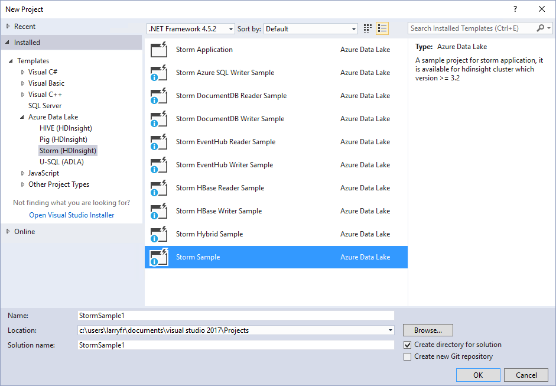
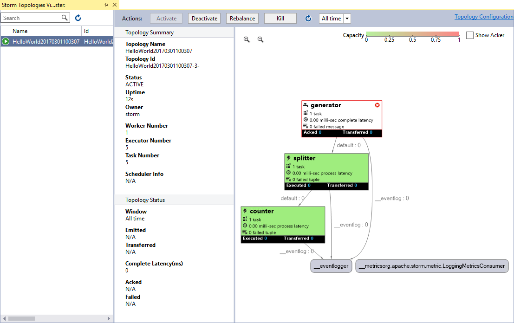

<properties
    pageTitle="在基于 Linux 的 HDInsight 上部署和管理 Apache Storm 拓扑 | Azure"
    description="了解如何使用基于 Linux 的 HDInsight 上的 Storm 仪表板部署、监视和管理 Apache Storm 拓扑。 使用 Hadoop Tools for Visual Studio。"
    services="hdinsight"
    documentationcenter=""
    author="Blackmist"
    manager="jhubbard"
    editor="cgronlun"
    translationtype="Human Translation" />
<tags
    ms.assetid="35086e62-d6d8-4ccf-8cae-00073464a1e1"
    ms.service="hdinsight"
    ms.custom="hdinsightactive"
    ms.devlang="na"
    ms.topic="article"
    ms.tgt_pltfrm="na"
    ms.workload="big-data"
    ms.date="03/22/2017"
    wacn.date="05/08/2017"
    ms.author="larryfr"
    ms.sourcegitcommit="2c4ee90387d280f15b2f2ed656f7d4862ad80901"
    ms.openlocfilehash="3f0976db07fb259f78cf47d48cc911b89727e76d"
    ms.lasthandoff="04/28/2017" />

# 在 HDInsight 上部署和管理 Apache Storm 拓扑

本文档介绍有关如何在 HDInsight 群集上管理和监视 Storm 上运行的 Storm 拓扑的基本知识。

[AZURE.INCLUDE [hdinsight-linux-acn-version.md](../../includes/hdinsight-linux-acn-version.md)]

> [AZURE.IMPORTANT]
> 本文中的步骤需要使用 HDInsight 群集上基于 Linux 的 Storm。 Linux 是在 HDInsight 3.4 版或更高版本上使用的唯一操作系统。 有关详细信息，请参阅 [HDInsight 在 Windows 上即将弃用](/documentation/articles/hdinsight-component-versioning/#hdi-version-33-nearing-deprecation-date)。 
> 

> 有关在基于 Windows 的 HDInsight 上部署和监视拓扑的详细信息，请参阅 [在基于 Windows 的 HDInsight 上部署和管理 Apache Storm 拓扑](/documentation/articles/hdinsight-storm-deploy-monitor-topology/)

## 先决条件

* **基于 Linux 的 Storm on HDInsight 群集**：请参阅 [Apache Storm on HDInsight 入门](/documentation/articles/hdinsight-apache-storm-tutorial-get-started-linux/)获取群集创建步骤

* （可选）**熟悉 SSH 和 SCP**：有关详细信息，请参阅[将 SSH 与 HDInsight 配合使用](/documentation/articles/hdinsight-hadoop-linux-use-ssh-unix/)。

* （可选）**Visual Studio**：Azure SDK 2.5.1 或更高版本，以及针对 Visual Studio 的 Data Lake 工具。 有关详细信息，请参阅[开始使用针对 Visual Studio 的 Data Lake 工具](/documentation/articles/hdinsight-hadoop-visual-studio-tools-get-started/)。

    下列其中一个版本的 Visual Studio：

    * Visual Studio 2012 Update 4

    * Visual Studio 2013 [Update 4](https://www.microsoft.com/download/details.aspx?id=45326) 或 [Visual Studio 2013 Community](http://go.microsoft.com/fwlink/?LinkId=517284)
    * [Visual Studio 2015](https://www.visualstudio.com/zh-cn/downloads/)

    * Visual Studio 2015（任何版本）

    * Visual Studio 2017（任何版本）。 针对 Visual Studio 2017 的 Data Lake 工具作为 Azure 工作负荷的一部分安装。

## 提交拓扑：Visual Studio

HDInsight Tools 可用于将 C# 或混合拓扑提交到 Storm 群集。 以下步骤使用了一个示例应用程序。 有关使用 HDInsight 工具创建自己的拓扑的详细信息，请参阅[使用 Visual Studio 的 HDInsight 工具开发 C# 拓扑](/documentation/articles/hdinsight-storm-develop-csharp-visual-studio-topology/)。

1. 如果尚未安装最新版本的针对 Visual Studio 的 Data Lake 工具，请参阅[开始使用针对 Visual Studio 的 Data Lake 工具](/documentation/articles/hdinsight-hadoop-visual-studio-tools-get-started/)。

    > [AZURE.NOTE]
    > 针对 Visual Studio 的 Data Lake 工具以前称为 Visual Studio 的 HDInsight 工具。
    > 

    > 针对 Visual Studio 的 Data Lake 工具包含在 Visual Studio 2017 的 __Azure 工作负荷__中。

2. 打开 Visual Studio，选择“文件” > “新建” > “项目”。

3. 在“新建项目”对话框中，展开“已安装” > “模板”，然后选择“HDInsight”。 从模板列表中，选择“Storm 示例”。 在对话框底部，键入应用程序的名称。

    

4. 在“解决方案资源管理器”中，右键单击项目，然后选择“提交到 Storm on HDInsight”。

   > [AZURE.NOTE]
   > 如果出现提示，请输入 Azure 订阅的登录凭据。 如果有多个订阅，请登录包含 Storm on HDInsight 群集的订阅。

5. 从“Storm 群集”下拉列表中选择 Storm on HDInsight 群集，然后选择“提交”。 可以使用“输出”窗口监视提交是否成功。

## 提交拓扑：SSH 和 Storm 命令

1. 使用 SSH 连接到 HDInsight 群集。 将 **USERNAME** 替换为 SSH 登录名。 将 **CLUSTERNAME** 替换为 HDInsight 群集名：

        ssh USERNAME@CLUSTERNAME-ssh.azurehdinsight.cn

    有关使用 SSH 连接到 HDInsight 群集的详细信息，请参阅[将 SSH 与 HDInsight 配合使用](/documentation/articles/hdinsight-hadoop-linux-use-ssh-unix/)。

2. 使用以下命令启动示例拓扑：

        storm jar /usr/hdp/current/storm-client/contrib/storm-starter/storm-starter-topologies-*.jar storm.starter.WordCountTopology WordCount

    此命令启动群集上的示例 WordCount 拓扑。 此拓扑随机生成句子，并统计句子中每个单词的出现次数。

   > [AZURE.NOTE]
   > 将拓扑提交到群集时，必须先复制包含群集的 jar 文件，然后才能使用 `storm` 命令。 若要将文件复制到群集，可以使用 `scp` 命令。 例如： `scp FILENAME.jar USERNAME@CLUSTERNAME-ssh.azurehdinsight.cn:FILENAME.jar`
   >
   > WordCount 示例和其他 Storm 初学者示例已经包含在群集中，其位置为 `/usr/hdp/current/storm-client/contrib/storm-starter/`。

## 提交拓扑：以编程方式

可以通过与群集中托管的 Nimbus 服务进行通信，以编程方式将拓扑部署到 Storm on HDInsight。 [https://github.com/Azure-Samples/hdinsight-java-deploy-storm-topology](https://github.com/Azure-Samples/hdinsight-java-deploy-storm-topology) 提供了 Java 应用程序示例，演示如何通过 Nimbus 服务部署和启动拓扑。

## 监视和管理：Visual Studio

使用 Visual Studio 成功提交拓扑后，会出现群集的“Storm 拓扑”视图。 从列表中选择拓扑，以查看有关正在运行的拓扑的信息。

> [AZURE.NOTE]
> 也可以通过依次展开“Azure” > “HDInsight”，右键单击 Storm on HDInsight 群集，然后选择“查看 Storm 拓扑”，以从“服务器资源管理器”查看“Storm 拓扑”。

选择 Spout 或 Bolt 的形状可查看有关这些组件的信息。 每选择一项都会打开一个新窗口。

### 停用和重新激活

停用某个拓扑会使它暂停，直到将它终止或重新激活。 若要执行这些操作，请使用“拓扑摘要”顶部的“停用”和“重新激活”按钮。

### 重新平衡

重新平衡拓扑可以让系统修改拓扑的并行度。 例如，如果调整了群集的大小以添加更多节点，则重新平衡允许拓扑查看新节点。

若要重新平衡拓扑，请使用“拓扑摘要”顶部的“重新平衡”按钮。

> [AZURE.WARNING]
> 重新平衡某个拓扑首先会停用该拓扑，然后跨群集平均重新分布辅助角色，最后让拓扑返回到发生重新平衡之前的状态。 因此，如果拓扑原本处于活动，则它将再次变为活动状态。 如果它原本已停用，则将保持停用状态。

### 终止拓扑

Storm 拓扑会一直运行，直到它被停止，或者群集被删除。 若要停止拓扑，请使用“拓扑摘要”顶部的“终止”按钮。

## 监视和管理：SSH 和 Storm 命令

通过 `storm` 实用工具，可以从命令行使用正在运行的拓扑。 使用 `storm -h` 可以获取完整的命令行列表。

### 列出拓扑

使用以下命令可以列出所有正在运行的拓扑：

    storm list

此命令返回类似于以下文本的信息：

    Topology_name        Status     Num_tasks  Num_workers  Uptime_secs
    -------------------------------------------------------------------
    WordCount            ACTIVE     29         2            263

### 停用和重新激活

停用某个拓扑会使它暂停，直到将它终止或重新激活。 使用以下命令可停用和重新激活拓扑：

    storm Deactivate TOPOLOGYNAME

    storm Activate TOPOLOGYNAME

### 终止正在运行的拓扑

Storm 拓扑在启动后，将会不断运行，直到将其停止。 若要停止拓扑，请使用以下命令：

    storm stop TOPOLOGYNAME

### 重新平衡

重新平衡拓扑可以让系统修改拓扑的并行度。 例如，如果调整了群集的大小以添加更多节点，则重新平衡允许拓扑查看新节点。

> [AZURE.WARNING]
> 重新平衡某个拓扑首先会停用该拓扑，然后跨群集平均重新分布辅助角色，最后让拓扑返回到发生重新平衡之前的状态。 因此，如果拓扑原本处于活动，则它将再次变为活动状态。 如果它原本已停用，则将保持停用状态。

    storm rebalance TOPOLOGYNAME

## 监视和管理：Storm UI

Storm UI 提供一个 Web 界面用于处理正在运行的拓扑，你的 HDInsight 群集随附了此界面。 若要查看 Storm UI，请使用 Web 浏览器打开 **https://CLUSTERNAME.azurehdinsight.cn/stormui**，其中 **CLUSTERNAME** 是群集的名称。

> [AZURE.NOTE]
> 如果系统要求你提供用户名和密码，请输入创建群集时使用的群集管理员用户名 (admin) 和密码。

### 主页面

Storm UI 的主页面提供以下信息：

* **群集摘要**：有关 Storm 群集的基本信息。
* **拓扑摘要**：正在运行的拓扑列表。 使用此部分中的链接可以查看有关特定拓扑的详细信息。
* **监督员摘要**：有关 Storm 监督员的信息。
* **Nimbus 配置**：群集的 Nimbus 配置。

### 拓扑摘要

选择“拓扑摘要”部分中的链接会显示有关拓扑的以下信息：

* **拓扑摘要**：有关拓扑的基本信息。
* **拓扑操作**：可对拓扑执行的管理操作。

    * **激活**：继续处理已停用的拓扑。
    * **停用**：暂停正在运行的拓扑。
    * **重新平衡**：调整拓扑的并行度。 更改群集中的节点数目之后，你应该重新平衡正在运行的拓扑。 此操作可让拓扑调整并行度，以弥补群集中增加或减少的节点数。

        有关详细信息，请参阅 <a href="http://storm.apache.org/documentation/Understanding-the-parallelism-of-a-Storm-topology.html" target="_blank">了解 Storm 拓扑的并行度</a>。
    * **终止**：在经过指定的超时之后终止 Storm 拓扑。
* **拓扑统计信息**：有关拓扑的统计信息。 若要设置页面上剩余项的时间范围，请使用“窗口”列中的链接。
* **Spout**：拓扑使用的 Spout。 使用此部分中的链接可以查看有关特定 Spout 的详细信息。
* **Bolt**：拓扑使用的 Bolt。 使用此部分中的链接可以查看有关特定 Bolt 的详细信息。
* **拓扑配置**：选定拓扑的配置。

### Spout 和 Bolt 摘要

从“Spout”或“Bolt”部分中选择 spout 会显示有关选定项的以下信息：

* **组件摘要**：有关 Spout 或 Bolt 的基本信息。
* **Spout/Bolt 统计信息**：有关 Spout 或 Bolt 的统计信息。 若要设置页面上剩余项的时间范围，请使用“窗口”列中的链接。
* **输入统计信息**（仅限 Bolt）：有关 Bolt 使用的输入流的信息。
* **输出统计信息**：有关此 Spout 或 Bolt 所发出的流的信息。
* **执行器**：有关 Spout 或 Bolt 实例的信息。 选择特定执行器的“端口”项可以查看针对此实例生成的诊断信息的日志。
* **错误**：此 Spout 或 Bolt 的任何错误信息。

## 监视和管理：REST API

Storm UI 是以 REST API 为基础生成的，因此，你可以使用 API 执行类似的管理和监视功能。 使用 REST API 可以创建自定义工具来管理和监视 Storm 拓扑。

有关详细信息，请参阅 [Storm UI REST API](http://storm.apache.org/releases/0.9.6/STORM-UI-REST-API.html)。 以下信息特定于将 REST API 与 Apache Storm on HDInsight 配合使用的情况。

> [AZURE.IMPORTANT]
> Storm REST API 不能通过 Internet 公开使用，而必须使用与 HDInsight 群集头节点建立的 SSH 隧道来访问。 若要了解如何创建和使用 SSH 隧道，请参阅[使用 SSH 隧道访问 Ambari Web UI、ResourceManager、JobHistory、NameNode、Oozie 和其他 Web UI](/documentation/articles/hdinsight-linux-ambari-ssh-tunnel/)。

### 基本 URI

可在 **https://HEADNODEFQDN:8744/api/v1/** 的头节点上获取基于 Linux 的 HDInsight 群集上的 REST API 的基本 URI。 头节点的域名在群集创建过程中生成，且非静态。

可以使用多种不同的方式查找群集头节点的完全限定域名 (FQDN)：

* **从 SSH 会话**：通过与群集建立的 SSH 会话使用命令 `headnode -f`。
* **从 Ambari Web**：从页面顶部选择“服务”，然后选择“Storm”。 在“摘要”选项卡中，选择“Storm UI 服务器”。 页面顶部会显示运行 Storm UI 和 REST API 的节点的 FQDN。
* **从 Ambari REST API**：使用命令 `curl -u admin:PASSWORD -G "https://CLUSTERNAME.azurehdinsight.cn/api/v1/clusters/CLUSTERNAME/services/STORM/components/STORM_UI_SERVER"` 来检索有关 Storm UI 和 REST API 正在其上运行的节点的信息。 将 **PASSWORD** 替换为群集的管理员密码。 将 **CLUSTERNAME** 替换为群集名称。 在响应中，“host_name”条目包含节点的 FQDN。

### 身份验证

对 REST API 的请求必须使用 **基本身份验证**，因此应该使用 HDInsight 群集管理员名称和密码。

> [AZURE.NOTE]
> 由于基本身份验证是使用明文发送的，因此 **始终** 应该使用 HTTPS 来保护与群集之间的通信。

### 返回值

从 REST API 返回的信息只能从群集或与群集相同的 Azure 虚拟网络上的虚拟机中使用。 例如，无法从 Internet 访问针对 Zookeeper 服务器返回的完全限定的域名 (FQDN)。

## 后续步骤

在了解了如何使用 Storm 仪表板部署和监视拓扑后，接下来请了解如何[使用 Maven 开发基于 Java 的拓扑](/documentation/articles/hdinsight-storm-develop-java-topology/)。

有关更多示例拓扑的列表，请参阅 [Storm on HDInsight 的示例拓扑](/documentation/articles/hdinsight-storm-example-topology/)。

<!--Update_Description: wording update-->