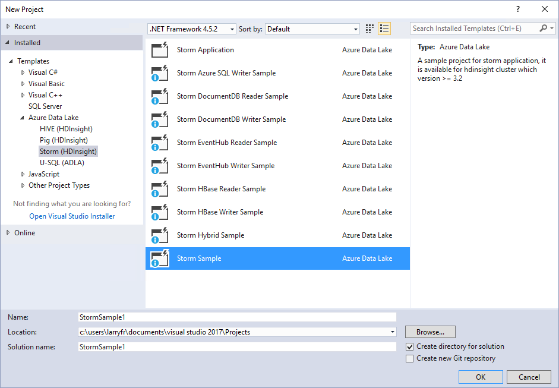
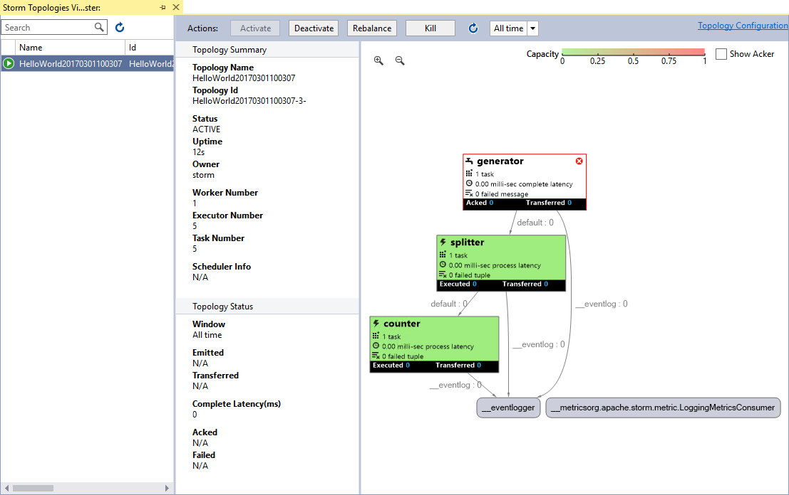

<properties
    pageTitle="在 HDInsight 上部署和管理 Apache Storm 拓扑 | Azure"
    description="了解如何使用 HDInsight 上的 Storm 仪表板部署、监视和管理 Apache Storm 拓扑。使用 Hadoop Tools for Visual Studio。"
    services="hdinsight"
    documentationcenter=""
    author="Blackmist"
    manager="jhubbard"
    editor="cgronlun"
    tags="azure-portal" />
<tags
    ms.assetid="5e542072-f014-42aa-82d6-2694a76df520"
    ms.service="hdinsight"
    ms.devlang="java"
    ms.topic="article"
    ms.tgt_pltfrm="na"
    ms.workload="big-data"
    ms.date="03/01/2017"
    wacn.date="04/27/2017"
    ms.author="larryfr" />

# 在基于 Windows 的 HDInsight 上部署和管理 Apache Storm 拓扑

[AZURE.INCLUDE [azure-sdk-developer-differences](../../includes/azure-sdk-developer-differences.md)]

通过 Storm 仪表板可以使用 Web 浏览器轻松在 HDInsight 群集中部署和运行 Apache Storm 拓扑。还可以使用该仪表板监视和管理正在运行的拓扑。如果使用 Visual Studio，则适用于 Visual Studio 的 HDInsight 工具会提供 Visual Studio 中的类似功能。

[AZURE.INCLUDE [azure-sdk-developer-differences](../../includes/azure-visual-studio-login-guide.md)]

HDInsight 工具中的 Storm 仪表板和 Storm 功能依赖于 Storm REST API，此 API 可用于创建你自己的监视和管理解决方案。

> [AZURE.IMPORTANT]
本文档中的步骤需要将 Windows 作为操作系统的 Storm on HDInsight 群集。Linux 是在 HDInsight 3.4 版或更高版本上使用的唯一操作系统。有关详细信息，请参阅 [HDInsight 在 Windows 上弃用](/documentation/articles/hdinsight-component-versioning/#hdi-version-32-and-33-nearing-deprecation-date)。
>

> 有关在使用 Linux 的 HDInsight 群集上部署和管理 Storm 拓扑的信息，请参阅 [Deploy and manage Apache Storm topologies on Linux-based HDInsight](/documentation/articles/hdinsight-storm-deploy-monitor-topology-linux/)（在基于 Linux 的 HDInsight 上部署和管理 Apache Storm 拓扑）

## 先决条件

* **Apache Storm on HDInsight** - 参阅 [Apache Storm on HDInsight 入门](/documentation/articles/hdinsight-apache-storm-tutorial-get-started-linux/)获取群集创建步骤。

* 对于 **Storm 仪表板**：支持 HTML5 的新型 Web 浏览器。

* 对于 **Visual Studio** - Azure SDK 2.5.1 或更高版本，以及适用于 Visual Studio 的 HDInsight 工具。请参阅[开始使用用于 Visual Studio 的 HDInsight 工具](/documentation/articles/hdinsight-hadoop-visual-studio-tools-get-started/)安装并配置用于 Visual Studio 的 HDInsight 工具。

    下列其中一个版本的 Visual Studio：

    * Visual Studio 2012 [Update 4](http://www.microsoft.com/download/details.aspx?id=39305)

    * Visual Studio 2013 [Update 4](http://www.microsoft.com/download/details.aspx?id=44921) 或 [Visual Studio 2013 Community](http://download.microsoft.com/download/7/1/B/71BA74D8-B9A0-4E6C-9159-A8335D54437E/vs_community.exe)
    * [Visual Studio 2015](https://www.visualstudio.com/downloads/)

## Storm 仪表板

Storm 仪表板是 Storm 群集上提供的网页。URL 是 **https://&lt;clustername>.azurehdinsight.cn/**，其中 **clustername** 是 Storm on HDInsight 群集的名称。

在 Storm 仪表板的顶部，选择“提交拓扑”。根据页面上的说明来运行示例拓扑，或者上载并运行创建的拓扑。

![提交拓扑页][storm-dashboard-submit]

### Storm UI

在 Storm 仪表板中，选择“Storm UI”链接。这会显示有关群集和任何正在运行的拓扑的信息。

![Storm UI][storm-dashboard-ui]  

> [AZURE.NOTE]
在某些版本的 Internet Explorer 中，你可能会发现，在首次访问 Storm UI 后它并不会刷新。例如，可能不显示已提交的新拓扑，或者将以前停用的拓扑显示为活动状态。Microsoft 已意识此问题，并在努力找出相应的解决方法。

#### 主页面

Storm UI 的主页面提供以下信息：

* **群集摘要**：有关 Storm 群集的基本信息。

* **拓扑摘要**：正在运行的拓扑列表。使用此部分中的链接可以查看有关特定拓扑的详细信息。

* **监督员摘要**：有关 Storm 监督员的信息。

* **Nimbus 配置**：群集的 Nimbus 配置。

#### 拓扑摘要

选择“拓扑摘要”部分中的链接会显示有关拓扑的以下信息。

* **拓扑摘要**：有关拓扑的基本信息。

* **拓扑操作**：可对拓扑执行的管理操作。

    * **激活**：继续处理已停用的拓扑。

    * **停用**：暂停正在运行的拓扑。

    * **重新平衡**：调整拓扑的并行度。更改群集中的节点数目之后，应该重新平衡正在运行的拓扑。这可让拓扑调整并行度，以弥补群集中增加或减少的节点数目。

        有关详细信息，请参阅[了解 Storm 拓扑的并行度 (http://storm.apache.org/documentation/Understanding-the-parallelism-of-a-Storm-topology.html)](http://storm.apache.org/documentation/Understanding-the-parallelism-of-a-Storm-topology.html)。

    * **终止**：在经过指定的超时之后终止 Storm 拓扑。

* **拓扑统计信息**：有关拓扑的统计信息。使用“窗口”列中的链接可以设置页面上剩余项的时间范围。

* **Spout**：拓扑使用的 Spout。使用此部分中的链接可以查看有关特定 Spout 的详细信息。

* **Bolt**：拓扑使用的 Bolt。使用此部分中的链接可以查看有关特定 Bolt 的详细信息。

* **拓扑配置**：选定拓扑的配置。

#### Spout 和 Bolt 摘要

从“Spout”或“Bolt”部分中选择 Spout 会显示有关选定项的以下信息：

* **组件摘要**：有关 Spout 或 Bolt 的基本信息。

* **Spout/Bolt 统计信息**：有关 Spout 或 Bolt 的统计信息。使用“窗口”列中的链接可以设置页面上剩余项的时间范围。

* **输入统计信息**（仅限 Bolt）：有关 Bolt 使用的输入流的信息。

* **输出统计信息**：有关此 Spout 或 Bolt 所发出流的信息。

* **执行器**：有关 Spout 或 Bolt 实例的信息。选择特定执行器的“端口”项可以查看针对此实例生成的诊断信息的日志。

* **错误**：此 Spout 或 Bolt 的任何错误信息。

## 适用于 Visual Studio 的 HDInsight 工具

HDInsight 工具可用于将 C# 或混合拓扑提交到 Storm 群集。以下步骤使用了一个示例应用程序。有关使用 HDInsight 工具创建自己的拓扑的详细信息，请参阅[使用适用于 Visual Studio 的 HDInsight 工具开发 C# 拓扑](/documentation/articles/hdinsight-storm-develop-csharp-visual-studio-topology/)。

使用以下步骤将示例部署到 Storm on HDInsight 群集，然后查看和管理拓扑。

1. 如果尚未安装最新版本的 HDInsight Tools for Visual Studio，请参阅 [Get started using HDInsight Tools for Visual Studio](/documentation/articles/hdinsight-hadoop-visual-studio-tools-get-started/)（开始使用 HDInsight Tools for Visual Studio）。

2. 打开 Visual Studio，选择“文件”>“新建”>“项目”。

3. 在“新建项目”对话框中，展开“已安装”>“模板”，然后选择“HDInsight”。从模板列表中，选择“Storm 示例”。在对话框底部，键入应用程序的名称。

    

4. 在“解决方案资源管理器”中，右键单击项目，然后选择“提交到 Storm on HDInsight”。

    > [AZURE.NOTE]
    如果出现提示，请输入 Azure 订阅的登录凭据。如果有多个订阅，请登录包含 Storm on HDInsight 群集的订阅。

5. 从“Storm 群集”下拉列表中选择你的 Storm on HDInsight 群集，然后选择“提交”。你可以使用“输出”窗口监视提交是否成功。

6. 成功提交拓扑之后，应该会出现群集的“Storm 拓扑”。从列表中选择拓扑，以查看有关正在运行的拓扑的信息。

    

    > [AZURE.NOTE]
    你也可以依次展开“Azure”和“HDInsight”，右键单击 Storm on HDInsight 群集，然后选择“查看 Storm 拓扑”，从“服务器资源管理器”查看“Storm 拓扑”。

    选择 Spout 或 Bolt 的形状可查看有关这些组件的信息。每选择一项都会打开一个新窗口。

    > [AZURE.NOTE]
    拓扑的名称是拓扑的类名（在此示例中为 `HelloWord`）并追加了时间戳。

7. 从“拓扑摘要”视图中，选择“终止”以停止拓扑。

    > [AZURE.NOTE]
    Storm 拓扑会一直运行，直到它被停止，或者群集被删除。

## REST API

Storm UI 是以 REST API 为基础生成的，因此，你可以使用 API 执行类似的管理和监视功能。使用 REST API 可以创建自定义工具来管理和监视 Storm 拓扑。

有关详细信息，请参阅 [Storm UI REST API](https://github.com/apache/storm/blob/0.9.3-branch/STORM-UI-REST-API.md)。以下信息特定于将 REST API 与 Apache Storm on HDInsight 配合使用的情况。

### 基本 URI

REST API on HDInsight 群集的基本 URI 是 **https://&lt;clustername>.azurehdinsight.cn/stormui/api/v1/**，其中 **clustername** 是 Storm on HDInsight 群集的名称。

### 身份验证

对 REST API 的请求必须使用**基本身份验证**，因此应该使用 HDInsight 群集管理员名称和密码。

> [AZURE.NOTE]
由于基本身份验证是使用明文发送的，因此**始终**应该使用 HTTPS 来保护与群集之间的通信。

### 返回值

从 REST API 返回的信息只能从群集或与群集相同的 Azure 虚拟网络上的虚拟机中使用。例如，无法从 Internet 访问针对 Zookeeper 服务器返回的完全限定域名 (FQDN)。

## 后续步骤

现在，你已经了解如何使用 Storm 仪表板部署和监视拓扑，接下来请学习：

* [使用适用于 Visual Studio 的 HDInsight 工具开发 C# 拓扑](/documentation/articles/hdinsight-storm-develop-csharp-visual-studio-topology/)

* [使用 Maven 开发基于 Java 的拓扑](/documentation/articles/hdinsight-storm-develop-java-topology/)

有关更多示例拓扑的列表，请参阅 [Storm on HDInsight 的示例拓扑](/documentation/articles/hdinsight-storm-example-topology/)。

[hdinsight-dashboard]: ./media/hdinsight-storm-deploy-monitor-topology/dashboard-link.png
[storm-dashboard-submit]: ./media/hdinsight-storm-deploy-monitor-topology/submit.png
[storm-dashboard-ui]: ./media/hdinsight-storm-deploy-monitor-topology/storm-ui-summary.png

<!---HONumber=Mooncake_0306_2017-->
<!--Update_Description: add information about HDInsight Windows is going to be abandoned-->