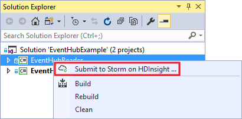
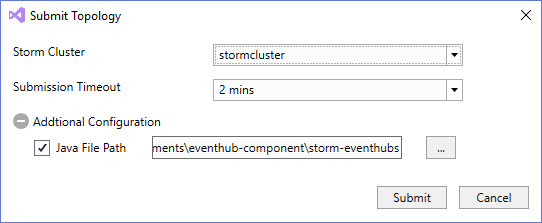
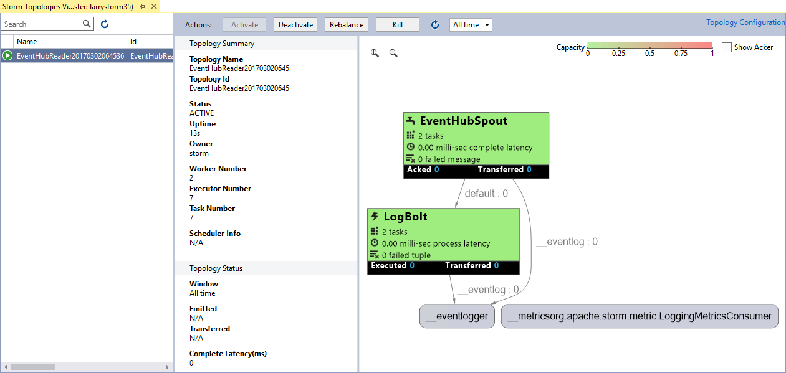
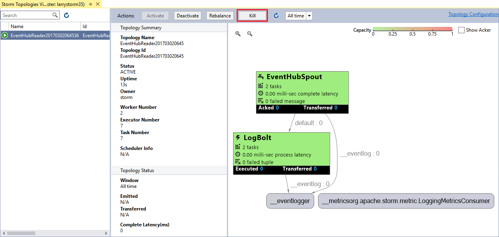

<properties
    pageTitle="使用 Storm on HDInsight 处理事件中心的事件 | Azure"
    description="了解如何使用在 Visual Studio 中通过用于 Visual Studio 的 HDInsight 工具创建的 C# Storm 拓扑处理事件中心数据。"
    services="hdinsight,notification hubs"
    documentationcenter=""
    author="Blackmist"
    manager="jhubbard"
    editor="cgronlun" />  

<tags
    ms.assetid="67f9d08c-eea0-401b-952b-db765655dad0"
    ms.service="hdinsight"
    ms.devlang="dotnet"
    ms.topic="article"
    ms.tgt_pltfrm="na"
    ms.workload="big-data"
    ms.date="01/12/2017"
    wacn.date="01/25/2017"
    ms.author="larryfr" />

# 使用 Storm on HDInsight 从 Azure 事件中心处理事件 (C#)

[AZURE.INCLUDE [azure-sdk-developer-differences](../../includes/azure-sdk-developer-differences.md)]

Azure 事件中心可处理网站、应用和设备的大量数据。借助事件中心 Spout，可轻松使用 Apache Storm on HDInsight 实时分析这些数据。还可以使用事件中心 Bolt 从 Storm 向事件中心写入数据。

在本教程中，将学习如何使用随用于 Visual Studio 的 HDInsight 工具一起安装的 Visual Studio 模板，创建两个可以配合 Azure 事件中心运行的拓扑。

* **EventHubWriter**：随机生成数据，并将其写入事件中心
* **EventHubReader**：从事件中心读取数据并将数据记录到 Storm 日志中

## 先决条件

* [Apache Storm on HDInsight 群集](/documentation/articles/hdinsight-apache-storm-tutorial-get-started/)

* [Azure 事件中心](/documentation/articles/event-hubs-csharp-ephcs-getstarted/)

* [Azure .NET SDK](/downloads/)

* [用于 Visual Studio 的 HDInsight 工具](/documentation/articles/hdinsight-hadoop-visual-studio-tools-get-started/)

## 已完成的项目

可以从 GitHub 下载本教程中创建的项目的完整版本：[eventhub-storm-hybrid](https://github.com/Azure-Samples/hdinsight-dotnet-java-storm-eventhub)。但是，仍然需要按照本教程中的步骤提供配置设置。

> [AZURE.NOTE] 使用已完成的项目时，必须使用 **NuGet 包管理器**还原此解决方案所需的程序包。

## 事件中心 Spout 和 Bolt

事件中心 Spout 和 Bolt 是可轻松从 Apache Storm 使用事件中心的 Java 组件。尽管这两个组件用 Java 语言编写，但用于 Visual Studio 的 HDInsight 工具允许创建混合使用 C# 和 Java 组件的混合拓扑。

Spout 和 Bolt 以名为 **eventhubs-storm-spout-#.#-jar-with-dependencies.jar** 的单个 Java 存档 (.jar) 文件的形式分发，其中 #.# 是文件的版本。

### 下载 .jar 文件

[HDInsight Storm 示例](https://github.com/hdinsight/hdinsight-storm-examples)项目中 **lib** 文件夹下包含了最新版本的 **eventhubs-storm-Spout-0.9-jar-with-dependencies.jar** 文件。要下载该文件，请使用以下方法之一。

> [AZURE.NOTE] 已提交 Spout 和 Bolt 以包含在 Apache Storm 项目中。有关详细信息，请参阅 GitHub 中的 [STORM-583: Initial check-in for storm-event hubs](https://github.com/apache/storm/pull/336/files)（STORM-583：Storm 事件中心的初始签入）。

* **下载 ZIP 文件**：在 [HDInsight Storm 示例](https://github.com/hdinsight/hdinsight-storm-examples)站点中，选择右窗格中的“下载 ZIP”下载包含项目的 .zip 文件。

    

    下载文件后，可以解压缩存档，该文件位于 **lib** 目录中。

* **克隆项目**：如果已安装 [Git](http://git-scm.com/)，请使用以下命令在本地克隆存储库，然后在 **lib** 目录中找到该文件。

        git clone https://github.com/hdinsight/hdinsight-storm-examples

## 配置事件中心

事件中心是此示例的数据源。按照下列步骤创建新事件中心。

1. 在 [Azure 经典管理门户](https://manage.windowsazure.cn)中，选择“新建”>“应用程序服务”>“服务总线”>“事件中心”>“自定义创建”。

2. 在“添加新事件中心”屏幕中，输入“事件中心名称”，选择要在其中创建中心的“区域”，然后创建新的命名空间或选择现有的命名空间。单击**箭头**继续。

    

    > [AZURE.NOTE] 应选择与 Storm on HDInsight 服务器相同的**位置**，以减少延迟和成本。

2. 在“配置事件中心”屏幕上，输入“分区计数”和“消息保留期”值。对于本示例，请使用分区计数 8 和消息保留期 1。记下分区计数，因为稍后需要用到。

3. 创建事件中心后，选择命名空间，选择“事件中心”，然后选择先前创建的事件中心。

4. 选择“配置”，然后使用以下信息创建两个新的访问策略。

    | 名称 | 权限 | 
    | --- | --- | 
    | 写入者 | 发送 | 
    | 读者 | 侦听 |
   
    创建权限后，点击页面底部的“保存”图标。这样就创建了共享访问策略，然后便能发送（写入者）和倾听（读者）这个事件中心。

    

5. 保存策略后，使用页面底部的“共享访问密钥生成器”检索 **writer** 和 **reader** 策略的密钥。保存这些密钥，因为稍后将要用到。

## 配置表存储

由于可轻松地在 Visual Studio 中通过“服务器资源管理器”查看表存储，因此可使用表存储保存从事件中心读取的值。按照下列步骤创建新表存储：

1. 在 [Azure 经典管理门户](https://manage.windowsazure.cn)中，选择“新建”>“数据服务”>“存储”>“快速创建”。

      

2. 输入存储帐户的**名称**，选择**位置**，然后单击**复选标记**以创建存储帐户。

    > [AZURE.NOTE] 应选择与事件中心和 Storm on HDInsight 服务器相同的**位置**，以减少延迟和成本。

3. 创建新存储帐户后，选择该帐户，然后使用页面底部的“管理访问密钥”链接检索“存储帐户名称”和“主访问密钥”。保存此信息，因为稍后将要用到。

    

4. 打开 Visual Studio。在“视图”菜单中，选择“云资源管理器”。在“云资源管理器”中，展开“存储帐户”，然后选择先前创建的存储帐户。

    

5. 右键单击存储帐户对应的“表”，然后选择“创建表”。出现提示时，请输入 **events** 作为表的名称。保存该名称，因为在后续步骤中需要用到。

## 创建 EventHubWriter

在本节中，将使用事件中心 Bolt 创建向事件中心写入数据的拓扑。

1. 如果尚未安装最新版本的用于 Visual Studio 的 HDInsight 工具，请参阅 [Get started using HDInsight Tools for Visual Studio](/documentation/articles/hdinsight-hadoop-visual-studio-tools-get-started/)（开始使用用于 Visual Studio 的 HDInsight 工具）。

2. 打开 Visual Studio，选择“文件”>“新建”>“项目”。

3. 在“新建项目”屏幕上，展开“已安装”>“模板”，然后选择“HDInsight”。从模板列表中，选择“Storm 应用程序”。在屏幕底部，输入 **EventHubWriter** 作为应用程序名称。

    

4. 创建项目后，应显示以下文件：

    * **Program.cs**：定义项目的拓扑。请注意，默认将创建包含一个 Spout 和一个 Bolt 的默认拓扑。

    * **Spout.cs**：示例 Spout。

    * **Bolt.cs**：示例 Bolt。需要删除此文件，因为将使用事件中心 Bolt 向事件中心写入数据

### 配置

1. 在“解决方案资源管理器”中，右键单击“EventHubWriter”，然后选择“属性”。

2. 在项目属性中，选择“设置”，然后选择“此项目不包含默认设置文件。单击此处可创建一个”。

3. 输入以下设置。在“值”列中使用先前创建的事件中心的信息。

    | Name | 类型 | 范围 |
    | ----- | ----- | ----- |
    | EventHubPolicyName | 字符串 | 应用程序 |
    | EventHubPolicyKey | 字符串 | 应用程序 |
    | EventHubNamespace | 字符串 | 应用程序 |
    | EventHubName | 字符串 | 应用程序 |
    | EventHubPartitionCount | 整型 | 应用程序 |

4. 保存并关闭“属性”页。

### 定义拓扑

1. 在“解决方案资源管理器”中，右键单击“Bolt.cs”，然后选择“删除”。由于使用的是 Java 事件中心 Bolt，因此不需要此文件。

2. 打开 **Program.cs** 文件，并紧接在 `TopologyBuilder topologyBuilder = new TopologyBuilder("EventHubWriter" + DateTime.Now.ToString("yyyyMMddHHmmss"));` 行后添加以下内容。

        int partitionCount = Properties.Settings.Default.EventHubPartitionCount;
        List<string> javaDeserializerInfo =
            new List<string>() { "microsoft.scp.storm.multilang.CustomizedInteropJSONDeserializer", "java.lang.String" };

    第一行从前面定义的属性中读取分区计数。第二行定义一个反序列化程序，用于将 Spout 生成的 JSON 数据反序列化为 `java.lang.String`，使 Java 组件可以使用数据。

4. 找到以下代码：

        topologyBuilder.SetSpout(
            "Spout",
            Spout.Get,
            new Dictionary<string, List<string>>()
            {
                {Constants.DEFAULT_STREAM_ID, new List<string>(){"count"}}
            },
            1);

    将它替换为以下代码：

        topologyBuilder.SetSpout(
            "Spout",
            Spout.Get,
            new Dictionary<string, List<string>>()
            {
                {Constants.DEFAULT_STREAM_ID, new List<string>(){"Event"}}
            },
            partitionCount).
            DeclareCustomizedJavaDeserializer(javaDeserializerInfo);

    这将创建一个 Spout，并使用事件中心分区计数作为此组件的并行度提示。这应该为每个分区创建一个 Spout 实例。

    这还会将先前创建的反序列化程序与此组件的输出流相关联。这样，下游 EventHubSpout 组件可以使用 C# Spout 生成的数据。

5. 紧接在上述代码的后面添加以下代码：

        JavaComponentConstructor constructor =
            JavaComponentConstructor.CreateFromClojureExpr(
            String.Format(@"(com.microsoft.eventhubs.bolt.EventHubBolt. (com.microsoft.eventhubs.bolt.EventHubBoltConfig. " +
            @"""{0}"" ""{1}"" ""{2}"" ""{3}"" ""{4}"" {5}))",
            Properties.Settings.Default.EventHubPolicyName,
            Properties.Settings.Default.EventHubPolicyKey,
            Properties.Settings.Default.EventHubNamespace,
            "servicebus.chinacloudapi.cn", //suffix for servicebus fqdn
            Properties.Settings.Default.EventHubName,
            "true"));

    这会为 Java Bolt 创建一个新的构造函数，在运行时使用此构造函数配置 Bolt 的新实例。在此示例中，通过 <a href="http://storm.apache.org/documentation/Clojure-DSL.html" target="_blank">Apache Storm Clojure DSL</a> 使用先前添加的事件中心配置信息配置 Spout。更具体地说，HDInsight 在运行时将使用此代码执行以下操作：

    * 使用提供的事件中心信息创建 **com.microsoft.eventhubs.bolt.EventHubBoltConfig** 的新实例。
    * 创建 **com.microsoft.eventhubs.bolt.EventHubBolt** 的新实例并传入 **EventHubBoltConfig** 实例。

6. 找到以下代码：

        topologyBuilder.SetBolt(
            "Bolt",
            Bolt.Get,
            new Dictionary<string, List<string>>(),
            1).shuffleGrouping("Spout");

    将它替换为以下代码：

        topologyBuilder.SetJavaBolt(
            "EventHubBolt",
            constructor,
            partitionCount).
            shuffleGrouping("Spout");

    这会指示拓扑使用上述步骤中的 **JavaComponentConstructor** 作为 Bolt。可以在此拓扑中使用友好名称“EventHubBolt”引用该组件。 将并行度提示设置为事件中心的分区数，并订阅由 Spout（“Spout”）生成的数据。

此时，已完成对 **Program.cs** 的操作。已经定义拓扑，但现在必须修改 **Spout.cs**，使它能够以事件中心 Bolt 可以使用的格式生成数据。

> [AZURE.NOTE] 此拓扑将默认创建一个工作进程，以充分满足示例需求。如果要针对生产群集改写此拓拟，应添加以下代码以更改工作进程数：

    StormConfig config = new StormConfig();
    config.setNumWorkers(1);
    topologyBuilder.SetTopologyConfig(config);

### 修改 Spout

事件中心 Bolt 需要单个字符串值，该值将路由到事件中心。在下例中，将修改默认 **Spout.cs** 文件以生成 JSON 字符串。

1. 在“解决方案资源管理器”中，打开“Spout.cs”，在该文件的顶部添加以下内容：

        using Newtonsoft.Json;
        using Newtonsoft.Json.Linq;

    这样可以更轻松地使用 JSON 数据。
    
    > [AZURE.NOTE] 应该已经安装 JSON.NET 包，因为它是用于 C# Storm 拓扑的 SCP.NET 框架所必需的。

3. 找到以下代码：

        Dictionary<string, List<Type>> outputSchema = new Dictionary<string, List<Type>>();
        outputSchema.Add("default", new List<Type>() { typeof(int) });
        this.ctx.DeclareComponentSchema(new ComponentStreamSchema(null, outputSchema));

    将它替换为以下代码：

        Dictionary<string, List<Type>> outputSchema = new Dictionary<string, List<Type>>();
        outputSchema.Add("default", new List<Type>() { typeof(string) });
        this.ctx.DeclareComponentSchema(new ComponentStreamSchema(null, outputSchema));
        this.ctx.DeclareCustomizedSerializer(new CustomizedInteropJSONSerializer());

    这会更改 Spout 创建的数据定义，以使用**字符串**数据和先前在拓扑中声明的 **CustomizedInteropJSONSerializer**（在 program.cs 中）。

2. 将 **NextTuple** 方法替换为以下内容：

        public void NextTuple(Dictionary<string, Object> parms)
        {
            JObject eventData = new JObject();
            eventData.Add("deviceId", r.Next(10));
            eventData.Add("deviceValue", r.Next());
            ctx.Emit(new Values(eventData.ToString(Formatting.None)));
        }

    这随机生成一个设备 ID 和一个值，然后使用 Json.NET 发出使用这些值的 JSON 对象。

3. 保存 **Spout.cs** 文件。

此时，已创建一个基本拓扑，该拓扑将生成随机数据，并使用事件中心 Bolt 将其存储在事件中心。接下来，需要创建读取器。

## 创建 EventHubReader

在本节中，将使用事件中心 Spout 创建从事件中心读取数据的拓扑。

2. 打开 Visual Studio，选择“文件”>“新建”>“项目”。

3. 在“新建项目”屏幕上，展开“已安装”>“模板”，然后选择“HDInsight”。从模板列表中，选择“Storm 应用程序”。在屏幕底部，输入 **EventHubReader** 作为应用程序名称。

### 配置

1. 在“解决方案资源管理器”中，右键单击“EventHubReader”，然后选择“属性”。

2. 依次选择“工具”、“NuGet 包管理器”和“包管理器控制台”。当控制台出现时，请使用以下命令安装 Azure 存储包。

        NuGet install WindowsAzure.Storage

2. 在项目属性中，选择“设置”，然后选择“此项目不包含默认设置文件。单击此处可创建一个”。

3. 输入以下设置。在“值”列中使用先前创建的事件中心和存储帐户的信息。

    | Name | 类型 | 范围 |
    | ----- | ----- | ----- |
    | EventHubPolicyName | 字符串 | 应用程序 |
    | EventHubPolicyKey | 字符串 | 应用程序 |
    | EventHubNamespace | 字符串 | 应用程序 |
    | EventHubName | 字符串 | 应用程序 |
    | EventHubPartitionCount | 整型 | 应用程序 |
    | StorageConnection | （连接字符串） | 应用程序 |
    | TableName | 字符串 | 应用程序 |

    对于 **TableName**，请输入要在其中存储事件的表的名称。

    对于 **StorageConnection**，请输入值 `DefaultEndpointsProtocol=https;AccountName=myAccount;AccountKey=myKey;`。将 **myAccount** 和 **myKey** 分别替换为先前获取的存储帐户名和密钥。

    拓扑将使用这些值与事件中心和表存储进行通信。

4. 保存并关闭“属性”页。

### 定义拓扑

1. 在“解决方案资源管理器”中，右键单击“Spout.cs”，然后选择“删除”。由于使用的是 Java 事件中心 Spout，因此不需要此文件。

2. 打开 **Program.cs** 文件，并紧接在 `TopologyBuilder topologyBuilder = new TopologyBuilder("EventHubReader" + DateTime.Now.ToString("yyyyMMddHHmmss"));` 行后添加以下代码：

        int partitionCount = Properties.Settings.Default.EventHubPartitionCount;
        EventHubSpoutConfig ehConfig = new EventHubSpoutConfig(
                Properties.Settings.Default.EventHubPolicyName,
                Properties.Settings.Default.EventHubPolicyKey,
                Properties.Settings.Default.EventHubNamespace,
                Properties.Settings.Default.EventHubName,
                partitionCount);

    读取分区计数并将其分配给本地变量。可以多次使用该计数。

    `EventHubSpoutConfig` 定义事件中心 Spout 的配置。在此示例中，该配置是先前添加的事件中心配置信息。此代码在幕后使用 Java 事件中心 Spout，并使用事件中心信息创建 **com.microsoft.eventhubs.spout.EventHubSpoutConfig** 的新实例。

5. 找到以下代码：

        topologyBuilder.SetSpout(
            "Spout",
            Spout.Get,
            new Dictionary<string, List<string>>()
            {
                {Constants.DEFAULT_STREAM_ID, new List<string>(){"count"}}
            },
            1);

    将它替换为以下代码：

        topologyBuilder.SetEventHubSpout(
            "EventHubSpout", 
            ehConfig, 
            partitionCount); 

    这将指示拓扑创建新事件中心 Spout，并使用上一步中的 `EventHubSpoutConfig` 作为配置。“EventHubSpout”设置 Spout 的友好名称，`partitionCount` 用于设置并行度提示。此代码在幕后使用提供的配置信息创建 **com.microsoft.eventhubs.Spout.EventHubSpout** Java 组件的新实例。

2. 紧接在上述代码的后面添加以下内容：

         List<string> javaSerializerInfo = new List<string>() { "microsoft.scp.storm.multilang.CustomizedInteropJSONSerializer" };

    这将创建一个自定义序列化程序，用于将 Java 组件（如 EventHubSpout）生成的信息序列化为下游 C# 组件可使用的 JSON 格式。

3. 找到以下代码：

        topologyBuilder.SetBolt(
            "Bolt",
            Bolt.Get,
            new Dictionary<string, List<string>>(),
            1).shuffleGrouping("Spout");

    将它替换为以下代码：

        topologyBuilder.SetBolt(
            "Bolt",
            Bolt.Get,
            new Dictionary<string, List<string>>(),
            partitionCount,
            true).
            DeclareCustomizedJavaSerializer(javaSerializerInfo).
            shuffleGrouping("EventHubSpout");

    此代码指示拓扑使用 Bolt（在 Bolt.cs 中定义）。此处使用先前定义的自定义序列化程序，以便此 Bolt 可使用上游 Java 组件生成的数据。在此示例中为 EventHubSpout。

    > [AZURE.IMPORTANT] SetBolt 的最后一个参数（值为 `true`）启用此 Bolt 的 ACK 功能。该参数是必需的，因为 EventHubSpout 组件期望它发出数据的 ACK。如果下游组件未返回 ACK，则 Spout 在处理大约 1000 条消息后将停止接收。

此时，已完成对 **Program.cs** 的操作。已经定义拓扑，但现在必须创建一个帮助器类以将数据写入表存储，然后必须修改 **Bolt.cs** 以便可了解 Spout 生成的数据。

> [AZURE.NOTE] 此拓扑将默认创建一个工作进程，以充分满足示例需求。如果要针对生产群集改写此拓拟，应添加以下代码以更改工作线程数：

    StormConfig config = new StormConfig();
    config.setNumWorkers(1);
    topologyBuilder.SetTopologyConfig(config);

### 创建帮助器类

将数据写入表存储时，必须创建一个类来描述要写入的数据。

1. 在“解决方案资源管理器”中，右键单击“EventHubReader”项目，然后依次选择“添加”和“类”。将新类命名为 **Device.cs**。

2. 打开 **Device.cs**，将默认代码替换为以下代码：

        using System;
        using System.Collections.Generic;
        using System.Linq;
        using System.Text;
        using System.Threading.Tasks;
        using Microsoft.WindowsAzure.Storage.Table;

        namespace EventHubReader
        {
            class Device : TableEntity
            {
                public int value { get; set; }

                public Device() { }
                public Device(int id)
                {
                    this.PartitionKey = id.ToString();
                    this.RowKey = System.Guid.NewGuid().ToString();
                }
            }
        }

    这将在表存储中创建由分区键（设置为从事件中心读取的设备 ID）、唯一行键和从事件中心读取的值构成的实体。每个实体还有一个时间戳，在表中插入实体时将自动创建该时间戳。

### 修改 Bolt

1. 在“解决方案资源管理器”中，展开 **EventHubReader** 项目，然后打开 **Bolt.cs** 文件。在该文件的顶部，添加以下内容：

        using Newtonsoft.Json.Linq;
        using Microsoft.WindowsAzure.Storage;
        using Microsoft.WindowsAzure.Storage.Table;

    这样，可以更轻松地处理来自 Bolt 的 JSON 数据，并将数据写入表存储。

2. 找到 `private int count;` 语句，并将其替换为以下内容：

        private CloudTable table;

    连接到表时将使用这些代码。

4. 找到以下代码：

        Dictionary<string, List<Type>> inputSchema = new Dictionary<string, List<Type>>();
        inputSchema.Add("default", new List<Type>() { typeof(int) });
        this.ctx.DeclareComponentSchema(new ComponentStreamSchema(inputSchema, null));

    将它替换为以下代码：

        Dictionary<string, List<Type>> inputSchema = new Dictionary<string, List<Type>>();
        inputSchema.Add("default", new List<Type>() { typeof(string) });
        this.ctx.DeclareComponentSchema(new ComponentStreamSchema(inputSchema, null));
        this.ctx.DeclareCustomizedDeserializer(new CustomizedInteropJSONDeserializer());

    这将指示 Bolt 接收**字符串**值而不是**整型**值，并且应使用先前在拓扑中声明的 **CustomizedInteropJSONDeserialzer**（在 program.cs 文件中）反序列化数据。

3. 紧接在上述代码的后面添加以下代码：

        CloudStorageAccount storageAccount = CloudStorageAccount.Parse(Properties.Settings.Default.StorageConnection);
        CloudTableClient tableClient = storageAccount.CreateCloudTableClient();
        table = tableClient.GetTableReference(Properties.Settings.Default.TableName);
        table.CreateIfNotExists();

    连接到先前使用存储在 `TableName` 中的连接字符串创建的 Azure 存储表。

2. 找到 **Execute** 方法，并将其替换为以下内容：

        public void Execute(SCPTuple tuple)
        {
            Context.Logger.Info("Processing events");
            string eventValue = (string)tuple.GetValue(0);
            if (eventValue != null)
            {
                JObject eventData = JObject.Parse(eventValue);

                Device device = new Device((int)eventData["deviceId"]);
                device.value = (int)eventData["deviceValue"];

                TableOperation insertOperation = TableOperation.Insert(device);

                table.Execute(insertOperation);
                this.ctx.Ack(tuple);
            }
        }

    这使用 Json.NET 分析来自 Spout 的 JSON 数据，然后选择 **deviceId** 和 **deviceValue** 字段。随后，在初始化期间，使用 **deviceId** 创建新 **Device** 对象，以设置表的分区键。然后将值设置为 **deviceValue**，最后将实体插入到表中。

    将实体插入到表中后，为元组调用 `Ack()`，以通知 Spout 已成功处理数据。

    > [AZURE.IMPORTANT] EventHubSpout 组件需要来自下游组件（如此 Bolt）的每个元组的 ACK。如果未收到 ACK，EventHubSpout 将假定元组处理失败。

此时，已完成创建一个拓扑，该拓扑可从事件中心读取数据，并将其存储到表存储（位于先前创建的表中）。

## 部署拓扑

1. 在“解决方案资源管理器”中，右键单击“EventHubReader”项目，然后选择“提交到 Storm on HDInsight”。
   
    

2. 在“提交拓扑”屏幕上，选择“Storm 群集”。展开“其他配置”，选择“Java 文件路径”，选择“...”，然后选择前面下载的 jar 文件所在的目录。最后，单击“提交”。
   
      

3. 提交拓扑后，将会出现“Storm 拓扑查看器”。选择左窗格中的 **EventHubReader** 拓扑，以查看该拓扑的统计信息。目前，不会发生任何情况，因为尚未将任何事件写入事件中心。
   
    

4. 在“解决方案资源管理器”中，右键单击“EventHubReader”项目，然后选择“提交到 Storm on HDInsight”。

5. 在“提交拓扑”屏幕上，选择“Storm 群集”。展开“其他配置”，选择“Java 文件路径”，选择“...”，然后选择前面下载的 jar 文件所在的目录。最后，单击“提交”。

6. 提交拓扑后，在“Storm 拓扑查看器”中刷新拓扑列表，以检查这两个拓扑是否在群集上运行。

6. 如果两个拓扑都在运行，选择“服务器资源管理器”，展开“Azure”>“存储”，然后选择先前创建的存储帐户。在存储帐户下，展开“表”。最后，双击 **events** 表以打开该表。会显示来自 **EventHubReader** 拓扑的数据已存储在该表中。

    * **EventHubWriter** 拓扑正在生成事件，并将这些事件写入事件中心。

    * 然后，**EventHubReader** 从事件中心读取事件，并将其存储到 **events** 表中的表存储。

## 停止拓扑

要停止拓扑，选择“Storm 拓扑查看器”中的每个拓扑，然后单击“终止”。

## 删除群集

[AZURE.INCLUDE [delete-cluster-warning](../../includes/hdinsight-delete-cluster-warning.md)]

## 后续步骤

在本文档中，已学习如何使用 C# 拓扑中的 Java 事件中心 Spout 和 Bolt 处理 Azure 事件中心中的数据。要了解有关创建 C# 拓扑的详细信息，请参阅以下主题。

* [使用 Visual Studio 开发适用于 Apache Storm on HDInsight 的 C# 拓扑](/documentation/articles/hdinsight-storm-develop-csharp-visual-studio-topology/)
* [SCP 编程指南](/documentation/articles/hdinsight-storm-scp-programming-guide/)
* [Storm on HDInsight 的示例拓扑](/documentation/articles/hdinsight-storm-example-topology/)

<!---HONumber=Mooncake_1205_2016-->