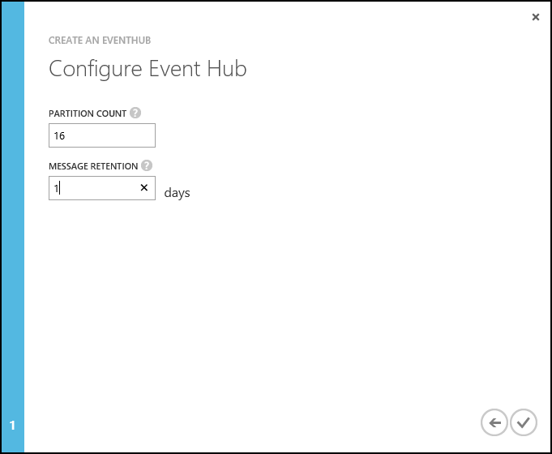
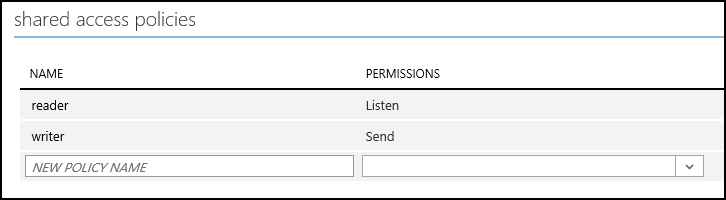

<properties
    pageTitle="配合 Java 使用 Storm on HDInsight 从事件中心处理事件 | Azure"
    description="了解如何使用通过 Maven 创建的 Java Storm 拓扑处理事件中心数据。"
    services="hdinsight,notification hubs"
    documentationcenter=""
    author="Blackmist"
    manager="jhubbard"
    editor="cgronlun" />
<tags
    ms.assetid="453fa7b0-c8a6-413e-8747-3ac3b71bed86"
    ms.service="hdinsight"
    ms.devlang="dotnet"
    ms.topic="article"
    ms.tgt_pltfrm="na"
    ms.workload="big-data"
    ms.date="10/11/2016"
    wacn.date="01/25/2017"
    ms.author="larryfr" />

# 使用 Storm on HDInsight 从 Azure 事件中心处理事件 (Java)
Azure 事件中心可用于处理网站、应用程序和设备中的大量数据。借助事件中心 Spout，可轻松使用 Apache Storm on HDInsight 实时分析这些数据。还可使用事件中心 Bolt 从 Storm 向事件中心写入数据。

在本教程中，你将学习如何使用事件中心 Spout 和 Bolt 在基于 Java 的 Storm 拓扑中读取和写入数据。

## 先决条件
* 一个 Apache Storm on HDInsight 群集。参考下列其中一篇入门文章来创建群集：

    * [基于 Windows 的 Storm on HDInsight 群集](/documentation/articles/hdinsight-apache-storm-tutorial-get-started/)：若要从 Windows 客户端使用 PowerShell 来操作群集，请选择此选项

    > [AZURE.NOTE]
    本文档中的步骤假设使用 Storm on HDInsight 群集 3.3 或 3.4。这些群集提供 Storm 0.10.0 和 Hadoop 2.7，可减少正常演示本示例而需要执行的步骤。
    >
 
    > 有关可在 HDInsight 3.2 上与 Storm 0.9.3 配合运行的示例版本，请参阅示例存储库的 [Storm v0.9.3](https://github.com/Azure-Samples/hdinsight-java-storm-eventhub/tree/Storm_v0.9.3) 分支。
    > 
    > 
* [Azure 事件中心](/documentation/articles/event-hubs-csharp-ephcs-getstarted/)
* [Oracle Java Developer Kit (JDK) 版本 7](https://www.oracle.com/technetwork/java/javase/downloads/jdk7-downloads-1880260.html) 或同等版本，例如 [OpenJDK](http://openjdk.java.net/)
* [Maven](https://maven.apache.org/download.cgi)：Maven 是 Java 项目的项目生成系统
* 文本编辑器或 Java 集成开发环境 (IDE)
  
    > [AZURE.NOTE]
    你的编辑器或 IDE 可能具有处理 Maven 的特定功能，但本文档中未提供说明。有关环境编辑功能的详细信息，请参阅所使用产品的文档。
    > 
    > 

## 了解示例
[hdinsight-java-storm-eventhub](https://github.com/Azure-Samples/hdinsight-java-storm-eventhub) 示例包含两个拓扑：

**com.microsoft.example.EventHubWriter** 将随机数据写入 Azure 事件中心。数据由 Spout 生成，是随机设备 ID 和设备值。因此它可以模拟发出字符串 ID 和数字值的某些硬件。

**com.microsoft.example.EventHubReader** 从事件中心读取数据（EventHubWriter 写入的数据），并将其存储到 HDFS（在本例中为 WASB，因为它是使用 Azure HDInsight 编写和测试的）上的 /devicedata 目录中。

数据在写入事件中心之前已格式化为 JSON 文档，因此读取器会将其从 JSON 解析为元组。JSON 格式如下：

    { "deviceId": "unique identifier", "deviceValue": some value }

使用 JSON 文档将数据存储到事件中心是为了了解格式，而不是依赖事件中心 Spout 和 Bolt 的内部格式化机制。

### 项目配置
**POM.xml** 文件包含此 Maven 项目的配置信息。需要关注的部分是：

#### EventHubs Storm Spout 依赖性
    <dependency>
      <groupId>org.apache.storm</groupId>
      <artifactId>storm-eventhubs</artifactId>
      <version>0.10.0</version>
    </dependency>

这将添加 storm-eventhubs 包的依赖项，它包含用于从事件中心读取的 Spout 和写入事件中心的 Bolt。

> [AZURE.NOTE]
此包仅适用于 Storm 0.10.0 和更高版本。使用 Storm 0.9.3 时，必须手动安装 Microsoft 提供的 Spout 包。有关与 Storm 0.9.3 配合运行的示例，请参阅示例存储库的 [Storm v0.9.3](https://github.com/Azure-Samples/hdinsight-java-storm-eventhub/tree/Storm_v0.9.3) 分支。
> 
> 

#### HdfsBolt 和 WASB 组件
HdfsBolt 一般用于将数据存储到 Hadoop 分布式文件系统 (HDFS)。但是，HDInsight 群集使用 Azure 存储空间 (WASB) 作为默认的数据存储区，因此我们必须加载多个组件，使 HdfsBolt 识别 WASB 文件系统。

      <!--HdfsBolt stuff -->
        <dependency>
        <groupId>org.apache.storm</groupId>
        <artifactId>storm-hdfs</artifactId>
        <exclusions>
            <exclusion>
            <groupId>org.apache.hadoop</groupId>
            <artifactId>hadoop-client</artifactId>
            </exclusion>
            <exclusion>
            <groupId>org.apache.hadoop</groupId>
            <artifactId>hadoop-hdfs</artifactId>
            </exclusion>
        </exclusions>
        <version>0.10.0</version>
        </dependency>
    <!--So HdfsBolt knows how to talk to WASB -->
    <dependency>
        <groupId>org.apache.hadoop</groupId>
        <artifactId>hadoop-client</artifactId>
        <version>2.7.1</version>
    </dependency>
    <dependency>
        <groupId>org.apache.hadoop</groupId>
        <artifactId>hadoop-hdfs</artifactId>
        <version>2.7.1</version>
    </dependency>
    <dependency>
        <groupId>org.apache.hadoop</groupId>
        <artifactId>hadoop-azure</artifactId>
        <version>2.7.1</version>
    </dependency>
    <dependency>
        <groupId>org.apache.hadoop</groupId>
        <artifactId>hadoop-common</artifactId>
        <version>2.7.1</version>
        <exclusions>
        <exclusion>
            <groupId>org.slf4j</groupId>
            <artifactId>slf4j-log4j12</artifactId>
        </exclusion>
        </exclusions>
    </dependency>

> [AZURE.NOTE]
如果使用早期版本的 HDInsight（例如 3.2 版），必须手动注册这些组件。有关示例以及早期版本的 HDInsight 群集所需的自定义位，请参阅示例存储库的 [Storm v0.9.3](https://github.com/Azure-Samples/hdinsight-java-storm-eventhub/tree/Storm_v0.9.3) 分支。
> 
> 

#### maven-compiler-plugin
    <plugin>
      <groupId>org.apache.maven.plugins</groupId>
      <artifactId>maven-compiler-plugin</artifactId>
      <version>2.3.2</version>
      <configuration>
        <source>1.7</source>
        <target>1.7</target>
      </configuration>
    </plugin>

这将告诉 Maven，编译后的项目应与 HDInsight 群集所用的 Java 7 版本兼容。

#### maven-shade-plugin
      <!-- build an uber jar -->
      <plugin>
        <groupId>org.apache.maven.plugins</groupId>
        <artifactId>maven-shade-plugin</artifactId>
        <version>2.3</version>
        <configuration>
          <transformers>
            <!-- Keep us from getting a can't overwrite file error -->
            <transformer implementation="org.apache.maven.plugins.shade.resource.ApacheLicenseResourceTransformer"/>
            <!-- Keep us from getting errors when trying to use WASB from the storm-hdfs bolt -->
            <transformer implementation="org.apache.maven.plugins.shade.resource.ServicesResourceTransformer"/>
          </transformers>
          <!-- Keep us from getting a bad signature error -->
          <filters>
            <filter>
                <artifact>*:*</artifact>
                <excludes>
                    <exclude>META-INF/*.SF</exclude>
                    <exclude>META-INF/*.DSA</exclude>
                    <exclude>META-INF/*.RSA</exclude>
                </excludes>
            </filter>
          </filters>
        </configuration>
        <executions>
          <execution>
            <phase>package</phase>
            <goals>
              <goal>shade</goal>
            </goals>
          </execution>
        </executions>
      </plugin>

用于将解决方案打包成 uber jar，其中包含项目代码和所需的依赖项。它还用于：

* 重命名依赖项的许可证文件：如果不这样做，基于 Windows 的 HDInsight 群集在运行时可能会出错。
* 排除安全性/签名：如果不这样做，HDInsight 群集在运行时可能会出错。
* 确保同一接口的多个实现已合并成一个条目。否则，你将收到错误，指出 Storm-HDFS Bolt 不知道如何与 WASB 文件系统通信。

#### exec-maven-plugin
    <plugin>
      <groupId>org.codehaus.mojo</groupId>
      <artifactId>exec-maven-plugin</artifactId>
      <version>1.2.1</version>
      <executions>
        <execution>
        <goals>
          <goal>exec</goal>
        </goals>
        </execution>
      </executions>
      <configuration>
        <executable>java</executable>
        <includeProjectDependencies>true</includeProjectDependencies>
        <includePluginDependencies>false</includePluginDependencies>
        <classpathScope>compile</classpathScope>
        <mainClass>${storm.topology}</mainClass>
      </configuration>
    </plugin>

可使用以下命令在开发环境上本地运行拓扑：

    mvn compile exec:java -Dstorm.topology=<CLASSNAME>

例如，`mvn compile exec:java -Dstorm.topology=com.microsoft.example.EventHubWriter`。

#### resources 节
    <resources>
      <resource>
        <directory>${basedir}/conf</directory>
        <filtering>false</filtering>
        <includes>
          <include>EventHubs.properties</include>
          <include>core-site.xml</include>
        </includes>
      </resource>
    </resources>

定义项目所需的资源：

* **EventHubs.properties**：包含用于连接到 Azure 事件中心的信息
* **core-site.xml**：包含 HDInsight 群集使用的 Azure 存储空间的相关信息。

必须在这两节中填充事件中心与 HDInsight 群集的相关信息。

## 配置环境变量
可以在开发工作站上安装 Java 和 JDK 时设置以下环境变量。但应检查其是否存在并且包含相关系统的适当值。

* **JAVA\_HOME** - 应该指向已安装 Java 运行时环境 (JRE) 的目录。例如，在 Unix 或 Linux 分发版中，它的值应该类似于 `/usr/lib/jvm/java-7-oracle`。在 Windows 中，它的值类似于 `c:\Program Files (x86)\Java\jre1.7`
* **PATH** - 应该包含以下路径：
  
    * **JAVA\_HOME**（或等效路径）
    * **JAVA\_HOME\\bin**（或等效路径）
    * 安装 Maven 的目录

## 配置事件中心
事件中心是此示例的数据源。按照下列步骤创建新的事件中心。

1. 在 [Azure 经典管理门户](https://manage.windowsazure.cn)中，选择“新建”>“服务总线”>“事件中心”>“自定义创建”。
2. 在“添加新事件中心”屏幕中，输入“事件中心名称”，选择要在其中创建中心的“区域”，然后创建新的命名空间或选择现有的命名空间。单击**箭头**继续。
   
    
   
    > [AZURE.NOTE]
    应选择与 Storm on HDInsight 服务器相同的**位置**，以减少延迟和成本。
    > 
    > 
3. 在“配置事件中心”屏幕中，输入“分区计数”和“消息保留期”值。对于本示例，请使用分区计数 10，消息保留期 1。记下分区计数，因为稍后需要用到。
   
    
4. 创建事件中心之后，请选择命名空间，选择“事件中心”，然后选择之前创建的事件中心。
5. 选择“配置”，然后使用以下信息创建两个新的访问策略。
   
    <table>
    <tr><th>Name</th><th>权限</th></tr>
    <tr><td>写入器</td><td>发送</td></tr>
    <tr><td>读取器</td><td>侦听</td></tr>
    </table>
   
    创建权限后，选择页面底部的“保存”图标。这将创建用于对此事件中心进行发送 (writer) 和侦听 (reader) 的共享访问策略。
   
    
6. 保存策略后，使用页面底部的“共享访问密钥生成器”检索 **writer** 和 **reader** 策略的密钥。保存这些密钥，因为稍后将要用到。

## 下载并生成项目
1. 从 GitHub 下载项目：[hdinsight-java-storm-eventhub](https://github.com/Azure-Samples/hdinsight-java-storm-eventhub)。可以下载 zip 存档形式的包，或者使用 [git](https://git-scm.com/) 在本地克隆项目。
2. 使用以下命令生成和打包项目：
   
        mvn package
   
    这会下载所需的依赖项，生成然后打包项目。输出在 **/target** 目录中存储为 **EventHubExample-1.0-SNAPSHOT.jar**。

## 部署拓扑
此项目创建的 jar 包含两个拓扑；**com.microsoft.example.EventHubWriter** 和 **com.microsoft.example.EventHubReader**。应该先启动 EventHubWriter 拓扑，因为它会将事件写入事件中心，然后由 EventHubReader 读取事件。

### 如果使用基于 Windows 的群集
1. 在浏览器中打开 https://CLUSTERNAME.azurehdinsight.cn。出现提示时，输入 HDInsight 群集的管理员凭据。随后你将进入 Storm 仪表板。
2. 使用“Jar 文件”下拉列表在构建环境中浏览并选择 EventHubExample-1.0-SNAPSHOT.jar 文件。
3. 对于“类名”，请输入 `com.mirosoft.example.EventHubWriter`。
4. 对于“其他参数”，请输入 `writer`。最后，单击“提交”上载 jar 并启动 EventHubWriter 拓扑。
5. 启动拓扑后，使用窗体来启动 EventHubReader：
   
    * **Jar 文件**：选择前面上载的 EventHubExample-1.0-SNAPSHOT.jar
    * **类名**：输入 `com.microsoft.example.EventHubReader`
    * **其他参数**：输入 `reader`
     
    单击“提交”启动 EventHubReader 拓扑。
6. 等待几分钟让拓扑生成事件并将事件存储到 Azure 存储空间，然后选择“Storm 仪表板”页面顶部的“Hadoop 查询控制台”选项卡。
7. 在“查询控制台”上，选择“Hive 编辑器”并将默认的 `select * from hivesampletable` 替换为以下内容：
   
        create external table devicedata (deviceid string, devicevalue int) row format delimited fields terminated by ',' stored as textfile location 'wasbs:///devicedata/';
        select * from devicedata limit 10;
   
    单击“选择”以运行查询。这会返回 10 行由 EventHubReader 写入 Azure 存储空间 (WASB) 的数据。完成查询后，你应会看到类似于下面的数据：
   
        3409e622-c85d-4d64-8622-af45e30bf774,848981614
        c3305f7e-6948-4cce-89b0-d9fbc2330c36,-1638780537
        788b9796-e2ab-49c4-91e3-bc5b6af1f07e,-1662107246
        6403df8a-6495-402f-bca0-3244be67f225,275738503
        d7c7f96c-581a-45b1-b66c-e32de6d47fce,543829859
        9a692795-e6aa-4946-98c1-2de381b37593,1857409996
        3c8d199b-0003-4a79-8d03-24e13bde7086,-1271260574
8. 选择页面顶部的“Storm 仪表板”，然后选择“Storm UI”。从“Storm UI”中选择**读取器**拓扑的链接，然后使用“终止”按钮停止拓扑。针对**写入器**拓扑重复该过程。

### 检查点
EventHubSpout 定期将其检查点状态传输到 Zookeeper 节点，该节点保存从队列中读取的消息的当前偏移量。这允许组件在以下情况下以保存的偏移量开始接收消息：

* 组件实例失败，并已重新启动。
* 通过添加或删除节点扩大或收缩群集。
* 拓扑已终止并已**使用相同的名称**重新启动。

#### 在基于 Windows 的 HDInsight 群集上
可将持久性检查点导入和导出到 WASB（HDInsight 群集使用的 Azure 存储空间。） 用于执行此操作的脚本位于 Storm on HDInsight 上的 **c:\\apps\\dist\\storm-0.9.3.2.2.1.0-2340\\zkdatatool-1.0\\bin** 中。

> [AZURE.NOTE]
路径中的版本号可能不同，因为群集上安装的 Storm 版本将来可能会更改。
> 
> 

此目录中的脚本是：

* **stormmeta\_import.cmd**：将所有 Storm 元数据从群集默认存储容器导入 Zookeeper。
* **stormmeta\_export.cmd**：将所有 Storm 元数据从 Zookeeper 导出到群集默认存储容器。
* **stormmeta\_delete.cmd**：从 Zookeeper 中删除所有 Storm 元数据。

如果需要删除群集，但在将新群集重新联机的情况下要从中心的当前偏移量恢复处理时，可以使用导出和导入保存检查点数据。

> [AZURE.NOTE]
由于数据将保存到默认的存储容器，新群集**必须**使用前一群集所用的同一个存储帐户和容器。
> 
> 

## 删除群集
[AZURE.INCLUDE [delete-cluster-warning](../../includes/hdinsight-delete-cluster-warning.md)]

## 故障排除
如果未看到文件存储在 /devicedata 位置（使用 `hadoop fs -ls /devicedata` 命令或在查询控制台中使用 Hive 命令），请使用 Storm UI 来查找拓扑返回的任何错误。

有关使用 Storm UI 的详细信息，请参阅以下主题：

* 如果在 HDInsight 群集上使用**基于 Windows** 的 Storm，请参阅[在基于 Windows 的 HDInsight 上部署和管理 Apache Storm 拓扑](/documentation/articles/hdinsight-storm-deploy-monitor-topology/)

## 后续步骤
* [Storm on HDInsight 的示例拓扑](/documentation/articles/hdinsight-storm-example-topology/)

<!---HONumber=Mooncake_0120_2017-->
<!--Update_Description: update from ASM to ARM-->