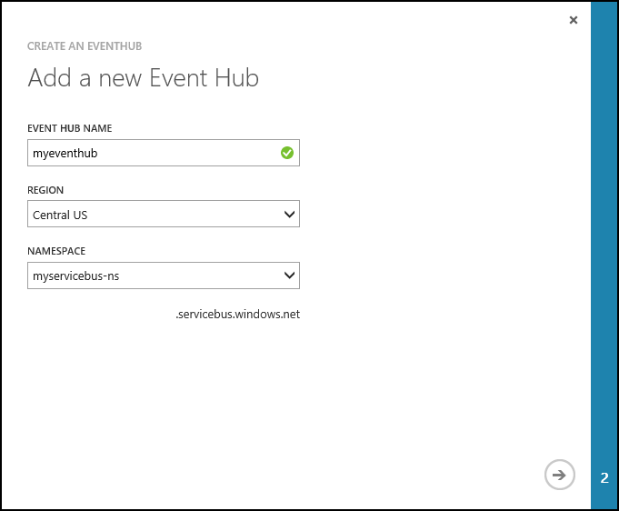

<properties
    pageTitle="配合 Java 使用 Storm on HDInsight 从事件中心处理事件 | Azure"
    description="了解如何使用通过 Maven 创建的 Java Storm 拓扑处理事件中心数据。"
    services="hdinsight,notification hubs"
    documentationcenter=""
    author="Blackmist"
    manager="jhubbard"
    editor="cgronlun"
    translationtype="Human Translation" />
<tags
    ms.assetid="453fa7b0-c8a6-413e-8747-3ac3b71bed86"
    ms.service="hdinsight"
    ms.custom="hdinsightactive"
    ms.devlang="dotnet"
    ms.topic="article"
    ms.tgt_pltfrm="na"
    ms.workload="big-data"
    ms.date="04/03/2017"
    wacn.date="05/08/2017"
    ms.author="larryfr"
    ms.sourcegitcommit="2c4ee90387d280f15b2f2ed656f7d4862ad80901"
    ms.openlocfilehash="2f18d8279fe0425e4f662e8133d7ab4fce3e2b81"
    ms.lasthandoff="04/28/2017" />

# 使用 Storm on HDInsight 从 Azure 事件中心处理事件 (Java)

了解如何将 Azure 事件中心与 Storm on HDInsight 配合使用。 此示例使用基于 Java 的组件在 Azure 事件中心中读取和写入数据。

Azure 事件中心可用于处理网站、应用程序和设备中的大量数据。 借助事件中心 Spout，可以轻松使用 Apache Storm on HDInsight 实时分析这些数据。 还可使用事件中心 Bolt 从 Storm 向事件中心写入数据。

## 先决条件

* 一个 3.5 版 Apache Storm on HDInsight 群集。 有关详细信息，请参阅 [Storm on HDInsight 群集入门](/documentation/articles/hdinsight-apache-storm-tutorial-get-started-linux/)。

    [AZURE.INCLUDE [hdinsight-linux-acn-version.md](../../includes/hdinsight-linux-acn-version.md)]

    > [AZURE.IMPORTANT]
    > Linux 是 HDInsight 3.4 或更高版本上使用的唯一操作系统。 有关详细信息，请参阅[弃用 HDInsight 3.3 和 3.4](/documentation/articles/hdinsight-component-versioning/#hdi-version-33-nearing-deprecation-date)。

* [Azure 事件中心](/documentation/articles/event-hubs-dotnet-standard-getstarted-send/)。

* [Oracle Java Developer Kit (JDK) 版本 8](http://www.oracle.com/technetwork/java/javase/downloads/index.html) 或等效工具，例如 [OpenJDK](http://openjdk.java.net/)。

* [Maven](https://maven.apache.org/download.cgi)：Maven 是 Java 项目的项目生成系统。

* 文本编辑器或集成开发环境 (IDE)。

    > [AZURE.NOTE]
    > 你的编辑器或 IDE 可能具有处理 Maven 的特定功能，但本文档中未提供说明。 有关环境编辑功能的详细信息，请参阅所使用产品的文档。

    * SSH 客户端。 有关详细信息，请参阅[对 HDInsight 使用 SSH](/documentation/articles/hdinsight-hadoop-linux-use-ssh-unix/)。

* 一个 SCP 客户端。 `scp` 命令随所有 Linux、Unix 和 OS X 系统（包括 Windows 10 上的 Bash）提供。对于未提供 `scp` 命令的 Windows 版本，建议使用 PSCP。 PSCP 可通过 [PuTTY 下载页](http://www.chiark.greenend.org.uk/~sgtatham/putty/download.html)获得。

## 了解示例

[hdinsight-java-storm-eventhub](https://github.com/Azure-Samples/hdinsight-java-storm-eventhub) 示例包含两个拓扑：

**com.microsoft.example.EventHubWriter** 将随机数据写入 Azure 事件中心。 数据由 Spout 生成，是随机设备 ID 和设备值。 因此它可以模拟发出字符串 ID 和数字值的某些硬件。

**com.microsoft.example.EventHubReader** 从事件中心读取数据并将其存储到群集默认存储的 /devicedata 目录中。

数据在写入事件中心之前已格式化为 JSON 文档，因此读取器会将其从 JSON 解析为元组。 JSON 格式如下：

    { "deviceId": "unique identifier", "deviceValue": some value }

### 项目配置

`POM.xml` 文件包含此 Maven 项目的配置信息。 需要关注的部分是：

#### Hortonworks 存储库

HDInsight 基于 Hortonworks Data Platform。 为了确保项目与配合 HDInsight 3.5 使用的 Storm 和 Hadoop 版本兼容，以下部分将项目配置为使用 Hortonworks 位：

    <repositories>
        <repository>
            <releases>
                <enabled>true</enabled>
                <updatePolicy>always</updatePolicy>
                <checksumPolicy>warn</checksumPolicy>
            </releases>
            <snapshots>
                <enabled>false</enabled>
                <updatePolicy>never</updatePolicy>
                <checksumPolicy>fail</checksumPolicy>
            </snapshots>
            <id>HDPReleases</id>
            <name>HDP Releases</name>
            <url>http://repo.hortonworks.com/content/repositories/releases/</url>
            <layout>default</layout>
        </repository>
        <repository>
            <releases>
                <enabled>true</enabled>
                <updatePolicy>always</updatePolicy>
                <checksumPolicy>warn</checksumPolicy>
            </releases>
            <snapshots>
                <enabled>false</enabled>
                <updatePolicy>never</updatePolicy>
                <checksumPolicy>fail</checksumPolicy>
            </snapshots>
            <id>HDPJetty</id>
            <name>Hadoop Jetty</name>
            <url>http://repo.hortonworks.com/content/repositories/jetty-hadoop/</url>
            <layout>default</layout>
        </repository>
    </repositories>

#### EventHubs Storm Spout 依赖性

    <dependency>
        <groupId>com.microsoft</groupId>
        <artifactId>eventhubs</artifactId>
        <version>1.0.2</version>
    </dependency>

此 xml 定义 eventhubs 包的依赖项，它包含用于从事件中心读取数据的 Spout 和用于将数据写入事件中心的 Bolt。

> [AZURE.NOTE]
> 在本文档后面将安装此包。

#### HdfsBolt 和 WASB 组件

HdfsBolt 一般用于将数据存储到 Hadoop 分布式文件系统 (HDFS)。 但是，HDInsight 群集使用 Azure 存储空间 (WASB) 作为默认的数据存储区，因此我们必须加载多个组件，使 HdfsBolt 识别 WASB 文件系统。

    <!--HdfsBolt stuff -->
    <dependency>
        <groupId>org.apache.storm</groupId>
        <artifactId>storm-hdfs</artifactId>
        <!-- exclude these storm-hdfs dependencies since they are on the server -->
        <exclusions>
            <exclusion>
                <groupId>org.apache.hadoop</groupId>
                <artifactId>hadoop-client</artifactId>
            </exclusion>
            <exclusion>
                <groupId>org.apache.hadoop</groupId>
                <artifactId>hadoop-hdfs</artifactId>
            </exclusion>
        </exclusions>
        <version>${storm.version}</version>
    </dependency>
    <dependency>
        <groupId>org.apache.hadoop</groupId>
        <artifactId>hadoop-common</artifactId>
        <version>${hadoop.version}</version>
        <exclusions>
        <exclusion>
            <groupId>org.slf4j</groupId>
            <artifactId>slf4j-log4j12</artifactId>
        </exclusion>
        </exclusions>
    </dependency>

> [AZURE.NOTE]
> 如果使用早期版本的 HDInsight（例如 3.2 版），则必须手动注册这些组件。 有关示例，请参阅示例存储库的 [Storm v0.9.3](https://github.com/Azure-Samples/hdinsight-java-storm-eventhub/tree/Storm_v0.9.3) 分支。

#### maven-compiler-plugin

    <plugin>
        <groupId>org.apache.maven.plugins</groupId>
        <artifactId>maven-compiler-plugin</artifactId>
        <version>2.3.2</version>
        <configuration>
        <source>1.8</source>
        <target>1.8</target>
        </configuration>
    </plugin>

这将配置项目以生成 Java 8 的输出，供 HDInsight 3.5 使用。

#### maven-shade-plugin

    <!-- build an uber jar -->
    <plugin>
    <groupId>org.apache.maven.plugins</groupId>
    <artifactId>maven-shade-plugin</artifactId>
    <version>2.3</version>
    <configuration>
        <transformers>
        <!-- Keep us from getting a can't overwrite file error -->
        <transformer implementation="org.apache.maven.plugins.shade.resource.ApacheLicenseResourceTransformer"/>
        <!-- Keep us from getting errors when trying to use WASB from the storm-hdfs bolt -->
        <transformer implementation="org.apache.maven.plugins.shade.resource.ServicesResourceTransformer"/>
        </transformers>
        <!-- Keep us from getting a bad signature error -->
        <filters>
        <filter>
            <artifact>*:*</artifact>
            <excludes>
                <exclude>META-INF/*.SF</exclude>
                <exclude>META-INF/*.DSA</exclude>
                <exclude>META-INF/*.RSA</exclude>
            </excludes>
        </filter>
        </filters>
    </configuration>
    <executions>
        <execution>
        <phase>package</phase>
        <goals>
            <goal>shade</goal>
        </goals>
        </execution>
    </executions>
    </plugin>

这将配置解决方案以将输出打包到 uber jar。 该 jar 包含项目代码和所需的依赖项。 它还用于：

* 为依赖项重命名许可证文件。
* 排除安全性/签名。
* 确保同一接口的多个实现已合并成一个条目。

这些配置设置可防止在运行时出现错误。

#### exec-maven-plugin

    <plugin>
        <groupId>org.codehaus.mojo</groupId>
        <artifactId>exec-maven-plugin</artifactId>
        <version>1.2.1</version>
        <executions>
        <execution>
        <goals>
            <goal>exec</goal>
        </goals>
        </execution>
        </executions>
        <configuration>
        <executable>java</executable>
        <includeProjectDependencies>true</includeProjectDependencies>
        <includePluginDependencies>false</includePluginDependencies>
        <classpathScope>compile</classpathScope>
        <mainClass>${storm.topology}</mainClass>
        </configuration>
    </plugin>

使用此配置可以更轻松地在开发环境中本地运行拓扑。 可以使用以下语法本地运行拓扑：

    mvn compile exec:java -Dstorm.topology=<CLASSNAME>

例如， `mvn compile exec:java -Dstorm.topology=com.microsoft.example.EventHubWriter`。

#### resources 节

    <resources>
        <resource>
        <directory>${basedir}/conf</directory>
        <filtering>false</filtering>
        <includes>
            <include>EventHubs.properties</include>
        </includes>
        </resource>
    </resources>

此配置定义可在项目中包含的非 Java 资源。 例如， **EventHubs.properties** 文件包含用于连接到 Azure 事件中心的信息。

## 配置环境变量

可以在开发工作站上安装 Java 和 JDK 时设置以下环境变量。 不过，你应该检查它们是否存在并且包含系统的正确值。

* **JAVA_HOME** - 应该指向已安装 Java 运行时环境 (JRE) 的目录。 例如，在 Unix 或 Linux 分发版中，它的值应该类似于 `/usr/lib/jvm/java-7-oracle`。 在 Windows 中，它的值类似于 `c:\Program Files (x86)\Java\jre1.7`
* **PATH** - 应该包含以下路径：

    * **JAVA_HOME**（或等效的路径）
    * **JAVA_HOME\bin**（或等效的路径）
    * 安装 Maven 的目录

## 下载并注册 EventHub 组件

1. 从 [https://000aarperiscus.blob.core.windows.net/certs/storm-eventhubs-1.0.2-jar-with-dependencies.jar](https://000aarperiscus.blob.core.windows.net/certs/storm-eventhubs-1.0.2-jar-with-dependencies.jar) 下载 `storm-eventhubs-1.0.2-jar-with-dependencies.jar`。 此文件包含用于从 EventHubs 读取和写入的 spout 和 bolt 组件。

2. 使用以下命令在本地 maven 存储库中注册组件：

        mvn install:install-file -Dfile=storm-eventhubs-1.0.2-jar-with-dependencies.jar -DgroupId=com.microsoft -DartifactId=eventhubs -Dversion=1.0.2 -Dpackaging=jar

    修改 `-Dfile=` 参数，使其指向下载的文件位置。

    此命令将文件安装在本地 Maven 存储库中，Maven 在编译时可以找到该存储库。

## 配置事件中心

事件中心是此示例的数据源。 按照下列步骤创建一个事件中心。

1. 在 [Azure 经典管理门户](https://manage.windowsazure.cn)中，选择“新建” > “服务总线” > “事件中心” > “自定义创建”。

2. 在“添加新事件中心”屏幕中，输入**事件中心名称**。 选择要在其中创建中心的**区域**，然后创建一个命名空间或选择现有命名空间。 最后，单击 **箭头** 以继续。

    

    > [AZURE.NOTE]
    > 选择与 Storm on HDInsight 服务器相同的**位置**，以降低延迟和成本。

3. 在“配置事件中心”屏幕中，输入“分区计数”和“消息保留期”值。 对于本示例，请使用分区计数 10，消息保留期 1。 记下分区计数，因为稍后需要用到此值。

    

4. 创建事件中心之后，请选择命名空间、“事件中心”，然后选择前面创建的事件中心。
5. 选择“配置”，然后使用以下信息创建两个新的访问策略：

    <table>
    <tr><th>Name</th><th>权限</th></tr>
    <tr><td>写入器</td><td>发送</td></tr>
    <tr><td>读取器</td><td>侦听</td></tr>
    </table>

    创建权限后，在页面底部选择“保存”图标。 这些共享访问策略用于读取和写入事件中心。

    

6. 保存策略后，使用页面底部的“共享访问密钥生成器”检索 **writer** 和 **reader** 策略的密钥。 保存这些密钥。

## 下载并生成项目

1. 从 GitHub 下载项目： [hdinsight-java-storm-eventhub](https://github.com/Azure-Samples/hdinsight-java-storm-eventhub)。 可以下载 zip 存档形式的包，或者使用 [git](https://git-scm.com/) 在本地克隆项目。

2. 使用以下命令生成和打包项目：

        mvn package

    此命令下载所需的依赖项，进行生成，然后打包项目。 输出将作为 **EventHubExample-1.0-SNAPSHOT.jar** 存储在 **/target** 目录中。

## 部署拓扑

此项目创建的 jar 包含两个拓扑：**com.microsoft.example.EventHubWriter** 和 **com.microsoft.example.EventHubReader**。 应该先启动 EventHubWriter 拓扑，因为它会将事件写入事件中心，然后由 EventHubReader 读取事件。

1. 使用 SCP 将 jar 包复制到 HDInsight 群集。 将 USERNAME 替换为群集的 SSH 用户。 将 CLUSTERNAME 替换为 HDInsight 群集的名称：

        scp ./target/EventHubExample-1.0-SNAPSHOT.jar USERNAME@CLUSTERNAME-ssh.azurehdinsight.cn:.

    如果使用了 SSH 帐户的密码，则系统将提示你输入该密码。 如果将 SSH 密钥与帐户配合使用，则可能需要使用 `-i` 参数来指定密钥文件的路径。 例如，`scp -i ~/.ssh/id_rsa ./target/EventHubExample-1.0-SNAPSHOT.jar USERNAME@CLUSTERNAME-ssh.azurehdinsight.cn:.`。

    此命令会将文件复制到群集上 SSH 用户的主目录。

2. 上载完文件后，使用 SSH 连接到 HDInsight 群集。 将 **USERNAME** 替换为 SSH 登录名。 将 **CLUSTERNAME** 替换为 HDInsight 群集名称：

        ssh USERNAME@CLUSTERNAME-ssh.azurehdinsight.cn

    > [AZURE.NOTE]
    > 如果使用了 SSH 帐户的密码，则系统将提示你输入该密码。 如果将 SSH 密钥与帐户配合使用，则可能需要使用 `-i` 参数来指定密钥文件的路径。 以下示例从 `~/.ssh/id_rsa` 加载私钥：
    > 

    > `ssh -i ~/.ssh/id_rsa USERNAME@CLUSTERNAME-ssh.azurehdinsight.cn`

3. 使用以下命令启动拓扑：

        storm jar EventHubExample-1.0-SNAPSHOT.jar com.microsoft.example.EventHubWriter writer
        storm jar EventHubExample-1.0-SNAPSHOT.jar com.microsoft.example.EventHubReader reader

    这些命令将使用“读取器”和“写入器”的友好名称启动拓扑。

4. 等待一分钟让拓扑生成数据。 使用以下命令验证数据是否已写入到 HDInsight 存储：

        hdfs dfs fs -ls /devicedata

    此命令将返回类似于以下文本的文件列表：

        -rw-r--r--   1 storm supergroup      10283 2015-08-11 19:35 /devicedata/wasbbolt-14-0-1439321744110.txt
        -rw-r--r--   1 storm supergroup      10277 2015-08-11 19:35 /devicedata/wasbbolt-14-1-1439321748237.txt
        -rw-r--r--   1 storm supergroup      10280 2015-08-11 19:36 /devicedata/wasbbolt-14-10-1439321760398.txt
        -rw-r--r--   1 storm supergroup      10267 2015-08-11 19:36 /devicedata/wasbbolt-14-11-1439321761090.txt
        -rw-r--r--   1 storm supergroup      10259 2015-08-11 19:36 /devicedata/wasbbolt-14-12-1439321762679.txt

    > [AZURE.NOTE]
    > 某些文件可能显示大小为 0，因为虽然已由 EventHubReader 创建这些文件，但尚未将数据存储到其中。

    可以通过以下命令查看这些文件的内容：

        hdfs dfs -text /devicedata/*.txt

    此命令将返回类似于以下文本的数据：

        3409e622-c85d-4d64-8622-af45e30bf774,848981614
        c3305f7e-6948-4cce-89b0-d9fbc2330c36,-1638780537
        788b9796-e2ab-49c4-91e3-bc5b6af1f07e,-1662107246
        6403df8a-6495-402f-bca0-3244be67f225,275738503
        d7c7f96c-581a-45b1-b66c-e32de6d47fce,543829859
        9a692795-e6aa-4946-98c1-2de381b37593,1857409996
        3c8d199b-0003-4a79-8d03-24e13bde7086,-1271260574

    第一列包含设备 ID 值，第二列为设备值。

5. 使用以下命令停止拓扑：

        storm kill reader
        storm kill writer

## 删除群集

[AZURE.INCLUDE [delete-cluster-warning](../../includes/hdinsight-delete-cluster-warning.md)]

## 故障排除

如果在 /devicedata 目录中看不到文件，请使用 Storm UI 查找拓扑返回的任何错误。

有关使用 Storm UI 的详细信息，请参阅以下主题：

* 如果使用**基于 Linux** 的 Storm on HDInsight 群集，请参阅[在基于 Linux 的 HDInsight 上部署和管理 Apache Storm 拓扑](/documentation/articles/hdinsight-storm-deploy-monitor-topology-linux/)

* 如果使用**基于 Windows** 的 Storm on HDInsight 群集，请参阅[在基于 Windows 的 HDInsight 上部署和管理 Apache Storm 拓扑](/documentation/articles/hdinsight-storm-deploy-monitor-topology/)

## 后续步骤

* [Storm on HDInsight 的示例拓扑](/documentation/articles/hdinsight-storm-example-topology/)

<!--Update_Description: wording update-->