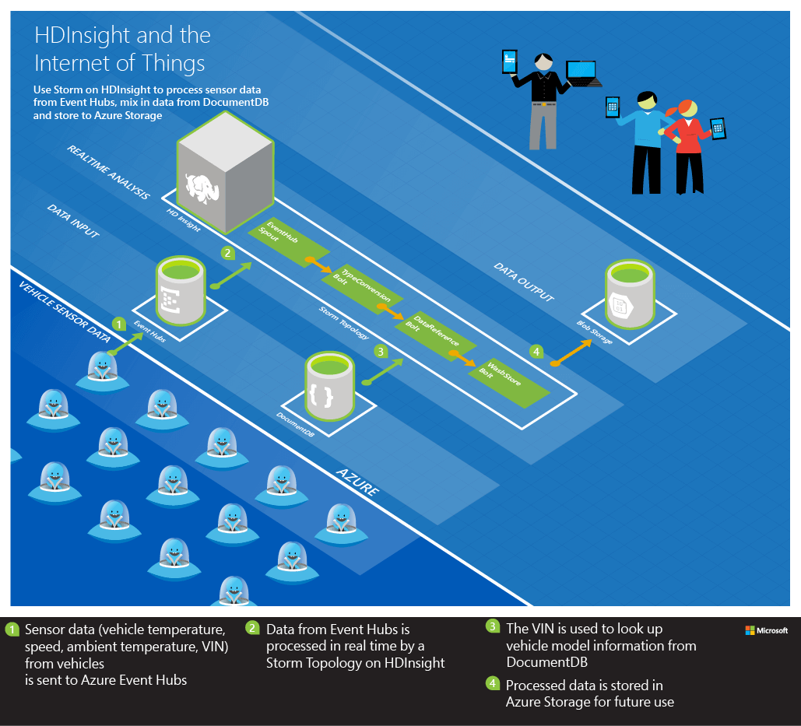
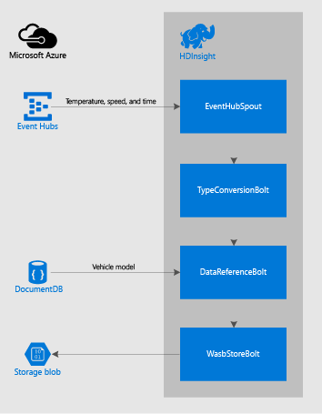

<properties
    pageTitle="使用 Apache Storm on HDInsight 处理车辆传感器数据 | Azure"
    description="了解如何使用 Apache Storm on HDInsight 处理事件中心的车辆传感器数据。 从 Azure DocumentDb 添加模型数据，并将输出存储到存储中。"
    services="hdinsight,documentdb,notification-hubs"
    documentationcenter=""
    author="Blackmist"
    manager="jhubbard"
    editor="cgronlun" />
<tags
    ms.assetid="78980635-8bef-4c33-96c3-fae50e932e31"
    ms.service="hdinsight"
    ms.custom="hdinsightactive"
    ms.devlang="java"
    ms.topic="article"
    ms.tgt_pltfrm="na"
    ms.workload="big-data"
    ms.date="05/03/2017"
    wacn.date="06/05/2017"
    ms.author="v-dazen"
    ms.translationtype="Human Translation"
    ms.sourcegitcommit="08618ee31568db24eba7a7d9a5fc3b079cf34577"
    ms.openlocfilehash="1cdca7c18097340ed26fc24afd4a1b7ba8a0d2f9"
    ms.contentlocale="zh-cn"
    ms.lasthandoff="05/26/2017" />

# 使用 Apache Storm on HDInsight 处理 Azure 事件中心的车辆传感器数据

了解如何使用 Apache Storm on HDInsight 处理 Azure 事件中心的车辆传感器数据。 此示例从 Azure 事件中心读取传感器数据，通过引用 Azure DocumentDb 中存储的数据来丰富数据。 使用 Hadoop 文件系统 (HDFS) 将数据存储到 Azure 存储。

## 概述

向车辆添加传感器可以基于历史数据趋势预测设备问题。 它还允许根据使用模式分析对未来版本做出改进。 必须能够快速有效地将所有车辆的数据加载到 Hadoop 中，然后才能进行 MapReduce 处理。 此外，可能还需要实时针对关键故障路径（引擎温度、刹车等）进行分析。

Azure 事件中心用于处理传感器生成的大量数据。 将数据存储到 HDFS 中之前，可以使用 Apache Storm 加载和处理这些数据。

## 解决方案

由传感器记录引擎温度、环境温度和车速的遥测数据。 然后，将数据以及汽车的车辆标识号 (VIN) 和时间戳一起发送到事件中心。 在事件中心，运行在 Apache Storm on HDInsight 群集上的 Storm 拓扑将读取并处理数据，然后将其存储到 HDFS 中。

处理过程中，VIN 用于从 DocumentDb 检索车型信息。 该数据在存储之前会添加到数据流中。

在 Storm 拓扑中使用的组件包括：

* EventHubSpout - 从 Azure 事件中心读取数据
* TypeConversionBolt - 将事件中心的 JSON 字符串转换为包含以下传感器数据的元组：
    * 引擎温度
    * 环境温度
    * Speed
    * VIN
    * Timestamp
* DataReferencBolt - 使用 VIN 从 DocumentDb 中查找车型
* WasbStoreBolt - 将数据存储到 HDFS（Azure 存储）

下面是此解决方案的图示：

## 实现

GitHub 上的 [HDInsight-Storm-Examples](https://github.com/hdinsight/hdinsight-storm-examples) 存储库中提供了这种情况的完整自动化解决方案。 若要使用此示例，请遵循 [IoTExample README.MD](https://github.com/hdinsight/hdinsight-storm-examples/blob/master/IotExample/README.md) 中的步骤。

## 后续步骤

如需更多 Storm 拓扑示例，请参阅 [Storm on HDInsight 的示例拓扑](/documentation/articles/hdinsight-storm-example-topology/)。

<!--Update_Description: wording update-->