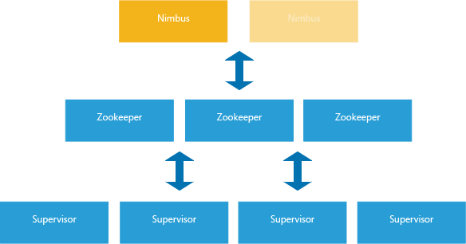

<properties
    pageTitle="什么是 Apache Storm - Azure HDInsight | Azure"
    description="Apache Storm 用于实时处理数据流。 可以通过 Azure HDInsight 轻松地在 Azure 云中创建 Storm 群集。 使用 Visual Studio 时，可以通过 C# 创建 Storm 解决方案，然后将其部署到 HDInsight Storm 群集。"
    services="hdinsight"
    documentationcenter=""
    author="Blackmist"
    manager="jhubbard"
    editor="cgronlun"
    tags="azure-portal"
    keywords="apache storm 用例,storm 群集,什么是 apache storm" />
<tags
    ms.assetid="72d54080-1e48-4a5e-aa50-cce4ffc85077"
    ms.service="hdinsight"
    ms.custom="hdinsightactive,hdiseo17may2017"
    ms.devlang="na"
    ms.topic="get-started-article"
    ms.tgt_pltfrm="na"
    ms.workload="big-data"
    ms.date="05/12/2017"
    wacn.date="06/05/2017"
    ms.author="v-dazen"
    ms.translationtype="Human Translation"
    ms.sourcegitcommit="08618ee31568db24eba7a7d9a5fc3b079cf34577"
    ms.openlocfilehash="7fdf1d5c3f9c3fa8ea82ee9ecbf880c7e389d168"
    ms.contentlocale="zh-cn"
    ms.lasthandoff="05/26/2017" />

# 什么是 Azure HDInsight 上的 Apache Storm

[AZURE.INCLUDE [hdinsight-linux-acn-version.md](../../includes/hdinsight-linux-acn-version.md)]

[Apache Storm](http://storm.apache.org/) 是一种容错的分布式开源计算系统。 可以将 Storm 群集与 Hadoop 配合使用，以便实时处理数据流。 Storm 解决方案还提供有保障的数据处理功能，能够重播第一次未成功处理的数据。

Storm on HDInsight 具有下述重要优势：

* 以托管服务的形式执行，提供 99.9% 运行时间 SLA。

* 支持在 Storm 群集创建期间或者创建之后，通过对该群集运行脚本轻松进行自定义。 有关详细信息，请参阅[使用脚本操作自定义 HDInsight 群集](/documentation/articles/hdinsight-hadoop-customize-cluster-linux/)。

* 使用各种语言。 可以根据所选语言（例如 Java、C#、Python）编写 Storm 组件。

    * 将 Visual Studio 与 HDInsight 集成，以便开发、管理和监视 C# 拓扑。 有关详细信息，请参阅[使用用于 Visual Studio 的 HDInsight 工具开发 C# Storm 拓扑](/documentation/articles/hdinsight-storm-develop-csharp-visual-studio-topology/)。

    * 支持 Trident Java 接口。 可以创建支持一次性消息处理、事务性数据存储持久性和一组常见流分析操作的 Storm 拓扑。

*  轻松地上下缩放 Storm 群集。 可以在不影响 Storm 拓扑运行的情况下添加或删除辅助角色节点。

* 与以下 Azure 服务集成：

    * Azure 事件中心

    * Azure 虚拟网络

    * Azure SQL 数据库

    * Azure 存储

    * Azure DocumentDb

* 使用虚拟网络，将多个 HDInsight 群集的功能安全地组合在一起。 可以创建使用 Storm、Spark、HBase 或 Hadoop 群集的分析管道。

有关在实时分析解决方案中使用 Apache Storm 的公司的列表，请参阅[使用 Apache Storm 的公司](https://storm.apache.org/documentation/Powered-By.html)。

若要开始使用 Storm，请参阅 [Storm on HDInsight 入门][gettingstarted]。

## Storm 的工作原理

Storm 运行的是拓扑，而不是你可能熟悉的 MapReduce 作业。 Storm 拓扑由多个以有向无环图 (DAG) 形式排列的组件构成。 数据在该图中的组件之间流动。 每个组件使用一个或多个数据流，并可选择性地发出一个或多个流。 下图演示了一个基本单词计数拓扑中组件之间的数据流动方式：

* Spout 组件将数据引入拓扑。 它们将一个或多个流发出到拓扑中。

* Bolt 组件使用 Spout 或其他 Bolt 发出的流。 Bolt 可以选择性地将流发出到拓扑中。 Bolt 还负责将数据写入 HDFS、Kafka 或 HBase 等外部服务或存储。

## 容易创建

只需数分钟即可在 HDInsight 上预配好新的 Storm 群集。 有关创建 Storm 群集的信息，请参阅 [Storm on HDInsight 入门](/documentation/articles/hdinsight-apache-storm-tutorial-get-started-linux/)。

## 易于使用

* __安全外壳 (SSH) 连接__：可以使用 SSH 通过 Internet 访问 Storm 群集的头节点。 可以使用 SSH 直接在群集上运行命令。

    有关详细信息，请参阅[对 HDInsight 使用 SSH](/documentation/articles/hdinsight-hadoop-linux-use-ssh-unix/)。

* __Web 连接__：所有 HDInsight 群集都提供 Ambari Web UI。 可以使用 Ambari Web UI 在群集上轻松监视、配置和管理服务。 Storm 群集还提供 Storm UI。 可以使用 Storm UI，通过浏览器监视和管理 Storm 拓扑的运行。

    有关详细信息，请参阅[使用 Ambari Web UI 管理 HDInsight](/documentation/articles/hdinsight-hadoop-manage-ambari/) 和[使用 Storm UI 进行监视和管理](/documentation/articles/hdinsight-storm-deploy-monitor-topology-linux/#monitor-and-manage-storm-ui)这两篇文档。

* __Azure PowerShell 和 Azure CLI__：PowerShell 和 CLI 都提供命令行实用工具，可在客户端系统中使用这些工具来操作 HDInsight 和其他 Azure 服务。

* __Visual Studio 集成__：针对 Visual Studio 的 Azure Data Lake 工具包含用于通过 SCP.Net Framework 创建 C# Storm 拓扑的项目模板。 Data Lake 工具还提供用于通过 Storm on HDInsight 部署、监视和管理解决方案的工具。

    有关详细信息，请参阅[使用用于 Visual Studio 的 HDInsight 工具开发 C# Storm 拓扑](/documentation/articles/hdinsight-storm-develop-csharp-visual-studio-topology/)。

## 与其他 Azure 服务集成

* __事件中心__：有关将事件中心与 Storm 群集配合使用的示例，请参阅以下文档：

    * [开发适用于 Storm on HDInsight 的基于 Java 的拓扑](/documentation/articles/hdinsight-storm-develop-java-topology/)

    * [使用 Storm on HDInsight 从 Azure 事件中心处理事件 (C#)](/documentation/articles/hdinsight-storm-develop-csharp-event-hub-topology/)

* __SQL 数据库__、__DocumentDb__、__事件中心__和 __HBase__：针对 Visual Studio 的 Data Lake 工具包含模板示例。 有关详细信息，请参阅[为 Storm on HDInsight 开发 C# 拓扑](/documentation/articles/hdinsight-storm-develop-csharp-visual-studio-topology/)。

## 可靠性

Apache Storm 保证每个传入消息始终受到完全处理，即使数据分析分散在数百个节点。

Nimbus 节点提供的功能与 Hadoop JobTracker 类似，它通过 Zookeeper 将任务分配给群集中的其他节点。 Zookeeper 节点为群集提供协调功能，并促进 Nimbus 与辅助节点上的 Supervisor 进程进行通信。 如果处理的一个节点出现故障，Nimbus 节点将得到通知，并分配到另一个节点的任务和关联的数据。

Apache Storm 群集的默认配置是只能有一个 Nimbus 节点。 HDInsight 上的 Storm 提供两个 Nimbus 节点。 如果主节点出现故障，Storm 群集将切换到辅助节点，同时主节点将会恢复。 下图说明了 Storm on HDInsight 的任务流配置：

## 缩放

可以通过添加或删除辅助角色节点来动态地缩放 HDInsight 群集。 处理数据时，可以执行此操作。

> [AZURE.IMPORTANT]
> 若要利用通过缩放添加的新节点，需要重新平衡在增加大小之前启动的 Storm 拓扑。

## 支持

Storm on HDInsight 附带完整的企业级持续支持。 Storm on HDInsight 也提供 99.9% 的 SLA。 这意味着，我们保证至少 99.9% 的时间 Storm 群集都能建立外部连接。

有关详细信息，请参阅 [Azure 支持](/support/contact/)。

## Apache Storm 用例

以下是可能使用 HDInsight 上的 Storm 的一些常见方案：

* 物联网 (IoT)
* 欺诈检测
* 社交分析
* 提取、转换和加载 (ETL)
* 网络监视
* 搜索
* 移动应用场景

有关实际方案的信息，请参阅文档 [How companies are using Storm](https://storm.apache.org/documentation/Powered-By.html)（公司如何使用 Storm）。

## 开发

.NET 开发人员使用针对 Visual Studio 的 Data Lake 工具即可以 C# 语言设计和实施拓扑。 你也可以创建使用 Java 和 C# 组件的混合拓扑。

有关详细信息，请参阅 [使用 Visual Studio 开发适用于 Storm on HDInsight 的 C# 拓扑](/documentation/articles/hdinsight-storm-develop-csharp-visual-studio-topology/)。

还可以使用所选的 IDE 开发 Java 解决方案。 有关详细信息，请参阅[开发适用于 Storm on HDInsight 的 Java 拓扑](/documentation/articles/hdinsight-storm-develop-java-topology/)。

还可以使用 Python 开发 Storm 组件。 有关详细信息，请参阅[使用 Python on HDInsight 开发 Storm 拓扑](/documentation/articles/hdinsight-storm-develop-python-topology/)。

## 常见开发模式

### 有保证的消息处理

Apache Storm 可以提供不同级别的有保证的消息处理。 例如，基本的 Storm 应用程序至少可以保证一次处理，而 Trident 仅可以保证一次处理。

有关详细信息，请参阅 apache.org 上的 [数据处理保证](https://storm.apache.org/about/guarantees-data-processing.html) 。

### IBasicBolt

读取输入元组，发出零个或多个元组，然后在执行方法结束时立即询问输入元组，这种模式非常普通。 Storm 提供 [IBasicBolt](https://storm.apache.org/releases/1.0.3/javadocs/org/apache/storm/topology/IBasicBolt.html) 接口来自动执行这种模式。

### 联接

应用程序之间数据流的联接方式各不相同。 例如，可以从多个流将每个元组联接到一个新流，也可以仅联接特定窗口的批量元组。 不管什么方式，都可以通过 [fieldsGrouping](http://storm.apache.org/releases/current/javadocs/org/apache/storm/topology/InputDeclarer.html#fieldsGrouping-java.lang.String-org.apache.storm.tuple.Fields-) 完成联接。 可以通过字段分组来定义将元组路由到 Bolt 的方式。

在以下 Java 实例中，fieldsGrouping 用于将来自组件“1”、“2”和“3”的元组路由至 MyJoiner bolt：

    builder.setBolt("join", new MyJoiner(), parallelism) .fieldsGrouping("1", new Fields("joinfield1", "joinfield2")) .fieldsGrouping("2", new Fields("joinfield1", "joinfield2")) .fieldsGrouping("3", new Fields("joinfield1", "joinfield2"));

### 批处理

Apache Storm 提供名为“计时周期元组”的内部计时机制。 可以在拓扑中对计时周期元组的发出频率进行设置。

有关从 C# 组件使用计时周期元组的示例，请参阅 [PartialBoltCount.cs](https://github.com/hdinsight/hdinsight-storm-examples/blob/3b2c960549cac122e8874931df4801f0934fffa7/EventCountExample/EventCountTopology/src/main/java/com/microsoft/hdinsight/storm/examples/PartialCountBolt.java)。

### 缓存

内存缓存通常用作加速处理的机制，因为它在内存中存储常用资产。 由于拓扑跨多个节点分布，而每个节点中有多个流程，因此应考虑使用 [fieldsGrouping](http://storm.apache.org/releases/current/javadocs/org/apache/storm/topology/InputDeclarer.html#fieldsGrouping-java.lang.String-org.apache.storm.tuple.Fields-)。 使用 `fieldsGrouping` 确保将元组（其中包含的字段用于缓存查找）始终路由到同一进程。 此分组功能可以避免在进程间重复缓存条目。

### 流“top N”

当拓扑依赖于计算 top N 值时，请并行计算 top N 值。 然后将这些计算的输出合并到全局值中。 此操作可以通过 [fieldsGrouping](http://storm.apache.org/releases/current/javadocs/org/apache/storm/topology/InputDeclarer.html#fieldsGrouping-java.lang.String-org.apache.storm.tuple.Fields-) 完成，以便按字段路由来完成并行处理。 然后即可路由到 Bolt，以便通过全局方式确定 top N 值。

有关计算 top N 值的示例，请参阅 [RollingTopWords](https://github.com/apache/storm/blob/master/examples/storm-starter/src/jvm/org/apache/storm/starter/RollingTopWords.java) 示例。

## 日志记录

Storm 使用 Apache Log4j 来记录信息。 默认情况下，将记录大量的数据，因此很难通过信息排序。 可以让日志记录配置文件包括在 Storm 拓扑中，控制日志记录行为。

有关演示如何配置日志记录的示例拓扑，请参阅适用于 HDInsight 上的 Storm 的[基于 Java 的 WordCount](/documentation/articles/hdinsight-storm-develop-java-topology/) 示例。

## 后续步骤

了解有关使用 Storm on HDInsight 构建实时分析解决方案的详细信息：

* [HDInsight 上的 Apache Storm 入门][gettingstarted]
* [HDInsight 上的 Apache Storm 的示例拓扑](/documentation/articles/hdinsight-storm-example-topology/)

[stormtrident]: https://storm.apache.org/documentation/Trident-API-Overview.html
[samoa]: http://yahooeng.tumblr.com/post/65453012905/introducing-samoa-an-open-source-platform-for-mining
[apachetutorial]: https://storm.apache.org/documentation/Tutorial.html
[gettingstarted]: /documentation/articles/hdinsight-apache-storm-tutorial-get-started-linux/

<!--Update_Description: add "how does storm work"-->