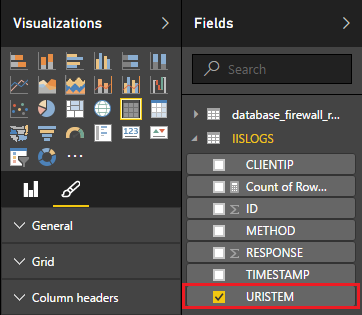
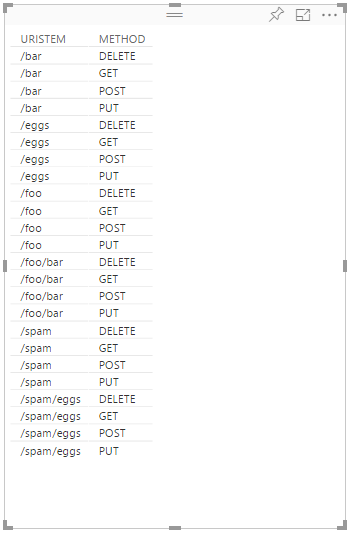
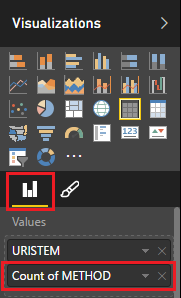
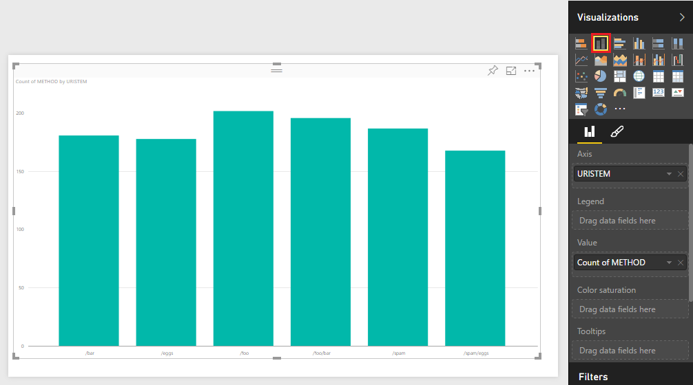

<properties
    pageTitle="将 Apache Storm 与 Power BI 配合使用 | Azure"
    description="使用 HDInsight 中 Apache Storm 群集上运行的 C# 拓扑中的数据创建 Power BI 报表。"
    services="hdinsight"
    documentationcenter=""
    author="Blackmist"
    manager="jhubbard"
    editor="cgronlun"
    tags="azure-portal" />
<tags
    ms.assetid="36fe3b9c-5232-4464-8d75-95403b6da7a1"
    ms.service="hdinsight"
    ms.devlang="dotnet"
    ms.topic="article"
    ms.tgt_pltfrm="na"
    ms.workload="big-data"
    ms.date="10/27/2016"
    wacn.date="01/25/2017"
    ms.author="larryfr" />

# 使用 Power BI 直观显示 Apache Storm 拓扑中的数据

[AZURE.INCLUDE [azure-sdk-developer-differences](../../includes/azure-sdk-developer-differences.md)]

Power BI 允许以可视方式将数据显示为报表。使用适用于 Storm on HDInsight 的 Visual Studio 模板，可以轻松地将 Apache Storm on HDInsight 群集上运行的拓扑中的数据存储到 SQL Azure，然后使用 Power BI 将数据可视化。

在本文档中，将学习如何使用 Power BI 基于 Apache Storm 生成的数据创建报表，然后将其存储到 Azure SQL 数据库中。

[AZURE.INCLUDE [hdinsight-linux-acn-version.md](../../includes/hdinsight-linux-acn-version.md)]

> [AZURE.NOTE]
虽然本文档中的步骤依赖于带 Visual Studio 的 Windows 开发环境，但是也可将编译的项目提交到基于 Linux 或 Windows 的 HDInsight 群集。仅在 2016 年 10 月 28 日以后创建的基于 Linux 的群集支持 SCP.NET 拓扑。
> 

> 若要将 C# 拓扑与基于 Linux 的群集一起使用，必须将项目所使用的 Microsoft.SCP.Net.SDK NuGet 包更新为 0.10.0.6 或更高版本。包的版本还必须与 HDInsight 上安装的 Storm 的主要版本相符。例如，Storm on HDInsight 版本 3.3 和 3.4 使用 Storm 版本 0.10.x，而 HDInsight 3.5 使用 Storm 1.0.x。
> 

> 基于 Linux 的群集上的 C# 拓扑必须使用 .NET 4.5，并使用要在 HDInsight 群集上运行的 Mono。大多数功能会正常运行，但应查看 [Mono 兼容性](http://www.mono-project.com/docs/about-mono/compatibility/)文档，了解可能的不兼容性。
> 

> 如需此项目的 Java 版本（也适用于基于 Linux 或基于 Windows 的群集），请参阅[使用 Storm on HDInsight 从 Azure 事件中心处理事件 (Java)](/documentation/articles/hdinsight-storm-develop-java-event-hub-topology/)。
> 
> 

## 先决条件
* Azure 订阅。请参阅[获取 Azure 试用版](/pricing/1rmb-trial/)。
* 具有 [Power BI](https://powerbi.com) 访问权限的 Azure Active Directory 用户
* Visual Studio（以下版本之一）
  
    * Visual Studio 2012 [Update 4](http://www.microsoft.com/download/details.aspx?id=39305)
    * Visual Studio 2013 [Update 4](http://www.microsoft.com/download/details.aspx?id=44921) 或 [Visual Studio 2013 Community](http://download.microsoft.com/download/7/1/B/71BA74D8-B9A0-4E6C-9159-A8335D54437E/vs_community.exe)
    * [Visual Studio 2015](https://www.visualstudio.com/downloads/download-visual-studio-vs.aspx)
* HDInsight Tools for Visual Studio：有关安装方面的信息，请参阅 [HDInsight Tools for Visual Studio 入门](/documentation/articles/hdinsight-hadoop-visual-studio-tools-get-started/)。

## 工作原理
本示例包含随机生成 Internet Information Services (IIS) 日志数据的 C# Storm 拓扑。将此数据写入 SQL 数据库，随后用于在 Power BI 中生成报表。

以下是实现本示例的主要功能的文件列表。

* **SqlAzureBolt.cs**：将 Storm 拓扑中生成的信息写入 SQL 数据库。
* **IISLogsTable.sql**：Transact-SQL 语句，用于生成存储数据的数据库。

> [AZURE.WARNING]
在 HDInsight 群集上启动该拓扑前，必须先在 SQL 数据库中创建表。
> 
> 

## 下载示例
下载 [HDInsight C# Storm Power BI 示例](https://github.com/Azure-Samples/hdinsight-dotnet-storm-powerbi)。要下载该示例，请使用 [git](http://git-scm.com/) 复制/克隆它，或使用“下载”链接下载 .zip 存档。

## 创建数据库
1. 按照 [SQL Database tutorial](/documentation/articles/sql-database-get-started/)（SQL 数据库教程）文档中的步骤创建新 SQL 数据库。
2. 按照 [Connect to a SQL Database with Visual Studio](/documentation/articles/sql-database-connect-query/)（使用 Visual Studio 连接到 SQL 数据库）文档中的步骤连接到数据库。
3. 在“对象资源管理器”中，右键单击数据库，然后创建**新查询**。将下载的项目中包含的 **IISLogsTable.sql** 文件的内容粘贴到查询窗口中，然后按 Ctrl+Shift+E 执行查询。将会已成功完成命令的消息。
   
    完成此操作后，数据库中会出现名为 **IISLOGS** 的新表。

## 配置示例
1. 在 [Azure 门户预览](https://portal.azure.cn)中选择 SQL 数据库。在 SQL 数据库边栏选项卡的“基本信息”部分，选择“显示数据库连接字符串”。从显示的列表中复制“ADO.NET (SQL 身份验证)”信息。
2. 在 Visual Studio 中打开该示例。在“解决方案资源管理器”中打开“App.config”文件，然后找到以下条目：
   
        <add key="SqlAzureConnectionString" value="##TOBEFILLED##" />
   
    将 **##TOBEFILLED##** 值替换为上一步中复制的数据库连接字符串。将 **{your\_username}** 和 **{your\_password}** 替换为数据库的用户名和密码。
3. 保存并关闭文件。

## 部署示例
1. 在“解决方案资源管理器”中，右键单击“StormToSQL”项目，然后选择“提交到 Storm on HDInsight”。从“Storm 群集”下拉对话框中选择 HDInsight 群集。
   
    > [AZURE.NOTE]
    “Storm 群集”下拉对话框中填充服务器名称可能需要几秒钟时间。
    >
 
    > 如果出现提示，请输入 Azure 订阅的登录凭据。如果有多个订阅，请登录包含 Storm on HDInsight 群集的订阅。
    > 
    > 
2. 成功提交拓扑后，应该会出现群集的“Storm 拓扑”。从列表中选择 SqlAzureWriterTopology 条目，以查看有关正在运行的拓扑的信息。
   
    
   
    可以使用此视图查看有关拓扑的信息，或双击条目（例如 SqlAzureBolt）以查看拓扑中组件的具体信息。
3. 在拓扑运行几分钟后，请返回用于创建数据库的 SQL 查询窗口。将现有语句替换为以下内容。
   
        select * from iislogs;
   
    按 Ctrl+Shift+E 执行查询，应显示类似如下的结果。
   
        1    2016-05-27 17:57:14.797    255.255.255.255    /bar    GET    200
        2    2016-05-27 17:57:14.843    127.0.0.1    /spam/eggs    POST    500
        3    2016-05-27 17:57:14.850    123.123.123.123    /eggs    DELETE    200
        4    2016-05-27 17:57:14.853    127.0.0.1    /foo    POST    404
        5    2016-05-27 17:57:14.853    10.9.8.7    /bar    GET    200
        6    2016-05-27 17:57:14.857    192.168.1.1    /spam    DELETE    200
   
    这是从 Storm 拓扑写入的数据。

## 创建报告
1. 连接到 Power BI 的 [Azure SQL 数据库连接器](https://app.powerbi.com/getdata/bigdata/azure-sql-database-with-live-connect)。
2. 在“数据库”中，选择“获取”。
3. 选择“Azure SQL 数据库”，然后选择“连接”。
4. 输入信息以连接到 Azure SQL 数据库。可以通过访问 [Azure 门户预览](https://portal.azure.cn)并选择 SQL 数据库查找此信息。
   
    > [AZURE.NOTE]
    还可以通过在连接对话框中使用“启用高级选项”，以设置刷新间隔和自定义筛选器。
    > 
    > 
5. 连接后，将显示一个名称与连接的数据库相同的新数据集。选择该数据集以开始设计报表。
6. 在“字段”中，展开“IISLOGS”条目。选中“URISTEM”对应的复选框。这将创建一个新报表，列出数据库中记录的 URI 词干（/foo、/bar 等）。
   
    
7. 接下来，将“方法”拖到报表中。报表将更新，以列出词干和用于 HTTP 请求的对应 HTTP 方法。
   
    
8. 从“可视化”列中选择“字段”图标，然后选择“值”部分中“方法”旁边的向下箭头。从显示的列表中选择“计数”。随后将更改报表以列出特定 URI 的访问次数。
   
    
9. 接下来，选择“堆积柱形图”以更改信息的显示方式。
   
    
10. 创建所需的报表后，使用菜单中的“保存”项输入名称并保存报表。

## 停止拓扑
拓扑将继续运行，直至将其停止或删除 Storm on HDInsight 群集。执行以下步骤可停止拓扑。

1. 在 Visual Studio 中，返回拓扑查看器并选择拓扑。
2. 选择“终止”按钮即可停止拓扑。
   
    

## 删除群集
[AZURE.INCLUDE [delete-cluster-warning](../../includes/hdinsight-delete-cluster-warning.md)]

## 后续步骤
在本文档中，已学习如何将数据从 Storm 拓扑发送到 SQL 数据库，然后使用 Power BI 可视化数据。有关如何在 Storm on HDInsight 中使用其他 Azure 技术的信息，请参阅以下文章：

* [Storm on HDInsight 的示例拓扑](/documentation/articles/hdinsight-storm-example-topology/)

<!---HONumber=Mooncake_0120_2017-->
<!--Update_Description: update from ASM to ARM-->