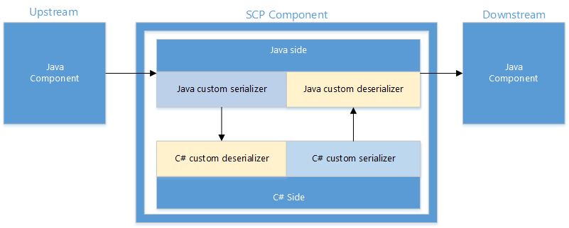

<properties
	pageTitle="SCP.NET 编程指南 | Azure"
	description="了解如何通过 SCP.NET 创建可在 Storm on HDInsight 中使用的基于 .NET 的 Storm 拓扑。"
	services="hdinsight"
	documentationCenter=""
	authors="rperi"
	manager="paulettm"
	editor="cgronlun"/>

<tags
	ms.service="hdinsight"
	ms.date="05/16/2016"
	wacn.date="07/18/2016"/>

#SCP 编程指南

SCP 是一个用于构建实时、可靠、一致和高性能的数据处理应用程序的平台。它在 [Apache Storm](http://storm.incubator.apache.org/) 的基础上构建而成 -- Storm 是开源软件 (OSS) 社区设计的一个流处理系统。Storm 由 Nathan Marz 设计，在 Twitter 上进行开源。其利用 [Apache ZooKeeper](http://zookeeper.apache.org/)（另一个 Apache 项目）来实现高可靠性的分布式协调和状态管理。

SCP 项目不仅已移植到 Windows 的 Storm 中，还为 Windows 生态系统增加了扩展和自定义。扩展包括 .NET 开发人员经验和库，自定义包括基于 Windows 的部署。

我们无需派生 OSS 项目便可实现扩展和自定义，而且我们还可以利用在 Storm 上构建的派生生态系统。

## 处理模型 

SCP 中的数据以连续的元组流形式建模。通常，元组首先流入某个队列，然后被提取，再通过托管在 Storm 拓扑中的业务逻辑进行转换；最后，所产生的输出可作为元组传送到其他 SCP 系统，或者提交到存储（如分布式文件系统）或数据库（如 SQL Server）。

在 Storm 中，应用程序拓扑定义计算图。拓扑中的每个节点都包含处理逻辑，节点之间的链接指明数据流。用于将输入数据注入到拓扑中的节点称为 Spout,这些节点还可用于对数据进行排列。输入数据可驻留在文件日志、事务性数据库、系统性能计数器中或其他位置。具有输入和输出数据流的节点称为 Bolt，这些节点执行实际数据过滤、选择和汇总。

SCP 支持“尽力”、“至少一次”数据处理和“恰一次”数据处理。在分布式流处理应用程序中，数据处理过程中可能会出现各种错误，例如，网络中断、机器故障、用户代码错误等等。“至少一次”处理会在出现错误时自动重新处理原来的数据，从而确保所有数据均至少被处理一次。“至少一次”处理简单且可靠，适用于许多应用程序。但是，例如当应用程序需要确切计算时，进行“至少一次”处理是不够的，因为相同的数据有可能用于应用程序拓扑中。在此情况下，“恰一次”处理可确保即使数据被多次重复使用和处理，结果也是正确。

通过 SCP，.NET 开发人员可以开发实时数据处理应用程序，同时利用基于 Java 虚拟机 (JVM) 的 Storm。.NET 和 JVM 通过 TCP 本地套接字进行通信。基本上，每个 Spout/Bolt 都是一个 .Net/Java 进程对，在这些进程对中，用户逻辑作为插件在 .Net 进程中运行。

若要在 SCP 上开发数据处理应用程序，需要执行以下几个步骤：

-   设计并实施 Spout，以从队列中提取数据。

-   设计并实施 Bolt 以处理输入数据，以及将数据保存到外部存储（如数据库）中。

-   设计拓扑，然后提交并运行拓扑。拓扑定义顶点以及顶点之间的数据流。SCP 会采用拓扑规范并将拓扑部署在 Storm 群集上，在 Storm 群集中，每个顶点在一个逻辑节点上运行。Storm 任务计划程序将会处理故障转移和缩放。

本文档将会使用一些简单示例来介绍如何使用 SCP 开发数据处理应用程序。

## SCP 插件接口 

SCP 插件（或应用程序）是独立的 EXE，可以在开发阶段在 Visual Studio 中运行，也可以在生产环境中部署后插入到 Storm 管道中。编写 SCP 插件就像编写任何其他标准的 Windows 控制台应用程序一样。SCP.NET 平台声明用于 Spout/Bolt 的接口，用户插件代码应实施这些接口。这种设计的主要目的是使用户可以专注于自己的业务逻辑，其他事情则由 SCP.NET 平台处理。

用户插件代码应实施以下其中一个接口，具体取决于拓扑是事务性还是非事务性，以及组件是 Spout 还是 Bolt。

-   ISCPSpout

-   ISCPBolt

-   ISCPTxSpout

-   ISCPBatchBolt

### ISCPPlugin

ISCPPlugin 是各种插件的公共接口。目前，该接口是一个虚拟接口。

	public interface ISCPPlugin 
	{
	}

### ISCPSpout

ISCPSpout 是适用于非事务性 Spout 的接口。

	 public interface ISCPSpout : ISCPPlugin                    
	 {
		 void NextTuple(Dictionary<string, Object> parms);         
		 void Ack(long seqId, Dictionary<string, Object> parms);   
		 void Fail(long seqId, Dictionary<string, Object> parms);  
	 }

调用 `NextTuple()` 时，C# 用户代码会发送一个或多个元组。如果没有要发送的数据，此方法应返回而不发送任何信息。请注意，如果 C# 进程的单一线程出现紧凑循环，将会调用 `NextTuple()`、`Ack()` 和 `Fail()`。如果没有要发送的元组，最好短暂地将 NextTuple 置于休眠状态（例如 10 毫秒），以免浪费太多 CPU。

仅在规范文件中启用了确认机制的情况下，才会调用 `Ack()` 和 `Fail()`。`seqId` 用于识别已确认或失败的元组。因此，如果在非事务性拓扑中启用了确认功能，应在 Spout 中使用以下 emit 函数：

	public abstract void Emit(string streamId, List<object> values, long seqId); 

如果非事务性拓扑不支持确认功能，则可以将 `Ack()` 和 `Fail()` 保留为空函数。

这些函数中的 `parms` 输入参数仅仅是空字典，保留供以后使用。

### ISCPBolt

ISCPBolt 是适用于非事务性 Bolt 的接口。

	public interface ISCPBolt : ISCPPlugin 
	{
	void Execute(SCPTuple tuple);           
	}

当有新的元组可用时，会调用 `Execute()` 函数来处理该元组。

### ISCPTxSpout

ISCPTxSpout 是适用于事务性 Spout 的接口。

	public interface ISCPTxSpout : ISCPPlugin
	{
		void NextTx(out long seqId, Dictionary<string, Object> parms);  
		void Ack(long seqId, Dictionary<string, Object> parms);         
		void Fail(long seqId, Dictionary<string, Object> parms);        
	}

与非事务性接口一样，如果 C# 进程的单一线程出现紧凑循环，将会调用 `NextTx()`、`Ack()` 和 `Fail()`。如果没有要发送的数据，最好短暂地将 `NextTx` 置于休眠状态（例如 10 毫秒），以免浪费太多 CPU。

调用 `NextTx()` 可启动新的事务；输出参数 `seqId` 用于识别事务，该参数也用于 `Ack()` 和 `Fail()` 中。在 `NextTx()` 中，用户可以将数据发送到 Java 端。然后，数据将被存储在 ZooKeeper 中，以支持重用。ZooKeeper 的容量很有限，因此，用户应该只发送元数据，而不应该发送事务性 Spout 中的批量数据。

如果事务失败，Storm 会自动重新处理失败的事务，因此，一般情况下不应调用 `Fail()`。但是，如果 SCP 可以检查事务性 Spout 发送的元数据，当元数据无效时，SCP 可以调用 `Fail()`。

这些函数中的 `parms` 输入参数仅仅是空字典，保留供以后使用。

### ISCPBatchBolt

ISCPBatchBolt 是适用于事务性 Bolt 的接口。

	public interface ISCPBatchBolt : ISCPPlugin           
	{
		void Execute(SCPTuple tuple);
		void FinishBatch(Dictionary<string, Object> parms);  
	}

当有新的元组到达 Bolt 时，会调用 `Execute()`。当事务结束时，会调用 `FinishBatch()`。`parms` 输入参数保留供以后使用。

对于事务性拓扑，有一个重要概念 - `StormTxAttempt`。它具有两个字段：`TxId` 和 `AttemptId`。`TxId` 用于识别特定事务，对于给定的事务，如果事务失败，可能会多次尝试对事务进行重新处理。SCP.NET 会新建一个不同的 ISCPBatchBolt 对象来处理每个 `StormTxAttempt`，就像 Storm 在 Java 端所做的一样。这种设计的目的是支持并行事务处理。用户应记住，事务处理尝试结束后，应销毁相应的 ISCPBatchBolt 对象并回收所产生的垃圾。

## 对象模型

SCP.NET 还会提供可供开发人员用于编程的简单密钥对象集。这些对象是 **Context**、**StateStore** 和 **SCPRuntime**。本节余下部分将会讨论这些对象。

### 上下文

上下文为应用程序提供运行环境。每个 ISCPPlugin 实例 (ISCPSpout/ISCPBolt/ISCPTxSpout/ISCPBatchBolt) 都有相应的上下文实例。上下文提供的功能可分为两部分：(1) 静态部分，可用于整个 C# 进程；(2) 动态部分，仅可用于特定上下文实例。

### 静态部分

	public static ILogger Logger = null;
	public static SCPPluginType pluginType;                      
	public static Config Config { get; set; }                    
	public static TopologyContext TopologyContext { get; set; }  

`Logger` 用于日志记录。

`pluginType` 用于指明 C# 进程的插件类型。如果 C# 进程在本地测试模式下运行（没有 Java），则插件类型是 `SCP_NET_LOCAL`。

	public enum SCPPluginType 
	{
		SCP_NET_LOCAL = 0,       
		SCP_NET_SPOUT = 1,       
		SCP_NET_BOLT = 2,        
		SCP_NET_TX_SPOUT = 3,   
		SCP_NET_BATCH_BOLT = 4  
	}

`Config` 用于从 Java 端获取配置参数。C# 插件初始化时，会从 Java 端传递这些参数。`Config` 参数分为两部分：`stormConf` 和 `pluginConf`。

	public Dictionary<string, Object> stormConf { get; set; }  
	public Dictionary<string, Object> pluginConf { get; set; }  

`stormConf` 是 Storm 定义的参数，`pluginConf` 是 SCP 定义的参数。例如：

	public class Constants
	{
		… …

		// constant string for pluginConf
		public static readonly String NONTRANSACTIONAL_ENABLE_ACK = "nontransactional.ack.enabled";  

		// constant string for stormConf
		public static readonly String STORM_ZOOKEEPER_SERVERS = "storm.zookeeper.servers";           
		public static readonly String STORM_ZOOKEEPER_PORT = "storm.zookeeper.port";                 
	}

`TopologyContext` 用于获取拓扑上下文，对于具有多种并行执行能力的组件最有用。下面是一个示例：

	//demo how to get TopologyContext info
	if (Context.pluginType != SCPPluginType.SCP_NET_LOCAL)                      
	{
		Context.Logger.Info("TopologyContext info:");
		TopologyContext topologyContext = Context.TopologyContext;                    
		Context.Logger.Info("taskId: {0}", topologyContext.GetThisTaskId());          
		taskIndex = topologyContext.GetThisTaskIndex();
		Context.Logger.Info("taskIndex: {0}", taskIndex);
		string componentId = topologyContext.GetThisComponentId();                    
		Context.Logger.Info("componentId: {0}", componentId);
		List<int> componentTasks = topologyContext.GetComponentTasks(componentId);  
		Context.Logger.Info("taskNum: {0}", componentTasks.Count);                    
	}

### 动态部分

以下接口与某个上下文实例相关。上下文实例由 SCP.NET 平台创建，会被传递到用户代码：

	* Declare the Output and Input Stream Schemas *                

	public void DeclareComponentSchema(ComponentStreamSchema schema);   

	* Emit tuple to default stream. *
	public abstract void Emit(List<object> values);                   

	* Emit tuple to the specific stream. *
	public abstract void Emit(string streamId, List<object> values);  

对于支持确认功能的非事务性 Spout，提供了以下方法：

	* for non-transactional Spout which supports ack *
	public abstract void Emit(string streamId, List<object> values, long seqId);  

对于支持确认功能的非事务性 Bolt，应对其接收到的元组明确执行 `Ack()` 或 `Fail()`。发送新元组时，还必须指定新元组的定位点。对于此类 Bolt，提供了以下方法。

	public abstract void Emit(string streamId, IEnumerable<SCPTuple> anchors, List<object> values); 
	public abstract void Ack(SCPTuple tuple);
	public abstract void Fail(SCPTuple tuple);

### StateStore

`StateStore` 提供元数据服务、单调序列生成和无等待协调。可以在 `StateStore` 中构建高级分布式并发抽象，包括分布式锁、分布式队列、屏障和事务服务。

SCP 可使用 `State` 对象在 ZooKeeper 中保留某些信息，尤其是适用于事务性拓扑的信息。这样做时，如果事务性 Spout 崩溃并重新启动，它可以从 ZooKeeper 检索必要信息并重新开始数据传输。

`StateStore` 对象主要提供以下方法：

	/// 

	/// Static method to retrieve a state store of the given path and connStr 
	/// 

	/// <param name="storePath">StateStore Path</param>
	/// <param name="connStr">StateStore Address</param>
	/// <returns>Instance of StateStore</returns>
	public static StateStore Get(string storePath, string connStr);

	/// 

	/// Create a new state object in this state store instance
	/// 

	/// <returns>State from StateStore</returns>
	public State Create();

	/// 

	/// Retrieve all states that were previously uncommitted, excluding all aborted states 
	/// 

	/// <returns>Uncommited States</returns>
	public IEnumerable<State> GetUnCommitted();

	/// 

	/// Get all the States in the StateStore
	/// 

	/// <returns>All the States</returns>
	public IEnumerable<State> States();

	/// 

	/// Get state or registry object
	/// 

	/// <param name="info">Registry Name(Registry only)</param>
	/// <typeparam name="T">Type, Registry or State</typeparam>
	/// <returns>Return Registry or State</returns>
	public T Get<T>(string info = null);

	/// 

	/// List all the committed states
	/// 

	/// <returns>Registries contain the Committed State </returns> 
	public IEnumerable<Registry> Commited();

	/// 

	/// List all the Aborted State in the StateStore
	/// 

	/// <returns>Registries contain the Aborted State</returns>
	public IEnumerable<Registry> Aborted();

	/// 

	/// Retrieve an existing state object from this state store instance 
	/// 

	/// <returns>State from StateStore</returns>
	/// <typeparam name="T">stateId, id of the State</typeparam>
	public State GetState(long stateId)

`State` 对象主要提供以下方法：

	/// 

	/// Set the status of the state object to commit 
	/// 

	public void Commit(bool simpleMode = true); 

	/// 

	/// Set the status of the state object to abort 
	/// 

	public void Abort();

	/// 

	/// Put an attribute value under the give key 
	/// 

	/// <param name="key">Key</param> 
	/// <param name="attribute">State Attribute</param> 
	public void PutAttribute<T>(string key, T attribute); 

	/// 

	/// Get the attribute value associated with the given key 
	/// 

	/// <param name="key">Key</param> 
	/// <returns>State Attribute</returns>               
	public T GetAttribute<T>(string key);                    

对于 `Commit()` 方法，如果 simpleMode 设置为 true，此方法会删除 ZooKeeper 中相应的 ZNode。否则，会删除当前的 ZNode 并在 COMMITTED\_PATH 中添加新节点。

### SCPRuntime

SCPRuntime 提供以下两种方法。

	public static void Initialize();
	
	public static void LaunchPlugin(newSCPPlugin createDelegate);  

`Initialize()` 用于初始化 SCP 运行时环境。在此方法中，C# 进程会连接到 Java 端，并会获取配置参数和拓扑上下文。

`LaunchPlugin()` 用于启动消息处理循环。在消息处理循环中，C# 插件会接收来自 Java 端的消息（包括元组和控制信号），然后处理接收到的消息，也许还会调用用户代码提供的接口方法。`LaunchPlugin()` 方法的输入参数是委托参数，可返回实施 ISCPSpout/IScpBolt/ISCPTxSpout/ISCPBatchBolt 接口的对象。

	public delegate ISCPPlugin newSCPPlugin(Context ctx, Dictionary<string, Object> parms); 

对于 ISCPBatchBolt，我们可以从 `parms` 获取 `StormTxAttempt`，并利用它来判断某项操作是否是重复尝试。此操作通常在 commit bolt 中完成，并在 `HelloWorldTx` 示例中提供其演示。

一般来说，SCP 插件可在以下两种模式下运行：

1. 本地测试模式：在此模式下，SCP 插件（C# 用户代码）在开发阶段在 Visual Studio 中运行。`LocalContext` 可用于此模式，其提供方法对发送到本地文件的元组进行序列化并将这些元组重新读取到内存。

        public interface ILocalContext
        {
            List<SCPTuple> RecvFromMsgQueue();
            void WriteMsgQueueToFile(string filepath, bool append = false);  
            void ReadFromFileToMsgQueue(string filepath);                    
        }

2. 常规模式：在此模式下，SCP 插件由 Storm Java 进程启动。

    下面是一个 SCP 插件启动示例：

        namespace Scp.App.HelloWorld
        {
        public class Generator : ISCPSpout
        {
            … …
            public static Generator Get(Context ctx, Dictionary<string, Object> parms)
            {
            return new Generator(ctx);
            }
        }
    
        class HelloWorld
        {
            static void Main(string[] args)
            {
            /* Setting the environment variable here can change the log file name */
            System.Environment.SetEnvironmentVariable("microsoft.scp.logPrefix", "HelloWorld");
    
            SCPRuntime.Initialize();
            SCPRuntime.LaunchPlugin(new newSCPPlugin(Generator.Get));
            }
        }
        }

## 拓扑规范语言 

SCP 拓扑规范是一种特定于域的语言，用于描述和配置 SCP 拓扑。它基于 Storm 的 Clojure DSL (<http://storm.incubator.apache.org/documentation/Clojure-DSL.html>)，可通过 SCP 进行扩展。

拓扑规范可通过 ***runspec*** 命令直接提交到 Storm 群集进行执行。

SCP.NET 添加了以下新函数来定义事务性拓扑：

|**新函数**|**参数**|**说明**|
|---|---|---|
|**tx-topolopy**|topology-name spout-map bolt-map|使用拓扑名称、Spout 定义图和 Bolt 定义图来定义事务性拓扑|
|**scp-tx-spout**|exec-name args fields|定义事务性 Spout。它将会使用 ***args*** 运行带有 ***exec-name*** 的应用程序。  ***fields*** 是用于 Spout 的输出字段|
|**scp-tx-batch-bolt**|exec-name args fields|定义事务性批处理 Bolt。它将会使用 ***args*** 运行带有 ***exec-name*** 的应用程序。  Fields 是用于 Bolt 的输出字段。|
|**scp-tx-commit-bolt**|exec-name args fields|定义事务性 Committer Bolt。它将会使用 ***args*** 运行带有 ***exec-name*** 的应用程序。  ***fields*** 是用于 Bolt 的输出字段|
|**nontx-topolopy**|topology-name spout-map bolt-map|使用拓扑名称、Spout 定义图和 Bolt 定义图来定义非事务性拓扑|
|**scp-spout**|exec-name args fields parameters|定义非事务性 Spout。它将会使用 ***args*** 运行带有 ***exec-name*** 的应用程序。  ***fields*** 是用于 Spout 的输出字段  ***parameters*** 是可选的，用于指定某些参数（例如“nontransactional.ack.enabled”）。|
|**scp-bolt**|exec-name args fields parameters|定义非事务性 Bolt。它将会使用 ***args*** 运行带有 ***exec-name*** 的应用程序。  ***fields*** 是用于 Bolt 的输出字段  ***parameters*** 是可选的，用于指定某些参数（例如“nontransactional.ack.enabled”）。|

SCP.NET 需要定义以下关键词：

|**关键字**|**说明**|
|---|---|
|**:name**|定义拓扑名称|
|**:topology**|使用上述函数和内置函数定义拓扑。|
|**:p**|定义每个 Spout 或 Bolt 的并行提示。|
|**:config**|定义配置参数或更新现有的配置参数|
|**:schema**|定义流架构。|

常用参数：

|**参数**|**说明**|
|---|---|
|**"plugin.name"**|C# 插件的 exe 文件名|
|**"plugin.args"**|plugin args|
|**"output.schema"**|输出架构|
|**"nontransactional.ack.enabled"**|非事务性拓扑是否已启用确认功能|

runspec 命令将会与位元一起部署，其用法如下：

	.\bin\runSpec.cmd
	usage: runSpec [spec-file target-dir [resource-dir] [-cp classpath]]
	ex: runSpec examples\HelloWorld\HelloWorld.spec specs examples\HelloWorld\Target

***resource-dir*** 参数是可选参数，当你想要启动 C# 应用程序时，需要指定此参数，此目录将包含应用程序、依赖项和配置。

***classpath*** 参数也是可选参数。当规范文件包含 Java Spout 或 Bolt 时，此参数用于指定 Java classpath。

## 其他功能

### 输入和输出架构声明

用户可以在 C# 进程中发出元组；平台需要需要将元组序列化为字节，将元组传输到 Java 端；而 Storm 会将此元组传输到目标。与此同时，在下游组件中，C# 进程会接收从 Java 端返回的元组，并将接收到的元组转换为平台使用的原始类型 -- 所有这些操作都在平台的后台进行。

为了支持序列化和反序列化，用户代码需要声明输入和输出的架构。

输入/输出流架构被定义为字典，其密钥是 StreamId，其值是列的类型。组件可以声明多个数据流。

    public class ComponentStreamSchema
    {
        public Dictionary<string, List<Type>> InputStreamSchema { get; set; }
        public Dictionary<string, List<Type>> OutputStreamSchema { get; set; }
        public ComponentStreamSchema(Dictionary<string, List<Type>> input, Dictionary<string, List<Type>> output)
        {
            InputStreamSchema = input;
            OutputStreamSchema = output;
        }
    }

在上下文对象中，添加了以下 API：

	public void DeclareComponentSchema(ComponentStreamSchema schema)

用户代码必须确保发送的元组符合为数据流定义的架构，否则，系统可能会引发运行时异常。

### 多流支持

SCP 支持用户代码同时向多个不同数据流发送元组或同时接收来自多个不同数据流的元组。这种支持在上下文对象中体现为，Emit 方法采用可选的 stream ID 参数。

在 SCP.NET 上下文对象中添加了两种方法，这些方法用于发送一个或多个元组以指定 StreamId。StreamId 是字符串，必须在 C# 和拓扑定义规范中保持一致。

        /* Emit tuple to the specific stream. */
        public abstract void Emit(string streamId, List<object> values);

        /* for non-transactional Spout only */
        public abstract void Emit(string streamId, List<object> values, long seqId);

向不存在的数据流发送元组会导致运行时异常。

### 字段分组

Storm 中内置的字段分组在 SCP.NET 中无法正常使用。在 Java 代理端，所有字段数据类型实际上都是 byte，字段分组会使用 byte 对象来进行分组。byte 对象哈希代码是该对象在内存中的地址。因此，如果两个 byte 对象共享相同的内容但地址不相同，分组将会不正确。

SCP.NET 添加了一个自定义的分组方法，该方法将会使用 byte 的内容来进行分组。在 **SPEC** 文件中，语法如下所示：

	(bolt-spec
	    {
	        "spout_test" (scp-field-group :non-tx [0,1])
	    }
	    …
	)

其中：

1.  "scp-field-group" 表示“SCP 实现的自定义字段分组”。

2.  ":tx" 或 ":non-tx" 表示是否是事务性拓扑。我们需要此信息，因为事务性拓扑和非事务性拓扑的起始索引不一样。

3.  [0,1] 表示从 0 开始的哈希集或字段 ID。

### 混合拓扑

本机 Storm 是用 Java 编写的。SCP.Net 经过增强，使我们的客户能够编写 C# 代码来处理其业务逻辑。但我们也支持混合拓扑，这种拓扑不仅包含 C# Spout/Bolt，还包含 Java Spout/Bolt。

### 在规范文件中指定 Java Spout/Bolt

在规范文件中，“scp-spout”和“scp-bolt”也可用于指定 Java Spout 和 Bolt；下面是一个示例：

    (spout-spec 
      (microsoft.scp.example.HybridTopology.Generator.)           
      :p 1)

其中，`microsoft.scp.example.HybridTopology.Generator` 是 Java Spout 类的名称。

### 在 runSpec 命令中指定 Java Classpath

如果你想要提交包含 Java Spout 或 Bolt 的拓扑，则首先需要编译 Java Spout 或 Bolt 并获取 Jar 文件。然后，应在提交拓扑时指定包含 Jar 文件的 Java Classpath。下面是一个示例：

	bin\runSpec.cmd examples\HybridTopology\HybridTopology.spec specs examples\HybridTopology\net\Target -cp examples\HybridTopology\java\target*

其中，**examples\\HybridTopology\\java\\target\** 是包含 Java Spout/Bolt Jar 文件的文件夹。

### Java 和 C# 之间的序列化和反序列化

SCP 组件包括 Java 端和 C# 端。若要与本机 Java Spout/Bolt 交互，必须在 Java 端与 C# 端之间执行序列化/反序列化，如下图中所示。

1.  **Java 端的序列化和 C# 端的反序列化**
	
	最初，默认情况下是在 Java 端进行序列化并在 C# 端进行反序列化。可以在规范文件中指定 Java 端的序列化方法：
	
        (scp-bolt
            {
                "plugin.name" "HybridTopology.exe"
                "plugin.args" ["displayer"]
                "output.schema" {}
                "customized.java.serializer" ["microsoft.scp.storm.multilang.CustomizedInteropJSONSerializer"]
            })
	
	应在 C# 用户代码中指定 C# 端的反序列化方法：
	
        Dictionary<string, List<Type>> inputSchema = new Dictionary<string, List<Type>>();
        inputSchema.Add("default", new List<Type>() { typeof(Person) });
        this.ctx.DeclareComponentSchema(new ComponentStreamSchema(inputSchema, null));
        this.ctx.DeclareCustomizedDeserializer(new CustomizedInteropJSONDeserializer());	        
	
    如果数据类型不是太复杂，这种默认实现方法应该能够应对大多数情况。对于某些情况，由于用户数据类型太复杂，或者由于我们的默认实现方法不符合用户要求，用户可能会进行自定义实施。

    Java 端的序列化接口如下定义：
	
        public interface ICustomizedInteropJavaSerializer {
            public void prepare(String[] args);
            public List<ByteBuffer> serialize(List<Object> objectList);
        }
	
	C# 端的反序列化接口如下定义：
	
	公共接口 ICustomizedInteropCSharpDeserializer
	
	    public interface ICustomizedInteropCSharpDeserializer
	    {
	        List<Object> Deserialize(List<byte[]> dataList, List<Type> targetTypes);
	    }

2.  **C# 端的序列化和 Java 端的反序列化**

	应在 C# 用户代码中指定 C# 端的序列化方法：
	
		this.ctx.DeclareCustomizedSerializer(new CustomizedInteropJSONSerializer()); 
	
	应在 SPEC 文件中指定 Java 端的反序列化方法：
	
		(scp-spout
		  {
		    "plugin.name" "HybridTopology.exe"
		    "plugin.args" ["generator"]
		    "output.schema" {"default" ["person"]}
		    "customized.java.deserializer" ["microsoft.scp.storm.multilang.CustomizedInteropJSONDeserializer" "microsoft.scp.example.HybridTopology.Person"]
		  })
	
	其中，"microsoft.scp.storm.multilang.CustomizedInteropJSONDeserializer" 是反序列化程序的名称，"microsoft.scp.example.HybridTopology.Person" 是数据要反序列化成的目标类。
	
	用户也可以外挂其自己的 C# 序列化程序和 Java 反序列化程序的实现。这是 C# 序列化程序的接口：
	
	    public interface ICustomizedInteropCSharpSerializer
	    {
	        List<byte[]> Serialize(List<object> dataList);
	    }
	
	这是 Java 反序列化程序的接口：
	
	    public interface ICustomizedInteropJavaDeserializer {
	        public void prepare(String[] targetClassNames);
	        public List<Object> Deserialize(List<ByteBuffer> dataList);
	    }

## SCP 主机模式

在此模式下，用户可以将代码编译为 DLL，以及使用 SCP 提供的 SCPHost.exe 来提交拓扑。规范文件如下所示：

    (scp-spout
      {
        "plugin.name" "SCPHost.exe"
        "plugin.args" ["HelloWorld.dll" "Scp.App.HelloWorld.Generator" "Get"]
        "output.schema" {"default" ["sentence"]}
      })

其中，`plugin.name` 指定为 SCP SDK 提供的 `SCPHost.exe`。SCPHost.exe 仅接受三个参数：

1.  第一个参数是 DLL 名称，在本示例中为 `"HelloWorld.dll"`。

2.  第二个参数是类名称，在本示例中为 `"Scp.App.HelloWorld.Generator"`。

3.  第三个参数是公共静态方法的名称，调用此参数可获得 ISCPPlugin 的实例。

在主机模式下，用户代码被编译为 DLL，并由 SCP 平台调用。因此，SCP 平台可以全面控制整个处理逻辑。因此，我们建议客户在 SCP 主机模式下提交拓扑，因此这样做可以简化开发过程，获得更大的灵活性，以及对于以后版本的更好向后兼容性。

## SCP 编程示例 

### HelloWorld

**HelloWorld** 是非常简单的 SCP.Net 编程示例。它使用非事务性拓扑，带有一个名为 **generator** 的 Spout，以及两个分别名为 **splitter** 和 **counter** 的 Bolt。Spout **generator** 会随机生成一些句子，然后将生成的句子发送到 **splitter**。Bolt **splitter** 会将句子拆分为字词并将其发送到 Bolt **counter**。Bolt "counter" 使用字典记录每个字词出现的次数。

在本示例中，有两个规范文件：**HelloWorld.spec** 和 **HelloWorld\_EnableAck.spec**。在 C# 代码中，可以通过从 Java 端获取 pluginConf 来确定是否已启用确认功能。

    /* demo how to get pluginConf info */
    if (Context.Config.pluginConf.ContainsKey(Constants.NONTRANSACTIONAL_ENABLE_ACK))
    {
        enableAck = (bool)(Context.Config.pluginConf[Constants.NONTRANSACTIONAL_ENABLE_ACK]);
    }
    Context.Logger.Info("enableAck: {0}", enableAck);

在 Spout 中，如果启用了确认功能，会使用字典将未确认的元组存储在缓存中。如果调用了 Fail()，将会重新处理失败的元组：

    public void Fail(long seqId, Dictionary<string, Object> parms)
    {
        Context.Logger.Info("Fail, seqId: {0}", seqId);
        if (cachedTuples.ContainsKey(seqId))
        {
            /* get the cached tuple */
            string sentence = cachedTuples[seqId];

            /* replay the failed tuple */
            Context.Logger.Info("Re-Emit: {0}, seqId: {1}", sentence, seqId);
            this.ctx.Emit(Constants.DEFAULT_STREAM_ID, new Values(sentence), seqId);
        }
        else
        {
            Context.Logger.Warn("Fail(), can't find cached tuple for seqId {0}!", seqId);
        }
    }

### HelloWorldTx

**HelloWorldTx** 示例展示如何实施事务性拓扑。它有一个名为 **generator** 的 Spout、一个名为 **partial-count** 的批处理 Bolt 以及一个名为 **count-sum** 的提交 Bolt。还有三个预先创建的 txt 文件：**DataSource0.txt**、**DataSource1.txt** 和 **DataSource2.txt**。

在每个事务中，Spout **generator** 从预先创建的三个文件中随机选择两个文件，并将那两个文件的名称发送给 Bolt **partial-count**。Bolt **partial-count** 首先从接收到的元组获取文件名，然后打开文件并计算文件中的字词数量，最后将计算出的字词数量发送给 Bolt **count-sum**。Bolt **count-sum** 将对总计数进行汇总。

为了获得**恰好一次**语义，提交 Bolt **count-sum** 需要判断事务是否是重复处理的事务。在本示例中，它具有静态成员变量：

	public static long lastCommittedTxId = -1; 

创建了 ISCPBatchBolt 实例后，它将从输入参数获取 `txAttempt`：

    public static CountSum Get(Context ctx, Dictionary<string, Object> parms)
    {
        /* for transactional topology, we can get txAttempt from the input parms */
        if (parms.ContainsKey(Constants.STORM_TX_ATTEMPT))
        {
            StormTxAttempt txAttempt = (StormTxAttempt)parms[Constants.STORM_TX_ATTEMPT];
            return new CountSum(ctx, txAttempt);
        }
        else
        {
            throw new Exception("null txAttempt");
        }
    }

如果调用 `FinishBatch()`，在不是重复处理的事务的情况下，将会更新 `lastCommittedTxId`。

    public void FinishBatch(Dictionary<string, Object> parms)
    {
        /* judge whether it is a replayed transaction? */
        bool replay = (this.txAttempt.TxId <= lastCommittedTxId);
 
        if (!replay)
        {
            /* If it is not replayed, update the toalCount and lastCommittedTxId vaule */
            totalCount = totalCount + this.count;
            lastCommittedTxId = this.txAttempt.TxId;
        }
        … …
    }

### HybridTopology

此拓扑包含一个 Java Spout 和一个 C# Bolt。它使用 SCP 平台提供的默认序列化和反序列化实现方法。有关规范文件的详细信息，请参阅 **examples\\HybridTopology** 文件夹中的 **HybridTopology.spec**；有关如何指定 Java classpath，请参阅 **SubmitTopology.bat**。

### SCPHostDemo

本质上，本示例与 HelloWorld 相同。唯一不同之处是，在本示例中，用户代码被编译为 DLL，而且使用 SCPHost.exe 提交拓扑。有关更详细说明，请参阅“SCP 主机模式”部分。

##后续步骤

有关使用 SCP 创建的 Storm 拓扑示例，请参阅以下文档：

* [使用 Visual Studio 开发 Apache Storm on HDInsight 的 C# 拓扑](/documentation/articles/hdinsight-storm-develop-csharp-visual-studio-topology/)
* [使用 Storm on HDInsight 从 Azure 事件中心处理事件](/documentation/articles/hdinsight-storm-develop-csharp-event-hub-topology/)
* [Use Power Bi to visualize data from a Storm topology](/documentation/articles/hdinsight-storm-power-bi-topology/)（使用 Power Bi 直观显示 Storm 拓扑中的数据）
* [使用 Storm on HDInsight 处理事件中心的汽车传感器数据](https://github.com/hdinsight/hdinsight-storm-examples/tree/master/IotExample)
* [Extract, Transform, and Load (ETL) from Azure Event Hubs to HBase](https://github.com/hdinsight/hdinsight-storm-examples/blob/master/RealTimeETLExample)（从 Azure 事件中心提取、转换和加载 (ETL) 到 HBase）
* [使用 HDInsight 上的 Storm 和 HBase 对事件进行关联](/documentation/articles/hdinsight-storm-correlation-topology/)

<!---HONumber=Mooncake_0711_2016-->