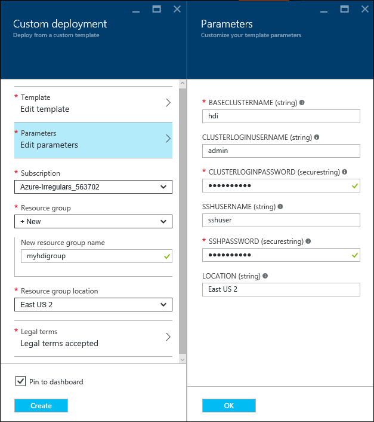

<properties
    pageTitle="使用 Apache Storm 和 HBase 分析传感器数据 | Azure"
    description="了解如何使用虚拟网络连接到 Apache Storm。 了解如何使用 Storm 和 HBase 处理来自 Azure 事件中心的传感器数据，然后使用 D3.js 来可视化这些数据。"
    services="hdinsight"
    documentationcenter=""
    author="Blackmist"
    manager="jhubbard"
    editor="cgronlun"
    translationtype="Human Translation" />
<tags
    ms.assetid="a9a1ac8e-5708-4833-b965-e453815e671f"
    ms.service="hdinsight"
    ms.custom="hdinsightactive"
    ms.devlang="java"
    ms.topic="article"
    ms.tgt_pltfrm="na"
    ms.workload="big-data"
    ms.date="03/21/2017"
    wacn.date="05/08/2017"
    ms.author="larryfr"
    ms.sourcegitcommit="2c4ee90387d280f15b2f2ed656f7d4862ad80901"
    ms.openlocfilehash="bdba5c33d4ca5596e33c09112a1a0b1200e87bb5"
    ms.lasthandoff="04/28/2017" />

# 使用 Apache Storm、事件中心和 HDInsight 中的 HBase (Hadoop) 分析传感器数据

了解如何在 HDInsight 上使用 Apache Storm 处理来自 Azure 事件中心的传感器数据。 然后，数据将存储到 HDInsight 上的 Apache HBase 中并使用 D3.js 进行可视化。

本文档中所使用的 Azure Resource Manager 模板演示如何在资源组中创建多个 Azure 资源。 该模板创建一个 Azure 虚拟网络、两个 HDInsight 群集（Storm 和 HBase）和一个 Azure Web 应用。 将实时 Web 仪表板的 node.js 实现自动部署到 Web 应用。

[AZURE.INCLUDE [hdinsight-linux-acn-version.md](../../includes/hdinsight-linux-acn-version.md)]

> [AZURE.NOTE]
> 此文档中的信息和此文档中的示例需要 HDInsight 3.5 版。
>
> Linux 是在 HDInsight 3.4 版或更高版本上使用的唯一操作系统。 有关详细信息，请参阅 [HDInsight 在 Windows 上即将弃用](/documentation/articles/hdinsight-component-versioning/#hdi-version-33-nearing-deprecation-date)。

## 先决条件

* Azure 订阅。 请参阅[获取 Azure 试用版](/pricing/1rmb-trial/)。

    > [AZURE.IMPORTANT]
    > 你不需要现有的 HDInsight 群集。 本文档中的步骤创建以下资源：
    >
 * Azure 虚拟网络
    >
 * 一个 Storm on HDInsight 群集（基于 Linux，2 个工作节点）
    >
 * 一个 HBase on HDInsight 群集（基于 Linux，2 个工作节点）
    >
 * 承载 Web 仪表板的 Azure Web 应用

* [Node.js](http://nodejs.org/)：用于从本地预览开发环境上的 Web 仪表板。
* [Java 和 JDK 1.7](http://www.oracle.com/technetwork/java/javase/downloads/index.html)：用于开发 Storm 拓扑。
* [Maven](http://maven.apache.org/what-is-maven.html)：用于生成和编译项目。
* [Git](http://git-scm.com/)：用于从 GitHub 下载项目。
* **SSH** 客户端：用于连接到基于 Linux 的 HDInsight 群集。 有关详细信息，请参阅[对 HDInsight 使用 SSH](/documentation/articles/hdinsight-hadoop-linux-use-ssh-unix/)。

    > [AZURE.NOTE]
    > 另外，用户还必须有权限访问 `scp` 命令，该命令用于在本地开发环境与使用 SSH 的 HDInsight 群集之间复制文件。

## 体系结构

本示例包括以下组成部分：

* **Azure 事件中心**：包含从传感器收集的数据。
* **Storm on HDInsight**：用于实时处理来自事件中心的数据。
* **HBase on HDInsight**：Storm 处理后，为数据提供永久性的 NoSQL 数据存储区。
* **Azure 虚拟网络服务**：在 Storm on HDInsight 和 HBase on HDInsight 群集之间启用安全通信。

    > [AZURE.NOTE]
    > 使用 Java HBase 客户端 API 时，虚拟网络是必需的。 它不通过 HBase 群集的公用网关进行公开。 通过将 HBase 和 Storm 群集安装到同一个虚拟网络，Storm 群集（或虚拟网络上的任何其他系统）便能够直接访问使用客户端 API 的 HBase。

* **仪表板网站**：实时绘制数据图表的示例仪表板。

    * 该网站在 Node.js 中实现，因此它可以在用于测试的任何客户端操作系统上运行，或者可以部署到 Azure 网站。
    * [Socket.io](http://socket.io/) 用于 Storm 拓扑和网站之间的实时通信。

        > [AZURE.NOTE]
        > 使用 Socket.io 进行通信是一个实现细节。 你可以使用任何通信框架，例如原始 WebSockets 或 SignalR。

    * [D3.js](http://d3js.org/) 用于绘制发送到网站的数据的图表。

> [AZURE.IMPORTANT]
> 需要两个群集，因为没有方法支持为 Storm 和 HBase 创建同一个 HDInsight 群集。

拓扑使用 [org.apache.storm.eventhubs.spout.EventHubSpout](http://storm.apache.org/releases/0.10.1/javadocs/org/apache/storm/eventhubs/spout/class-use/EventHubSpout.html) 类从事件中心读取数据，并使用 [org.apache.storm.hbase.bolt.HBaseBolt](http://storm.apache.org/releases/0.10.1/javadocs/org/apache/storm/hbase/bolt/HBaseBolt.html) 类将数据写入到 HBase。 与网站的通信可通过使用 [socket.io-client.java](https://github.com/nkzawa/socket.io-client.java) 来实现。

下图说明拓扑的布局：

> [AZURE.NOTE]
> 这是一个简化的拓扑视图。 在运行时，每个组件的实例为每个分区创建事件中心所读取。 这些实例分布在群集中，节点和数据在它们之间路由，如下所示：
>
 * 从 spout 到分析器的数据已经过负载均衡。
>
 * 从分析器到仪表板和 HBase 的数据按设备 ID 进行分组，因此，来自同一设备的消息始终流向同一组件。

### 拓扑组件

* **EventHub Spout**：此 Spout 作为 Apache Storm 0.10.0 及更高版本的一部分提供。

    > [AZURE.NOTE]
    > 此示例中使用的事件中心 Spout 需要 Storm on HDInsight 群集版本 3.3 或 3.4。 有关如何通过旧版 Storm on HDInsight 使用事件中心的信息，请参阅[使用 Storm on HDInsight 处理 Azure 事件中心的事件](/documentation/articles/hdinsight-storm-develop-java-event-hub-topology/)。

* **ParserBolt.java**：spout 发出的数据是原始的 JSON，有时每次会发出多个事件。 此 bolt 演示如何读取 spout 发出的数据，并将它作为包含多个字段的元组形式发送到新流。
* **DashboardBolt.java**：此组件演示如何使用 Java 的 Socket.io 客户端库将数据实时发送到 Web 仪表板。
* **Temperature.java**：此组件定义拓扑，并从 **Config.properties** 文件加载配置数据。

## 准备环境

在使用本示例之前，必须创建由 Storm 拓扑读取的 Azure 事件中心。

### 配置事件中心

事件中心是此示例的数据源。 按照下列步骤创建一个事件中心。

1. 从 [Azure 门户预览](https://portal.azure.cn)选择“+ 新建” -> “物联网” -> “事件中心”。
2. 在“创建命名空间”边栏选项卡上，执行以下任务： 

    1. 输入命名空间的**名称**。
    2. 选择定价层。 “基本”对于本示例来说已足够。
    3. 选择要使用的 Azure **订阅**。
    4. 选择现有的 Azure 资源组或创建新的资源组。
    5. 选择事件中心的“位置”。
    6. 选择“固定到仪表板”，然后单击“创建”。

3. 完成创建后，将显示命名空间的“事件中心”边栏选项卡。 从此处选择“+ 添加事件中心”。 在“创建事件中心”边栏选项卡上输入 **sensordata** 的名称，然后选择“创建”。 将其他字段保留默认值。
4. 从命名空间的“事件中心”边栏选项卡，选择“事件中心”。 选择“sensordata”条目。
5. 从 sensordata 事件中心的边栏选项卡，选择“共享访问策略”。 使用“+ 添加”链接添加以下策略：

    | 策略名称 | 声明 |
    | ----- | ----- |
    | devices | 发送 |
    | storm | 侦听 |

1. 选择这两种策略，然后记下“主密钥”值。 在以后的步骤中需要用到这两种策略的值。

## 下载并配置项目

使用以下命令从 GitHub 中下载项目。

    git clone https://github.com/Blackmist/hdinsight-eventhub-example

在命令完成后，你将得到以下目录结构：

    hdinsight-eventhub-example/
        TemperatureMonitor/ - this contains the topology
            resources/
                log4j2.xml - set logging to minimal.
                hbase-site.xml - connection information for the HBase cluster.
                Config.properties - configuration information for the topology. How to read from Event Hub and the URI to the dashboard.
            src/ - the Java bolts and topology definition.
        dashboard/nodejs/ - this is the node.js web dashboard.
        SendEvents/ - utilities to send fake sensor data.

> [AZURE.NOTE]
> 本文档没有深入介绍此示例中包含的代码。 但是，已对代码进行全面注释。

打开 **hdinsight-eventhub-example/TemperatureMonitor/resources/Config.properties** 文件并将事件中心信息添加到以下行：

    eventhubspout.username = <shared access policy name that can read from Event Hub>
    eventhubspout.password = <shared access policy key>
    eventhubspout.namespace = <namespace of your Event Hub
    eventhubspout.entitypath = <name of your event hub>
    eventhubspout.partitions.count = 2

在添加此信息后，请保存该文件。

## 编译并在本地测试

测试之前，必须启动仪表板以查看拓扑的输出，并生成要在事件中心中存储的数据。

> [AZURE.IMPORTANT]
> 执行本地测试时，此拓扑的 HBase 组件未处于活动状态。 这是因为从 Azure 虚拟网络（包含群集）外部无法访问 HBase 群集的 Java API。

### 启动 Web 应用程序

1. 打开一个新的命令提示符或终端，并将目录更改到 **hdinsight-eventhub-example/dashboard**。 使用以下命令安装 Web 应用程序所需的依赖项：

        npm install

2. 使用以下命令启动 Web 应用程序：

        node server.js

    将看到类似于以下文本的消息：

        Server listening at port 3000

3. 打开 Web 浏览器，并输入 **http://localhost:3000/**作为地址。 应看到类似于下图的页面：

    

    将此命令提示符或终端保持打开状态。 测试完成后，使用 Ctrl-C 停止 Web 服务器。

### 开始生成数据

> [AZURE.NOTE]
> 此部分中的步骤使用 Node.js，以便它们可以在任何平台上使用。 对于其他语言示例，请参阅 **SendEvents** 目录。

1. 打开新的提示符、shell 或终端，并将目录更改为 **hdinsight-eventhub-example/SendEvents/nodejs**。 若要安装应用程序所需的依赖项，请使用以下命令：

        npm install

2. 在文本编辑器中打开 **app.js** 文件，并添加之前获取的事件中心信息：

        // ServiceBus Namespace
        var namespace = 'YourNamespace';
        // Event Hub Name
        var hubname ='sensordata';
        // Shared access Policy name and key (from Event Hub configuration)
        var my_key_name = 'devices';
        var my_key = 'YourKey';

    > [AZURE.NOTE]
    > 此示例假设已使用 **sensordata** 作为事件中心的名称，并假设具有 **Send** 声明的策略的名称为 **devices**。

3. 使用以下命令在事件中心插入新条目：

        node app.js

    可看到包含发送到事件中心的数据的多个输出行：

        {"TimeStamp":"2015-02-10T14:43.05.00320Z","DeviceId":"0","Temperature":7}
        {"TimeStamp":"2015-02-10T14:43.05.00320Z","DeviceId":"1","Temperature":39}
        {"TimeStamp":"2015-02-10T14:43.05.00320Z","DeviceId":"2","Temperature":86}
        {"TimeStamp":"2015-02-10T14:43.05.00320Z","DeviceId":"3","Temperature":29}
        {"TimeStamp":"2015-02-10T14:43.05.00320Z","DeviceId":"4","Temperature":30}
        {"TimeStamp":"2015-02-10T14:43.05.00320Z","DeviceId":"5","Temperature":5}
        {"TimeStamp":"2015-02-10T14:43.05.00320Z","DeviceId":"6","Temperature":24}
        {"TimeStamp":"2015-02-10T14:43.05.00320Z","DeviceId":"7","Temperature":40}
        {"TimeStamp":"2015-02-10T14:43.05.00320Z","DeviceId":"8","Temperature":43}
        {"TimeStamp":"2015-02-10T14:43.05.00320Z","DeviceId":"9","Temperature":84}

### 启动拓扑

1. 打开新的命令提示符、外壳程序或终端，将目录切换为 **hdinsight-eventhub-example/TemperatureMonitor**，然后使用以下命令启动拓扑：

        mvn compile exec:java

    此命令在本地模式下启动拓扑。 **Config.properties** 文件包含的值为事件中心和本地仪表板网站提供连接信息。 启动后，拓扑从事件中心读取条目，并将其发送到在本地计算机上运行的仪表板。 你应看到各行显示在 Web 仪表板中，如下图所示：

    

2. 当仪表板正在运行时，使用前面步骤中的 `node app.js` 命令将新数据发送到事件中心。 由于温度值是随机生成的，因此图表会更新以显示温度的大幅变化。

    > [AZURE.NOTE]
    > 使用 `node app.js` 命令时必须位于 **hdinsight-eventhub-example/SendEvents/Nodejs** 目录中。

3. 验证仪表板是否更新后，使用 Ctrl+C 停止拓扑。 也可以使用 Ctrl+C 停止本地 Web 服务器。

## 创建 Storm 和 HBase 群集

本节中的步骤使用 [Azure Resource Manager 模板](/documentation/articles/resource-group-template-deploy/)创建 Azure 虚拟网络以及虚拟网络上的 Storm 和 HBase 群集。 该模板还创建 Azure Web 应用并将仪表板的副本部署到其中。

> [AZURE.NOTE]
> 使用虚拟网络，以便在 Storm 群集上运行的拓扑可以直接与使用 HBase Java API 的 HBase 群集进行通信。

本文档使用的 Resource Manager 模板位于 **https://hditutorialdata.blob.core.windows.net/armtemplates/create-linux-based-hbase-storm-cluster-in-vnet.json**.的公共 blob 容器上。

1. 单击以下按钮登录到 Azure，然后在 Azure 门户预览中打开 Resource Manager 模板。

    

    >[AZURE.NOTE]
    > 必须修改从 GitHub 存储库“azure-quickstart-templates”下载的模板，以适应 Azure 中国云环境。 例如，将一些终结点 -“blob.core.windows.net”替换为“blob.core.chinacloudapi.cn”，将“cloudapp.azure.com”替换为“chinacloudapp.cn”；将允许的位置更改为“China North”和“China East”；将 HDInsight Linux 版本更改为 Azure 中国区支持的版本 3.5。

2. 在“自定义部署”  边栏选项卡中，输入以下信息：

    

    * **基群集名称**：此值用作 Storm 和 HBase 群集的基名称。 例如，输入 **abc** 创建名为 **storm-abc** 的 Storm 群集和名为 **hbase-abc** 的 HBase 群集。
    * **群集登录用户名**：Storm 和 HBase 群集的管理员用户名。
    * **群集登录密码**：Storm 和 HBase 群集的管理员用户密码。
    * **SSH 用户名**：要为 Storm 和 HBase 群集创建的 SSH 用户。
    * **SSH 密码**：Storm 和 HBase 群集的 SSH 用户的密码。
    * **位置**：要在其中创建群集的区域。

    单击“确定”保存参数。

3. 使用“基本”部分创建资源组或选择现有资源组。
4. 在“资源组位置”下拉菜单中，选择与在“设置”部分为 **LOCATION** 参数所选的位置相同的位置。
5. 阅读条款和条件，然后选择“我同意上述条款和条件”。
6. 最后，选中“固定到仪表板”，然后选择“购买”。 创建群集大约需要 20 分钟时间。

创建资源后，系统会将用户重定向到包含群集和 Web 仪表板的资源组的边栏选项卡。

> [AZURE.IMPORTANT]
> 请注意，HDInsight 群集的名称为 **storm BASENAME** 和 **hbase BASENAME**，其中 BASENAME 是为模板提供的名称。 在连接到群集的后续步骤中，会用到这些名称。 此外请注意，仪表板站点的名称是 **basename-dashboard**。 稍后会在本文档中使用此值。

## 配置仪表板 bolt

若要将数据发送到部署为 Web 应用的仪表板，必须在 **Config.properties** 文件中修改以下行：

    dashboard.uri: http://localhost:3000

将 `http://localhost:3000` 更改为 `http://BASENAME-dashboard.chinacloudsites.cn` 并保存该文件。 用上一步中提供的基名称替换 **BASENAME**。 还可以通过以前创建的资源组选择仪表板并查看 URL。

## 创建 HBase 表

若要将数据存储在 HBase 中，必须先创建一个表。 请预先创建供 Storm 将内容写入到其中的资源，因为如果尝试从 Storm 拓扑内部创建资源，可能会导致多个实例尝试创建同一资源。 请在拓扑外部创建资源，并使用 Storm 进行读取/写入和分析。

1. 使用你在创建群集期间提供给模板的 SSH 用户和密码，通过 SSH 连接到 HBase 群集。 例如，如果使用 `ssh` 命令连接，请使用以下语法：

        ssh USERNAME@hbase-BASENAME-ssh.azurehdinsight.cn

    在下列命令中，用创建群集时提供的 SSH 用户名替换 **USERNAME**，用提供的基名称替换 **BASENAME**。 出现提示时，请输入 SSH 用户名密码。

2. 从 SSH 会话中启动 HBase Shell。

        hbase shell

    在 Shell 加载后，将会显示 `hbase(main):001:0>` 提示符。

3. 从 HBase Shell 中，输入以下命令以创建存储传感器数据的表。

        create 'SensorData', 'cf'

4. 使用以下命令验证是否已创建该表：

        scan 'SensorData'

    此时会返回类似于以下示例的信息，指示表中有 0 行。

        ROW                   COLUMN+CELL                                       0 row(s) in 0.1900 seconds

5. 输入 `exit` 以退出 HBase Shel：

## 配置 HBase Bolt

若要将内容从 Storm 群集写入 HBase，必须为 HBase Bolt 提供 HBase 群集的配置详细信息。 此示例使用来自 HBase 群集的 **hbase-site.xml** 文件。

### 下载 hbase-site.xml

从命令提示符处，使用 SCP 从群集下载 **hbase-site.xml** 文件。 在下面的示例中，用创建群集时提供的 SSH 用户替换 **USERNAME**，用之前提供的基名称替换 **BASENAME**。 出现提示时，请输入 SSH 用户名密码。 将 `/path/to/TemperatureMonitor/resources/hbase-site.xml` 替换为此文件在 TemperatureMonitor 项目中的路径。

    scp USERNAME@hbase-BASENAME-ssh.azurehdinsight.cn:/etc/hbase/conf/hbase-site.xml /path/to/TemperatureMonitor/resources/hbase-site.xml

此命令下载 **hbase-site.xml** 到指定的路径。

### 启用 HBase bolt

若要启用 HBase Bolt 组件，请打开 **TemperatureMonitor/src/main/java/com/microsoft/examples/Temperature.java** 文件，并取消评论以下行：

    // topologyBuilder.setBolt("HBase", new HBaseBolt("SensorData", mapper).withConfigKey("hbase.conf"), spoutConfig.getPartitionCount())
    //  .fieldsGrouping("Parser", "hbasestream", new Fields("deviceid")).setNumTasks(spoutConfig.getPartitionCount());

取消评论这些行后，保存该文件。

## 生成解决方案，并将其打包和部署到 HDInsight

在开发环境中，按以下步骤将 Storm 拓扑部署到 Storm 群集。

1. 从 **TemperatureMonitor** 目录中，使用以下命令来执行新的生成并从项目创建 JAR 包：

        mvn clean compile package

    此命令在项目的 **target** 目录中创建一个名为 **TemperatureMonitor-1.0-SNAPSHOT.jar** 的文件。

2. 使用 scp 将 **TemperatureMonitor-1.0-SNAPSHOT.jar** 文件上传到 Storm 群集。 在下面的示例中，用创建群集时提供的 SSH 用户替换 **USERNAME**，用之前提供的基名称替换 **BASENAME**。 出现提示时，请输入 SSH 用户名密码。

        scp target/TemperatureMonitor-1.0-SNAPSHOT.jar USERNAME@storm-BASENAME-ssh.azurehdinsight.cn:TemperatureMonitor-1.0-SNAPSHOT.jar

    > [AZURE.NOTE]
    > 上传文件可能需要数分钟的时间。

3. 文件上传完后，使用 SSH 连接到群集。

        ssh USERNAME@storm-BASENAME-ssh.azurehdinsight.cn

4. 若要启动拓扑，请在 SSH 会话中使用以下命令：

        storm jar TemperatureMonitor-1.0-SNAPSHOT.jar com.microsoft.examples.Temperature temperature

5. 启动拓扑后，打开浏览器到 Azure 发布的网站，然后使用 `node app.js` 命令将数据发送到事件中心。 你应该看到 Web 仪表板更新以显示信息。

    

## 查看 HBase 数据

使用以下步骤连接到 HBase 并验证该数据是否已写入到表中：

1. 使用 SSH 连接到 HBase 群集。

        ssh USERNAME@hbase-BASENAME-ssh.azurehdinsight.cn

2. 从 SSH 会话中启动 HBase Shell。

        hbase shell

    在 Shell 加载后，将会显示 `hbase(main):001:0>` 提示符。

3. 查看表中的行：

        scan 'SensorData'

    此命令会返回类似于以下文本的信息，指示表中有数据。

        hbase(main):002:0> scan 'SensorData'
        ROW                             COLUMN+CELL
        \x00\x00\x00\x00               column=cf:temperature, timestamp=1467290788277, value=\x00\x00\x00\x04
        \x00\x00\x00\x00               column=cf:timestamp, timestamp=1467290788277, value=2015-02-10T14:43.05.00320Z
        \x00\x00\x00\x01               column=cf:temperature, timestamp=1467290788348, value=\x00\x00\x00M
        \x00\x00\x00\x01               column=cf:timestamp, timestamp=1467290788348, value=2015-02-10T14:43.05.00320Z
        \x00\x00\x00\x02               column=cf:temperature, timestamp=1467290788268, value=\x00\x00\x00R
        \x00\x00\x00\x02               column=cf:timestamp, timestamp=1467290788268, value=2015-02-10T14:43.05.00320Z
        \x00\x00\x00\x03               column=cf:temperature, timestamp=1467290788269, value=\x00\x00\x00#
        \x00\x00\x00\x03               column=cf:timestamp, timestamp=1467290788269, value=2015-02-10T14:43.05.00320Z
        \x00\x00\x00\x04               column=cf:temperature, timestamp=1467290788356, value=\x00\x00\x00>
        \x00\x00\x00\x04               column=cf:timestamp, timestamp=1467290788356, value=2015-02-10T14:43.05.00320Z
        \x00\x00\x00\x05               column=cf:temperature, timestamp=1467290788326, value=\x00\x00\x00\x0D
        \x00\x00\x00\x05               column=cf:timestamp, timestamp=1467290788326, value=2015-02-10T14:43.05.00320Z
        \x00\x00\x00\x06               column=cf:temperature, timestamp=1467290788253, value=\x00\x00\x009
        \x00\x00\x00\x06               column=cf:timestamp, timestamp=1467290788253, value=2015-02-10T14:43.05.00320Z
        \x00\x00\x00\x07               column=cf:temperature, timestamp=1467290788229, value=\x00\x00\x00\x12
        \x00\x00\x00\x07               column=cf:timestamp, timestamp=1467290788229, value=2015-02-10T14:43.05.00320Z
        \x00\x00\x00\x08               column=cf:temperature, timestamp=1467290788336, value=\x00\x00\x00\x16
        \x00\x00\x00\x08               column=cf:timestamp, timestamp=1467290788336, value=2015-02-10T14:43.05.00320Z
        \x00\x00\x00\x09               column=cf:temperature, timestamp=1467290788246, value=\x00\x00\x001
        \x00\x00\x00\x09               column=cf:timestamp, timestamp=1467290788246, value=2015-02-10T14:43.05.00320Z
        10 row(s) in 0.1800 seconds

    > [AZURE.NOTE]
    > 此扫描操作最多返回表中的 10 行。

## 删除群集
[AZURE.INCLUDE [delete-cluster-warning](../../includes/hdinsight-delete-cluster-warning.md)]

若要同时删除群集、存储和 Web 应用，请删除包含它们的资源组。

## 后续步骤

如需更多 HDInsight 的 Storm 拓扑示例，请参阅 [Storm on HDInsight 的示例拓扑](/documentation/articles/hdinsight-storm-example-topology/)。

有关 Apache Storm 的详细信息，请参阅 [Apache Storm](https://storm.incubator.apache.org/) 站点。

有关 HBase on HDInsight 的详细信息，请参阅 [HDInsight 上的 HBase 概述](/documentation/articles/hdinsight-hbase-overview/)。

有关 Socket.io 的详细信息，请参阅 [socket.io](http://socket.io/) 站点。

有关 D3.js 的详细信息，请参阅 [D3.js - 数据驱动的文档](http://d3js.org/)。

有关以 Java 创建拓扑的信息，请参阅[为 Apache Storm on HDInsight 开发 Java 拓扑](/documentation/articles/hdinsight-storm-develop-java-topology/)。

有关以 .NET 创建拓扑的信息，请参阅[使用 Visual Studio 为 Apache Storm on HDInsight 开发 C# 拓扑](/documentation/articles/hdinsight-storm-develop-csharp-visual-studio-topology/)。

[azure-portal]: https://portal.azure.cn

<!--Update_Description: wording update-->