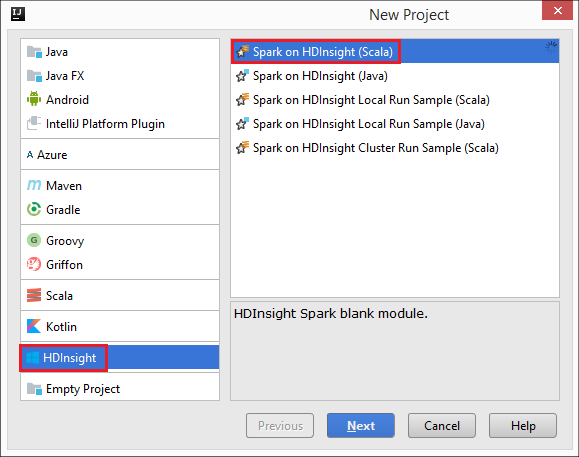
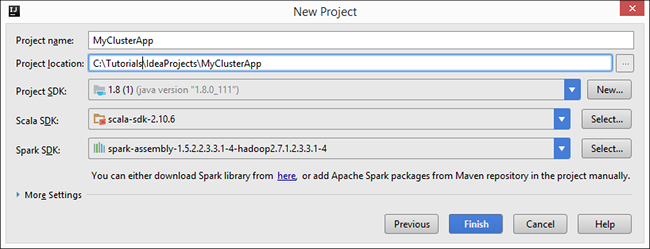
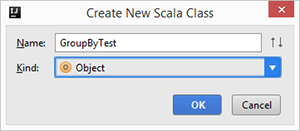
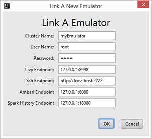

<!-- not suitable for Mooncake -->

<properties
    pageTitle="了解如何将用于 IntelliJ 的 Azure 工具包中的 HDInsight 工具与 Hortonworks 沙盒配合使用 | Azure"
    description="了解如何将用于 IntelliJ 的 Azure 工具包中的 HDInsight 工具与 Hortonworks 沙盒配合使用。"
    keywords="hadoop 工具,hive 查询,intellij,hortonworks 沙盒,用于 intellij 的 azure 工具包"
    services="HDInsight"
    documentationcenter=""
    tags="azure-portal"
    author="mumian"
    manager="jhubbard"
    editor="cgronlun" />
<tags 
    ms.service="hdinsight"
    ms.devlang="na"
    ms.topic=""
    ms.tgt_pltfrm="na"
    ms.workload="big-data"
    ms.date="01/07/2017"
    wacn.date="01/25/2017"
    ms.author="jgao" />

# 将用于 IntelliJ 的 HDInsight 工具与 Hortonworks 沙盒配合使用

了解如何通过用于 IntelliJ 的 HDInsight 工具开发 Apache Scala 应用程序，并在运行在工作站上的 [Hortonworks 沙盒](http://hortonworks.com/products/sandbox/)上测试应用程序。[IntelliJ IDEA](https://www.jetbrains.com/idea/) 是一种 Java 集成开发环境 (IDE)，适用于开发计算机软件。在 Hortonworks 沙盒上开发并测试应用程序以后，即可将应用程序移至 [Azure HDInsight](/documentation/articles/hdinsight-hadoop-introduction/)。

## 先决条件

在开始阅读本教程前，必须具备以下条件：

- 基于 Hortonworks 沙盒的 HDP 2.4，运行在本地环境中。若要进行配置，请参阅[在虚拟机上使用 Hadoop 沙盒，开始了解 Hadoop 生态系统](/documentation/articles/hdinsight-hadoop-emulator-get-started/)。请注意，用于 IntelliJ 的 HDInsight 工具只使用 HDP 2.4 测试过。在 [Hortonworks 沙盒下载站点](http://hortonworks.com/downloads/#sandbox)中，展开 **Hortonworks 沙盒存档**即可获取它。
- [Java 开发人员工具包 (JDK) 1.8 或更高版本](http://www.oracle.com/technetwork/java/javase/downloads/jdk8-downloads-2133151.html)。JDK 是用于 IntelliJ 的 Azure 工具包所必需的。
- [IntelliJ IDEA 社区版](https://www.jetbrains.com/idea/download)，带 [Scala](https://plugins.jetbrains.com/idea/plugin/1347-scala) 插件和[用于 IntelliJ 的 Azure 工具包](/documentation/articles/azure-toolkit-for-intellij/)插件。用于 IntelliJ 的 Azure 工具包随附了用于 IntelliJ 的 HDInsight 工具。

  **安装这些插件的步骤：**

  1. 打开 IntelliJ IDEA。
  2. 在“欢迎”屏幕上单击“配置”，然后单击“插件”。
  3. 单击左下角的“安装 JetBrains 插件”。
  4. 使用搜索功能搜索“Scala”，然后单击“安装”。
  5. 单击“重新启动 IntelliJ IDEA”完成安装。
  6. 重复步骤 4 和步骤 5，安装**用于 IntelliJ 的 Azure 工具包**。有关详细信息，请参阅[安装用于 IntelliJ 的 Azure 工具包](/documentation/articles/azure-toolkit-for-intellij-installation/)。

## 创建 Spark Scala 应用程序

本部分使用 IntelliJ IDEA 创建示例 Scala 项目。在下一部分，用户在提交项目之前，需将 IntelliJ IDEA 链接到 Hortonworks 沙盒（仿真程序）。

1. 从工作站打开 IntelliJ IDEA。
2. 单击“创建新项目”。
3. 在左窗格中单击“HDInsight”，在右窗格中单击“Spark on HDInsight(Scala)”，然后单击“下一步”。

      

4. 输入以下信息：

      

    - **项目名称**：提供项目名称。
    - **项目位置**：提供项目位置。
    - **项目 SDK**：单击“新建”，单击“JDK”，然后指定 Java JDK 7 或更高版本的文件夹。默认位置为 C:\\Program Files\\Java\\jdk1.8.x\_xxx。
    - **Scala SDK**：单击“选择”，选择版本 **2.10.6**，然后单击“确定”。如果版本未列出，请单击“下载”，选择“Scala 版本”，然后单击“确定”。请确保不使用版本 2.11.x。本文使用版本 2.10.6。
    - **Spark SDK**：下载该 [SDK](http://go.microsoft.com/fwlink/?LinkID=723585&clcid=0x409)。也可以忽略过此字段并改用“Spark Maven 存储库”，不过请确保已安装正确的 Maven 存储库，以便能够开发 Spark 应用程序。（例如，如果你使用 Spark Streaming，则需要确保已安装 Spark Streaming 部件；另请确保使用标记为 Scala 2.10 的存储库 - 不要使用标记为 Scala 2.11 的存储库。）
5. 单击“完成”。
6. 按 **[ALT]+1** 打开“项目”视图”（如果尚未打开）。
7. 在“项目资源管理器”中展开项目，然后单击“src”。
8. 右键单击“src”，指向“新建”，然后单击“Scala 类”。
9. 输入一个名称，在“类型”中选择“对象”，然后单击“确定”。

      

10. 在 .scala 文件中粘贴以下代码：

        import java.util.Random
        import org.apache.spark.{SparkConf, SparkContext}
        import org.apache.spark.SparkContext._

        /**
        * Usage: GroupByTest [numMappers] [numKVPairs] [valSize] [numReducers]
        */
        object GroupByTest {
            def main(args: Array[String]) {
                val sparkConf = new SparkConf().setAppName("GroupBy Test")
                var numMappers = 3
                var numKVPairs = 10
                var valSize = 10
                var numReducers = 2

                val sc = new SparkContext(sparkConf)

                val pairs1 = sc.parallelize(0 until numMappers, numMappers).flatMap { p =>
                val ranGen = new Random
                var arr1 = new Array[(Int, Array[Byte])](numKVPairs)
                for (i <- 0 until numKVPairs) {
                    val byteArr = new Array[Byte](/documentation/articles/valSize/)
                    ranGen.nextBytes(byteArr)
                    arr1(i) = (ranGen.nextInt(Int.MaxValue), byteArr)
                }
                arr1
                }.cache
                // Enforce that everything has been calculated and in cache
                pairs1.count

                println(pairs1.groupByKey(numReducers).count)
            }
        }

11. 在“生成”菜单中，单击“生成项目”。请确保已成功完成编译。

## HortonWorks 沙盒链接

必须先有 IntelliJ 应用程序，然后才能链接到 Hortonworks 沙盒（仿真程序）。

**链接到仿真程序**

1. 在 IntelliJ 中打开项目（如果尚未打开）。
2. 在“视图”菜单中，单击“工具窗口”，然后单击“Azure 资源管理器”。
3. 展开“Azure”，右键单击“HDInsight”，然后单击“链接仿真程序”。
4. 输入为 Hortonworks 沙盒的根帐户配置的密码，以及其余值（类似于以下屏幕截图），然后单击“确定”。

    

5. 单击“是”配置仿真程序。

  连接成功以后，即可看到仿真程序（Hortonworks 沙盒）列在 HDInsight 节点下。

## 将 Spark Scala 应用程序提交到沙盒

将 IntelliJ IDEA 链接到仿真程序以后，即可提交项目。

**将项目提交到仿真程序**

1. 在“项目资源管理器”中，右键单击项目，然后单击“将 Spark 应用程序提交到 HDInsight”。
2. 指定以下字段：

    - **Spark 群集(仅 Linux)**：选择本地 Hortonworks 沙盒。
    - **主类名称**：选择或输入主类名称。对于本教程，该名称为 **GroupByTest**。
3. 单击“提交”。作业提交日志显示在“Spark”提交工具窗口。

##后续步骤：

- 若要了解如何通过用于 IntelliJ 的 HDInsight 工具为 HDInsight 创建 Spark 应用程序，请参阅[通过用于 IntelliJ 的 Azure 工具包中的 HDInsight 工具为 HDInsight Spark Linux 群集创建 Spark 应用程序](/documentation/articles/hdinsight-apache-spark-intellij-tool-plugin/)。
- 若要观看用于 IntelliJ 的 HDInsight 工具的视频，请参阅 [Introduce HDInsight Tools for IntelliJ for Spark Development](https://mix.office.com/watch/1nqkqjt5xonza)（介绍如何通过用于 IntelliJ 的 HDInsight 工具进行 Spark 开发）。
- 若要了解如何以远程方式通过 HDInsight 上的工具包调试 Spark 应用程序，请参阅[通过用于 IntelliJ 的 Azure 工具包中的 HDInsight 工具对 HDInsight Spark Linux 群集上的 Spark 应用程序进行远程调试](/documentation/articles/hdinsight-apache-spark-intellij-tool-plugin-debug-jobs-remotely/)。
- 若要了解如何通过用于 Eclipse 的 HDInsight 工具创建 Spark 应用程序，请参阅[通过用于 Eclipse 的 Azure 工具包中的 HDInsight 工具创建 Spark 应用程序](/documentation/articles/hdinsight-apache-spark-eclipse-tool-plugin/)。
- 若要观看用于 Eclipse 的 HDInsight 工具的视频，请参阅[通过用于 Eclipse 的 HDInsight 工具创建 Spark 应用程序](https://mix.office.com/watch/1rau2mopb6fha)。

<!---HONumber=Mooncake_0120_2017-->