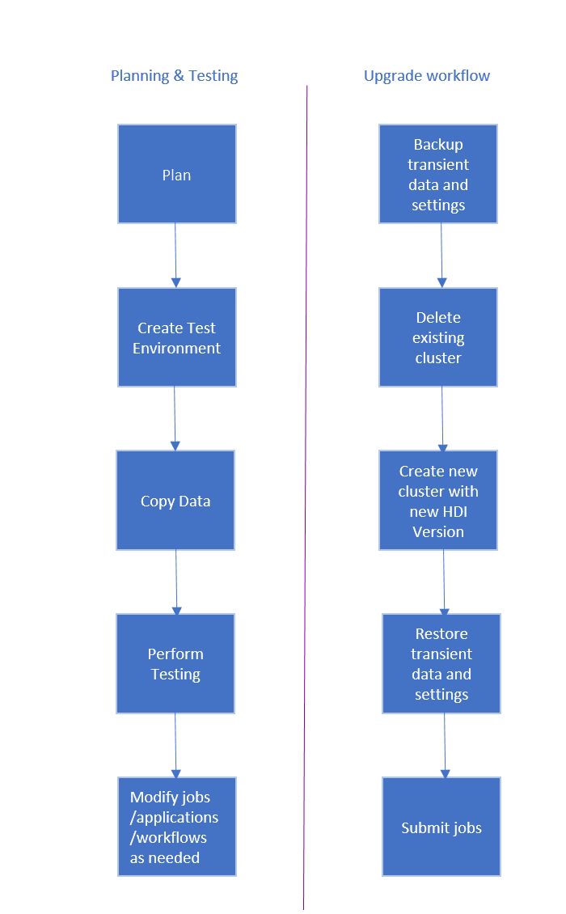

<properties
    pageTitle="从基于 Windows 的 HDInsight 迁移到基于 Linux 的 HDInsight -Azure | Azure"
    description="了解如何从基于 Windows 的 HDInsight 群集迁移到基于 Linux 的 HDInsight 群集。"
    services="hdinsight"
    documentationcenter=""
    author="bhanupr"
    editor="bhanupr" />
<tags
    ms.assetid=""
    ms.service="hdinsight"
    ms.devlang="na"
    ms.topic="article"
    ms.tgt_pltfrm="na"
    ms.workload="big-data"
    ms.date="01/11/2017"
    wacn.date="03/10/2017"
    ms.author="bhanupr" />  

# 将 HDInsight 群集升级到更新版本
若要利用最新的 HDInsight 功能，我们建议将 HDInsight 群集升级到最新版本。按照以下准则升级 HDInsight 群集版本。

> [AZURE.NOTE]
HDInsight 群集版本 3.2 和 3.3 接近弃用日期。有关支持的 HDInsight 版本的信息，请参阅 [HDInsight 组件版本](/documentation/articles/hdinsight-component-versioning/#supported-hdinsight-versions)。
>
>

## 升级任务
升级 HDInsight 群集的工作流如下所示。

  

1. 请阅读本文档的每个部分，以了解升级 Linux 群集时可能需要进行的更改。
2. 创建群集作为测试/质量保证环境。有关创建群集的详细信息，请参阅 [Learn how to create Linux-based HDInsight clusters](/documentation/articles/hdinsight-hadoop-provision-linux-clusters/)（了解如何创建基于 Linux 的 HDInsight 群集）
3. 将现有作业、数据源及接收器复制到新环境。有关详细信息，请参阅[将数据复制到测试环境](/documentation/articles/hdinsight-migrate-from-windows-to-linux/#copy-data-to-the-test-environment)。
4. 执行验证测试，以确保作业在新群集上按预期工作。

验证一切都按预期工作后，请为迁移安排停机时间。在此停机期间，请执行以下操作：

1.	备份所有存储在本地群集节点上的暂时性数据。例如，如果你的数据直接存储在头节点上。
2.	删除现有的群集。
3.	使用以前群集使用的同一默认数据存储在与最新（或支持）的 HDI 版本相同的 VNET 子网中创建群集。这样，新群集便可根据现有生产数据继续运行。
4.	导入任何已备份的暂时性数据。
5.	使用新群集启动作业/继续处理。

## 后续步骤
* [了解如何创建基于 Linux 的 HDInsight 群集](/documentation/articles/hdinsight-hadoop-provision-linux-clusters/)
* [从 Windows 客户端使用 SSH 连接到基于 Linux 的群集](/documentation/articles/hdinsight-hadoop-linux-use-ssh-windows/)
* [从 Linux、Unix，或 Mac 客户端使用 SSH 连接到基于 Linux 的群集](/documentation/articles/hdinsight-hadoop-linux-use-ssh-unix/)
* [使用 Ambari 管理基于 Linux 的群集](/documentation/articles/hdinsight-hadoop-manage-ambari/)

<!---HONumber=Mooncake_0306_2017-->