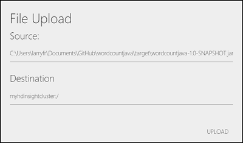

<properties
    pageTitle="在 HDInsight 中上传 Hadoop 作业的数据 | Azure"
    description="了解如何在 HDInsight 中使用 Azure CLI、Azure 存储资源管理器、Azure PowerShell、Hadoop 命令行或 Sqoop 上传和访问 Hadoop 作业的数据。"
    services="hdinsight,storage"
    documentationcenter=""
    tags="azure-portal"
    author="mumian"
    manager="jhubbard"
    editor="cgronlun" />
<tags
    ms.assetid="56b913ee-0f9a-4e9f-9eaf-c571f8603dd6"
    ms.service="hdinsight"
    ms.workload="big-data"
    ms.tgt_pltfrm="na"
    ms.devlang="na"
    ms.topic="article"
    ms.date="11/15/2016"
    wacn.date="01/25/2017"
    ms.author="jgao" />

# 在 HDInsight 中上传 Hadoop 作业的数据
Azure HDInsight 在 Azure Blob 存储之上提供了一个功能完备的 Hadoop 分布式文件系统 (HDFS)。该系统为一个 HDFS 扩展，可为客户提供无缝体验。在该系统的帮助下，Hadoop 生态系统中的整套组件能够直接操作其管理的数据。Azure Blob 存储和 HDFS 是独立的文件系统，并且已针对数据的存储和计算进行了优化。有关使用 Azure Blob 存储的益处，请参阅[将 Azure Blob 存储与 HDInsight 配合使用][hdinsight-storage]。

**先决条件**

在开始下一步之前，请注意以下要求：

* 一个 Azure HDInsight 群集。有关说明，请参阅 [Azure HDInsight 入门][hdinsight-get-started]或[预配 HDInsight 群集][hdinsight-provision]。

## 为什么使用 Blob 存储？
通常，为了执行 MapReduce 作业，会部署 Azure HDInsight 群集，但这些作业完成后，就会删除这些群集。完成计算后将数据保存在 HDFS 群集中是一种成本很高的数据存储方法。针对使用 HDInsight 处理的数据，选择使用 Azure Blob 存储具有高度可用、可高度缩放、大容量、低成本的优势。在 Blob 中存储数据，可以安全地释放用于计算的 HDInsight 群集而不丢失数据。

### 目录
Azure Blob 存储容器将数据存储为键值对，没有目录层次结构。不过，可在键名称中使用“/”字符，使其看起来像存储在目录结构中的文件。HDInsight 将这些键名称视为实际的目录。

例如，Blob 的键可以是 *input/log1.txt*。不存在实际的“input”目录，但键名称中包含“/”字符，所以看起来像一个文件路径。

因此，如果使用 Azure 资源管理器工具，可以看到一些 0 字节的文件。这些文件有两个作用：

* 在有空文件夹的情况下，它们充当文件夹存在的标记。Azure Blob 存储足够聪明，可以了解如果存在名为 foo/bar 的 blob，就存在一个名为 **foo** 的文件夹。但指明存在名为 **foo** 的空文件夹的唯一方法是放入这个特殊的 0 字节文件。
* 它们具有 Hadoop 文件系统所需的一些特别的元数据，最明显的是文件夹的权限和所有者。

## 命令行实用程序
Microsoft 提供了以下实用程序让你使用 Azure Blob 存储：

| 工具 | Linux | OS X | Windows |
| --- |:---:|:---:|:---:|
| [Azure 命令行界面][azurecli] |✔ |✔ |✔ |
| [Azure PowerShell][azure-powershell] | | |✔ |
| [AzCopy][azure-azcopy] | | |✔ |
| [Hadoop 命令](#commandline) |✔ |✔ |✔ |

> [AZURE.NOTE]
虽然可从 Azure 外部使用 Azure CLI、Azure PowerShell 和 AzCopy，但是 Hadoop 命令只能在 HDInsight 群集上使用，而且只能将数据从本地文件系统加载到 Azure Blob 存储。
>
>

### Azure CLI
Azure CLI 是一个跨平台工具，可用于管理 Azure 服务。使用以下步骤将数据上传到 Azure Blob 存储：

1. [安装和配置适用于 Mac、Linux 和 Windows 的 Azure CLI](/documentation/articles/xplat-cli-install/)。
2. 打开命令提示符、bash 或其他 shell，然后使用以下方法对 Azure 订阅进行身份验证。

        azure login -e AzureChinaCloud

    出现提示时，输入订阅的用户名和密码。
3. 输入以下命令，列出订阅的存储帐户：

        azure storage account list
4. 选择包含你要使用的 Blob 的存储帐户，然后使用以下命令检索此帐户的密钥：

        azure storage account keys list <storage-account-name>

    这应会返回**主**密钥和**辅助**密钥。复制**主**密钥值，因为后面的步骤要用到它。
5. 使用以下命令可检索存储帐户中的 Blob 容器列表：

        azure storage container list -a <storage-account-name> -k <primary-key>
6. 使用以下命令可将文件上传和下载到 Blob：

    * 上传文件：

            azure storage blob upload -a <storage-account-name> -k <primary-key> <source-file> <container-name> <blob-name>
    * 下载文件：

            azure storage blob download -a <storage-account-name> -k <primary-key> <container-name> <blob-name> <destination-file>

> [AZURE.NOTE]
如果始终使用同一个存储帐户，可以不用为每条命令指定帐户和密钥，而是设置以下环境变量：
>

 *AZURE\_STORAGE\_ACCOUNT**：存储帐户名称 

 * **AZURE\_STORAGE\_ACCESS\_KEY**：存储帐户密钥
>
>

### Azure PowerShell
Azure PowerShell 是一个脚本编写环境，可用于在 Azure 中控制和自动执行工作负荷的部署和管理。有关配置工作站以运行 Azure PowerShell 的信息，请参阅[安装和配置 Azure PowerShell](https://docs.microsoft.com/powershell/azureps-cmdlets-docs)。

[AZURE.INCLUDE [use-latest-version](../../includes/hdinsight-use-latest-powershell.md)]

**将本地文件上传到 Azure Blob 存储**

1. 根据[安装和配置 Azure PowerShell](https://docs.microsoft.com/powershell/azureps-cmdlets-docs) 中的说明打开 Azure PowerShell 控制台。
2. 设置以下脚本中前五个变量的值：

        $resourceGroupName = "<AzureResourceGroupName>"
        $storageAccountName = "<StorageAccountName>"
        $containerName = "<ContainerName>"

        $fileName ="<LocalFileName>"
        $blobName = "<BlobName>"

        # Get the storage account key
        $storageAccountKey = (Get-AzureRmStorageAccountKey -ResourceGroupName $resourceGroupName -Name $storageAccountName)[0].Value
        # Create the storage context object
        $destContext = New-AzureStorageContext -StorageAccountName $storageAccountName -StorageAccountKey $storageaccountkey

        # Copy the file from local workstation to the Blob container
        Set-AzureStorageBlobContent -File $fileName -Container $containerName -Blob $blobName -context $destContext
3. 将脚本粘贴到 Azure PowerShell 控制台，然后运行以复制文件。

有关创建用来使用 HDInsight 的 PowerShell 脚本示例，请参阅 [HDInsight 工具](https://github.com/blackmist/hdinsight-tools)。

### AzCopy
AzCopy 是一个命令行工具，用于简化将数据传入和传出 Azure 存储帐户的任务。可以将它作为独立的工具使用，也可以将此工具融入到现有应用程序中。[下载 AzCopy][azure-azcopy-download]。

AzCopy 语法为：

    AzCopy <Source> <Destination> [filePattern [filePattern...]] [Options]

有关详细信息，请参阅 [AzCopy - 上传/下载 Azure Blob 的文件][azure-azcopy]。

### Hadoop 命令行
仅当数据已存在于群集头节点中时，才可以使用 Hadoop 命令行将数据存储到 Blob 存储。

若要使用 Hadoop 命令，必须先使用以下方法之一连接到头节点：

* **基于 Windows 的 HDInsight**：[使用远程桌面连接](/documentation/articles/hdinsight-administer-use-management-portal/#connect-to-clusters-using-rdp)

连接之后，可以使用以下语法将文件上载到存储。

    hadoop -copyFromLocal <localFilePath> <storageFilePath>

例如 `hadoop fs -copyFromLocal data.txt /example/data/data.txt`

由于 HDInsight 的默认文件系统在 Azure Blob 存储中，/example/data.txt 实际是在 Azure Blob 存储中。也可以将该文件表示为：

    wasbs:///example/data/data.txt

或

    wasbs://<ContainerName>@<StorageAccountName>.blob.core.chinacloudapi.cn/example/data/davinci.txt

有关用于处理文件的其他 Hadoop 命令列表，请参阅 [http://hadoop.apache.org/docs/r2.7.0/hadoop-project-dist/hadoop-common/FileSystemShell.html](http://hadoop.apache.org/docs/r2.7.0/hadoop-project-dist/hadoop-common/FileSystemShell.html)

> [AZURE.WARNING]
在 HBase 群集上，当写入数据为 256KB 时使用默认块大小。尽管使用 HBase API 或 REST API 时这正常工作，但使用 `hadoop` 或 `hdfs dfs` 命令写入大于 ~12GB 的数据会导致错误。有关详细信息，请参阅下面的[写入 blob 时的存储异常](#storageexception)。
>
>

## 图形客户端
还有一些应用程序可提供用于 Azure 存储的图形界面。下面列出了其中一些应用程序：

| 客户端 | Linux | OS X | Windows |
| --- |:---:|:---:|:---:|
| [用于 HDInsight 的 Microsoft Visual Studio 工具](/documentation/articles/hdinsight-hadoop-visual-studio-tools-get-started/#navigate-the-linked-resources) |✔ |✔ |✔ |
| [Azure 存储资源管理器](http://storageexplorer.com/) |✔ |✔ |✔ |
| [Cloud Storage Studio 2](http://www.cerebrata.com/Products/CloudStorageStudio/) | | |✔ |
| [CloudXplorer](http://clumsyleaf.com/products/cloudxplorer) | | |✔ |
| [Azure 资源管理器](http://www.cloudberrylab.com/free-microsoft-azure-explorer.aspx) | | |✔ |
| [Cyberduck](https://cyberduck.io/) | |✔ |✔ |

### 用于 HDInsight 的 Visual Studio 工具
有关详细信息，请参阅[导航链接资源](/documentation/articles/hdinsight-hadoop-visual-studio-tools-get-started/#navigate-the-linked-resources)。

### Azure 存储资源管理器
*Azure 存储资源管理器*是一种用于在 Blob 中检查和更改数据的实用工具。它是一个免费的开源工具，可从 [http://storageexplorer.com/](http://storageexplorer.com/) 下载。也可以从此链接获取源代码。

使用该工具之前，必须知道 Azure 存储帐户名和帐户密钥。有关如何获取此信息的说明，请参阅[创建、管理或删除存储帐户][azure-create-storage-account]中的“如何：查看、复制和重新生成存储访问密钥”部分。

1. 运行 Azure 存储资源管理器。如果是第一次运行存储资源管理器，系统将提示输入存储帐户名和存储帐户密钥。如果以前运行过存储资源管理器，请使用“添加”按钮添加一个新的存储帐户名和密钥。

    输入 HDinsight 群集使用的存储帐户的名称和密钥，然后选择“保存并打开”。

    ![HDI.AzureStorageExplorer][image-azure-storage-explorer]
2. 在界面左侧的容器列表中，单击与 HDInsight 群集关联的容器名称。默认情况下，这是 HDInsight 群集的名称，但如果在创建群集时输入了特定的名称，则该名称可能不同。
3. 在工具栏中选择上传图标。

    
4. 指定要上传的文件，然后单击“打开”。出现提示时，请选择“上传”，将文件上传到存储容器的根目录。如果要将文件上传到特定的路径，请在“目标”字段中输入该路径，然后选择“上传”。

    

    上传完文件后，可以通过 HDInsight 群集中的作业来使用该文件。

## 将 Azure Blob 存储装载为本地驱动器
请参阅[将 Azure Blob 存储装载为本地驱动器](http://blogs.msdn.com/b/bigdatasupport/archive/2014/01/09/mount-azure-blob-storage-as-local-drive.aspx)。

## 服务

### Apache Sqoop
Sqoop 是一种专用于在 Hadoop 和关系数据库之间传输数据的工具。可以使用此工具将数据从关系数据库管理系统 (RDBMS)（如 SQL Server、MySQL 或 Oracle）中导入到 Hadoop 分布式文件系统 (HDFS)，在 Hadoop 中使用 MapReduce 或 Hive 转换该数据，然后将该数据导回 RDBMS。

有关详细信息，请参阅[将 Sqoop 与 HDInsight 配合使用][hdinsight-use-sqoop]。

## 开发 SDK
还可以使用 Azure SDK 通过以下编程语言来访问 Azure Blob 存储：

* .NET
* Java
* Node.js
* PHP
* Python
* Ruby

有关安装 Azure SDK 的详细信息，请参阅 [Azure 下载](/downloads/)

## 故障排除
### 写入 blob 时的存储异常
**症状**：使用 `hadoop` 或 `hdfs dfs` 命令将 ~12GB 或更大的文件写入 HBase 群集时，可能会遇到以下错误：

    ERROR azure.NativeAzureFileSystem: Encountered Storage Exception for write on Blob : example/test_large_file.bin._COPYING_ Exception details: null Error Code : RequestBodyTooLarge
    copyFromLocal: java.io.IOException
            at com.microsoft.azure.storage.core.Utility.initIOException(Utility.java:661)
            at com.microsoft.azure.storage.blob.BlobOutputStream$1.call(BlobOutputStream.java:366)
            at com.microsoft.azure.storage.blob.BlobOutputStream$1.call(BlobOutputStream.java:350)
            at java.util.concurrent.FutureTask.run(FutureTask.java:262)
            at java.util.concurrent.Executors$RunnableAdapter.call(Executors.java:471)
            at java.util.concurrent.FutureTask.run(FutureTask.java:262)
            at java.util.concurrent.ThreadPoolExecutor.runWorker(ThreadPoolExecutor.java:1145)
            at java.util.concurrent.ThreadPoolExecutor$Worker.run(ThreadPoolExecutor.java:615)
            at java.lang.Thread.run(Thread.java:745)
    Caused by: com.microsoft.azure.storage.StorageException: The request body is too large and exceeds the maximum permissible limit.
            at com.microsoft.azure.storage.StorageException.translateException(StorageException.java:89)
            at com.microsoft.azure.storage.core.StorageRequest.materializeException(StorageRequest.java:307)
            at com.microsoft.azure.storage.core.ExecutionEngine.executeWithRetry(ExecutionEngine.java:182)
            at com.microsoft.azure.storage.blob.CloudBlockBlob.uploadBlockInternal(CloudBlockBlob.java:816)
            at com.microsoft.azure.storage.blob.CloudBlockBlob.uploadBlock(CloudBlockBlob.java:788)
            at com.microsoft.azure.storage.blob.BlobOutputStream$1.call(BlobOutputStream.java:354)
            ... 7 more

**原因**：HBase on HDInsight 群集在写入 Azure 存储时默认阻止 256KB 大小的块。尽管这对于 HBase API 或 REST API 正常工作，但在使用 `hadoop` 或 `hdfs dfs` 命令行实用程序时将导致错误。

**解决方案**：使用 `fs.azure.write.request.size` 指定更大的块大小。可以使用 `-D` 参数基于使用情况执行此操作。以下是将此参数与 `hadoop` 命令配合使用的一个示例：

    hadoop -fs -D fs.azure.write.request.size=4194304 -copyFromLocal test_large_file.bin /example/data

## 后续步骤
现在，你已了解如何将数据导入 HDInsight，请阅读以下文章了解如何执行分析：

* [Azure HDInsight 入门][hdinsight-get-started]
* [以编程方式提交 Hadoop 作业][hdinsight-submit-jobs]
* [将 Hive 与 HDInsight 配合使用][hdinsight-use-hive]
* [将 Pig 与 HDInsight 配合使用][hdinsight-use-pig]

[azure-management-portal]: https://portal.azure.cn
[azure-powershell]: http://msdn.microsoft.com/zh-cn/library/azure/jj152841.aspx

[azure-storage-client-library]: /documentation/articles/storage-dotnet-how-to-use-blobs/
[azure-create-storage-account]: /documentation/articles/storage-create-storage-account/
[azure-azcopy-download]: /documentation/articles/storage-use-azcopy/
[azure-azcopy]: /documentation/articles/storage-use-azcopy/

[hdinsight-use-sqoop]: /documentation/articles/hdinsight-use-sqoop/

[hdinsight-storage]: /documentation/articles/hdinsight-hadoop-use-blob-storage/
[hdinsight-submit-jobs]: /documentation/articles/hdinsight-submit-hadoop-jobs-programmatically/
[hdinsight-get-started]: /documentation/articles/hdinsight-hadoop-tutorial-get-started-windows/

[hdinsight-use-hive]: /documentation/articles/hdinsight-use-hive/
[hdinsight-use-pig]: /documentation/articles/hdinsight-use-pig/
[hdinsight-provision]: /documentation/articles/hdinsight-provision-clusters/

[sqldatabase-create-configure]: /documentation/articles/sql-database-get-started/

[apache-sqoop-guide]: http://sqoop.apache.org/docs/1.4.4/SqoopUserGuide.html

[Powershell-install-configure]: https://docs.microsoft.com/powershell/azureps-cmdlets-docs

[azurecli]: /documentation/articles/xplat-cli-install/

[image-azure-storage-explorer]: ./media/hdinsight-upload-data/HDI.AzureStorageExplorer.png
[image-ase-addaccount]: ./media/hdinsight-upload-data/HDI.ASEAddAccount.png
[image-ase-blob]: ./media/hdinsight-upload-data/HDI.ASEBlob.png

<!---HONumber=Mooncake_0120_2017-->
<!--Update_Description: update from ASM to ARM-->