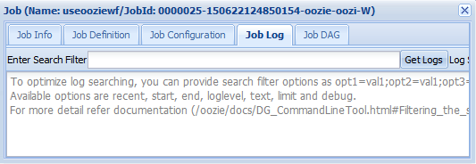
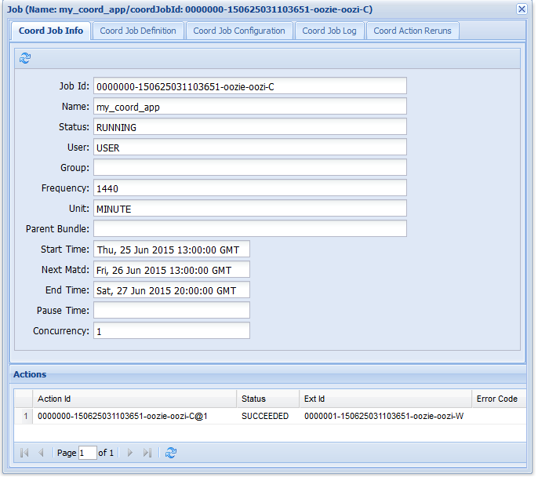

<!-- not suitable for Mooncake -->

<properties
    pageTitle="在基于 Linux 的 HDInsight 中使用 Hadoop Oozie 工作流 | Azure"
    description="在基于 Linux 的 HDInsight 中使用 Hadoop Oozie。了解如何定义 Oozie 工作流，并提交 Oozie 作业。"
    services="hdinsight"
    documentationcenter=""
    author="Blackmist"
    manager="jhubbard"
    editor="cgronlun"
    tags="azure-portal" />
<tags 
    ms.assetid="d7603471-5076-43d1-8b9a-dbc4e366ce5d"
    ms.service="hdinsight"
    ms.workload="big-data"
    ms.tgt_pltfrm="na"
    ms.devlang="na"
    ms.topic="article"
    ms.date="10/11/2016"
    wacn.date="02/06/2017"
    ms.author="larryfr" />

# 在基于 Linux 的 HDInsight 上将 Oozie 与 Hadoop 配合使用以定义和运行工作流
[AZURE.INCLUDE [oozie-selector](../../includes/hdinsight-oozie-selector.md)]

了解如何用 Apache Oozie 定义使用 Hive 和 Sqoop 的工作流，然后在基于 Linux 的 HDInsight 群集上运行该工作流。

Apache Oozie 是一个管理 Hadoop 作业的工作流/协调系统。该系统与 Hadoop 堆栈集成，支持 Apache MapReduce、Apache Pig、Apache Hive 和 Apache Sqoop 的 Hadoop 作业。它也能用于安排特定于某系统的作业，例如 Java 程序或 shell 脚本。

## 先决条件
在开始阅读本教程前，你必须具有：

* **Azure 订阅**：请参阅[获取 Azure 试用版](/pricing/1rmb-trial/)。
* **Azure CLI**：请参阅[安装和配置 Azure CLI](/documentation/articles/xplat-cli-install/)

    > [AZURE.IMPORTANT]
    Azure PowerShell 对于使用 Azure Service Manager 管理 HDInsight 资源的支持已**弃用**，将于 2017 年 1 月 1 日删除。本文档中的步骤使用的是与 Azure Resource Manager 兼容的新 HDInsight cmdlet。
    >
    > 请按照 [Install and configure Azure PowerShell](https://docs.microsoft.com/powershell/azureps-cmdlets-docs)（安装和配置 Azure PowerShell）中的步骤安装最新版 Azure PowerShell。如果脚本需要修改才能使用与 Azure Resource Manager 配合工作的新 cmdlet，请参阅[迁移到适用于 HDInsight 群集的基于 Azure Resource Manager 的开发工具](/documentation/articles/hdinsight-hadoop-development-using-azure-resource-manager/)，了解详细信息。

* **HDInsight 群集**：请参阅 [Linux 上的 HDInsight 入门](/documentation/articles/hdinsight-hadoop-tutorial-get-started-windows/)
* **Azure SQL 数据库**：将使用本文档中的步骤创建此数据库

## 示例工作流
你要根据本文档中的说明实现的工作流包含两个操作。操作是任务的定义，例如运行 Hive、Sqoop、MapReduce 或其他进程：

![工作流关系图][img-workflow-diagram]  

1. Hive 操作运行 HiveQL 脚本，以从 HDInsight 随附的 **hivesampletable** 中提取记录。每个数据行描述特定移动设备的访问。显示的记录格式如下所示：

        8       18:54:20        en-US   Android Samsung SCH-i500        California     United States    13.9204007      0       0
        23      19:19:44        en-US   Android HTC     Incredible      Pennsylvania   United States    NULL    0       0
        23      19:19:46        en-US   Android HTC     Incredible      Pennsylvania   United States    1.4757422       0       1

    本文档中使用的 Hive 脚本将统计每个平台（例如 Android 或 iPhone）的总访问次数，并将计数存储到新的 Hive 表中。

    有关 Hive 的详细信息，请参阅[将 Hive 与 HDInsight 配合使用][hdinsight-use-hive]。
2. Sqoop 操作将新 Hive 表的内容导出到 Azure SQL 数据库中的表。有关 Sqoop 的详细信息，请参阅[将 Hadoop Sqoop 与 HDInsight 配合使用][hdinsight-use-sqoop]。

> [AZURE.NOTE]
有关在 HDInsight 群集上支持的 Oozie 版本，请参阅 [HDInsight 提供的 Hadoop 群集版本有哪些新增功能？][hdinsight-versions]。

## 创建工作目录
Oozie 希望将作业所需的资源存储在同一个目录中。本示例使用 **wasbs:///tutorials/useoozie**。请使用以下命令创建此目录，并创建一个数据目录用于保存此工作流所创建的新 Hive 表：

    hdfs dfs -mkdir -p /tutorials/useoozie/data

> [AZURE.NOTE]
`-p` 参数使系统创建路径中的所有目录（如果这些目录尚不存在）。**data** 目录用于保存 **useooziewf.hql** 脚本使用的数据。

此外，请运行以下命令，以确保在运行 Hive 和 Sqoop 作业时 Oozie 可以模拟用户帐户。将 **USERNAME** 替换为你的登录名：

    sudo adduser USERNAME users

如果有错误指出该用户已是用户成员，你可以直接忽略该错误。

## 添加数据库驱动程序
由于此工作流使用 Sqoop 将数据导出到 SQL 数据库，因此必须提供用来与 SQL 数据库对话的 JDBC 驱动程序的副本。使用以下命令将该副本复制到工作目录：

    hdfs dfs -copyFromLocal /usr/share/java/sqljdbc_4.1/enu/sqljdbc*.jar /tutorials/useoozie/

如果工作流使用了其他资源，例如包含 MapReduce 应用程序的 jar，则还必须添加这些资源。

## 定义 Hive 查询
使用以下步骤创建 HiveQL 脚本，用于定义稍后要在 Oozie 工作流中使用的查询。

1. 使用 SSH 连接到基于 Linux 的 HDInsight 群集：

    * **Linux、Unix 或 OS X 客户端**：请参阅[在 Linux、OS X 或 Unix 中的 HDInsight 上将 SSH 与基于 Linux 的 Hadoop 配合使用](/documentation/articles/hdinsight-hadoop-linux-use-ssh-unix/)
    * **Windows 客户端**：请参阅[在 Windows 中的 HDInsight 上将 SSH 与基于 Linux 的 Hadoop 配合使用](/documentation/articles/hdinsight-hadoop-linux-use-ssh-windows/)
2. 使用以下命令创建新文件：

        nano useooziewf.hql
3. 打开 nano 编辑器后，使用以下内容作为该文件的内容：

        DROP TABLE ${hiveTableName};
        CREATE EXTERNAL TABLE ${hiveTableName}(deviceplatform string, count string) ROW FORMAT DELIMITED
        FIELDS TERMINATED BY '\t' STORED AS TEXTFILE LOCATION '${hiveDataFolder}';
        INSERT OVERWRITE TABLE ${hiveTableName} SELECT deviceplatform, COUNT(*) as count FROM hivesampletable GROUP BY deviceplatform;

    脚本中使用了两个变量：

    * **${hiveTableName}**：包含要创建的表的名称
    * **${hiveDataFolder}**：包含表数据文件的存储位置

     工作流定义文件（本教程中的 workflow.xml）在运行时会将三个值传递到这个 HiveQL 脚本。
4. 按 Ctrl-X 退出编辑器。出现提示时，请选择“Y”保存文件，然后按 **Enter** 以使用 **useooziewf.hql** 文件名。
5. 使用以下命令将 **useooziewf.hql** 复制到 **wasbs:///tutorials/useoozie/useooziewf.hql**：

        hdfs dfs -copyFromLocal useooziewf.hql /tutorials/useoozie/useooziewf.hql

    这些命令将 **useooziewf.hql** 文件存储在与此群集关联的 Azure 存储帐户上，即使删除群集，此帐户也仍会保留该文件。这样，便可以删除未使用的群集以节省成本，同时还能保留你的作业和工作流。

## 定义工作流
Oozie 工作流定义是用 hPDL（一种 XML 过程定义语言）编写的。使用以下步骤定义工作流：

1. 使用以下语句创建并编辑新文件：

        nano workflow.xml
2. 打开 nano 编辑器后，输入以下内容作为文件内容：

        <workflow-app name="useooziewf" xmlns="uri:oozie:workflow:0.2">
            <start to = "RunHiveScript"/>
            <action name="RunHiveScript">
            <hive xmlns="uri:oozie:hive-action:0.2">
                <job-tracker>${jobTracker}</job-tracker>
                <name-node>${nameNode}</name-node>
                <configuration>
                <property>
                    <name>mapred.job.queue.name</name>
                    <value>${queueName}</value>
                </property>
                </configuration>
                
                <param>hiveTableName=${hiveTableName}</param>
                <param>hiveDataFolder=${hiveDataFolder}</param>
            </hive>
            <ok to="RunSqoopExport"/>
            <error to="fail"/>
            </action>
            <action name="RunSqoopExport">
            <sqoop xmlns="uri:oozie:sqoop-action:0.2">
                <job-tracker>${jobTracker}</job-tracker>
                <name-node>${nameNode}</name-node>
                <configuration>
                <property>
                    <name>mapred.compress.map.output</name>
                    <value>true</value>
                </property>
                </configuration>
                <arg>export</arg>
                <arg>--connect</arg>
                <arg>${sqlDatabaseConnectionString}</arg>
                <arg>--table</arg>
                <arg>${sqlDatabaseTableName}</arg>
                <arg>--export-dir</arg>
                <arg>${hiveDataFolder}</arg>
                <arg>-m</arg>
                <arg>1</arg>
                <arg>--input-fields-terminated-by</arg>
                <arg>"\t"</arg>
                <archive>sqljdbc41.jar</archive>
                </sqoop>
            <ok to="end"/>
            <error to="fail"/>
            </action>
            <kill name="fail">
            <message>Job failed, error message[${wf:errorMessage(wf:lastErrorNode())}] </message>
            </kill>
            <end name="end"/>
        </workflow-app>

    该工作流中定义了两个操作：

    * **RunHiveScript**：这是启动操作，运行 **useooziewf.hql** Hive 脚本
    * **RunSqoopExport**：此操作使用 Sqoop 将创建的数据从 Hive 脚本导出到 SQL 数据库。仅当 **RunHiveScript** 操作成功时才运行此操作。

     > [AZURE.NOTE]
     有关 Oozie 工作流和使用工作流操作的详细信息，请参阅 [Apache Oozie 4.0 文档][apache-oozie-400]（适用于 HDInsight 3.0 版）或 [Apache Oozie 3.3.2 文档][apache-oozie-332]（适用于 HDInsight 2.1 版）。
     >
     >

     请注意，工作流包含多个条目，例如 `${jobTracker}`，它将替换为本文档稍后的作业定义中使用的值。

     另请注意 Sqoop 节中的 `<archive>sqljdbc4.jar</arcive>` 条目。该条目指示在运行此操作时 Oozie 要将此存档提供给 Sqoop 使用。
3. 依次按 Ctrl-X、**Y** 和 **Enter** 以保存文件。
4. 使用以下命令将 **workflow.xml** 文件复制到 **wasbs:///tutorials/useoozie/workflow.xml**：

        hdfs dfs -copyFromLocal workflow.xml /tutorials/useoozie/workflow.xml

## 创建数据库
遵循[创建 SQL 数据库](/documentation/articles/sql-database-get-started/)文档中的步骤创建新数据库。创建数据库时，请使用 **oozietest** 作为数据库名称。并记下用于数据库服务器的名称，因为下一部分需要用到该名称。

### 创建表
> [AZURE.NOTE]
有多种方法可连接到 SQL 数据库以创建表。以下步骤从 HDInsight 群集使用 [FreeTDS](http://www.freetds.org/)。
>
>

1. 使用以下命令在 HDInsight 群集上安装 FreeTDS：

        sudo apt-get --assume-yes install freetds-dev freetds-bin
2. 安装 FreeTDS 后，使用以下命令连接到你先前创建的 SQL 数据库服务器：

        TDSVER=8.0 tsql -H <serverName>.database.chinacloudapi.cn -U <sqlLogin> -P <sqlPassword> -p 1433 -D oozietest

    你将收到如下输出：

        locale is "en_US.UTF-8"
        locale charset is "UTF-8"
        using default charset "UTF-8"
        Default database being set to oozietest
        1>
3. 在 `1>` 提示符下，输入以下行：

        CREATE TABLE [dbo].[mobiledata](
        [deviceplatform] [nvarchar](50),
        [count] [bigint])
        GO
        CREATE CLUSTERED INDEX mobiledata_clustered_index on mobiledata(deviceplatform)
        GO

    输入 `GO` 语句后，将评估前面的语句。这将创建名为 **mobiledata** 的新表，Sqoop 会将数据写入该表。

    使用以下命令验证是否已创建该表：

        SELECT * FROM information_schema.tables
        GO

    您应该会看到与下面类似的输出：

        TABLE_CATALOG   TABLE_SCHEMA    TABLE_NAME      TABLE_TYPE
        oozietest       dbo     mobiledata      BASE TABLE
4. 在 `1>` 提示符下输入 `exit` 以退出 tsql 实用工具。

## 创建作业定义
作业定义描述可在哪里找到 workflow.xml 以及工作流使用的其他文件（例如 useooziewf.hql）。 它还定义工作流中使用的属性值以及关联的文件。

1. 使用以下命令获取默认存储的完整 WASB 地址。稍后在配置文件中将要用到该地址：

        sed -n '/<name>fs.default/,/<\/value>/p' /etc/hadoop/conf/core-site.xml

    这应该返回如下信息：

        <name>fs.defaultFS</name>
        <value>wasbs://mycontainer@mystorageaccount.blob.core.chinacloudapi.cn</value>

    保存 **wasbs://mycontainer@mystorageaccount.blob.core.chinacloudapi.cn** 值，后续步骤将会用到它。
2. 使用以下命令获取群集头节点的 FQDN。此值将用作群集的 JobTracker 地址。稍后在配置文件中将要用到该地址：

        hostname -f

    这将返回类似于下面的信息：

        hn0-CLUSTERNAME.randomcharacters.cx.internal.chinacloudapp.cn

    JobTracker 使用的端口是 8050，因此要用于 JobTracker 的完整地址是 **hn0-CLUSTERNAME.randomcharacters.cx.internal.cloudapp.net:8050**。
3. 使用以下命令创建 Oozie 作业定义配置：

        nano job.xml
4. 打开 nano 编辑器后，使用以下内容作为该文件的内容：

        <?xml version="1.0" encoding="UTF-8"?>
        <configuration>

          <property>
            <name>nameNode</name>
            <value>wasbs://mycontainer@mystorageaccount.blob.core.chinacloudapi.cn</value>
          </property>

          <property>
            <name>jobTracker</name>
            <value>JOBTRACKERADDRESS</value>
          </property>

          <property>
            <name>queueName</name>
            <value>default</value>
          </property>

          <property>
            <name>oozie.use.system.libpath</name>
            <value>true</value>
          </property>

          <property>
            <name>hiveScript</name>
            <value>wasbs://mycontainer@mystorageaccount.blob.core.chinacloudapi.cn/tutorials/useoozie/useooziewf.hql</value>
          </property>

          <property>
            <name>hiveTableName</name>
            <value>mobilecount</value>
          </property>

          <property>
            <name>hiveDataFolder</name>
            <value>wasbs://mycontainer@mystorageaccount.blob.core.chinacloudapi.cn/tutorials/useoozie/data</value>
          </property>

          <property>
            <name>sqlDatabaseConnectionString</name>
            <value>"jdbc:sqlserver://serverName.database.chinacloudapi.cn;user=adminLogin;password=adminPassword;database=oozietest"</value>
          </property>

          <property>
            <name>sqlDatabaseTableName</name>
            <value>mobiledata</value>
          </property>

          <property>
            <name>user.name</name>
            <value>YourName</value>
          </property>

          <property>
            <name>oozie.wf.application.path</name>
            <value>wasbs://mycontainer@mystorageaccount.blob.core.chinacloudapi.cn/tutorials/useoozie</value>
          </property>
        </configuration>

    * 将 **wasbs://mycontainer@mystorageaccount.blob.core.chinacloudapi.cn** 的所有实例替换为前面收到的值。

     > [AZURE.WARNING]
     必须使用完整的 WASB 路径，其中包含容器和存储帐户作为路径的一部分。如果使用短格式 (wasbs:///)，则在作业启动时会导致 RunHiveScript 操作失败。
     >
     >
    * 将 **JOBTRACKERADDRESS** 替换为前面收到的 JobTracker/ResourceManager 地址。
    * 将 **YourName** 替换为 HDInsight 群集的登录名。
    * 将 **serverName**、**adminLogin** 和 **adminPassword** 替换为 Azure SQL 数据库的信息。

     此文件中的大多数信息用于填充 workflow.xml 或 ooziewf.hql 文件中使用的值（例如 ${nameNode}）。

     > [AZURE.NOTE]
     **oozie.wf.application.path** 条目定义要在何处查找 workflow.xml 文件，该文件包含此作业运行的工作流。
     >
     >
5. 依次按 Ctrl-X、**Y** 和 **Enter** 以保存文件。

## 提交和管理作业
以下步骤使用 Oozie 命令提交和管理群集上的 Oozie 工作流。Oozie 命令是基于 [Oozie REST API](https://oozie.apache.org/docs/4.1.0/WebServicesAPI.html) 的友好界面。

> [AZURE.IMPORTANT]
使用 Oozie 命令时，必须使用 HDInsight 头节点的 FQDN。只能从群集访问此 FQDN，如果群集位于 Azure 虚拟网络中，则必须从同一个网络中的其他计算机来访问它。
>
>

1. 使用以下命令获取 Oozie 服务的 URL：

        sed -n '/<name>oozie.base.url/,/<\/value>/p' /etc/oozie/conf/oozie-site.xml

    此命令将返回类似于下面的值：

        <name>oozie.base.url</name>
        <value>http://hn0-CLUSTERNAME.randomcharacters.cx.internal.chinacloudapp.cn:11000/oozie</value>

    **http://hn0-CLUSTERNAME.randomcharacters.cx.internal.chinacloudapp.cn:11000/oozie** 部分是要配合 Oozie 命令使用的 URL。
2. 使用以下命令创建 URL 的环境变量，这样就不需要为每个命令键入该 URL：

        export OOZIE_URL=http://HOSTNAMEt:11000/oozie

    将 URL 替换为前面收到的 URL。
3. 使用以下命令提交作业：

        oozie job -config job.xml -submit

    这将从 **job.xml** 加载作业信息，然后将作业信息提交到 Oozie，但不运行该作业。

    命令完成后，应返回作业的 ID。例如，`0000005-150622124850154-oozie-oozi-W`。此值用于管理作业。
4. 使用以下命令查看作业的状态。输入上一命令返回的作业 ID：

        oozie job -info <JOBID>

    这将返回类似于下面的信息。

        Job ID : 0000005-150622124850154-oozie-oozi-W
        ------------------------------------------------------------------------------------------------------------------------------------
        Workflow Name : useooziewf
        App Path      : wasbs:///tutorials/useoozie
        Status        : PREP
        Run           : 0
        User          : USERNAME
        Group         : -
        Created       : 2015-06-22 15:06 GMT
        Started       : -
        Last Modified : 2015-06-22 15:06 GMT
        Ended         : -
        CoordAction ID: -
        ------------------------------------------------------------------------------------------------------------------------------------

    此作业的状态为 `PREP`，表示该作业已提交，但尚未启动。
5. 使用以下命令来启动作业：

        oozie job -start JOBID

    如果在运行此命令后检查状态，你会发现作业处于正在运行状态，并且返回了作业中操作的信息。
6. 任务成功完成后，你可以使用以下命令验证是否已生成数据并且已将导出到 SQL 数据库表：

        TDSVER=8.0 tsql -H <serverName>.database.chinacloudapi.cn -U <adminLogin> -P <adminPassword> -p 1433 -D oozietest

    在 `1>` 提示符下输入以下命令：

        SELECT * FROM mobiledata
        GO

    你应会收到类似于下面的信息：

        deviceplatform  count
        Android 31591
        iPhone OS       22731
        proprietary development 3
        RIM OS  3464
        Unknown 213
        Windows Phone   1791
        (6 rows affected)

有关 Oozie 命令的详细信息，请参阅 [Oozie Command Line Tool](https://oozie.apache.org/docs/4.1.0/DG_CommandLineTool.html)（Oozie 命令行工具）。

## Oozie REST API
Oozie REST API 允许你构建自己的工具来使用 Oozie。下面是有关在 HDInsight 中使用 Oozie REST API 的具体信息：

* **URI**：可从群集（位于 `https://CLUSTERNAME.azurehdinsight.cn/oozie`）外部访问 REST API
* **身份验证**：必须使用群集的 HTTP 帐户 (admin) 和密码对 API 进行身份验证。例如：

        curl -u admin:PASSWORD https://CLUSTERNAME.azurehdinsight.cn/oozie/versions

有关使用 Oozie REST API 的详细信息，请参阅 [Oozie Web Services API](https://oozie.apache.org/docs/4.1.0/WebServicesAPI.html)（Oozie Web 服务 API）。

## Oozie Web UI
Oozie Web UI 提供基于 Web 的视图来显示群集上 Oozie 作业的状态。它可以让你查看作业状态、作业定义、配置、作业中操作的图形以及作业的日志。你还可以查看作业中操作的详细信息。

若要访问 Oozie Web UI，请使用以下步骤：

1. 与 HDInsight 群集建立 SSH 隧道。有关执行这些操作的相关信息，请参阅[使用 SSH 隧道访问 Ambari Web UI、ResourceManager、JobHistory、NameNode、Oozie 和其他 Web UI](/documentation/articles/hdinsight-linux-ambari-ssh-tunnel/)。
2. 创建隧道后，请在 Web 浏览器中打开 Ambari Web UI。Ambari 站点的 URI 为 **https://CLUSTERNAME.azurehdinsight.cn**。请将 **CLUSTERNAME** 替换为基于 Linux 的 HDInsight 群集的名称。
3. 在页面左侧选择“Oozie”，然后依次选择“快速链接”和“Oozie Web UI”。

      

4. Oozie Web UI 默认显示正在运行的工作流作业。若要查看所有工作流作业，请选择“所有作业”。

      

5. 选择一个作业可查看有关该作业的详细信息。

      

6. 可以在“作业信息”选项卡中查看基本作业信息，以及作业中的各个操作。使用顶部选项卡可以查看作业定义和作业配置、访问作业日志，或查看作业的有向无环图 (DAG)。

    * **作业日志**：选择“获取日志”按钮获取作业的所有日志，或使用“输入搜索条件”字段来筛选日志

         

    * **JobDAG**：DAG 是整个工作流中使用的数据路径的图形概览

         

7. 在“作业信息”选项卡中选择一个操作会显示有关该操作的信息。例如，选择 **RunHiveScript** 操作。

      

8. 可以查看操作的详细信息，包括**控制台 URL** 的链接，使用此链接可以查看作业的 JobTracker 信息。

## 计划作业
使用协调器可以指定作业的开始时间、结束时间和发生频率，这样便可将这些作业安排在特定的时间。

若要定义工作流的计划，请使用以下步骤：

1. 使用以下命令创建名为 **coordinator.xml** 的新文件：

        nano coordinator.xml

    将以下内容用作该文件的内容：

        <coordinator-app name="my_coord_app" frequency="${coordFrequency}" start="${coordStart}" end="${coordEnd}" timezone="${coordTimezone}" xmlns="uri:oozie:coordinator:0.4">
          <action>
            <workflow>
              <app-path>${workflowPath}</app-path>
            </workflow>
          </action>
        </coordinator-app>

    请注意，其中使用的 `${...}` 变量将替换为作业定义中的值。变量包括：

    * **${coordFrequency}**：运行作业实例的间隔时间
    * **${coordStart}**：作业开始时间
    * **${coordEnd}**：作业结束时间
    * **${coordTimezone}**：在没有夏时制的固定时区（通常用 UTC 表示）处理协调器作业。此时区称为“Oozie 处理时区”
    * **${wfPath}**：workflow.xml 的路径
2. 依次按 Ctrl-X、**Y** 和 **Enter** 以保存文件。
3. 使用以下命令将该文件复制到此作业的工作目录中：

        hadoop fs -copyFromLocal coordinator.xml /tutorials/useoozie/coordinator.xml
4. 使用以下命令修改 **job.xml** 文件：

        nano job.xml

    进行以下更改：

    * 将 `<name>oozie.wf.application.path</name>` 更改为 `<name>oozie.coord.application.path</name>`。这会指示 Oozie 运行协调器文件，而不是工作流文件
    * 添进行下内容，以将 coordinator.xml 中使用的变量设置为指向 workflow.xml 的位置：

           <property>
             <name>workflowPath</name>
             <value>wasbs://mycontainer@mystorageaccount.blob.core.chinacloudapi.cn/tutorials/useoozie</value>
           </property>

       将 **mycontainer** 和 **mystorageaccount** 的值替换为 job.xml 文件中其他条目使用的值。
    * 添加以下内容，以定义 coordinator.xml 文件使用的开始时间、结束时间和频率：

           <property>
             <name>coordStart</name>
             <value>2015-06-25T12:00Z</value>
           </property>

           <property>
             <name>coordEnd</name>
             <value>2015-06-27T12:00Z</value>
           </property>

           <property>
             <name>coordFrequency</name>
             <value>1440</value>
           </property>

           <property>
             <name>coordTimezone</name>
             <value>UTC</value>
           </property>

       这会将开始时间设置为 2015 年 6 月 25 日中午 12:00、将结束时间设置为 2015 年 6 月 27 日，将运行此作业的间隔设置为每日（频率是以分钟为单位，因此 24 小时 x 60 分钟 = 1440 分钟）。 最后，将时区设置为 UTC。
5. 依次按 Ctrl-X、**Y** 和 **Enter** 以保存文件。
6. 若要运行作业，请使用以下命令：

        oozie job -config job.xml -run

    这将提交并启动作业。
7. 如果访问 Oozie Web UI 并选择“协调器作业”选项卡，应会看到类似于下面的信息：

      

    请注意“下一次具体化”条目，这是下次运行作业的时间。
8. 与以前的工作流作业类似，在 Web UI 中选择作业条目会显示有关作业的信息：

      

    请注意，这只显示作业的成功运行条目，而不显示计划的工作流中的单个操作。若要查看这些操作，请选择某个“操作”条目。这样就会显示类似于针对前面工作流作业检索到的信息。

      

## 故障排除
Oozie UI 对于排查 Oozie 作业问题很有帮助，因为它可让你轻松查看 Oozie 日志以及 MapReduce 任务（例如 Hive 查询）的 JobTracker 日志链接。一般而言，故障排除的模式应该是：

1. 在 Oozie Web UI 中查看作业。
2. 如果特定的操作出错或失败，请选择该操作，以查看“错误消息”字段是否提供了有关失败的详细信息。
3. 如果已提供，请使用操作中的 URL 查看该操作的更多详细信息（例如 JobTracker 日志）。

下面是你可能遇到的特定错误及其解决方法。

### JA009: 无法初始化群集
**症状**：作业状态将更改为“已暂停”。作业详细信息中显示 RunHiveScript 状态为 **START\_MANUAL**。选择该操作会显示以下错误消息：

    JA009: Cannot initialize Cluster. Please check your configuration for map

**原因**：**job.xml** 文件中使用的 WASB 地址不包含存储容器或存储帐户名。WASB 地址格式必须是 `wasbs://containername@storageaccountname.blob.core.chinacloudapi.cn`。

**解决方法**：更改作业使用的 WASB 地址。

### JA002: 不允许 Oozie 模拟 &lt;USER>
**症状**：作业状态将更改为“已暂停”。作业详细信息中显示 RunHiveScript 状态为 **START\_MANUAL**。选择该操作会显示以下错误消息：

    JA002: User: oozie is not allowed to impersonate <USER>

**原因**：当前的权限设置不允许 Oozie 模拟指定的用户帐户。

**解决方法**：允许 Oozie 模拟**用户**组中的用户。使用 `groups USERNAME` 查看用户帐户所属的组。如果该用户不是**用户**组的成员，请使用以下命令将该用户添加到该组：

    sudo adduser USERNAME users

> [AZURE.NOTE]
可能需要几分钟，HDInsight 才能识别用户已添加到该组。
>
>

### 启动器错误 (Sqoop)
**症状**：作业状态将更改为“已终止”。作业详细信息中显示 RunSqoopExport 状态为 **ERROR**。选择该操作会显示以下错误消息：

    Launcher ERROR, reason: Main class [org.apache.oozie.action.hadoop.SqoopMain], exit code [1]

**原因**：Sqoop 无法加载访问数据库时所需的数据库驱动程序。

**解决方法**：从 Oozie 作业使用 Sqoop 时，必须同时包含数据库驱动程序和作业使用的其他资源（例如 workflow.xml）。

此外，必须通过 workflow.xml 的 `<sqoop>...</sqoop>` 节引用包含数据库驱动程序的存档。

例如，可以针对本文档中的作业使用以下步骤：

1. 将 sqljdbc4.1.jar 文件复制到 /tutorials/useoozie 目录：

         hadoop fs -copyFromLocal /usr/share/java/sqljdbc_4.1/enu/sqljdbc41.jar /tutorials/useoozie/sqljdbc41.jar
2. 修改 workflow.xml，在 `</sqoop>` 上方的新行中添加以下内容：

        <archive>sqljdbc41.jar</archive>

## 后续步骤
在本教程中，你已经学习了如何定义 Oozie 工作流，以及如何运行 Oozie 作业。若要了解有关使用 HDInsight 的详细信息，请参阅以下文章：

* [将基于时间的 Oozie 协调器与 HDInsight 配合使用][hdinsight-oozie-coordinator-time]
* [在 HDInsight 中上载 Hadoop 作业的数据][hdinsight-upload-data]
* [将 Sqoop 与 HDInsight 中的 Hadoop 配合使用][hdinsight-use-sqoop]
* [将 Hive 与 HDInsight 上的 Hadoop 配合使用][hdinsight-use-hive]
* [将 Pig 与 HDInsight 上的 Hadoop 配合使用][hdinsight-use-pig]
* [为 HDInsight 开发 Java MapReduce 程序][hdinsight-develop-mapreduce]

[hdinsight-cmdlets-download]: http://go.microsoft.com/fwlink/?LinkID=325563
[azure-data-factory-pig-hive]: /documentation/articles/data-factory-data-transformation-activities/
[hdinsight-oozie-coordinator-time]: /documentation/articles/hdinsight-use-oozie-coordinator-time/
[hdinsight-versions]: /documentation/articles/hdinsight-component-versioning/
[hdinsight-storage]: /documentation/articles/hdinsight-hadoop-use-blob-storage/
[hdinsight-get-started]: /documentation/articles/hdinsight-hadoop-tutorial-get-started-windows/
[hdinsight-use-sqoop]: /documentation/articles/hdinsight-use-sqoop/
[hdinsight-provision]: /documentation/articles/hdinsight-provision-clusters-v1/
[hdinsight-upload-data]: /documentation/articles/hdinsight-upload-data/
[hdinsight-use-mapreduce]: /documentation/articles/hdinsight-use-mapreduce/
[hdinsight-use-hive]: /documentation/articles/hdinsight-use-hive/
[hdinsight-use-pig]: /documentation/articles/hdinsight-use-pig/
[hdinsight-storage]: /documentation/articles/hdinsight-hadoop-use-blob-storage/
[hdinsight-get-started-emulator]: /documentation/articles/hdinsight-hadoop-emulator-get-started/
[hdinsight-develop-mapreduce]: /documentation/articles/hdinsight-develop-deploy-java-mapreduce-linux/

[sqldatabase-create-configue]: /documentation/articles/sql-database-get-started/
[sqldatabase-get-started]: /documentation/articles/sql-database-get-started/

[azure-create-storageaccount]: /documentation/articles/storage-create-storage-account/

[apache-hadoop]: http://hadoop.apache.org/
[apache-oozie-400]: http://oozie.apache.org/docs/4.0.0/
[apache-oozie-332]: http://oozie.apache.org/docs/3.3.2/

[powershell-download]: /downloads/
[powershell-about-profiles]: https://technet.microsoft.com/zh-cn/library/hh847857.aspx
[powershell-install-configure]: https://docs.microsoft.com/powershell/azureps-cmdlets-docs
[powershell-start]: http://technet.microsoft.com/zh-cn/library/hh847889.aspx
[powershell-script]: https://technet.microsoft.com/zh-cn/library/ee176961.aspx

[cindygross-hive-tables]: http://blogs.msdn.com/b/cindygross/archive/2013/02/06/hdinsight-hive-internal-and-external-tables-intro.aspx

[img-workflow-diagram]: ./media/hdinsight-use-oozie/HDI.UseOozie.Workflow.Diagram.png
[img-preparation-output]: ./media/hdinsight-use-oozie/HDI.UseOozie.Preparation.Output1.png
[img-runworkflow-output]: ./media/hdinsight-use-oozie/HDI.UseOozie.RunWF.Output.png

[technetwiki-hive-error]: http://social.technet.microsoft.com/wiki/contents/articles/23047.hdinsight-hive-error-unable-to-rename.aspx

<!---HONumber=Mooncake_0103_2017-->