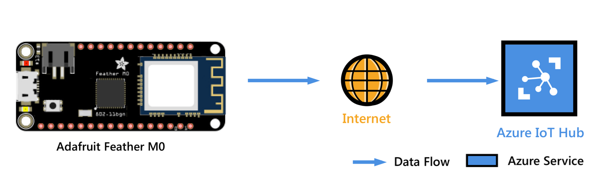
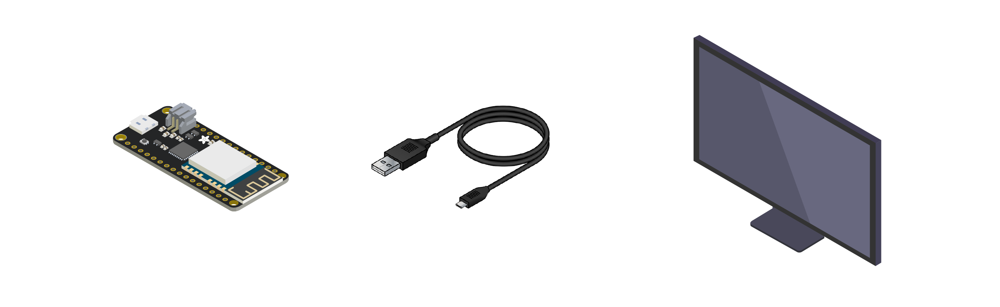
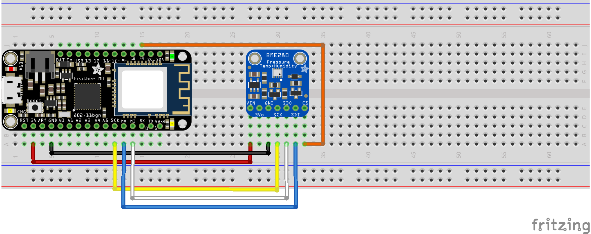
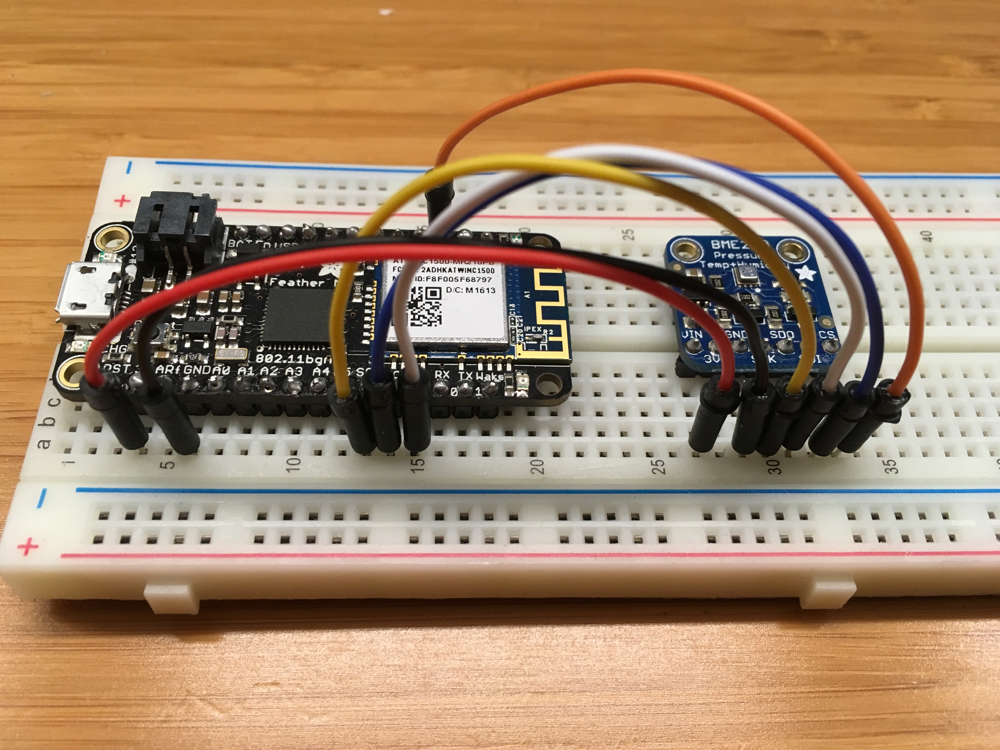
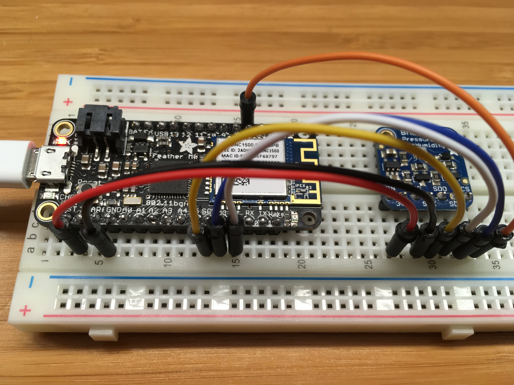
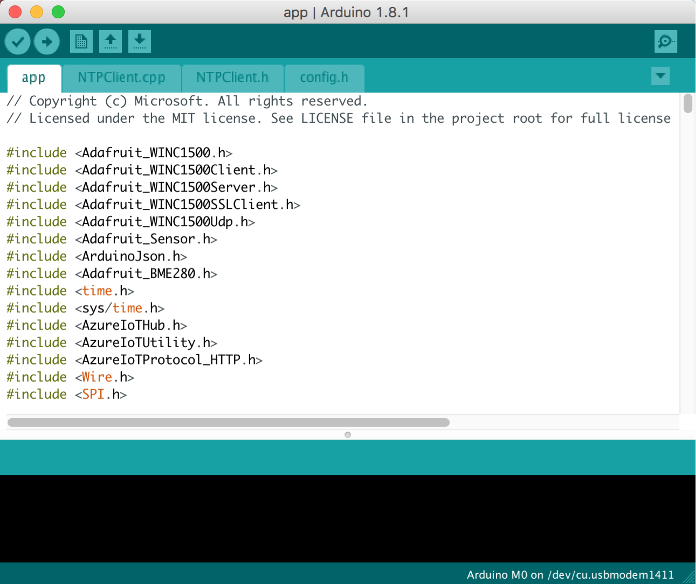
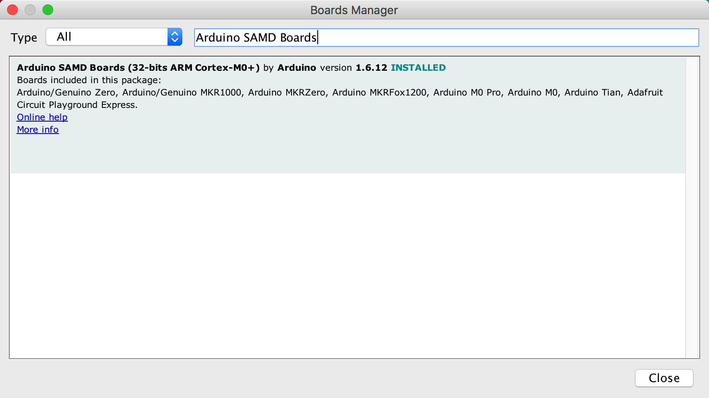
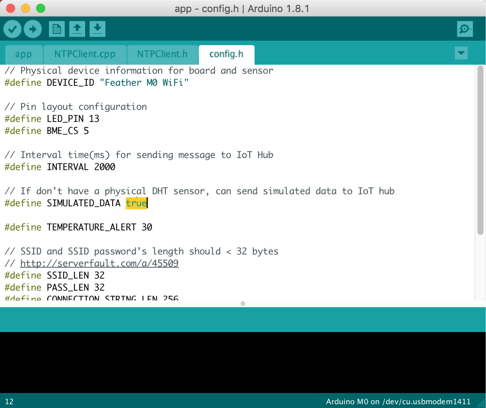

<properties
    pageTitle="M0 到云 - 将 Feather M0 WiFi 连接到 Azure IoT 中心 | Azure"
    description="解释如何将名为“Adafruit Feather M0 WiFi”的 Arduino 设备连接到 Azure IoT 中心（可帮助管理 IoT 资产的 Microsoft 云服务）。"
    services="iot-hub"
    documentationcenter=""
    author="shizn"
    manager="timtl"
    tags=""
    keywords=""
    translationtype="Human Translation" />
<tags
    ms.assetid="51befcdb-332b-416f-a6a1-8aabdb67f283"
    ms.service="iot-hub"
    ms.devlang="arduino"
    ms.topic="article"
    ms.tgt_pltfrm="na"
    ms.workload="na"
    ms.date="3/21/2017"
    wacn.date="05/08/2017"
    ms.author="xshi"
    ms.sourcegitcommit="2c4ee90387d280f15b2f2ed656f7d4862ad80901"
    ms.openlocfilehash="94d4b2aaa44e0c6071c0e91c26f1610ba2d833fa"
    ms.lasthandoff="04/28/2017" />

# 将 Adafruit Feather M0 WiFi 连接到云中的 Azure IoT 中心
[AZURE.INCLUDE [iot-hub-get-started-device-selector](../../includes/iot-hub-get-started-device-selector.md)]

在本教程中，从学习如何使用 Arduino 开发板的基础知识开始。 然后将学习如何使用 [Azure IoT 中心](/documentation/articles/iot-hub-what-is-iot-hub/)将设备无缝连接到云。

## 准备工作

将 Adafruit Feather M0 WiFi 连接到创建的 IoT 中心。 然后，在 M0 WiFi 上运行一个示例应用程序，用于从 BME280 收集温度和湿度数据。 最后，将传感器数据发送到 IoT 中心。

## 学习内容

* 如何创建 IoT 中心以及注册 Feather M0 WiFi 的设备
* 如何将 Feather M0 WiFi 与传感器和计算机相连接
* 如何在 Feather M0 WiFi 上运行示例应用程序来收集传感器数据
* 如何将传感器数据发送到 IoT 中心

## 所需条件

若要完成此操作，需要使用 Feather M0 WiFi 初学者工具包中的以下部件：

* Feather M0 WiFi 开发板
* Micro USB 转 Type A USB 线缆

还需要为开发环境做好以下准备：

* 运行 Windows 或 Ubuntu 的 Mac 或 PC。
* Feather M0 WiFi 要连接到的无线网络。
* 建立 Internet 连接，以便下载配置工具。
* [Arduino IDE](https://www.arduino.cc/en/main/software) 1.6.8 版或更高版本。 早期版本不适用于 AzureIoT 库。

如果没有传感器，以下各项是可选的。 也可以使用模拟的传感器数据。

* BME280 温度和湿度传感器
* 试验板
* M/M 跳线

[AZURE.INCLUDE [iot-hub-get-started-create-hub-and-device](../../includes/iot-hub-get-started-create-hub-and-device.md)]

## 将 Feather M0 WiFi 与传感器和计算机相连接
在此部分中，将传感器连接到开发板。 然后，将设备插入计算机以供进一步使用。
### 将 DHT22 温度和湿度传感器连接到 Feather M0 WiFi

按如下所示，使用试验板和跳线建立连接。 如果没有传感器，请跳过本部分，因为可以改用模拟的传感器数据。

对于传感器引脚，请使用以下接线：

| 启动（传感器）           | 结束（开发板）            | 线缆颜色   |
| -----------------------  | ---------------------- | ------------: |
| VDD（引脚 27A）            | 3V（引脚 3A）            | 红线     |
| GND（引脚 29A）            | GND（引脚 6A）           | 黑线   |
| SCK（引脚 30A）            | SCK（引脚 12A）          | 黄色电缆  |
| SDO（引脚 31A）            | MI（引脚 14A）           | 白线   |
| SDI（引脚 32A）            | M0（引脚 13A）           | 蓝线    |
| CS（引脚 33A）             | GPIO 5（引脚 15J）       | 橙色电缆  |

有关详细信息，请参阅 [Adafruit BME280 湿度 + 大气压力 + 温度传感器分类](https://learn.adafruit.com/adafruit-bme280-humidity-barometric-pressure-temperature-sensor-breakout/wiring-and-test?view=all)和 [Adafruit Feather M0 WiFi 引出线](https://learn.adafruit.com/adafruit-feather-m0-wifi-atwinc1500/pinouts)。

现在，Feather M0 WiFi 应已连接到正常工作的传感器。

### 将 Feather M0 WiFi 连接到计算机

按如下所示，使用 Micro USB 转 Type A USB 线缆将 Feather M0 WiFi 连接到计算机。

### 添加串行端口权限（仅适用于 Ubuntu）

如果使用 Ubuntu，确保有权在 Feather M0 WiFi 的 USB 端口上操作。 若要添加串行端口权限，请执行以下步骤：

1. 在终端中运行以下命令：

       ls -l /dev/ttyUSB*
       ls -l /dev/ttyACM*

   将返回以下输出之一：

   * crw-rw---- 1 root uucp xxxxxxxx
   * crw-rw---- 1 root dialout xxxxxxxx

   请注意，在输出中，`uucp` 或 `dialout` 是 USB 端口的组所有者名称。

1. 运行以下命令，将用户添加到该组中：

       sudo usermod -a -G <group-owner-name> <username>

   `<group-owner-name>` 是在上一步骤中获取的组所有者名称。 `<username>` 是你的 Ubuntu 用户名。

1. 需要注销 Ubuntu，然后重新登录，更改才会显示。

## 收集传感器数据并将其发送到 IoT 中心

在本部分中，将在 Feather M0 WiFi 上部署并运行一个示例应用程序。 该示例应用程序会使 Feather M0 WiFi 上的 LED 闪烁，并将从 BME280 传感器收集的温度和湿度数据发送到 IoT 中心。

### 从 GitHub 获取示例应用程序并准备 Arduino IDE

该示例应用程序托管在 GitHub 中。 从 GitHub 中克隆包含该示例应用程序的示例存储库。 若要克隆示例存储库，请执行以下步骤：

1. 打开命令提示符或终端窗口。
1. 转到用于存储示例应用程序的文件夹。
1. 运行以下命令：

       git clone https://github.com/Azure-Samples/iot-hub-Feather-M0-WiFi-client-app.git

在 Arduino IDE 中安装 Feather M0 WiFi 的程序包：

1. 打开存储示例应用程序的文件夹。
1. 在 Arduino IDE 中打开 app 文件夹中的 app.ino 文件。

   

1. 依次单击“工具” > “开发板” > “开发板管理器”，然后安装 `Arduino SAMD Boards` 版本 `1.6.2` 或更高版本 

   开发板管理器指示已安装了版本 `1.6.2` 或更高版本的 `Arduino SAMD Boards`。

   

1. 依次单击“工具” > “开发板” > “Adafruit M0 WiFi”。

1. 安装驱动程序（仅限 Windows），插入 Feather 时可能需要安装驱动程序，单击“此处”下载驱动程序安装程序。
   按照以下步骤安装所需的驱动程序。

### 安装所需的库

1. 在 Arduino IDE 中，单击“Sketch” > “Include Library”（包含库） > “Manage Libraries”（管理库）。
1. 逐个搜索以下库名称。 对于找到的每个库，单击“安装”。
   * `Adafruit_WINC1500`
   * `RTCZero`
   * `NTPClient`
   * `AzureIoTHub`
   * `AzureIoTUtility`
   * `AzureIoTProtocol_HTTP`
   * `ArduinoJson`
   * `Adafruit BME280 Library`
   * `Adafruit Unified Sensor`

### 没有真正的 BME280 传感器？

如果没有真正的 BME280 传感器，示例应用程序可以模拟温度和湿度数据。 若要设置示例应用程序以使用模拟数据，请按照以下步骤操作：

1. 打开 `app` 文件夹中的 `config.h` 文件。
1. 找到以下代码行并将值从 `false` 更改为 `true`：

       define SIMULATED_DATA true

   

1. 使用 `Control-s` 保存文件。

### 将示例应用程序部署到 Feather M0 WiFi

1. 在 Arduino IDE 中，依次单击“工具” > “端口”，然后单击 Feather M0 WiFi 的串行端口。
1. 依次单击“草图” > “上传”，生成示例应用程序并将其部署到 Feather M0 WiFi。

### 输入凭据

上传成功完成后，按照以下步骤输入凭据：

1. 在 Arduino IDE 中，单击“Tools”（工具） > “Serial Monitor”（串行监视器）。
1. 在串行监视器窗口的右下角，可以看到两个下拉列表。
1. 在左侧下拉列表中选择“No line ending”（无行尾）。
1. 在右侧下拉列表中选择“115200 baud”（115200 波特率）。
1. 在串行监视器窗口顶部的输入框中输入以下信息（如果系统要求提供），然后单击“Send”（发送）。
   * Wi-Fi SSID
   * Wi-Fi 密码
   * 设备连接字符串

> [AZURE.NOTE]
> 凭据信息将存储在 Feather M0 WiFi 的 EEPROM 中。 如果在 Feather M0 WiFi 开发板上单击重置按钮，示例应用程序将询问是否要擦除这些信息。 输入 `Y` 擦除这些信息。 按提示再次提供这些信息。

### 验证示例应用程序是否成功运行

如果串行监视器窗口中显示以下输出并且 Feather M0 WiFi 上的 LED 闪烁，则表明示例应用程序已成功运行。

## 后续步骤

现已成功将 Feather M0 WiFi 连接到 IoT 中心，并将捕获的传感器数据发送到了 IoT 中心。 

[AZURE.INCLUDE [iot-hub-get-started-next-steps](../../includes/iot-hub-get-started-next-steps.md)]

<!--Update_Description:  add the section of what you learn-->