<properties
    pageTitle="ESP8266 到云 - 将 Feather HUZZAH ESP8266 连接到 Azure IoT 中心 | Azure"
    description="解释如何将名为 Adafruit Feather HUZZAH ESP8266 的 Arduino 设备连接到 Azure IoT 中心（可帮助管理 IoT 资产的 Microsoft 云服务）。"
    services="iot-hub"
    documentationcenter=""
    author="shizn"
    manager="timtl"
    tags=""
    keywords=""
    translationtype="Human Translation" />
<tags
    ms.assetid="c505aacf-89a8-40ed-a853-493b75bec524"
    ms.service="iot-hub"
    ms.devlang="arduino"
    ms.topic="article"
    ms.tgt_pltfrm="na"
    ms.workload="na"
    ms.date="03/28/2017"
    wacn.date="05/08/2017"
    ms.author="xshi"
    ms.sourcegitcommit="2c4ee90387d280f15b2f2ed656f7d4862ad80901"
    ms.openlocfilehash="3219d96140363620eeb6aa60fa2fc8c93b71c793"
    ms.lasthandoff="04/28/2017" />

# 将 Adafruit Feather HUZZAH ESP8266 连接到云中的 Azure IoT 中心

[AZURE.INCLUDE [iot-hub-get-started-device-selector](../../includes/iot-hub-get-started-device-selector.md)]
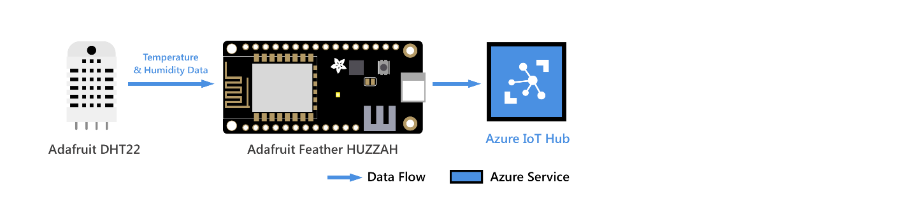

## 准备工作

将 Adafruit Feather HUZZAH ESP8266 连接到创建的 Azure IoT 中心。 然后，在 ESP8266 上运行一个示例应用程序，用于从 DHT22 传感器收集温度和湿度数据。 最后，将传感器数据发送到 IoT 中心。

> [AZURE.NOTE]
> 如果使用其他 ESP8266 开发板，仍可使用这些步骤将其连接到 IoT 中心。 根据所用的 ESP8266 开发板，可能需要重新配置 `LED_PIN`。 例如，如果使用 AI-Thinker 提供的 ESP8266，可将此参数从 `0` 更改为 `2`。 
## 学习内容

* 如何创建 IoT 中心以及注册 Feather HUZZAH ESP8266 的设备。
* 如何将 Feather HUZZAH ESP8266 与传感器和计算机相连接。
* 如何在 Feather HUZZAH ESP8266 上运行示例应用程序来收集传感器数据。
* 如何将传感器数据发送到 IoT 中心。

## 所需条件

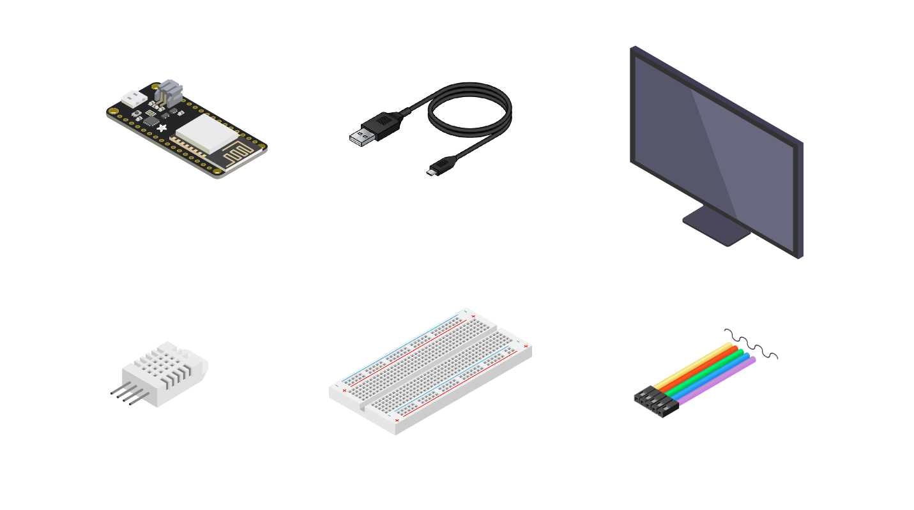

若要完成此操作，需要使用 Feather HUZZAH ESP8266 初学者工具包中的以下部件：

* Feather HUZZAH ESP8266 开发板。
* Micro USB 转 Type A USB 线缆。

还需要为开发环境做好以下准备：

* 运行 Windows 或 Ubuntu 的 Mac 或 PC。
* Feather HUZZAH ESP8266 要连接到的无线网络。
* 建立 Internet 连接，以便下载配置工具。
* [Arduino IDE](https://www.arduino.cc/en/main/software) 1.6.8 版或更高版本。 早期版本不适用于 AzureIoT 库。

如果没有传感器，以下各项是可选的。 也可以使用模拟的传感器数据。

* Adafruit DHT22 温度和湿度传感器。
* 试验板。
* M/M 跳线。

## 创建 IoT 中心以及注册 Feather HUZZAH ESP8266 的设备

### 若要在 Azure 门户中创建 IoT 中心，请执行下列步骤：

1. 登录到 [Azure 门户预览](https://portal.azure.cn/)。
1. 单击“新建” > “物联网” > “IoT 中心”。

    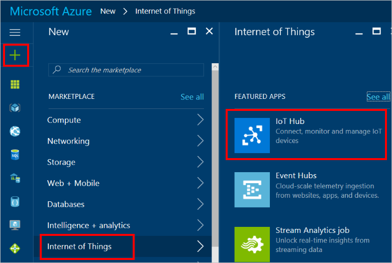

1. 在“IoT 中心”窗格中，输入 IoT 中心的所需信息：

    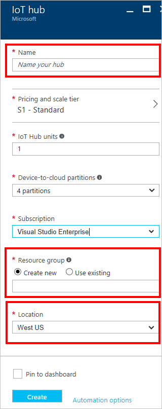

   * **名称**：IoT 中心的名称。 如果输入的名称有效，将显示一个绿色复选标记。
   * **定价和缩放级别**：为本演示教程选择免费的 F1 级别。 请参阅[定价和缩放级别](/pricing/details/iot-hub/)。
   * **资源组**：创建用于托管 IoT 中心的资源组，或使用现有的资源组。 请参阅[使用资源组管理 Azure 资源](/documentation/articles/resource-group-portal/)。
   * **位置**：选择与创建的 IoT 中心最靠近的位置。
   * **固定仪表板**：选中此选项可以方便地从仪表板访问 IoT 中心。

1. 单击“创建” 。 创建 IoT 中心可能需要几分钟时间。 可在“通知”窗格中查看进度。

    

1. 创建 IoT 中心后，请在仪表板中单击它。 记下“主机名”值供稍后使用，然后单击“共享访问策略”。

    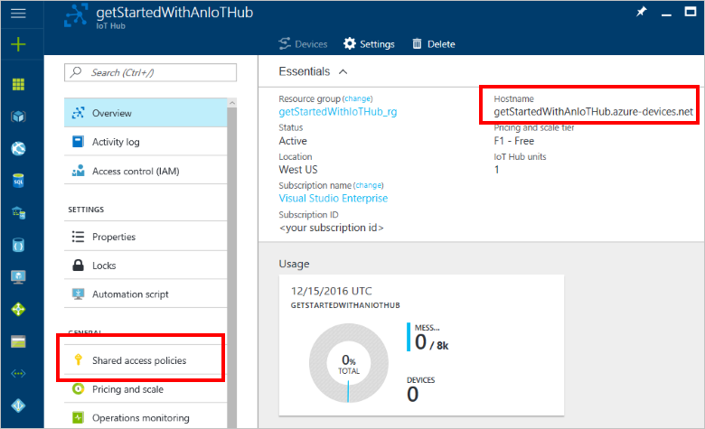

1. 在“共享访问策略”窗格中单击“iothubowner”策略，然后复制并保存 IoT 中心的“连接字符串”值。 本文稍后会用到此值。 有关详细信息，请参阅[控制对 IoT 中心的访问](/documentation/articles/iot-hub-devguide-security/)。

    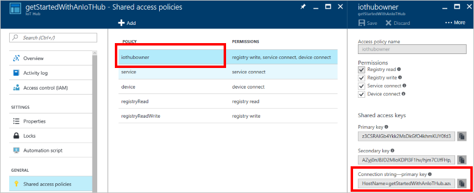

现已创建 IoT 中心。 确保保存“主机名”和“连接字符串”值。 稍后将在本文中用到这些值。

### 在 IoT 中心注册 Feather HUZZAH ESP8266 的设备

每个 IoT 中心都有一个标识注册表，存储允许连接到 IoT 中心的设备的相关信息。 在设备可连接到 IoT 中心之前，该 IoT 中心的标识注册表中必须有该设备的条目。

本部分使用一个名为 *iothub explorer* 的 CLI 工具。 使用此工具在 IoT 中心的标识注册表中注册 Feather HUZZAH ESP8266 的设备。

> [AZURE.NOTE]
> iothub explorer 需要 Node.js 4.x 或更高版本才能正常工作。

若要注册 Feather HUZZAH ESP8266 的设备，请执行以下步骤：

1. [下载](https://nodejs.org/en/download/)并安装 Node.js 的最新 LTS 版本，包括 NPM。
1. 使用 NPM 安装 iothub explorer。

   * Windows 7 或更高版本：

     以管理员身份启动命令提示符。 运行以下命令安装 iothub explorer：

         npm install -g iothub-explorer

   * Ubuntu 16.04 或更高版本：

     使用键盘快捷方式 Ctrl+Alt+T 打开终端，然后运行以下命令：

         sudo npm install -g iothub-explorer

   * MacOS 10.1 或更高版本：

     打开终端，然后运行以下命令：

         npm install -g iothub-explorer

3. 运行以下命令登录到 IoT 中心：

       iothub-explorer login [your IoT hub connection string]

4. 注册新设备。 在下一示例中，`deviceID` 为 `new-device`。 通过运行以下命令获取其连接字符串。

       iothub-explorer create new-device --connection-string

记下已注册设备的连接字符串。 之后将用到它。

> [AZURE.NOTE]
> 若要查看已注册设备的连接字符串，请运行 `iothub-explorer list` 命令。

## 将 Feather HUZZAH ESP8266 与传感器和计算机相连接
在此部分中，将传感器连接到开发板。 然后，将设备插入计算机以作后用。
### 将 DHT22 温度和湿度传感器连接到 Feather HUZZAH ESP8266

按如下所示，使用试验板和跳线建立连接。 如果没有传感器，请跳过本部分，因为可以改用模拟的传感器数据。

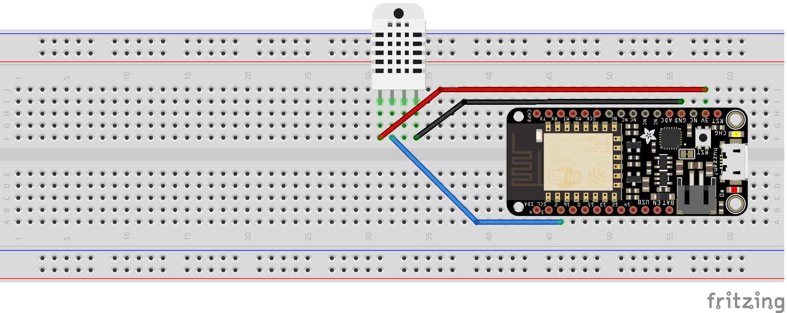

对于传感器引脚，请使用以下接线：

| 启动（传感器）           | 结束（开发板）           | 线缆颜色   |
| -----------------------  | ---------------------- | ------------: |
| VDD（引脚 31F）            | 3V（引脚 58H）           | 红线     |
| DATA（引脚 32F）           | GPIO 2（引脚 46A）       | 蓝线    |
| GND（引脚 34F）            | GND（引脚 56I）          | 黑线   |

有关详细信息，请参阅 [Adafruit DHT22 传感器设置](https://learn.adafruit.com/dht/connecting-to-a-dhtxx-sensor)和 [Adafruit Feather HUZZAH Esp8266 引出线](https://learn.adafruit.com/adafruit-feather-huzzah-esp8266/using-arduino-ide?view=all#pinouts)。

现在，Feather Huzzah ESP8266 应已连接到正常工作的传感器。

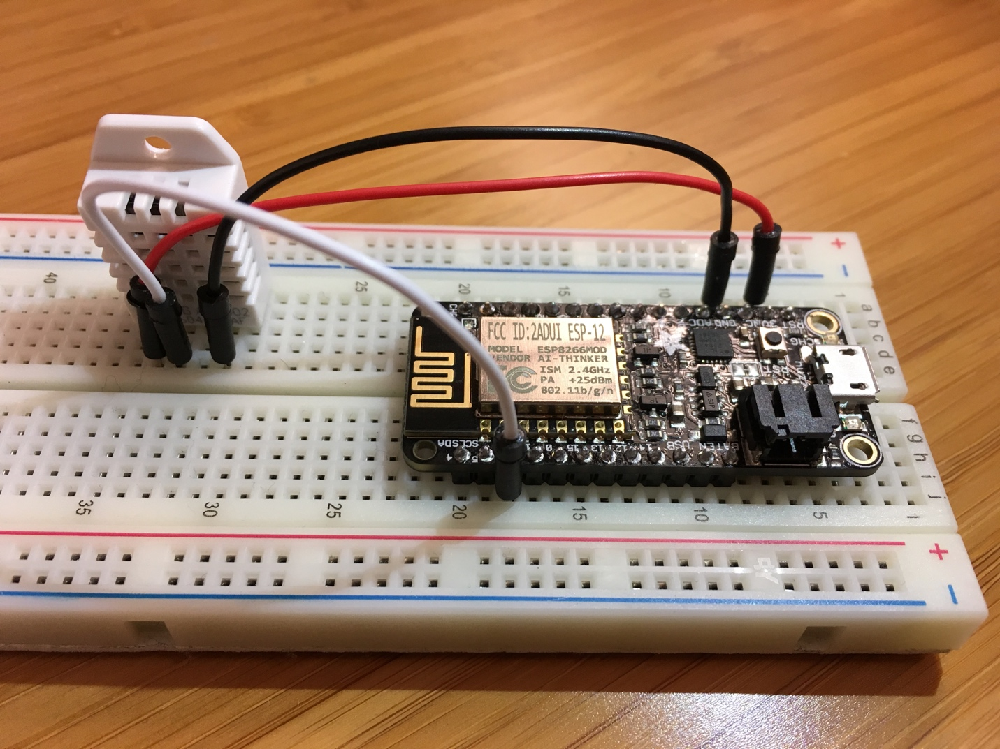

### 将 Feather HUZZAH ESP8266 连接到计算机

按如下所示，使用 Micro USB 转 Type A USB 线缆将 Feather HUZZAH ESP8266 连接到计算机。

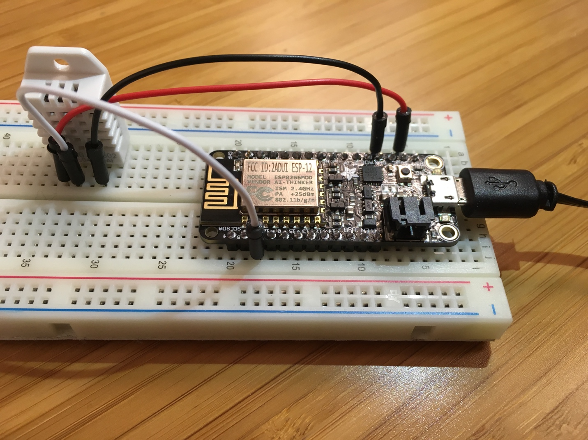

### 添加串行端口权限（仅适用于 Ubuntu）

如果使用 Ubuntu，请确保有权在 Feather HUZZAH ESP8266 的 USB 端口上操作。 若要添加串行端口权限，请执行以下步骤：

1. 在终端中运行以下命令：

        ls -l /dev/ttyUSB*
        ls -l /dev/ttyACM*

    将返回以下输出之一：

    * crw-rw---- 1 root uucp xxxxxxxx
    * crw-rw---- 1 root dialout xxxxxxxx

    请注意，在输出中，`uucp` 或 `dialout` 是 USB 端口的组所有者名称。

1. 运行以下命令，将用户添加到该组中：

        sudo usermod -a -G <group-owner-name> <username>

    `<group-owner-name>` 是在上一步骤中获取的组所有者名称。 `<username>` 是你的 Ubuntu 用户名。

1. 需要注销 Ubuntu，然后重新登录，更改才会显示。

## 收集传感器数据并将其发送到 IoT 中心

在本部分，你将在 Feather HUZZAH ESP8266 上部署并运行一个示例应用程序。 该示例应用程序会使 Feather HUZZAH ESP8266 上的 LED 闪烁，并将从 DHT22 传感器收集的温度和湿度数据发送到 IoT 中心。

### 从 Github 获取示例应用程序

该示例应用程序托管在 Github 中。 从 GitHub 中克隆包含该示例应用程序的示例存储库。 若要克隆示例存储库，请执行以下步骤：

1. 打开命令提示符或终端窗口。
1. 转到用于存储示例应用程序的文件夹。
1. 运行以下命令：

        git clone https://github.com/Azure-Samples/iot-hub-feather-huzzah-client-app.git

在 Arduino IDE 中安装 Feather HUZZAH ESP8266 的包：

1. 打开存储示例应用程序的文件夹。
1. 在 Arduino IDE 中打开 app 文件夹中的 app.ino 文件。

    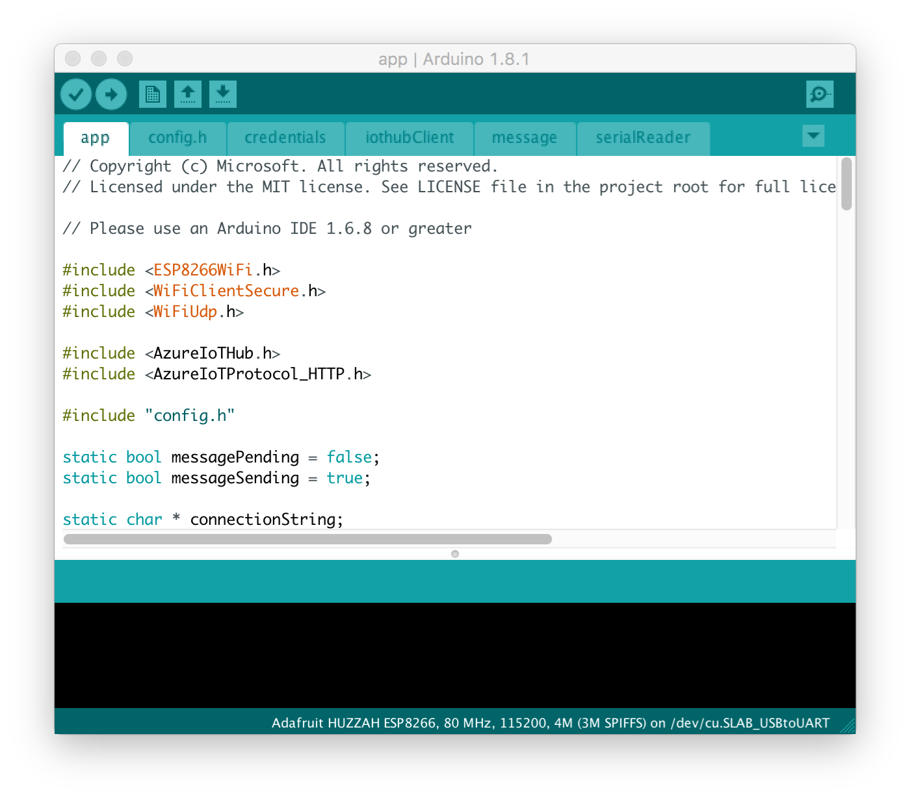

1. 在 Arduino IDE 中，单击“File”（文件） > “Preferences”（首选项）。
1. 在“首选项”对话框中，单击“其他 Boards Manager URL”框旁边的图标。
1. 在弹出窗口中输入以下 URL，然后单击“OK”（确定）。

        `http://arduino.esp8266.com/stable/package_esp8266com_index.json`

    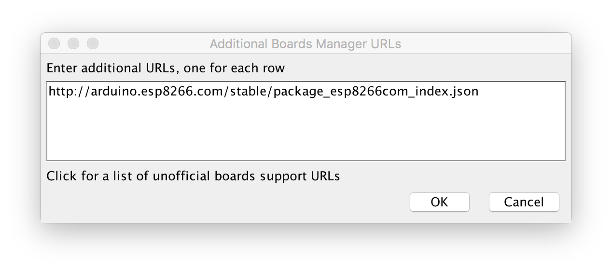

1. 在“Preference”（首选项）对话框中，单击“OK”（确定）。
1. 单击“Tools”（工具） > “Board”（开发板） > “Boards Manager”，然后搜索 esp8266。

   Boards Manager 指示 ESP8266 安装了版本 2.2.0 或更高版本。

    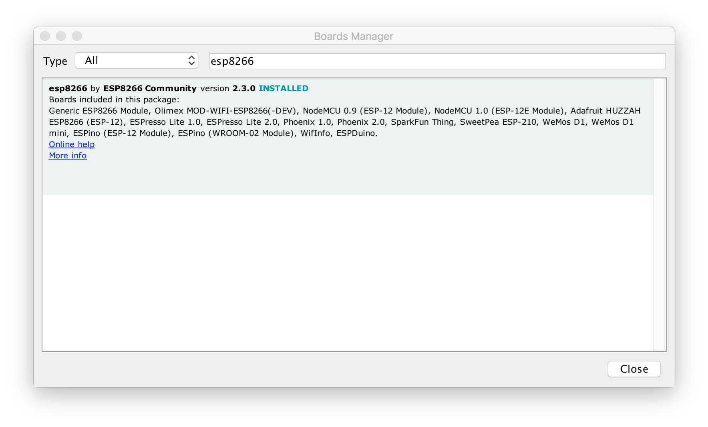

1. 单击“Tools”（工具） > “Board”（开发板） > “Adafruit HUZZAH ESP8266”。

### 安装所需的库

1. 在 Arduino IDE 中，单击“Sketch” > “Include Library”（包含库） > “Manage Libraries”（管理库）。
1. 逐个搜索以下库名称。 对于找到的每个库，单击“安装”。
   * `AzureIoTHub`
   * `AzureIoTUtility`
   * `AzureIoTProtocol_MQTT`
   * `ArduinoJson`
   * `DHT sensor library`
   * `Adafruit Unified Sensor`

### 没有真正的 DHT22 传感器？

如果你没有真正的 DHT22 传感器，示例应用程序可以模拟温度和湿度数据。 若要设置示例应用程序以使用模拟的数据，请执行以下步骤：

1. 打开 `app` 文件夹中的 `config.h` 文件。
1. 找到以下代码行并将值从 `false` 更改为 `true`：

        define SIMULATED_DATA true

    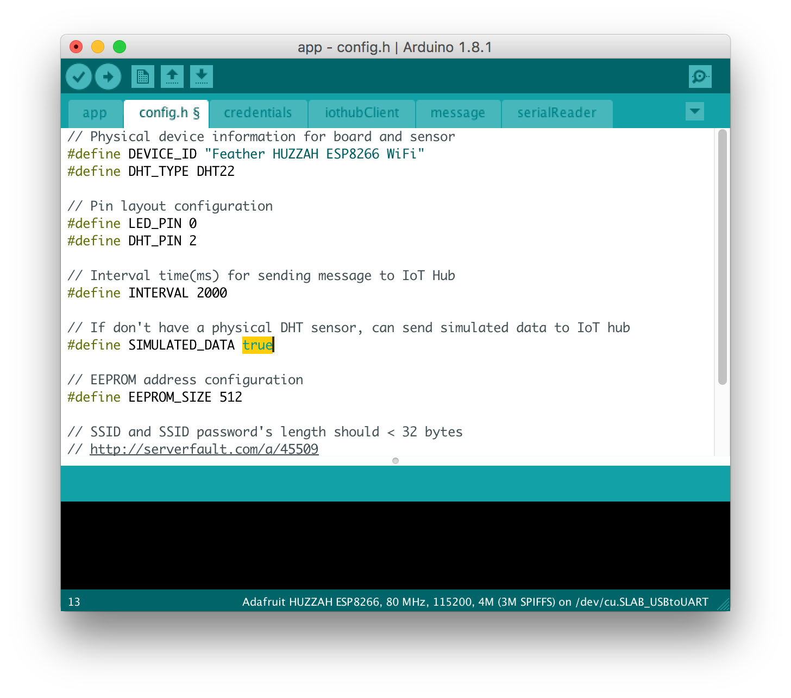

1. 使用 `Control-s` 保存文件。

### 将示例应用程序部署到 Feather HUZZAH ESP8266

1. 在 Arduino IDE 中，单击“Tool”（工具） > “Port”（端口），然后单击 Feather HUZZAH ESP8266 的串行端口。
1. 单击“Sketch” > “Upload”（上载），生成示例应用程序并将其部署到 Feather HUZZAH ESP8266。

### 输入凭据

上传成功完成后，按照以下步骤输入凭据：

1. 在 Arduino IDE 中，单击“Tools”（工具） > “Serial Monitor”（串行监视器）。
1. 在串行监视器窗口的右下角，可以看到两个下拉列表。
1. 在左侧下拉列表中选择“No line ending”（无行尾）。
1. 在右侧下拉列表中选择“115200 baud”（115200 波特率）。
1. 在串行监视器窗口顶部的输入框中输入以下信息（如果系统要求提供），然后单击“Send”（发送）。
   * Wi-Fi SSID
   * Wi-Fi 密码
   * 设备连接字符串

> [AZURE.NOTE]
> 凭据信息将存储在 Feather HUZZAH ESP8266 的 EEPROM 中。 如果在 Feather HUZZAH ESP8266 开发板上单击重置按钮，示例应用程序将询问是否要擦除这些信息。 输入 `Y` 以擦除这些信息。 按提示再次提供这些信息。

### 验证示例应用程序是否成功运行

如果串行监视器窗口中显示以下输出并且 Feather HUZZAH ESP8266 上的 LED 闪烁，则表示示例应用程序已成功运行。

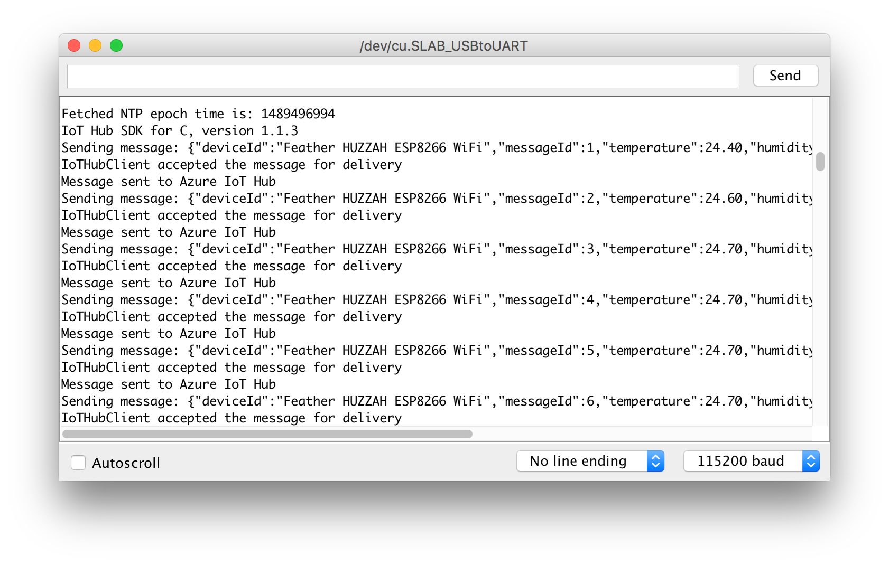

## 后续步骤

现已成功将 Feather HUZZAH ESP8266 连接到 IoT 中心，并将捕获的传感器数据发送到了 IoT 中心。 

[AZURE.INCLUDE [iot-hub-get-started-next-steps](../../includes/iot-hub-get-started-next-steps.md)]