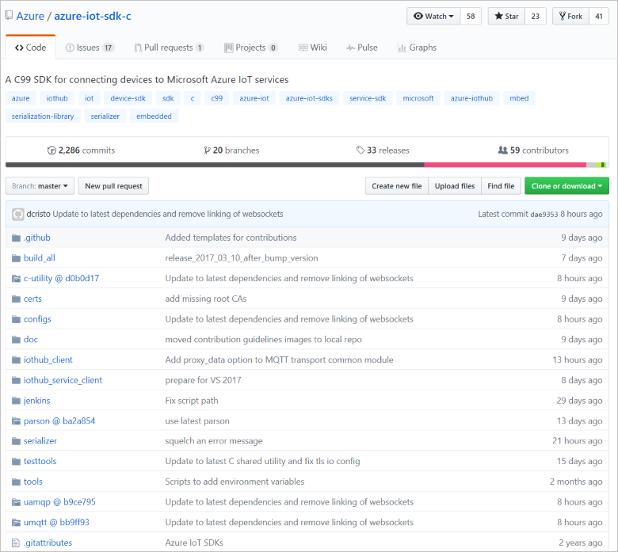
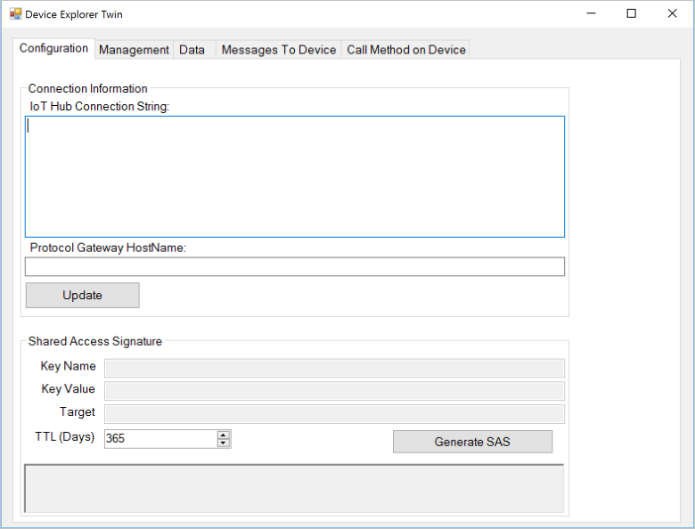
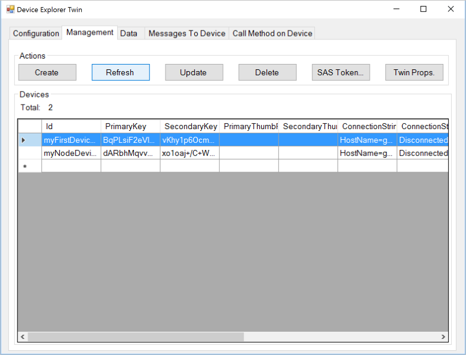
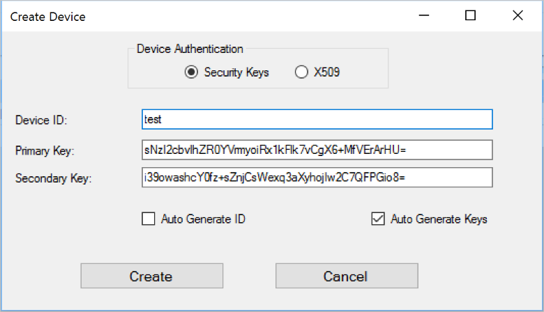
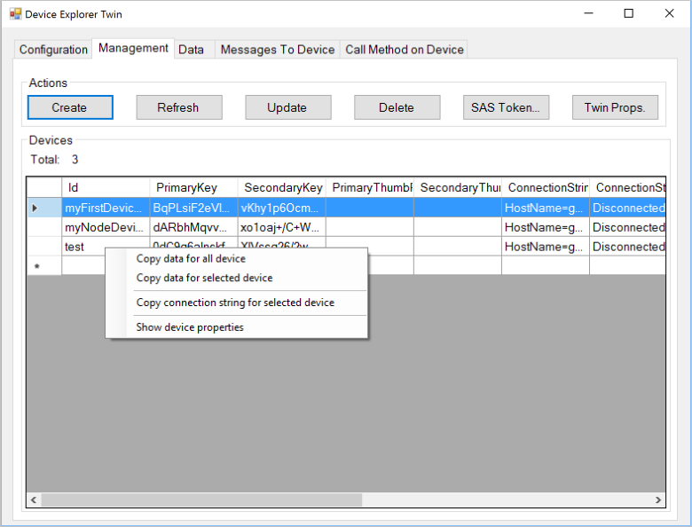
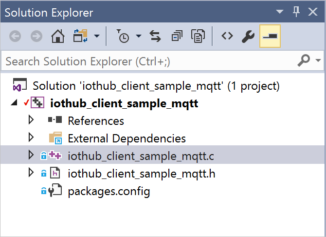
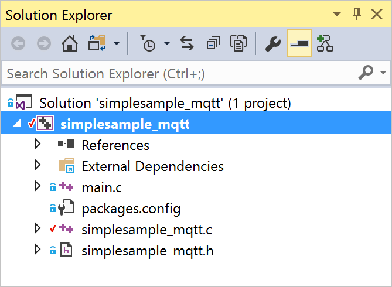

<properties
    pageTitle="适用于 C 语言的 Azure IoT 设备 SDK | Azure"
    description="开始使用适用于 C 语言的 Azure IoT 设备 SDK，并了解如何创建与 IoT 中心通信的设备应用。"
    services="iot-hub"
    documentationcenter=""
    author="olivierbloch"
    manager="timlt"
    editor=""
    translationtype="Human Translation" />
<tags
    ms.assetid="e448b061-6bdd-470a-a527-15ec03cca7b9"
    ms.service="iot-hub"
    ms.devlang="cpp"
    ms.topic="article"
    ms.tgt_pltfrm="na"
    ms.workload="na"
    ms.date="03/20/2017"
    wacn.date="05/08/2017"
    ms.author="obloch"
    ms.sourcegitcommit="2c4ee90387d280f15b2f2ed656f7d4862ad80901"
    ms.openlocfilehash="9f887e851afc50ce214699ca44b638e52d8c576f"
    ms.lasthandoff="04/28/2017" />

# 适用于 C 的 Azure IoT 设备 SDK

**Azure IoT 设备 SDK** 是一个库集，旨在简化从 **Azure IoT 中心**服务发送和接收消息的过程。 有各种不同的 SDK，每个 SDK 都以特定的平台为目标，而本文说明的是**适用于 C 语言的 Azure IoT 设备 SDK**。

适用于 C 语言的 Azure IoT 设备 SDK 以 ANSI C (C99) 编写，以获得最大可移植性。 此功能使得这些库很适合在多个平台和设备上运行，尤其是在以将磁盘和内存占用量降到最低作为优先考虑的情况下。

SDK 已在许多平台上进行了测试（有关详细信息，请参阅[平台和兼容性列表](/documentation/articles/iot-hub-tested-configurations/)）。尽管本文包含的是在 Windows 平台上运行的示例代码演示，但请记住，本文所述的代码在各种支持的平台上都完全相同。

本文将介绍适用于 C 语言的 Azure IoT 设备 SDK 的体系结构，将演示如何初始化设备库，将数据发送到 IoT 中心，以及从 IoT 中心接收消息。 本文中的信息应足以让你开始使用 SDK，但同时也提供了有关库的其他信息的链接。

## SDK 体系结构

可在 GitHub 存储库中找到[**适用于 C 语言的 Azure IoT 设备 SDK**](https://github.com/Azure/azure-iot-sdk-c)，还可在 [C API 参考](https://azure.github.io/azure-iot-sdk-c/index.html)中查看 API 的详细信息。

在此存储库的 **master** 分支中可找到最新版本的库：

  

* 此 SDK 的核心实现可在 **iothub\_client** 文件夹中找到，此文件夹包含 SDK 的最低 API 层的实现：**IoTHubClient** 库。 此 **IoTHubClient** 库包含实现原始消息传送的 API，即将消息发送到 IoT 中心以及从 IoT 中心接收消息。 使用此库时，你需要负责实现消息序列化，但与 IoT 中心通信的其他细节则由系统处理。
* **serializer** 文件夹包含帮助器函数和示例代码，演示了使用客户端库向 Azure IoT 中心发送消息之前如何序列化数据。 使用序列化程序不是必需的，仅为了提供便利。 如果使用**序列化程序**库，需要定义一个模型，用于指定要发送到 IoT 中心的数据以及预期要从 IoT 中心接收的消息。 定义模型后，SDK 将提供一个 API 图面，让你轻松处理设备到云和云到设备的消息，而无需担心序列化细节。 该库依赖于使用 MQTT 和 AMQP 等协议实现传输的其他开放源代码库。
* **IoTHubClient** 库依赖于其他开放源代码库：
  * [Azure C 共享实用程序](https://github.com/Azure/azure-c-shared-utility)库，其常用功能用于很多 Azure 相关的 C SDK 中所需的基本任务（如字符串、列表操作和 IO 等）。
  * [Azure uAMQP](https://github.com/Azure/azure-uamqp-c) 库，此库是针对资源约束设备的 AMQP 客户端实现的优化。
  * [Azure uMQTT](https://github.com/Azure/azure-umqtt-c) 库，它是实现 MQTT 协议并针对资源约束设备进行了优化的通用型库。

查看示例代码可以更方便地了解这些库的用法。 以下部分将演练 SDK 中包含的几个示例应用程序。 此演练应可让你轻松了解 SDK 体系结构层的各种功能以及 API 工作原理的简介。

## 运行示例之前

在面向 C 的 Azure IoT 设备 SDK 中运行示例之前，必须在 Azure 订阅中[创建 IoT 中心服务的实例](/documentation/articles/iot-hub-create-through-portal/)。 然后完成以下任务：

 - 准备开发环境
 - 获取设备凭据

### 准备开发环境

为常用平台提供了包（例如适用于 Windows 的 NuGet 包或者适用于 Debian 和 Ubuntu 的 apt_get），示例将使用这些包（如果适用）。 在某些情况下，需要为设备编译 SDK，或者在设备上编译 SDK。 如果需要编译 SDK，请参阅 GitHub 存储库中的[准备开发环境](https://github.com/Azure/azure-iot-sdk-c/blob/master/doc/devbox_setup.md)。

若要获取示例应用程序代码，请从 GitHub 下载 SDK 的副本。 从 [GitHub 存储库](https://github.com/Azure/azure-iot-sdk-c)的 **master** 分支获取源的副本。

### 获取设备凭据

获取示例源代码后，下一步是获取一组设备凭据。 若要使设备能够访问 IoT 中心，必须先将该设备添加到 IoT 中心标识注册表。 添加设备时，需要获取一组所需的设备凭据，以便设备能够连接到 IoT 中心。 下一部分所述示例应用程序的预期凭据格式为**设备连接字符串**。

有几个开源工具可帮助管理 IoT 中心。

* 一个是称为[设备资源管理器](https://github.com/Azure/azure-iot-sdk-csharp/tree/master/tools/DeviceExplorer)的 Windows 应用程序。
* 另一个是称为 [iothub-explorer](https://github.com/azure/iothub-explorer) 的跨平台 node.js CLI 工具。

本教程使用图形*设备资源管理器*工具。 如果你偏好 CLI 工具，也可以使用 *iothub-explorer* 工具。

[设备资源管理器](https://github.com/Azure/azure-iot-sdk-csharp/tree/master/tools/DeviceExplorer)工具使用 Azure IoT 服务库在 IoT 中心执行各种功能（包括添加设备）。若使用设备资源管理器工具添加设备，会获得设备的连接字符串。需要此连接字符串才能运行示例应用程序。

如果你不熟悉设备资源管理器工具，请参阅以下过程，了解如何使用该工具来添加设备和获取设备连接字符串。

若要安装设备资源管理器工具，请参阅[如何对 IoT 中心设备使用设备资源管理器](https://github.com/Azure/azure-iot-sdk-csharp/tree/master/tools/DeviceExplorer)。

运行该程序时，将看到以下界面：

  

在第一个字段中输入你的 **IoT 中心连接字符串**，然后单击“**更新**”。 此步骤配置该工具，以便与 IoT 中心通信。

配置 IoT 中心连接字符串后，请单击“管理”选项卡：

  

可在此选项卡中管理已注册到 IoT 中心的设备。

单击“创建”按钮创建设备。 将显示一个已预先填充一组密钥（主密钥和辅助密钥）的对话框。 输入“设备 ID”，然后单击“创建”。

  

创建设备后，“设备”列表将会更新，其中包含所有已注册的设备（包括刚刚创建的设备）。如果在新设备上单击右键，将看到此菜单：

  

如果选择“复制所选设备的连接字符串”，会将设备连接字符串复制到剪贴板。 请保留设备连接字符串的副本。 在运行后续部分中所述的示例应用程序时，将要用到它。

完成上述步骤后，可以开始运行一些代码。 两个示例的主源文件顶部都有一个常量，此常量可让你输入连接字符串。 例如，**iothub\_client\_sample\_mqtt** 应用程序中的相应行如下所示。

		static const char* connectionString = "[device connection string]";

## 使用 IoTHubClient 库

[azure-iot-sdk-c](https://github.com/azure/azure-iot-sdk-c) 存储库的 **iothub\_client** 文件夹中有一个 **samples** 文件夹，其中包含名为 **iothub\_client\_sample\_mqtt** 的应用程序。

Windows 版本的 **iothub\_client\_sample\_mqtt** 应用程序包含以下 Visual Studio 解决方案：

  

> [AZURE.NOTE]
> 如果在 Visual Studio 2017 中打开此项目，请接受提示，以便将项目重新定位到最新版本。

此解决方案只包含一个项目。 此解决方案中安装了四个 NuGet 包：

* Microsoft.Azure.C.SharedUtility
* Microsoft.Azure.IoTHub.MqttTransport
* Microsoft.Azure.IoTHub.IoTHubClient
* Microsoft.Azure.umqtt

在使用 SDK 时始终需要 **Microsoft.Azure.C.SharedUtility** 包。 本示例使用 MQTT 协议，因此必须包括 **Microsoft.Azure.umqtt** 和 **Microsoft.Azure.IoTHub.MqttTransport** 包（AMQP 和 HTTP 有对应的包）。 由于此示例使用 **IoTHubClient** 库，因此还必须在解决方案中包含 **Microsoft.Azure.IoTHub.IoTHubClient** 包。

可以在 **iothub\_client\_sample\_mqtt.c** 源文件中找到示例应用程序的实现。

以下步骤使用此示例应用程序来演示使用 **IoTHubClient** 库时所需的项目。

### 初始化库

> [AZURE.NOTE]
> 在开始使用库之前，你可能需要执行一些特定于平台的初始化。例如，如果打算在 Linux 上使用 AMQP，则必须初始化 OpenSSL 库。[GitHub 存储库](https://github.com/Azure/azure-iot-sdk-c)中的示例将在客户端启动时调用实用工具函数 **platform\_init**，并在退出之前调用 **platform\_deinit** 函数。这些函数在“platform.h”标头文件中声明。你应该在[存储库](https://github.com/Azure/azure-iot-sdk-c)中为目标平台检查这些函数定义，以确定是否需要在客户端中包含任何特定于平台的初始化代码。
> 
> 

只有在分配 IoT 中心客户端句柄之后，才可以开始使用库：

    if ((iotHubClientHandle = IoTHubClient_LL_CreateFromConnectionString(connectionString, MQTT_Protocol)) == NULL)
    {
        (void)printf("ERROR: iotHubClientHandle is NULL!\r\n");
    }
    else
    {
        ...

将设备资源管理器工具获取的设备连接字符串传递给此函数。 还需指定要使用的通信协议。 本示例使用 MQTT，但也可以选择 AMQP 和 HTTP。

获取有效的 **IOTHUB\_CLIENT\_HANDLE** 后，可以开始调用 API 来与 IoT 中心相互发送和接收消息。

### 发送消息

示例应用程序将设置一个循环用于向 IoT 中心发送消息。 以下代码片段：

- 创建消息。
- 将属性添加到消息。
- 发送消息。

首先创建一条消息：

    size_t iterator = 0;
    do
    {
        if (iterator < MESSAGE_COUNT)
        {
            sprintf_s(msgText, sizeof(msgText), "{\"deviceId\":\"myFirstDevice\",\"windSpeed\":%.2f}", avgWindSpeed + (rand() % 4 + 2));
            if ((messages[iterator].messageHandle = IoTHubMessage_CreateFromByteArray((const unsigned char*)msgText, strlen(msgText))) == NULL)
            {
                (void)printf("ERROR: iotHubMessageHandle is NULL!\r\n");
            }
            else
            {
                messages[iterator].messageTrackingId = iterator;
                MAP_HANDLE propMap = IoTHubMessage_Properties(messages[iterator].messageHandle);
                (void)sprintf_s(propText, sizeof(propText), "PropMsg_%zu", iterator);
                if (Map_AddOrUpdate(propMap, "PropName", propText) != MAP_OK)
                {
                    (void)printf("ERROR: Map_AddOrUpdate Failed!\r\n");
                }

                if (IoTHubClient_LL_SendEventAsync(iotHubClientHandle, messages[iterator].messageHandle, SendConfirmationCallback, &messages[iterator]) != IOTHUB_CLIENT_OK)
                {
                    (void)printf("ERROR: IoTHubClient_LL_SendEventAsync..........FAILED!\r\n");
                }
                else
                {
                    (void)printf("IoTHubClient_LL_SendEventAsync accepted message [%d] for transmission to IoT Hub.\r\n", (int)iterator);
                }
            }
        }
        IoTHubClient_LL_DoWork(iotHubClientHandle);
        ThreadAPI_Sleep(1);

        iterator++;
    } while (g_continueRunning);

每次发送消息时，指定发送数据时所调用的回调函数的引用。 在此示例中，回调函数名为 **SendConfirmationCallback**。 以下代码片段演示此回调函数：

		static void SendConfirmationCallback(IOTHUB_CLIENT_CONFIRMATION_RESULT result, void* userContextCallback)
		{
		    EVENT_INSTANCE* eventInstance = (EVENT_INSTANCE*)userContextCallback;
        	    (void)printf("Confirmation[%d] received for message tracking id = %zu with result = %s\r\n", callbackCounter, eventInstance->messageTrackingId, ENUM_TO_STRING(IOTHUB_CLIENT_CONFIRMATION_RESULT, result));
		    /* Some device specific action code goes here... */
		    callbackCounter++;
		    IoTHubMessage_Destroy(eventInstance->messageHandle);
		}

处理完消息后，请注意对 **IoTHubMessage\_Destroy** 函数的调用。 此函数释放创建消息时分配的资源。

### 接收消息

接收消息是一个异步操作。首先，请注册当设备接收消息时所要调用的回调：

    if (IoTHubClient_LL_SetMessageCallback(iotHubClientHandle, ReceiveMessageCallback, &receiveContext) != IOTHUB_CLIENT_OK)
    {
        (void)printf("ERROR: IoTHubClient_LL_SetMessageCallback..........FAILED!\r\n");
    }
    else
    {
        (void)printf("IoTHubClient_LL_SetMessageCallback...successful.\r\n");
    ...

最后一个参数是指向所需对象的 void 指针。 在本示例中，这是一个指向整数的指针，但也可以是指向更复杂数据结构的指针。 此参数使回调函数可与此函数的调用方以共享状态运行。

当设备接收消息时，将调用注册的回调函数。 此回调函数：

* 从消息中检索消息 ID 和相关 ID。
* 检索消息内容。
* 从消息中检索任何自定义属性。

        static IOTHUBMESSAGE_DISPOSITION_RESULT ReceiveMessageCallback(IOTHUB_MESSAGE_HANDLE message, void* userContextCallback)
        {
            int* counter = (int*)userContextCallback;
            const char* buffer;
            size_t size;
            MAP_HANDLE mapProperties;
            const char* messageId;
            const char* correlationId;
    
            // Message properties
            if ((messageId = IoTHubMessage_GetMessageId(message)) == NULL)
            {
                messageId = "<null>";
            }
    
            if ((correlationId = IoTHubMessage_GetCorrelationId(message)) == NULL)
            {
                correlationId = "<null>";
            }
    
            // Message content
            if (IoTHubMessage_GetByteArray(message, (const unsigned char**)&buffer, &size) != IOTHUB_MESSAGE_OK)
            {
                (void)printf("unable to retrieve the message data\r\n");
            }
            else
            {
                (void)printf("Received Message [%d]\r\n Message ID: %s\r\n Correlation ID: %s\r\n Data: <<<%.*s>>> & Size=%d\r\n", *counter, messageId, correlationId, (int)size, buffer, (int)size);
                // If we receive the work 'quit' then we stop running
                if (size == (strlen("quit") * sizeof(char)) && memcmp(buffer, "quit", size) == 0)
                {
                    g_continueRunning = false;
                }
            }
    
            // Retrieve properties from the message
            mapProperties = IoTHubMessage_Properties(message);
            if (mapProperties != NULL)
            {
                const char*const* keys;
                const char*const* values;
                size_t propertyCount = 0;
                if (Map_GetInternals(mapProperties, &keys, &values, &propertyCount) == MAP_OK)
                {
                    if (propertyCount > 0)
                    {
                        size_t index;
    
                        printf(" Message Properties:\r\n");
                        for (index = 0; index < propertyCount; index++)
                        {
                            (void)printf("\tKey: %s Value: %s\r\n", keys[index], values[index]);
                        }
                        (void)printf("\r\n");
                    }
                }
            }
    
            /* Some device specific action code goes here... */
            (*counter)++;
            return IOTHUBMESSAGE_ACCEPTED;
        }
    
使用 **IoTHubMessage\_GetByteArray** 函数来检索消息（在本示例中是一个字符串）。

### 取消初始化库

完成发送事件和接收消息后，可以取消初始化 IoT 库。 为此，请发出以下函数调用：

    IoTHubClient_LL_Destroy(iotHubClientHandle);

此调用释放 **IoTHubClient\_CreateFromConnectionString** 函数以前分配的资源。

可以看到，使用 **IoTHubClient** 库可以轻松发送和接收消息。 该库将处理与 IoT 中心通信的详细信息，包括要使用哪个协议（从开发人员的立场来看，这是一个简单的配置选项）。

在如何对设备发送到 IoT 中心的数据进行序列化方面，**IoTHubClient** 库也可提供精确的控制。 在某些情况下，这种控制级别是一项优点，但在其他情况下，这可能不是你想要看到的实现细节。 如果是这样，可以考虑使用下一部分中介绍的**序列化程序**库。

## 使用序列化程序库

从概念上讲，**序列化程序**库位于 SDK 中的 **IoTHubClient** 库之上。 它使用 **IoTHubClient** 库来与 IoT 中心进行底层通信，但它添加了建模功能，消除了开发人员处理消息序列化的负担。 我们将通过一个示例充分演示此库的工作原理。

[azure-iot-sdk-c 存储库](https://github.com/Azure/azure-iot-sdk-c)的 **serializer** 文件夹中有一个 **samples** 文件夹，其中包含名为 **simplesample\_mqtt** 的应用程序。 此示例的 Windows 版本包含以下 Visual Studio 解决方案：

  

> [AZURE.NOTE]
> 如果在 Visual Studio 2017 中打开此项目，请接受提示，以便将项目重新定位到最新版本。
>
>

如同前面的示例，此示例也包含多个 NuGet 包：

* Microsoft.Azure.C.SharedUtility
* Microsoft.Azure.IoTHub.MqttTransport
* Microsoft.Azure.IoTHub.IoTHubClient
* Microsoft.Azure.IoTHub.Serializer
* Microsoft.Azure.umqtt

其中的大多数包已在前面的示例中出现过，但 **Microsoft.Azure.IoTHub.Serializer** 是新的。 使用**序列化程序**库时需要此包。

可在 **simplesample\_mqtt.c** 文件中找到示例应用程序的实现。

以下部分将演练本示例的重要组成部分。

### 初始化库

若要开始使用**序列化程序**库，请调用初始化 API：

    if (serializer_init(NULL) != SERIALIZER_OK)
    {
        (void)printf("Failed on serializer_init\r\n");
    }
    else
    {
        IOTHUB_CLIENT_LL_HANDLE iotHubClientHandle = IoTHubClient_LL_CreateFromConnectionString(connectionString, MQTT_Protocol);
        srand((unsigned int)time(NULL));
        int avgWindSpeed = 10;

        if (iotHubClientHandle == NULL)
        {
            (void)printf("Failed on IoTHubClient_LL_Create\r\n");
        }
        else
        {
            ContosoAnemometer* myWeather = CREATE_MODEL_INSTANCE(WeatherStation, ContosoAnemometer);
            if (myWeather == NULL)
            {
                (void)printf("Failed on CREATE_MODEL_INSTANCE\r\n");
            }
            else
            {
    ...

对 **serializer\_init** 函数进行的调用是一次性调用，用于初始化底层库。 然后，需调用 **IoTHubClient\_LL\_CreateFromConnectionString** 函数，这是 **IoTHubClient** 示例中的同一 API。 此调用将设置设备连接字符串（也可用于选择要使用的协议）。 本示例使用 MQTT 作为传输方式，但也可以使用 AMQP 或 HTTP。

最后，调用 **CREATE\_MODEL\_INSTANCE** 函数。 **WeatherStation** 是模型的命名空间，**ContosoAnemometer** 是模型的名称。 创建模型实例后，可以使用它来开始发送和接收消息。 但是，必须了解模型是什么。

### 定义模型

**序列化程序**库中的模型定义了设备可发送到 IoT 中心的消息以及可接收的消息（在建模语言中称为*操作*）。 如 **simplesample\_mqtt** 示例应用程序中所示，可以使用一组 C 宏来定义模型：

		BEGIN_NAMESPACE(WeatherStation);

		DECLARE_MODEL(ContosoAnemometer,
		WITH_DATA(ascii_char_ptr, DeviceId),
    		WITH_DATA(int, WindSpeed),
		WITH_ACTION(TurnFanOn),
		WITH_ACTION(TurnFanOff),
		WITH_ACTION(SetAirResistance, int, Position)
		);

		END_NAMESPACE(WeatherStation);

**BEGIN\_NAMESPACE** 和 **END\_NAMESPACE** 这两个宏都以模型的命名空间作为参数。介于这两个宏之间的内容应该就是模型的定义和模型使用的数据结构。

在本示例中，有一个名为 **ContosoAnemometer** 的模型。 此模型定义了设备可以发送到 IoT 中心的两个数据片段：**DeviceId** 和 **WindSpeed**。 它还定义了设备可以接收的三个操作（消息）：**TurnFanOn**、**TurnFanOff** 和 **SetAirResistance**。 每个数据元素都有一个类型，而每个操作都有一个名称（以及一组可选参数）。

模型中定义的数据和操作可定义 API 接口，此接口可用于将消息发送到 IoT 中心，以及响应发送到设备的消息。 最好通过示例了解此模型的用法。

### 发送消息

模型定义了可以发送到 IoT 中心的数据。 在本示例中，这是指使用 **WITH_DATA** 宏来定义的两个数据项之一。 若要将 **DeviceId** 和 **WindSpeed** 值发送到 IoT 中心，需要执行几个步骤。 第一个步骤是设置要发送的数据：

    myWeather->DeviceId = "myFirstDevice";
    myWeather->WindSpeed = avgWindSpeed + (rand() % 4 + 2);

使用前面定义的模型可以通过设置 **struct** 的成员来设置值。 接下来，序列化想要发送的消息：

    unsigned char* destination;
    size_t destinationSize;
    if (SERIALIZE(&destination, &destinationSize, myWeather->DeviceId, myWeather->WindSpeed) != CODEFIRST_OK)
    {
        (void)printf("Failed to serialize\r\n");
    }
    else
    {
        sendMessage(iotHubClientHandle, destination, destinationSize);
        free(destination);
    }

此代码将设备到云的消息序列化到缓冲区（由 **destination** 引用）。 然后，代码调用 **sendMessage** 函数将消息发送到 IoT 中心：

    static void sendMessage(IOTHUB_CLIENT_LL_HANDLE iotHubClientHandle, const unsigned char* buffer, size_t size)
    {
        static unsigned int messageTrackingId;
        IOTHUB_MESSAGE_HANDLE messageHandle = IoTHubMessage_CreateFromByteArray(buffer, size);
        if (messageHandle == NULL)
        {
            printf("unable to create a new IoTHubMessage\r\n");
        }
        else
        {
            if (IoTHubClient_LL_SendEventAsync(iotHubClientHandle, messageHandle, sendCallback, (void*)(uintptr_t)messageTrackingId) != IOTHUB_CLIENT_OK)
            {
                printf("failed to hand over the message to IoTHubClient");
            }
            else
            {
                printf("IoTHubClient accepted the message for delivery\r\n");
            }
            IoTHubMessage_Destroy(messageHandle);
        }
        messageTrackingId++;
    }

**IoTHubClient\_LL\_SendEventAsync** 的倒数第二个参数是对成功发送数据后所调用的回调函数的引用。 下面是本示例中的回调函数：

    void sendCallback(IOTHUB_CLIENT_CONFIRMATION_RESULT result, void* userContextCallback)
    {
        unsigned int messageTrackingId = (unsigned int)(uintptr_t)userContextCallback;

        (void)printf("Message Id: %u Received.\r\n", messageTrackingId);

        (void)printf("Result Call Back Called! Result is: %s \r\n", ENUM_TO_STRING(IOTHUB_CLIENT_CONFIRMATION_RESULT, result));
    }

第二个参数是指向用户上下文的指针，即传递给 **IoTHubClient\_LL\_SendEventAsync** 的同一个指针。 在本例中，该上下文是一个简易计数器，但也可以是所需的任何组件。

这就是发送设备到云的消息所要执行的所有操作。 最后要介绍的内容是如何接收消息。

### 接收消息

接收消息的方式类似于在 **IoTHubClient** 库中处理消息。 首先，需要注册消息回调函数：

    if (IoTHubClient_LL_SetMessageCallback(iotHubClientHandle, IoTHubMessage, myWeather) != IOTHUB_CLIENT_OK)
    {
        printf("unable to IoTHubClient_SetMessageCallback\r\n");
    }
    else
    {
    ...

然后编写在接收消息时要调用的回调函数：

    static IOTHUBMESSAGE_DISPOSITION_RESULT IoTHubMessage(IOTHUB_MESSAGE_HANDLE message, void* userContextCallback)
    {
        IOTHUBMESSAGE_DISPOSITION_RESULT result;
        const unsigned char* buffer;
        size_t size;
        if (IoTHubMessage_GetByteArray(message, &buffer, &size) != IOTHUB_MESSAGE_OK)
        {
            printf("unable to IoTHubMessage_GetByteArray\r\n");
            result = IOTHUBMESSAGE_ABANDONED;
        }
        else
        {
            /*buffer is not zero terminated*/
            char* temp = malloc(size + 1);
            if (temp == NULL)
            {
                printf("failed to malloc\r\n");
                result = IOTHUBMESSAGE_ABANDONED;
            }
            else
            {
                (void)memcpy(temp, buffer, size);
                temp[size] = '\0';
                EXECUTE_COMMAND_RESULT executeCommandResult = EXECUTE_COMMAND(userContextCallback, temp);
                result =
                    (executeCommandResult == EXECUTE_COMMAND_ERROR) ? IOTHUBMESSAGE_ABANDONED :
                    (executeCommandResult == EXECUTE_COMMAND_SUCCESS) ? IOTHUBMESSAGE_ACCEPTED :
                    IOTHUBMESSAGE_REJECTED;
                free(temp);
            }
        }
        return result;
    }

此代码是一个样板 - 对任何解决方案都是相同的。此函数将接收消息并通过调用 **EXECUTE\_COMMAND** 将它路由到相应的函数。此时调用的函数取决于模型中的操作定义。

在模型中定义操作时，需要实现当设备接收相应的消息时调用的函数。例如，如果模型定义了此操作：

    WITH_ACTION(SetAirResistance, int, Position)

使用此签名定义函数：

		EXECUTE_COMMAND_RESULT SetAirResistance(ContosoAnemometer* device, int Position)
		{
		    (void)device;
		    (void)printf("Setting Air Resistance Position to %d.\r\n", Position);
		    return EXECUTE_COMMAND_SUCCESS;
		}

请注意，函数的名称与模型中的操作名称匹配，而函数的参数与为该操作指定的参数匹配。第一个参数始终是必需的，包含指向模型实例的指针。

当设备收到与此签名匹配的消息时，将调用相应的函数。因此，除了必须包含 **IoTHubMessage** 中的样板代码以外，接收消息所涉及的操作只是为模型中定义的每个操作定义一个简单的函数。

### 取消初始化库

完成发送数据和接收消息后，可以取消初始化 IoT 库。

    ...
            DESTROY_MODEL_INSTANCE(myWeather);
        }
        IoTHubClient_LL_Destroy(iotHubClientHandle);
    }
    serializer_deinit();

上述 3 个函数均符合以前所述的 3 个初始化函数。调用这些 API 可确保释放以前分配的资源。

## 后续步骤

本文介绍了有关使用**适用于 C 语言的 Azure IoT 设备 SDK** 中的库的基本知识。其中提供了足够的信息来让你了解 SDK 中包含哪些组件及其体系结构，以及如何开始使用 Windows 示例。下一篇文章通过讲解[有关 IoTHubClient 库的详细信息](/documentation/articles/iot-hub-device-sdk-c-iothubclient/)来继续介绍该 SDK。

若要详细了解如何针对 IoT 中心进行开发，请参阅 [Azure IoT SDK][lnk-sdks]。

若要进一步探索 IoT 中心的功能，请参阅：

- [使用 IoT 网关 SDK 模拟设备][lnk-gateway]

[lnk-file upload]: /documentation/articles/iot-hub-csharp-csharp-file-upload/
[lnk-create-hub]: /documentation/articles/iot-hub-rm-template-powershell/
[lnk-c-sdk]: /documentation/articles/iot-hub-device-sdk-c-intro/
[lnk-sdks]: /documentation/articles/iot-hub-devguide-sdks/

[lnk-gateway]: /documentation/articles/iot-hub-linux-gateway-sdk-simulated-device/

<!--Update_Description:update wording and code-->