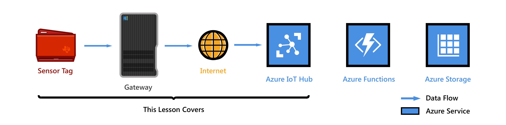
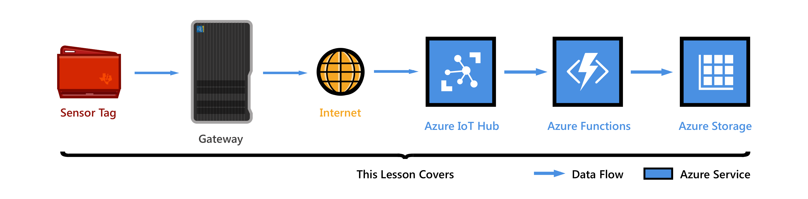

<properties
    pageTitle="开始使用 Azure IoT 网关初学者工具包 | Azure"
    description="开始使用 IoT 网关初学者工具包，创建 Azure IoT 中心，以及将 SensorTag 和网关连接到 IoT 中心"
    services="iot-hub"
    documentationcenter=""
    author="shizn"
    manager="timtl"
    tags=""
    keywords="azure iot 中心, iot 网关, 开始使用物联网, iot 工具包" />
<tags
    ms.assetid="56d05f4e-f2c1-4b22-8701-f01e14deead6"
    ms.service="iot-hub"
    ms.devlang="c"
    ms.topic="article"
    ms.tgt_pltfrm="na"
    ms.workload="na"
    ms.date: 3/21/2017
    wacn.date="05/08/2017"
    ms.author="xshi" />  

# 通过 SensorTag 开始使用 IoT 网关初学者工具包
>[AZURE.SELECTOR]
- [SensorTag](/documentation/articles/iot-hub-gateway-kit-c-get-started/)
- [Simulated Device](/documentation/articles/iot-hub-gateway-kit-c-sim-get-started/)

在本教程中，用户从学习如何使用 [IoT 网关初学者工具包](https://aka.ms/gateway-kit)的基础知识开始。用户会使用运行 Wind River Linux 的 Intel NUC 和 [TI SensorTag](http://www.ti.com/ww/en/wireless_connectivity/sensortag2015/index.html#main)。以及学习如何使用 Azure IoT 中心将设备无缝连接到云。

***
**还没有工具包？**单击[此处](https://aka.ms/gateway-kit)。**没有 SensorTag？**[从使用模拟设备开始](/documentation/articles/iot-hub-gateway-kit-c-sim-get-started/)或[购买 SensorTag](http://www.ti.com/ww/en/wireless_connectivity/sensortag2015/?INTC=SensorTag&HQS=sensortag)
***

## 第 1 课：配置 NUC
  

在本课中，用户会将工具包中的 Intel NUC（下一代计算单元，Next Unit of Computing）设置为 Azure IoT 网关、在 NUC 上安装 Azure IoT 网关 SDK 包，以及运行示例应用验证网关功能。

*估计完成时间：15 分钟*

转到[将 Intel NUC 设置为 IoT 网关](/documentation/articles/iot-hub-gateway-kit-c-lesson1-set-up-nuc/)

## 第 2 课：创建 IoT 中心
  

在本课中，用户会在主计算机上安装工具和软件。然后，用户会创建免费的 Azure 帐户，预配 Azure IoT 中心，以及在 IoT 中心创建第一个设备。

开始本课之前，请完成第 1 课。

### 获取工具
在主计算机上安装工具和软件。

*估计完成时间：20 分钟*

转到[获取工具](/documentation/articles/iot-hub-gateway-kit-c-lesson2-get-the-tools-win32/)

### 创建 IoT 中心和注册设备
使用 Azure CLI 创建资源组，预配第一个 Azure IoT 中心，并将第一个设备添加到 IoT 中心。

*估计完成时间：10 分钟*

转到[创建 IoT 中心和注册设备](/documentation/articles/iot-hub-gateway-kit-c-lesson2-register-device/)

## 第 3 课：从 SensorTag 接收消息以及从 IoT 中心读取消息
在本课中，用户会使用脚本在网关中自动配置和执行 BLE 示例应用程序。此类应用程序使用模块集合来聚合和转换数据、处理命令，或执行任意数量的相关任务。模块通过消息中转站互相通信。示例应用程序拥有一个 BLE 模块和一个 IoT 中心模块。BLE 模块从 BLE SensorTag 接收数据。IoT 中心模块打包接收的数据，并通过 Azure IoT 网关 SDK 中提供的网关框架将数据发送到 IoT 中心。

  

### 配置和运行 BLE 示例应用
设置 SensorTag 与网关之间的连接。然后完成配置并运行 BLE 示例应用程序。

*估计完成时间：15 分钟*

转到[配置和运行 BLE 示例应用](/documentation/articles/iot-hub-gateway-kit-c-lesson3-configure-ble-app/)

### 从 IoT 中心读取消息
在主计算机上运行示例代码，从 IoT 中心读取消息。

*估计完成时间：15 分钟*

转到[从 IoT 中心读取消息](/documentation/articles/iot-hub-gateway-kit-c-lesson3-read-messages-from-hub/)

## 第 4 课：将消息保存到 Azure 表存储
创建一个 Azure Function App，以便获取 IoT 中心发出的传入消息并将其写入 Azure 表存储。

  

### 创建 Azure 函数应用和 Azure 存储帐户
使用 Azure Resource Manager 模板创建 Azure 函数应用和 Azure 存储帐户。

*估计完成时间：10 分钟*

转到[创建 Azure Function App 和 Azure 存储帐户](/documentation/articles/iot-hub-gateway-kit-c-lesson4-deploy-resource-manager-template/)

### 读取保存在 Azure 表存储中的消息
在将网关到云消息写入 Azure 表存储时，对其进行监视。

*估计完成时间：5 分钟*

转到[读取保存在 Azure 表存储中的消息](/documentation/articles/iot-hub-gateway-kit-c-lesson4-read-table-storage/)。

## 故障排除
如果在课程中遇到任何问题，可在[故障排除](/documentation/articles/iot-hub-gateway-kit-c-troubleshooting/)一文中查找解决方案。

## 了解更多
若要了解详细信息，请访问 [Intel IoT 网关工具包开发人员专区](https://software.intel.com/zh-CN/iot/hardware/gateways/dev-kit)。

<!---HONumber=Mooncake_0116_2017-->