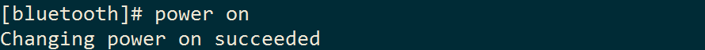
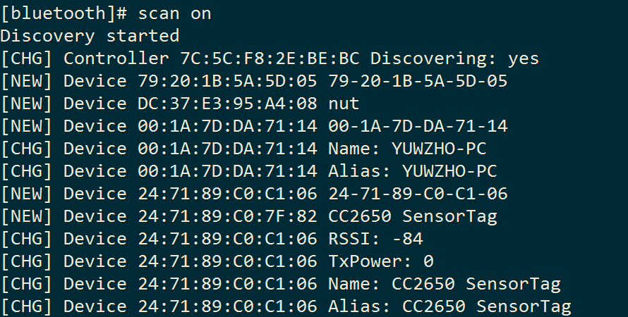
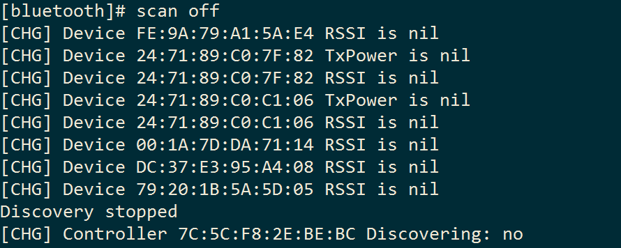
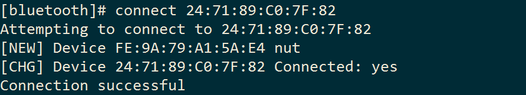
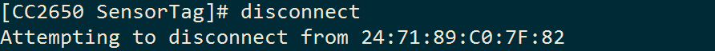
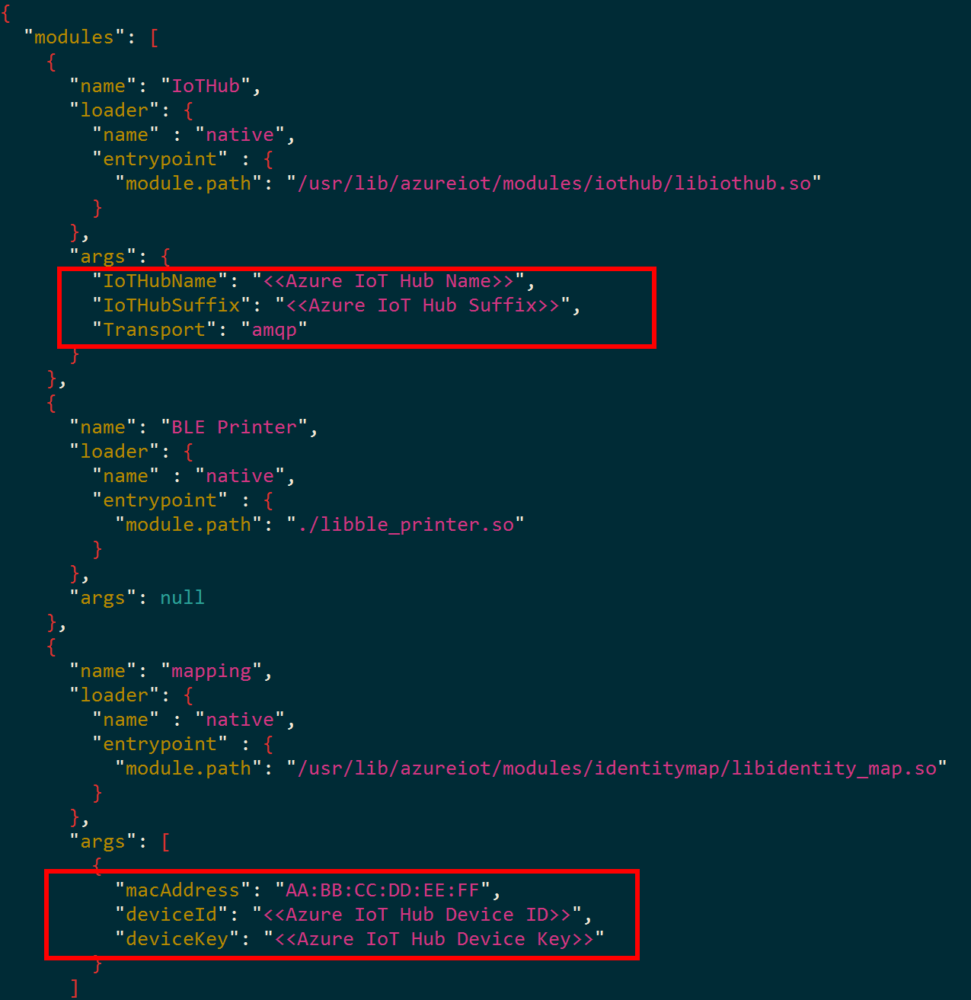

<properties
    pageTitle="使用 IoT 网关将设备连接到 Azure IoT 中心 | Azure"
    description="了解如何将 Intel NUC 用作 IoT 网关，以连接 TI SensorTag 并将传感器数据发送到云中的 Azure IoT 中心。"
    services="iot-hub"
    documentationcenter=""
    author="shizn"
    manager="timtl"
    tags=""
    keywords="IoT 网关将设备连接到云" />
<tags
    ms.assetid="cb851648-018c-4a7e-860f-b62ed3b493a5"
    ms.service="iot-hub"
    ms.devlang="c"
    ms.topic="article"
    ms.tgt_pltfrm="na"
    ms.workload="na"
    ms.date="04/06/2017"
    wacn.date="05/22/2017"
    ms.author="xshi"
    ms.translationtype="Human Translation"
    ms.sourcegitcommit="457fc748a9a2d66d7a2906b988e127b09ee11e18"
    ms.openlocfilehash="f42570f658e1297c3c6e4cbde3675ec22c761b3a"
    ms.contentlocale="zh-cn"
    ms.lasthandoff="05/05/2017" />

# 使用 IoT 网关将设备连接到 Azure IoT 中心的云 - SensorTag

> [AZURE.NOTE]
> 在开始本教程前，请确保[将 Intel NUC 设置为 IoT 网关](/documentation/articles/iot-hub-gateway-kit-c-lesson1-set-up-nuc/)已完成。 在[将 Intel NUC 设置为 IoT 网关](/documentation/articles/iot-hub-gateway-kit-c-lesson1-set-up-nuc/)中，用户将 Intel NUC 设备设置为 IoT 网关。

## 你要学习的知识

了解如何使用 IoT 网关将 Texas Instruments SensorTag (CC2650STK) 连接到 Azure IoT 中心。 IoT 网关将从 SensorTag 收集的温度和湿度数据发送到 Azure IoT 中心。

## 执行的操作

- 创建 IoT 中心。
- 在 IoT 中心内为 SensorTag 注册一台设备。
- 启用 IoT 网关和 SensorTag 之间的连接。
- 运行 BLE 示例应用程序，以将 SensorTag 数据发送到 IoT 中心。

## 所需条件

- 将 Intel NUC 设置为 IoT 网关后，即已完成[将 Intel NUC 设置为 IoT 网关](/documentation/articles/iot-hub-gateway-kit-c-lesson1-set-up-nuc/)教程。
- 在主计算机上运行的 SSH 客户端。 建议在 Windows 上使用 PuTTY。 Linux 和 macOS 已附带 SSH 客户端。
- IP 地址以及访问 SSH 客户端网关的用户名和密码。
- Internet 连接。

[AZURE.INCLUDE [iot-hub-get-started-create-hub-and-device](../../includes/iot-hub-get-started-create-hub-and-device.md)]

> [AZURE.NOTE]
> 在此处为 SensorTag 注册这台新设备。

## 启用 IoT 网关和 SensorTag 之间的连接

在本节中，执行以下任务：

- 获取 SensorTag 的 MAC 地址以进行蓝牙连接。
- 启动从 IoT 网关到 SensorTag 的蓝牙连接。

### 获取 SensorTag 的 MAC 地址以进行蓝牙连接

1. 在主计算机上，运行 SSH 客户端并连接到 IoT 网关。
1. 运行以下命令，取消阻止蓝牙：

        sudo rfkill unblock bluetooth

1. 在 IoT 网关上启动蓝牙服务，并输入蓝牙 shell，以通过运行以下命令配置蓝牙：

        sudo systemctl start bluetooth
        bluetoothctl

1. 在蓝牙 shell 上运行以下命令，打开蓝牙控制器：

        power on

    

1. 通过运行以下命令，开始扫描附近的蓝牙设备：

        scan on

    

1. 按 SensorTag 上的“配对”按钮。 SensorTag 上的绿色 LED 灯将闪烁。
1. 在蓝牙 shell 上，应该看到已找到 SensorTag。 记下 SensorTag 的 MAC 地址。 在此示例中，SensorTag 的 MAC 地址是 `24:71:89:C0:7F:82`。
1. 通过运行以下命令，关闭扫描：

        scan off

    

### 启动从 IoT 网关到 SensorTag 的蓝牙连接

1. 通过运行以下命令，连接到 SensorTag：

        connect <MAC address>

    

1. 通过运行以下命令，从 SensorTag 断开连接，并退出蓝牙 shell：

        disconnect
        exit

    

已成功启用 SensorTag 和 IoT 网关之间的连接。

## 运行 BLE 示例应用程序，将 SensorTag 数据发送到 IoT 中心

Azure IoT 网关 SDK 提供低耗电蓝牙 (BLE) 的示例应用程序。 该示例应用程序收集 BLE 连接的数据，并将该数据发送到 IoT 中心。 若要运行示例应用程序，需要：

1. 配置该示例应用程序。
1. 在 IoT 网关上运行该示例应用程序。

### 配置示例应用程序

1. 通过运行以下命令，转到示例应用程序的文件夹：

        cd /user/share/azureiotgatewaysdk/samples

1. 通过运行以下命令，打开配置文件：

        vi ble_gateway.json

1. 在配置文件中，填写以下值：

    **IoTHubName**：IoT 中心的名称。

    **IoTHubSuffix**：从记下的设备连接字符串的主键中获取 IoTHubSuffix。 确保获取的是设备连接字符串的主键，而非 IoT 中心连接字符串的主键。 设备连接字符串的主键采用 `HostName=IOTHUBNAME.IOTHUBSUFFIX;DeviceId=DEVICEID;SharedAccessKey=SHAREDACCESSKEY` 的格式。

    **Transport**：默认值为 `amqp`。 此值在传输期间显示协议。 它可以是 `http`、`amqp` 或 `mqtt`。

    **macAddress**：记下的 SensorTag 的 MAC 地址。

    **deviceID**：在 IoT 中心内创建的设备的 ID。

    **deviceKey**：设备连接字符串的主键。

    

1. 按 `ESC` 并键入 `:wq` 以保存文件。

### 运行示例应用程序

1. 确保已打开 SensorTag。
1. 运行以下命令：

        ./ble_gateway ble_gateway.json

## 后续步骤

[通过 Azure IoT 网关 SDK，使用 IoT 网关进行传感器数据转换](/documentation/articles/iot-hub-gateway-kit-c-use-iot-gateway-for-data-conversion/)