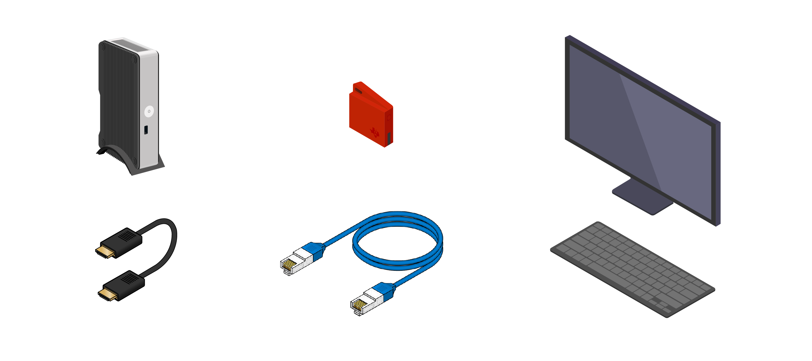
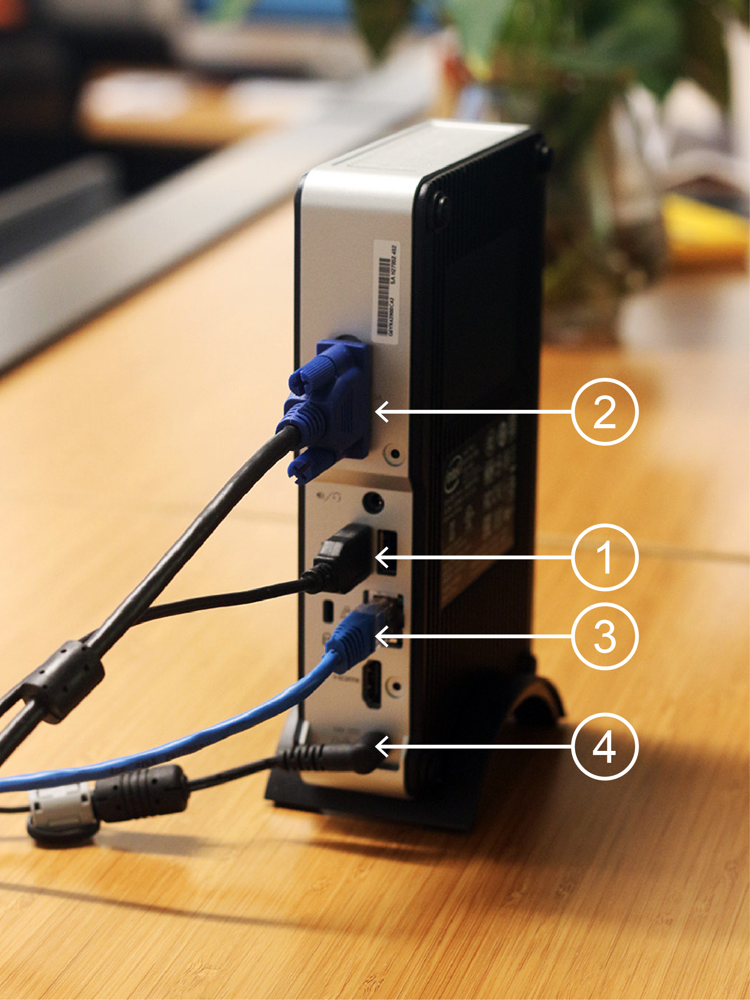
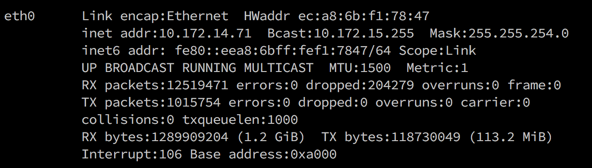
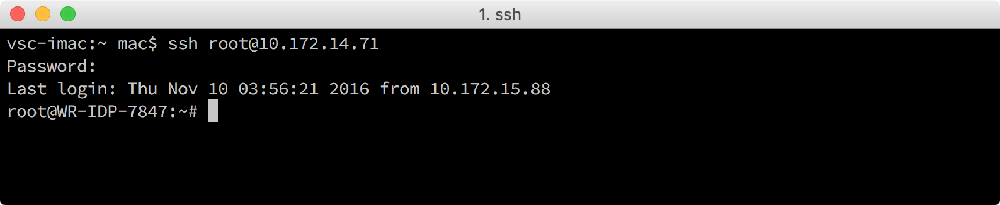
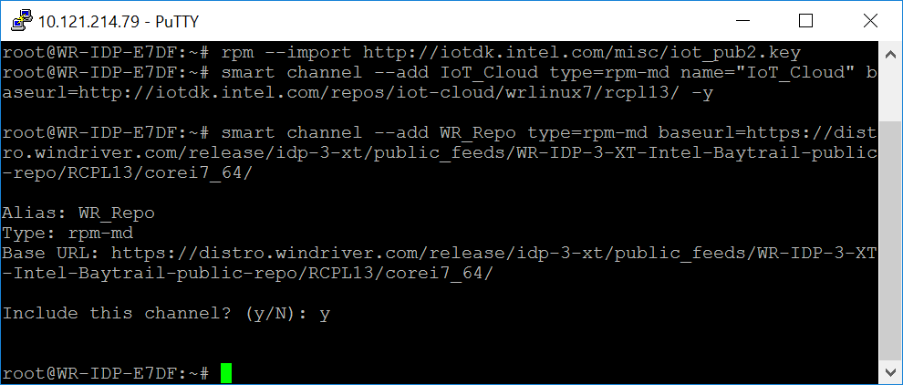
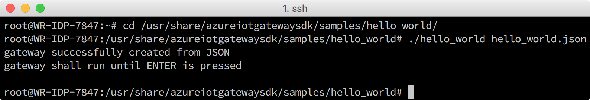
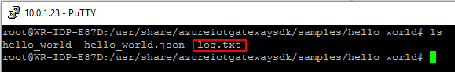
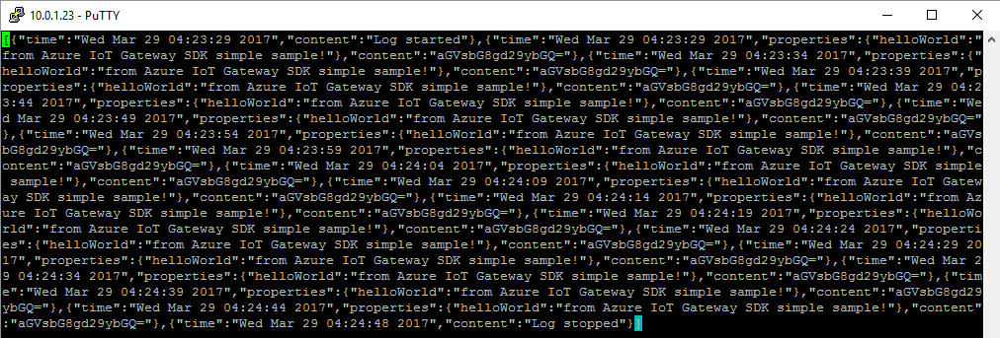

<properties
    pageTitle="SensorTag 设备和 Azure IoT 网关 - 第 1 课：设置 Intel NUC | Azure"
    description="将 Intel NUC 设置为传感器和 Azure IoT 中心之间的 IoT 网关，用于收集传感器信息并将其发送到 IoT 中心。"
    services="iot-hub"
    documentationcenter=""
    author="shizn"
    manager="yjianfeng"
    tags=""
    keywords="iot 网关, intel nuc, nuc 计算机, DE3815TYKE"
    translationtype="Human Translation" />
<tags
    ms.assetid="917090d6-35c2-495b-a620-ca6f9c02b317"
    ms.service="iot-hub"
    ms.devlang="c"
    ms.topic="article"
    ms.tgt_pltfrm="na"
    ms.workload="na"
    ms.date="3/21/2017"
    wacn.date="05/08/2017"
    ms.author="xshi"
    ms.sourcegitcommit="2c4ee90387d280f15b2f2ed656f7d4862ad80901"
    ms.openlocfilehash="51ecb2052a1db1ceb85dcbc2e31f0d17463bd685"
    ms.lasthandoff="04/28/2017" />

# 将 Intel NUC 设置为 IoT 网关
[AZURE.INCLUDE [iot-hub-get-started-device-selector](../../includes/iot-hub-get-started-device-selector.md)]

## 执行的操作

- 将 Intel NUC 设置为 IoT 网关。
- 在 Intel NUC 上安装 Azure IoT 网关 SDK 包。
- 在 Intel NUC 上运行“hello_world”示例应用程序，验证网关功能。

  > 如果有任何问题，请在[故障排除页面](/documentation/articles/iot-hub-gateway-kit-c-troubleshooting/)上查找解决方案。

## 你要学习的知识

本课介绍以下内容：

- 如何将 Intel NUC 与外围设备连接。
- 如何使用智能包管理器在 Intel NUC 上安装和更新所需的包。
- 如何运行“hello_world”示例应用程序来验证网关功能。

## 需要什么

- 预安装 Intel IoT 网关软件套件 (Wind River Linux *7.0.0.13) 的 Intel NUC 工具包 DE3815TYKE。 [单击此处购买 Grove IoT 商业网关工具包](https://www.seeedstudio.com/Grove-IoT-Commercial-Gateway-Kit-p-2724.html)。
- 以太网电缆。
- 键盘。
- HDMI 或 VGA 电缆。
- 带有 HDMI 或 VGA 端口的监视器。
- 可选：[Texas Instruments Sensor Tag (CC2650STK)](http://www.ti.com/tool/cc2650stk)

## 将 Intel NUC 与外设连接

下图是已连接到各种外围设备的 Intel NUC 示例:

1. 连接到键盘。
2. 使用 VGA 电缆或 HDMI 电缆连接到监视器。
3. 使用以太网电缆连接到有线网络。
4. 通过电源线连接到电源。

      

## 通过安全外壳 (SSH) 从主计算机连接到 Intel NUC 系统

此时需要键盘和监视器才能获取 Intel NUC 设备的 IP 地址。 如果已知道 IP 地址，可跳到本部分的步骤 3。

1. 按下电源按钮打开 Intel NUC，然后登录。

    默认用户名和密码都是 `root`。

2. 在 Intel NUC 设备上运行 `ifconfig` 命令，Intel NUC 的 IP 地址。

    以下是命令输出的示例。

    

    在此示例中，`inet addr:` 后面的值是计划从主计算机远程连接到 Intel NUC 时所需的 IP 地址。

3. 使用主计算机的以下任一 SSH 客户端连接到 Intel NUC。

    - [PuTTY](http://www.putty.org/) for Windows。
    - Ubuntu 或 macOS 上的内置 SSH 客户端。

    通过主计算机在 Intel NUC 上执行操作更高效。 需要 Intel NUC 的 IP 地址、用户名和密码才能通过 SSH 客户端与它建立连接。 下面是在 macOS 使用 SSH 客户端的示例。
    
    

## 安装 Azure IoT 网关 SDK 包

Azure IoT 网关 SDK 包中包含 SDK 及其依赖项的预编译二进制文件。 这些二进制文件包括 Azure IoT 网关 SDK、Azure IoT SDK 和相应的工具。 该包还包含用于验证网关功能的“hello_world”示例应用程序。 SDK 是网关的核心部分。 

执行以下步骤安装该包。

1. 在终端窗口中运行以下命令，添加 IoT 云存储库：

        rpm --import http://iotdk.intel.com/misc/iot_pub2.key
        smart channel --add IoT_Cloud type=rpm-md name="IoT_Cloud" baseurl=http://iotdk.intel.com/repos/iot-cloud/wrlinux7/rcpl13/ -y
        smart channel --add WR_Repo type=rpm-md baseurl=https://distro.windriver.com/release/idp-3-xt/public_feeds/WR-IDP-3-XT-Intel-Baytrail-public-repo/RCPL13/corei7_64/

    > 提示“是否包括此通道?”时，输入“y”

    `rpm` 命令导入 rpm 密钥。`smart channel` 命令将 rpm 通道添加到智能包管理器。运行 `smart update` 命令前，将看到如下输出。

      

2. 执行智能更新命令：

        smart update

3. 运行以下命令安装 Azure IoT 网关包：

   
		smart install packagegroup-cloud-azure -y
   

    `packagegroup-cloud-azure` 是包的名称。 `smart install` 命令用于安装包。

    > 如果出现“公钥不可用”错误，请运行以下命令

        smart config --set rpm-check-signatures=false
        smart install packagegroup-cloud-azure -y

    > 如果看到此错误：“无任何包提供 util-linux-dev”，则重新启动 Intel NUC

    安装此包后，Intel NUC 可用作网关。

## 运行 Azure IoT 网关 SDK“hello_world”示例应用程序

此示例应用程序通过 `hello_world.json` 文件创建网关，并使用 Azure IoT 网关 SDK 体系结构的基本组件每隔 5 秒将“hello world”消息记录到文件 (log.txt)。

可以通过执行以下命令来运行 Hello World 示例：

    cd /usr/share/azureiotgatewaysdk/samples/hello_world/
    ./hello_world hello_world.json

允许 Hello World 应用程序运行几分钟，然后点击 Enter 键来将其停止。

> 可以忽略后按 Enter，会显示任何参数无效 handle(NULL) 错误。

可以通过打开现在位于 hello_world 文件夹 中的 log.txt 文件来验证网关是否成功运行

使用以下命令打开 log.txt：

    vim log.txt

然后，你将看到 log.txt，将每隔 5 秒编写的网关 Hello World 模块的日志记录消息的 JSON 格式输出的内容。

如果有任何问题，请在[故障排除页面](/documentation/articles/iot-hub-gateway-kit-c-troubleshooting/)上查找解决方案。

## 摘要

祝贺你！ 现已将 Intel NUC 设置为网关。 接下来可进入下一课，了解如何设置主机、创建 Azure IoT 中心以及注册 Azure IoT 中心逻辑设备。

## 后续步骤
[使用 IoT 网关将设备连接到 Azure IoT 中心](/documentation/articles/iot-hub-gateway-kit-c-iot-gateway-connect-device-to-cloud/)

<!--Update_Description:update wording and code-->