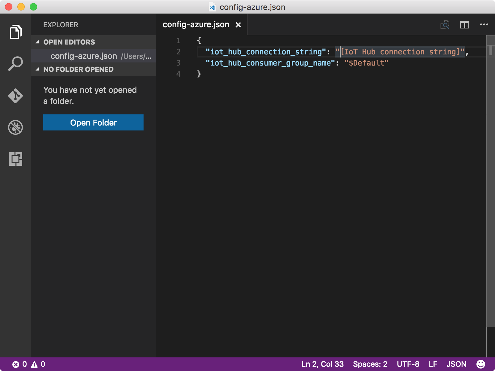

<properties
    pageTitle="从 Azure IoT 中心读取消息 | Azure"
    description="在主计算机上运行示例代码，从 IoT 中心读取消息。"
    services="iot-hub"
    documentationcenter=""
    author="shizn"
    manager="timtl"
    tags=""
    keywords="云中的数据, 云数据收集, iot 云服务, iot 数据" />
<tags
    ms.assetid="cc88be24-b5c0-4ef2-ba21-4e8f77f3e167"
    ms.service="iot-hub"
    ms.devlang="c"
    ms.topic="article"
    ms.tgt_pltfrm="na"
    ms.workload="na"
    ms.date="10/28/2016"
    wacn.date="01/23/2017"
    ms.author="xshi" />  

# 从 IoT 中心读取消息

## 执行的操作

- 在主计算机上运行示例代码，从 IoT 中心读取消息。

如果有任何问题，可在 [troubleshooting 页](/documentation/articles/iot-hub-gateway-kit-c-troubleshooting/)上查找解决方案。

## 你要学习的知识

如何使用 gulp 工具从 IoT 中心读取消息。

## 需要什么

- 在第 3 课中成功运行的 BLE 示例应用程序。

## 获取 IoT 中心和设备连接字符串

设备（TI SensorTag 或模拟设备）用于连接到 IoT 中心的设备连接字符串。IoT 中心连接字符串用于连接到 IoT 中心中的标识注册表，以便管理允许连接到 IoT 中心的设备。

- 运行以下命令，列出资源组中的所有 IoT 中心：

   
		az iot hub list -g iot-gateway --query [].name
   

    使用 `iot-gateway` 作为 `{resource group name}` 的值（如果尚未更改此值）。
    
- 运行以下命令，获取 IoT 中心连接字符串：

   
		az iot hub show-connection-string --name {my hub name} -g iot-gateway
   

    `{my hub name}` 是在第 2 课中指定的名称。

## 配置示例代码的设备连接

更新设备配置文件 `config-azure.json`，以便可以在主计算机上从 IoT 中心读取消息。为此，请执行以下步骤：

1. 在控制台窗口中运行以下命令，在 Visual Studio Code 中打开 `config-azure.json`：

   
		   # For Windows command prompt
		   code %USERPROFILE%\.iot-hub-getting-started\config-azure.json
		   # For MacOS or Ubuntu
		   code ~/.iot-hub-getting-started/config-azure.json
   

2. 在 `config-azure.json` 文件中进行以下替换：

      

    将 `[IoT hub connection string]` 替换为获取的 IoT 中心连接字符串。

## 从 IoT 中心读取消息

如果拥有 TI SensorTag，请确保已打开 SensorTag。通过以下命令运行网关示例应用程序及读取 IoT 中心消息：

	gulp run --iot-hub

该命令运行 BLE 示例应用程序，该 BLE 示例应用程序从 SensorTag 或模拟设备读取和打包温度数据，并每隔 2 秒将消息发送到 IoT 中心。它还生成用于接收消息的子进程。

发送和接收的消息全都在主计算机的同一控制台窗口中即时显示。示例应用程序实例会在 40 秒后自动终止。

  

## 摘要

已运行用于从 IoT 中心读取消息的示例代码。已准备好读取存储在 Azure 表存储中的消息。

## 后续步骤
[创建 Azure 函数应用和 Azure 存储帐户](/documentation/articles/iot-hub-gateway-kit-c-lesson4-deploy-resource-manager-template/)

<!---HONumber=Mooncake_0116_2017-->