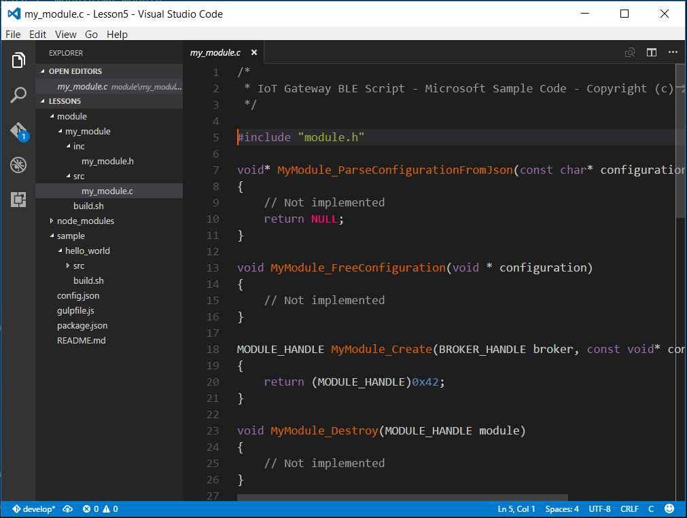
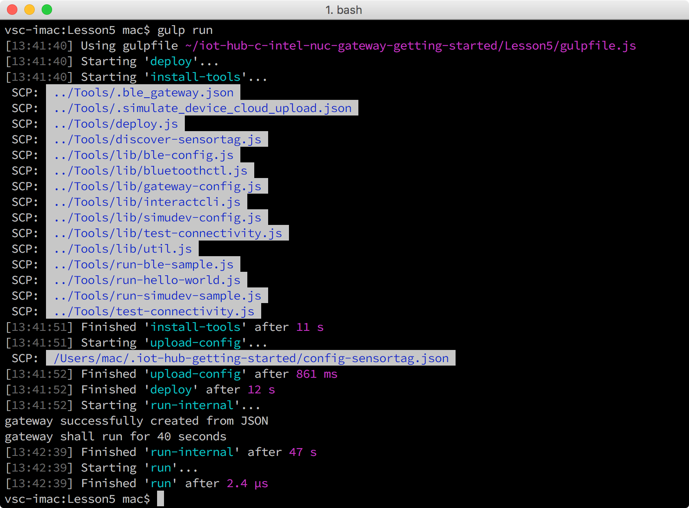
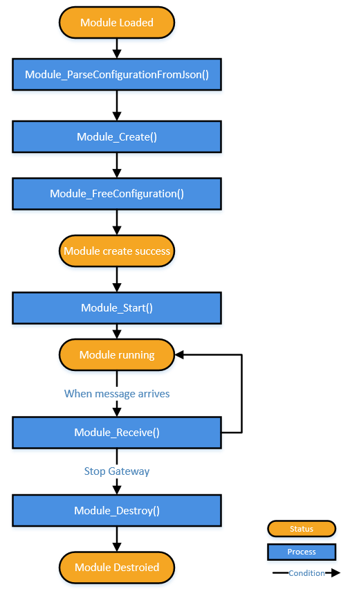
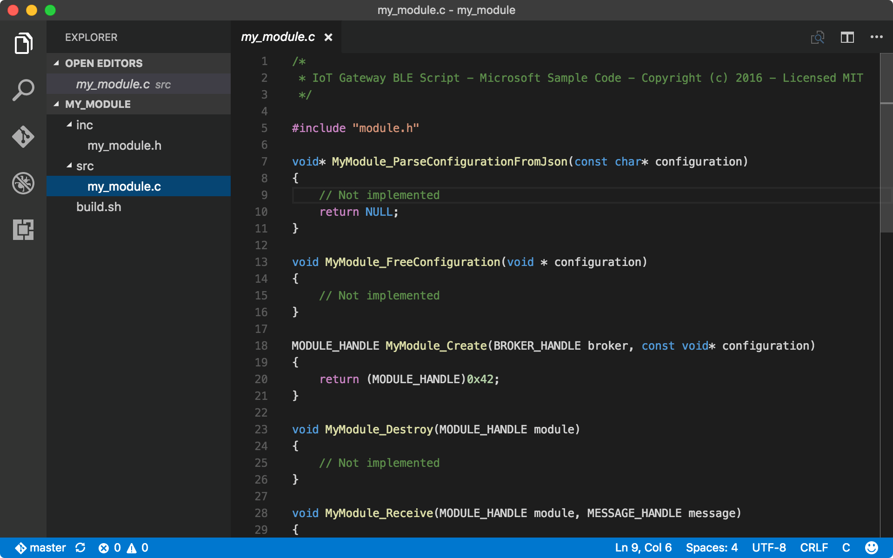
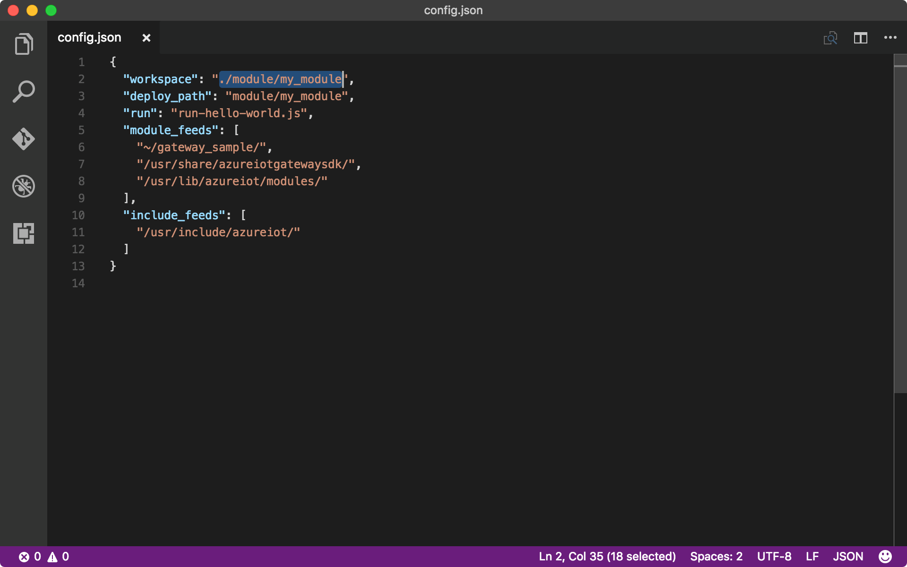
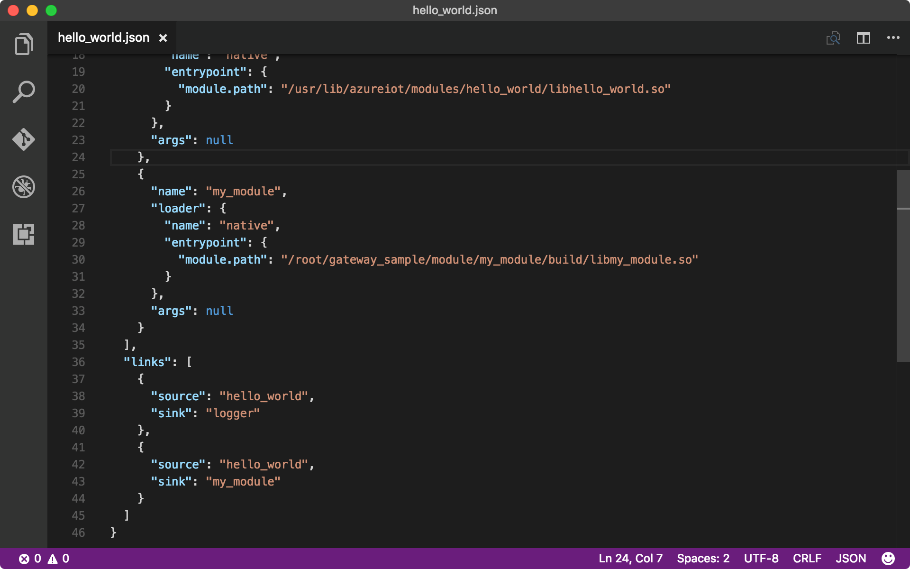
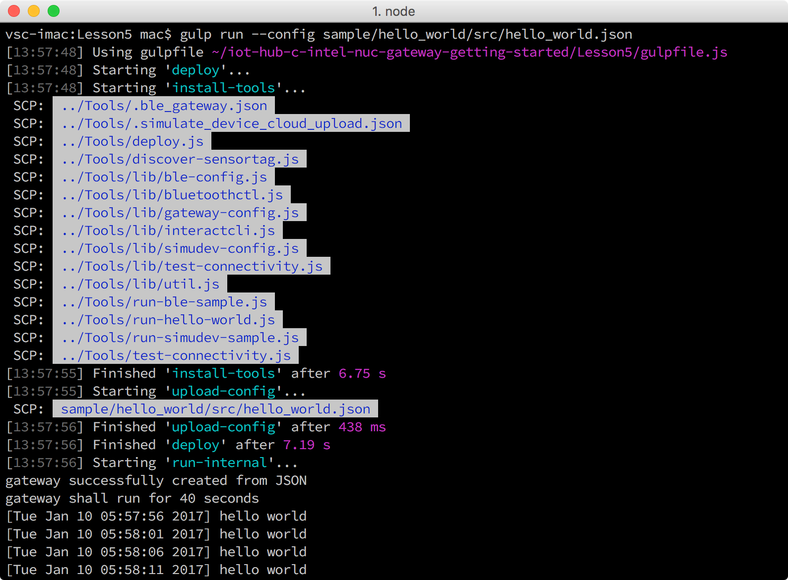

<properties
    pageTitle="创建你的第一个 Azure IoT 网关模块 | Azure"
    description="创建一个模块并将其添加到一个示例应用以自定义模块行为。"
    services="iot-hub"
    documentationcenter=""
    author="shizn"
    manager="timtl"
    tags=""
    keywords="" />
<tags
    ms.assetid="cd7660f4-7b8b-4091-8d71-bb8723165b0b"
    ms.service="iot-hub"
    ms.devlang=""
    ms.topic="article"
    ms.tgt_pltfrm="na"
    ms.workload="na"
    ms.date="02/17/2017"
    wacn.date="06/05/2017"
    ms.author="v-yiso"
    ms.translationtype="Human Translation"
    ms.sourcegitcommit="08618ee31568db24eba7a7d9a5fc3b079cf34577"
    ms.openlocfilehash="878a053c1a911dad021a57f13fc078af51774a10"
    ms.contentlocale="zh-cn"
    ms.lasthandoff="05/26/2017" />

# 第 5 课：创建你的第一个 Azure IoT 网关模块
虽然 Azure IoT Edge 可用于生成以 Java、.NET 或 Node.js 编写的模块，但本教程演示使用 C 生成模块的步骤。

## 执行的操作

- 在 Intel NUC 上编译并运行 hello_world 示例应用。
- 创建一个模块并在 Intel NUC 上编译该模块。
- 将新模块添加到 hello_world 示例应用，然后在 Intel NUC 上运行该示例。 新模块将输出带时间戳的“hello_world”消息。

## 你要学习的知识

- 如何在 Intel NUC 上编译并运行示例应用。
- 如何创建模块。
- 如何将模块添加到示例应用。

## 需要什么

主机计算机上已安装了 Azure IoT Edge。

## 文件夹结构

在你在第 1 课中克隆的示例代码的 Lesson 5 子文件夹中，有一个 `module` 文件夹和一个 `sample` 文件夹。

- `module/my_module` 文件夹中包含用来构建模块的源代码和脚本。
- `sample` 文件夹中包含用来构建示例应用的源代码和脚本。

## 在 Intel NUC 上编译并运行 hello_world 示例应用

`hello_world` 示例根据 `hello_world.json` 文件创建一个网关，该文件指定了与应用关联的两个预定义模块。 网关每隔 5 秒将一条“hello world”消息记录到一个文件中。 在本部分中，你将使用 `hello_world` 应用的默认模块编译并运行该应用。

若要编译并运行 `hello_world` 应用，请在你的主机计算机上执行以下步骤：

1. 通过运行以下命令初始化配置文件：

        cd iot-hub-c-intel-nuc-gateway-getting-started
        cd Lesson5
        npm install
        gulp init

1. 使用 Intel NUC 的 MAC 地址更新网关配置文件。 如果已完成了[配置并运行 BLE 示例应用程序][config_ble]的课程，请跳过此步骤。

   1. 通过运行以下命令，打开网关配置文件：

            # For Windows command prompt
            code %USERPROFILE%\.iot-hub-getting-started\config-gateway.json

            # For MacOS or Ubuntu
            code ~/.iot-hub-getting-started/config-gateway.json

   1. 在[将 Intel NUC 设置为 IoT 网关][setup_nuc]时更新网关的 MAC 地址，然后保存该文件。

1. 通过运行以下命令编译示例源代码：

        gulp compile

    该命令将示例源代码传输到 Intel NUC 并运行 `build.sh` 以对其进行编译。

1. 通过运行以下命令在 Intel NUC 上运行 `hello_world` 应用：

        gulp run

    该命令运行在 `config.json` 中指定的 `../Tools/run-hello-world.js` 以在 Intel NUC 上启动示例应用。

    

## 创建一个新模块并在 Intel NUC 上编译该模块

以下步骤将引导你创建一个新模块并在 Intel NUC 上编译该模块。 该模块在收到带时间戳的消息时将输出这些消息。 在本部分中，你将创建你的第一个自定义网关模块。

任何 Azure IoT Edge 模块都必须实现以下接口：

       pfModule_ParseConfigurationFromJson Module_ParseConfigurationFromJson
       pfModule_FreeConfiguration Module_FreeConfiguration
       pfModule_Create Module_Create
       pfModule_Destroy Module_Destroy
       pfModule_Receive Module_Receive

还可以实现以下接口：

       pfModule_Start Module_Start

下图显示了一个模块的重要状态路径。 方矩形表示你实现的当模块在各种状态之间变化时用来执行操作的方法。 椭圆是模块可以处于的重要状态。

现在，让我们根据模板创建一个模块：

1. 通过运行以下命令打开模板文件夹：

        code module/my_module

    

    - `src/my_module.c` 充当模板，可以用来方便地创建模块。 模板声明了接口。 你需要做的所有工作就是向 `MyModule_Receive` 函数中添加逻辑。
    - `build.sh` 是生成脚本，用来在 Intel NUC 上编辑模块。

1. 打开 `src/my_module.c` 文件并在其中包括两个头文件：

        #include <stdio.h>
        #include "azure_c_shared_utility/xlogging.h"

1. 向 `MyModule_Receive` 函数添加以下代码：

           if (message == NULL)
           {
              LogError("invalid arg message");
           }
           else
           {
              // get the message content
              const CONSTBUFFER * content = Message_GetContent(message);
              // get the local time and format it
              time_t temp = time(NULL);
              if (temp == (time_t)-1)
              {
                  LogError("time function failed");
              }
              else
              {
                  struct tm* t = localtime(&temp);
                  if (t == NULL)
                  {
                      LogError("localtime failed");
                  }
                  else
                  {
                      char timetemp[80] = { 0 };
                      if (strftime(timetemp, sizeof(timetemp) / sizeof(timetemp[0]), "%c", t) == 0)
                      {
                          LogError("unable to strftime");
                      }
                      else
                      {
                          printf("[%s] %.*s\r\n", timetemp, (int)content->size, content->buffer);
                      }
                  }
              }
           }

1. 更新 `config.json` 文件以指定主机计算机上的 `workspace` 文件夹和在 Intel NUC 上的部署路径。 在编译期间，`workspace` 文件夹中的文件将被传输到该部署路径。

   1. 通过运行以下命令打开 `config.json` 文件：

            code config.json

   1. 使用以下配置更新 `config.json`：

            "workspace": "./module/my_module",
            "deploy_path": "module/my_module"

      

1. 通过运行以下命令编译该模块：

        gulp compile

    该命令将源代码传输到 Intel NUC 并运行 `build.sh` 来编译该模块。

## 将模块添加到 hello_world 示例应用，然后在 Intel NUC 上运行该应用

若要执行此任务，请执行以下步骤：

1. 通过运行以下命令列出 Intel NUC 上所有可用的模块二进制文件（.so 文件）：

        gulp modules --list

    编译的 `my_module` 的二进制文件路径应当列出如下：

        /root/gateway_sample/module/my_module/build/libmy_module.so

    如果在 `config-gateway.json` 中更改了默认登录用户名，则二进制文件路径将以 `home/<your username>` 而非 `root` 开头。

1. 将 `my_module` 添加到 `hello_world` 示例应用：

    1. 通过运行以下命令打开 `hello_world.json` 文件：

            code sample/hello_world/src/hello_world.json

    1. 将以下代码添加到 `modules` 部分：

               {
                "name": "my_module",
                "loader": {
                "name": "native",
                "entrypoint": {
                "module.path": "/root/gateway_sample/module/my_module/build/libmy_module.so"
                  }
                 },
                "args": null
               }

      `module.path` 的值应当为 `/root/gateway_sample/module/my_module/build/libmy_module.so`。 该代码声明 `my_module` 将与 `module.path` 中指定的网关以及模块二进制文件的位置相关联。
      
    1. 将以下代码添加到 `links` 部分：

              {
                "source": "hello_world",
                "sink": "my_module"
              }

      该代码指定消息将从 `hello_world` 模块传输到 `my_module`。

      

1. 通过运行以下命令运行 `hello_world` 示例应用：

        gulp run --config sample/hello_world/src/hello_world.json

    `--config` 参数强制 `run-hello-world.js` 脚本使用 `hello_world.json` 文件运行。

    

祝贺。 现在，你可以看到此新模块的行为了，它只是输出带时间戳的“hello world”消息，这不同于原始“hello_world”模块的结果。

## 后续步骤

你已创建了一个新模块，将其添加到了 hello_world 示例，并使该示例应用使用新模块在网关上运行。 如果希望了解关于 Azure IoT 网关模块的详细信息，可以在以下位置找到更多模块示例：[https://github.com/Azure/azure-iot-gateway-sdk/tree/master/modules](https://github.com/Azure/azure-iot-gateway-sdk/tree/master/modules)。

<!-- Images and links -->

[config_ble]: /documentation/articles/iot-hub-gateway-kit-c-lesson3-configure-ble-app/
[setup_nuc]: /documentation/articles/iot-hub-gateway-kit-c-lesson1-set-up-nuc/