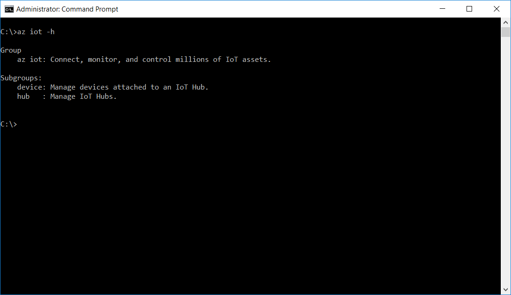

<properties
    pageTitle="准备好主计算机和 Azure IoT 中心 | Azure"
    description="在运行 Windows 的主计算机上安装工具和软件，创建 IoT 中心，以及在 IoT 中心注册设备。"
    services="iot-hub"
    documentationcenter=""
    author="shizn"
    manager="timtl"
    tags=""
    keywords="iot 开发, iot 软件, iot 云服务, 物联网软件, azure cli, 在 windows 上安装 git, gulp 运行, 安装 node js windows, 在 windows 上安装 npm, 在 windows 上安装 python" />
<tags
    ms.assetid="c16eee4c-8756-454b-82bf-3eb0dd51aa5f"
    ms.service="iot-hub"
    ms.devlang="c"
    ms.topic="article"
    ms.tgt_pltfrm="na"
    ms.workload="na"
    ms.date="11/07/2016"
    wacn.date="01/23/2017"
    ms.author="xshi" />  

# 获取工具（Windows 7 及更高版本）
>[AZURE.SELECTOR]
[Windows 7 or later](/documentation/articles/iot-hub-gateway-kit-c-sim-lesson2-get-the-tools-win32/)
[Ubuntu 16.04](/documentation/articles/iot-hub-gateway-kit-c-sim-lesson2-get-the-tools-ubuntu/)
[macOS 10.10](/documentation/articles/iot-hub-gateway-kit-c-sim-lesson2-get-the-tools-mac/)

## 执行的操作

- 安装 Git、Node.js、Gulp、Python。
- 安装 Azure 命令行接口 (Azure CLI)。

如果有问题，可在[故障排除页](/documentation/articles/iot-hub-gateway-kit-c-sim-troubleshooting/)上查找解决方案。

## 你要学习的知识

本课介绍以下内容：

- 如何安装 [Git](https://git-scm.com/) 和 [Node.js](https://nodejs.org/en/)。
  - Git 是一个开源分布式版本控制系统。本课的示例应用程序存储在 Git 中。
  - Node.js 是一个包生态系统很丰富的 JavaScript 运行时。
- 如何使用 [NPM](https://www.npmjs.com/) 安装 Node.js 开发工具。
  - 所需 Node.js 版本最低为 4.5 LTS。
  - NPM 是一个用于 Node.js 的包管理器。
- 如何安装 Visual Studio Code。
  - Visual Studio Code 是一个跨平台的轻型源代码编辑器，功能强大，适用于 Windows、Linux 和 macOS。该编辑器在调试、嵌入式 Git 控件、语法突出显示、智能代码完成、片段和代码重构方面提供极佳的支持。
- 如何安装 Python。
  - Python 是一种广泛使用的、经过解释的高级通用动态编程语言。
- 如何安装 Azure CLI。
  - Azure CLI 提供适用于 Azure 的多平台命令行体验。可直接通过命令行预配和管理资源。
- 如何使用 Azure CLI 创建 IoT 中心。

## 需要什么

- Internet 连接，用于下载工具和软件。
- Windows 计算机。

## 安装 Git 和 Node.js

单击以下链接，下载和安装适用于 Windows 的 Git 和 Node.js LTS。

- [获取适用于 Windows 的 Git](https://git-scm.com/download/win/)
- [获取适用于 Windows 的 Node.js LTS](https://nodejs.org/en/)

## 安装 Node.js 开发工具

使用 [gulp.js](http://gulpjs.com/) 自动部署和执行脚本。

按 `Windows + R`，键入 `cmd` 并按 `Enter` 打开命令提示符窗口，然后运行以下命令：

		npm install -g gulp

如果遇到安装问题，请参阅[故障排除指南](/documentation/articles/iot-hub-gateway-kit-c-sim-troubleshooting/)，获取常见问题的解决方案。

> [!注意]需要节点、NPM 和 Gulp 才能运行在 Node.js 中开发的自动化脚本。

## 安装 Python

可选择 Python 2.7、3.4 或 3.5。在本教程中，我们使用 Python 2.7。如果已安装 Python，请转到下一部分。

[获取用于 Windows 的 Python](https://www.python.org/downloads/)

还需要添加文件夹的路径，以便通过该路径将 Python.exe 和 pip.exe 安装到系统的 `PATH` 环境变量中。默认情况下，python.exe 安装在 `C:\Python27` 中，pip.exe 安装在 `C:\Python27\Scripts` 中。

## 安装 Azure CLI

若要安装 Azure CLI，请执行以下步骤：

1. 以管理员身份打开“命令提示符”窗口。

2. 运行以下命令，安装 Azure CLI：

   
		   pip install --upgrade azure-cli
		   pip install --upgrade azure-cli-iot
   

   安装过程可能需要 5 分钟。

3. 运行以下命令，对安装进行验证：

   
		   az iot -h
   

   如果安装成功，则会看到以下输出。

     

## 安装 Visual Studio Code

稍后在本教程中使用 Visual Studio Code 编辑配置文件。

[下载](https://code.visualstudio.com/docs/setup/windows)并安装 Visual Studio Code。

## 摘要

已在主计算机上安装所有必需的工具和软件。下一个任务是使用 Azure CLI 创建 IoT 中心并在 IoT 中心注册设备。

## 后续步骤
[创建 IoT 中心和注册设备](/documentation/articles/iot-hub-gateway-kit-c-sim-lesson2-register-device/)

<!---HONumber=Mooncake_0116_2017-->