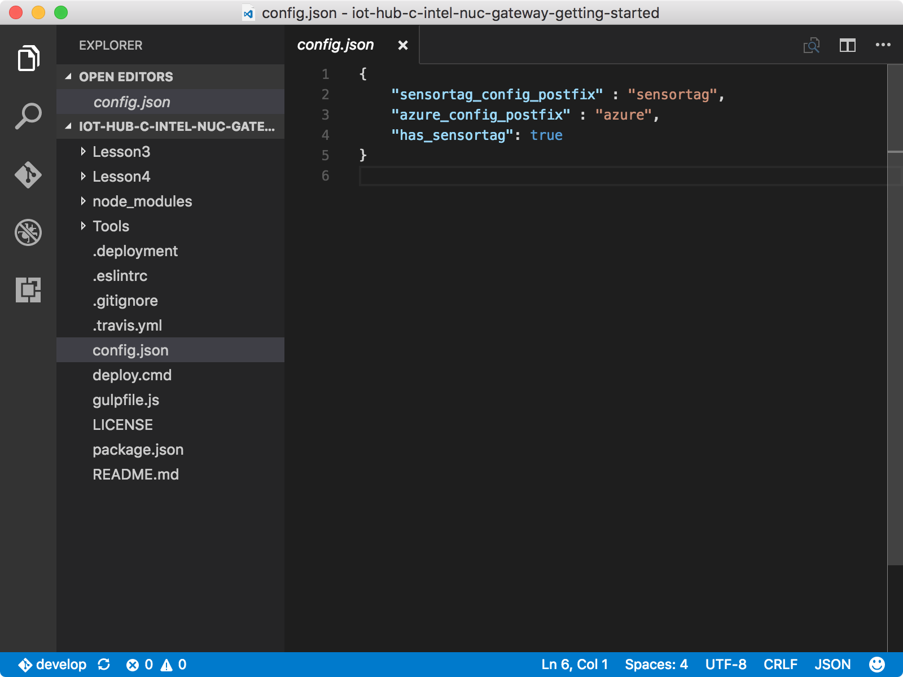
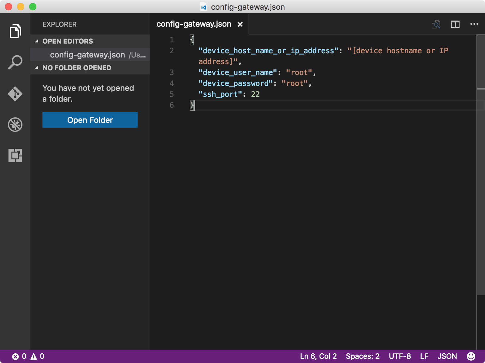
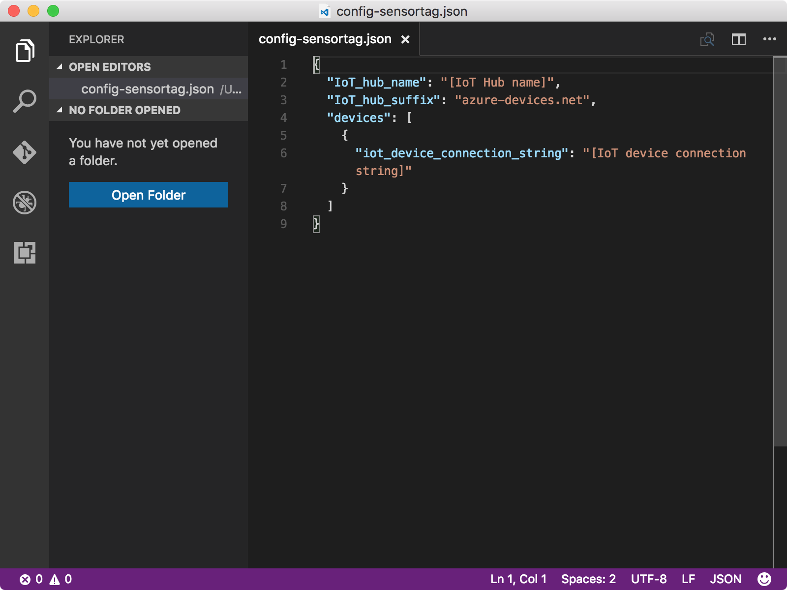
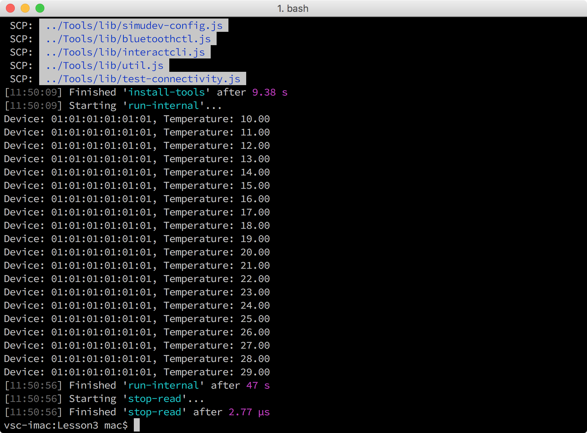

<properties
    pageTitle="运行模拟设备示例应用，将数据发送到 Azure IoT 中心 | Azure"
    description="运行模拟设备示例应用，将温度数据发送到 IoT 中心"
    services="iot-hub"
    documentationcenter=""
    author="shizn"
    manager="timtl"
    tags=""
    keywords="数据到云" />
<tags
    ms.assetid="5d051d99-9749-4150-b3c8-573b0bda9c52"
    ms.service="iot-hub"
    ms.devlang="c"
    ms.topic="article"
    ms.tgt_pltfrm="na"
    ms.workload="na"
    ms.date="10/28/2016"
    wacn.date="01/23/2017"
    ms.author="xshi" />  

# 配置和运行模拟设备示例应用

## 执行的操作

- 克隆示例存储库。
- 使用 Azure CLI 获取模拟设备示例应用程序的 IoT 中心和逻辑设备信息。配置和运行模拟设备示例应用程序。

如果有问题，可在[故障排除页](/documentation/articles/iot-hub-gateway-kit-c-sim-troubleshooting/)上查找解决方案。

## 你要学习的知识

本文介绍：

- 如何配置和运行模拟设备示例应用程序。

## 需要什么

必须已成功完成

- [创建 IoT 中心和注册设备](/documentation/articles/iot-hub-gateway-kit-c-sim-lesson2-register-device/)

## 将示例存储库克隆到主计算机

若要克隆示例存储库，请在主计算机上执行以下步骤：

1. 在 Windows 中打开命令提示符，或在 macOS 或 Ubuntu 中打开终端。
2. 运行以下命令：

   
		   git clone https://github.com/Azure-samples/iot-hub-c-intel-nuc-gateway-getting-started
		   cd iot-hub-c-intel-nuc-gateway-getting-started
   

## 配置模拟设备和 NUC

1. 运行以下命令，在 Visual Studio Code 中打开配置文件 `config.json`：

   
		   code config.json
   

2. 将 `"has_sensortag": true` 替换为 `"has_sensortag": false`

     

3. 运行以下命令初始化配置文件：

   
		   cd Lesson3
		   npm install
		   gulp init
   

4. 运行以下命令，在 Visual Studio Code 中打开 `config-gateway.json`：

   
		   # For Windows command prompt
		   code %USERPROFILE%\.iot-hub-getting-started\config-gateway.json
		   # For macOS or Ubuntu
		   code ~/.iot-hub-getting-started/config-gateway.json
   

5. 找到以下代码行，将 `[device hostname or IP address]` 替换为 Intel NUC 的 IP 地址或主机名。

## 获取 IoT 中心逻辑设备的连接字符串

若要获取逻辑设备的 Azure IoT 中心连接字符串，请在主计算机上运行以下命令：

		az iot device show-connection-string --hub-name {IoT hub name} --device-id mydevice --resource-group iot-gateway

`{IoT hub name}` 是所使用的 IoT 中心名称。使用 iot-gateway 作为 `{resource group name}` 的值，使用 mydevice 作为 `{device id}` 的值（如果尚未更改第 2 课中的值）。

## 配置模拟设备云上传示例应用程序

若要配置和运行模拟设备云上传示例应用程序，请在主计算机上执行以下步骤：

1. 运行以下命令，在 Visual Studio Code 中打开 `config-sensortag.json`：

   
		   # For Windows command prompt
		   code %USERPROFILE%\.iot-hub-getting-started\config-sensortag.json
		   # For macOS or Ubuntu
		   code ~/.iot-hub-getting-started/config-sensortag.json
   

     

2. 在代码中进行以下替换：
   - 将 `[IoT hub name]` 替换为 IoT 中心名称。
   - 将 `[IoT device connection string]` 替换为 IoT 中心逻辑设备的连接字符串。

3. 运行应用程序。

   运行以下命令，部署并运行应用程序：

   
		   gulp run
   

## 确认示例应用程序可以正常运行

现在应看到如下所示的输出：

  

应用程序会将温度数据发送到 IoT 中心，该操作持续 40 秒。

## 摘要

已成功配置并运行模拟设备云上传示例应用程序，该应用程序使用模拟设备将数据发送到 IoT 中心。

## 后续步骤
[从 IoT 中心读取消息](/documentation/articles/iot-hub-gateway-kit-c-sim-lesson3-read-messages-from-hub/)

<!---HONumber=Mooncake_0116_2017-->