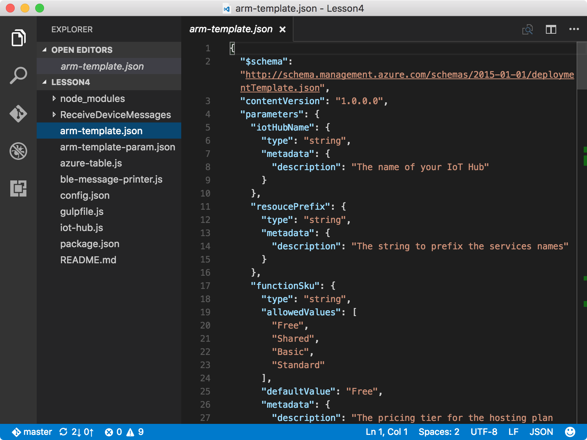
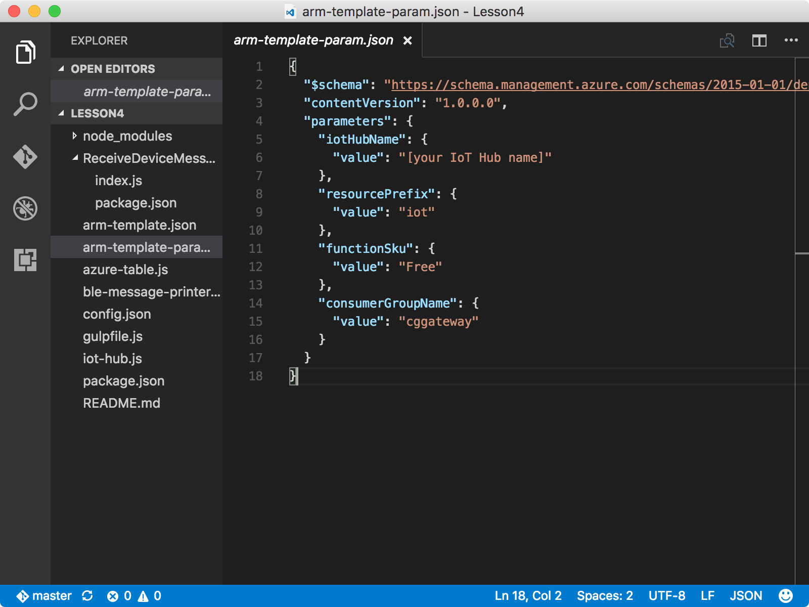

<properties
    pageTitle="将消息保存到 Azure 云并从云中读取 | Azure"
    description="将来自 Intel NUC 的消息保存到 IoT 中心并将其写入 Azure 表存储，然后从云中读取。"
    services="iot-hub"
    documentationcenter=""
    author="shizn"
    manager="timtl"
    tags=""
    keywords="在云中存储数据, 云中存储的数据, iot 云服务" />
<tags
    ms.assetid="ffed0c2e-b092-40e1-9113-8196ec057d67"
    ms.service="iot-hub"
    ms.devlang="c"
    ms.topic="article"
    ms.tgt_pltfrm="na"
    ms.workload="na"
    ms.date="10/28/2016"
    wacn.date="01/23/2017"
    ms.author="xshi" />  

# 创建 Azure Function App 和存储帐户

Azure Functions 是一种解决方案，可轻松地在云中运行 *函数* （小代码片段）。Azure 函数应用在 Azure 中托管函数的执行。

## 执行的操作

- 使用 Azure Resource Manager 模板创建 Azure 函数应用和 Azure 存储帐户。Azure 函数应用可侦听 Azure IoT 中心事件、处理传入消息以及将其写入到 Azure 表存储。

如果有问题，可在[故障排除页](/documentation/articles/iot-hub-gateway-kit-c-sim-troubleshooting/)上查找解决方案。

## 你要学习的知识

本课介绍以下内容：

- 如何使用 Azure Resource Manager 部署 Azure 资源。
- 如何使用 Azure Function App 处理 IoT 中心消息并将其写入 Azure 表存储的表中。

## 需要什么

必须已成功完成前面的课程：

- [第 1 课：将 Intel NUC 设置为 IoT 网关](/documentation/articles/iot-hub-gateway-kit-c-sim-lesson1-set-up-nuc/)
- [第 2 课：准备好主计算机和 Azure IoT 中心](/documentation/articles/iot-hub-gateway-kit-c-sim-lesson2-get-the-tools-win32/)
- [第 3 课：从模拟设备接收消息以及从 IoT 中心读取消息](/documentation/articles/iot-hub-gateway-kit-c-sim-lesson3-configure-simulated-device-app/)

## 打开示例应用

转到 `iot-hub-c-intel-nuc-gateway-getting-started` 存储库文件夹，初始化配置文件，然后运行以下命令，在 Visual Studio Code 中打开示例项目：

		cd Lesson4
		npm install
		gulp init
		code .

  

- `arm-template.json` 文件是 Azure Resource Manager 模板，其中包含一个 Azure 函数应用和一个 Azure 存储帐户。
- `arm-template-param.json` 文件是 Azure Resource Manager 模板使用的配置文件。
- `ReceiveDeviceMessages` 子文件夹包含用于 Azure 函数的 Node.js 代码。

## 在 Azure 中配置 Azure Resource Manager 模板并创建资源

在 Visual Studio Code 中更新 `arm-template-param.json` 文件。

  

- 将 `[your IoT Hub name]` 替换为在第 2 课中指定的 `{my hub name}`。

  更新 `arm-template-param.json` 文件后，请运行以下命令，将资源部署到 Azure：

		az resource group deployment create --template-file arm-template.json --parameters @arm-template-param.json -g iot-gateway

  使用 `iot-gateway` 作为 `{resource group name}` 的值（如果尚未更改第 2 课中的值）。

## 摘要

用户已创建 Azure 函数应用，因此可以处理 IoT 中心消息并通过 Azure 存储帐户存储这些消息。现在可读取网关发送到 IoT 中心的消息。

## 后续步骤
[读取保存在 Azure 存储中的消息](/documentation/articles/iot-hub-gateway-kit-c-sim-lesson4-read-table-storage/)。

<!---HONumber=Mooncake_0116_2017-->