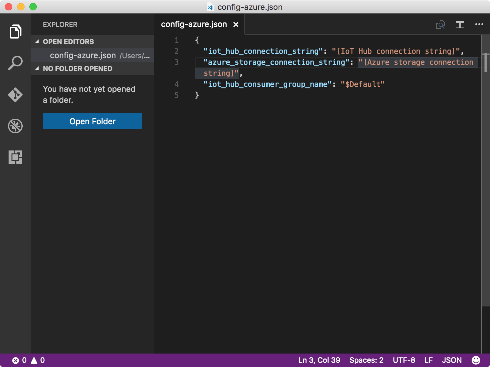
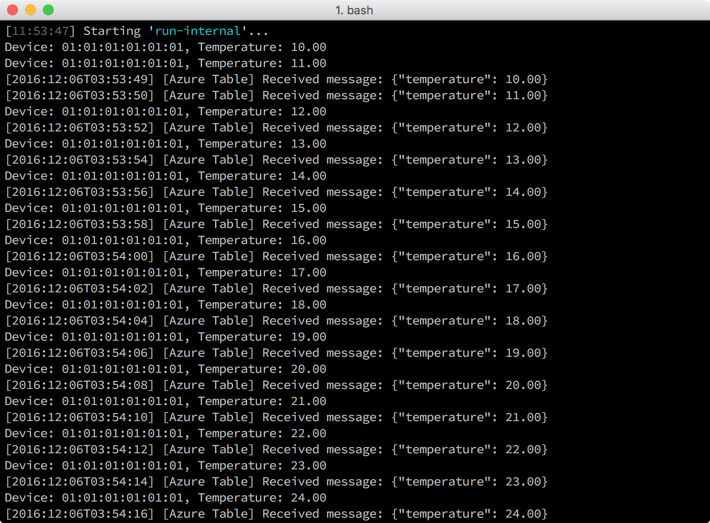

<properties
    pageTitle="读取保存在 Azure 表存储中的消息 | Azure"
    description="将来自 Intel NUC 的消息保存到 IoT 中心并将其写入 Azure 表存储，然后从云中读取。"
    services="iot-hub"
    documentationcenter=""
    author="shizn"
    manager="timtl"
    tags=""
    keywords="从云中检索数据, iot 云服务" />
<tags
    ms.assetid="78e4b6ea-968d-401e-a7dc-8f9acdb3ec1a"
    ms.service="iot-hub"
    ms.devlang="c"
    ms.topic="article"
    ms.tgt_pltfrm="na"
    ms.workload="na"
    ms.date="3/21/2017"
    wacn.date="05/08/2017"
    ms.author="xshi" />  

# 读取保存在 Azure 表存储中的消息

## 执行的操作

- 在网关上运行将消息发送到 IoT 中心的网关示例应用程序。
- 在主计算机上运行示例代码，读取 Azure 表存储中的消息。

如果有问题，可在[故障排除页](/documentation/articles/iot-hub-gateway-kit-c-sim-troubleshooting/)上查找解决方案。

## 你要学习的知识

如何使用 gulp 工具运行示例代码，读取 Azure 表存储中的消息。

## 需要什么

已成功完成以下任务：

- [创建 Azure Function App 和 Azure 存储帐户](/documentation/articles/iot-hub-gateway-kit-c-sim-lesson4-deploy-resource-manager-template/)。
- [运行网关示例应用程序](/documentation/articles/iot-hub-gateway-kit-c-sim-lesson3-configure-simulated-device-app/)。
- [从 IoT 中心读取消息](/documentation/articles/iot-hub-gateway-kit-c-sim-lesson3-read-messages-from-hub/)。

## 获取 Azure 存储连接字符串

在本课前面的部分中，已成功创建 Azure 存储帐户。若要获取 Azure 存储帐户的连接字符串，请运行以下命令：

* 列出所有存储帐户。

		az storage account list -g iot-gateway --query [].name

* 获取 Azure 存储连接字符串。

		az storage account show-connection-string -g iot-gateway -n {storage name}

    使用 `iot-gateway` 作为 `{resource group name}` 的值（如果尚未更改第 2 课中的值）。

## 配置设备连接

更新 `config-azure.json` 文件，以便在主计算机上运行的示例代码可以读取 Azure 表存储中的消息。若要配置设备连接，请执行以下步骤：

1. 运行以下命令，打开设备配置文件 `config-azure.json`：

   
		   # For Windows command prompt
		   code %USERPROFILE%\.iot-hub-getting-started\config-azure.json
		   # For MacOS or Ubuntu
		   code ~/.iot-hub-getting-started/config-azure.json
   

      

2. 将 `[Azure storage connection string]` 替换为获取的 Azure 存储连接字符串。

    `[IoT hub connection string]` 应该已在第 3 课的[从 Azure IoT 中心读取消息](/documentation/articles/iot-hub-gateway-kit-c-sim-lesson3-read-messages-from-hub/)部分中被替换。

## 读取 Azure 表存储中的消息

通过以下命令运行网关示例应用程序及读取 Azure 表存储消息：

	gulp run --table-storage

IoT 中心会在新消息到达时触发 Azure Function 应用程序，将消息保存到 Azure 表存储。`gulp run` 命令运行将消息发送到 IoT 中心的网关示例应用程序。借助 `table-storage` 参数，它还会生成用于接收 Azure 表存储中的已保存消息的子进程。

发送和接收的消息全都在主计算机的同一控制台窗口中即时显示。示例应用程序实例会在 40 秒后自动终止。

  

## 摘要

已运行示例代码读取 Azure Function 应用程序保存在 Azure 表存储中的消息。

<!---HONumber=Mooncake_0116_2017-->