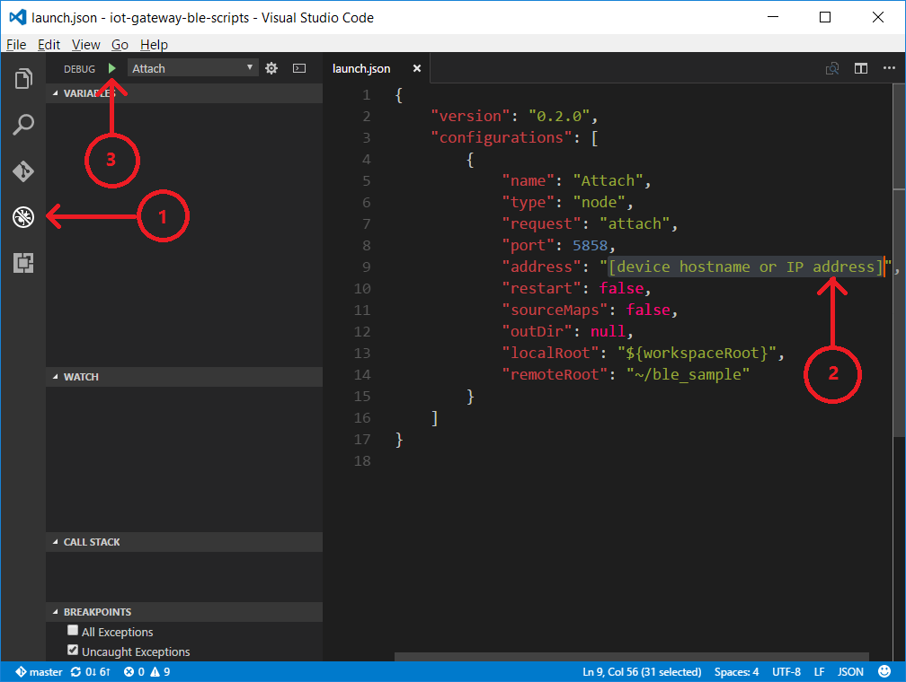
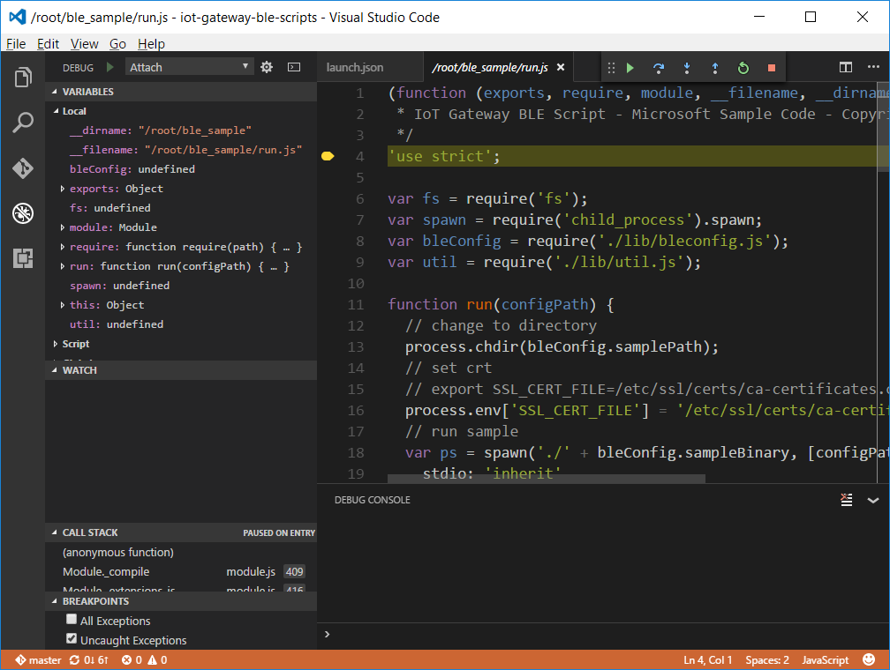

<properties
    pageTitle="Azure IoT 网关故障排除 | Azure"
    description="Intel NUC 网关的故障排除页"
    services="iot-hub"
    documentationcenter=""
    author="shizn"
    manager="timtl"
    tags=""
    keywords="iot 问题, 物联网问题" />
<tags
    ms.assetid="5f742c38-0e33-465a-9a0d-1e41e8d17187"
    ms.service="iot-hub"
    ms.devlang="c"
    ms.topic="article"
    ms.tgt_pltfrm="na"
    ms.workload="na"
    ms.date="10/21/2016"
    wacn.date="02/10/2017"
    ms.author="xshi" />  

# 故障排除

## 硬件问题

### 无法连接 TI SensorTag

若要对 SensorTag 连接问题进行故障排除，请使用 [SensorTag 应用](http://processors.wiki.ti.com/index.php/SensorTag_User_Guide#SensorTag_App_user_guide)。

### Intel NUC 出现问题

若要对启动问题进行故障排除，请参阅 [Troubleshooting No Boot Issues on Intel NUC](http://www.intel.com/content/www/us/en/support/boards-and-kits/000005845.html)（对 Intel NUC 上的无启动问题进行故障排除）。

若要对操作系统问题进行故障排除，请参阅 [Troubleshooting Operating System Issues on Intel NUC](http://www.intel.com/content/www/us/en/support/boards-and-kits/000006018.html)（对 Intel NUC 上的操作系统问题进行故障排除）。

若要对其他问题进行故障排除，请参阅 [Blink Codes and Beep Codes for Intel NUC](http://www.intel.com/content/www/us/en/support/boards-and-kits/intel-nuc-boards/000005854.html)（Intel NUC 的闪烁代码和蜂鸣代码）。

## Node.js 包问题

### 在 Gulp 任务期间没有响应

如果在运行 Gulp 任务时遇到问题，可添加 `--verbose` 选项进行调试。请尝试使用 `Ctrl + C` 终止当前 gulp 任务，然后在控制台窗口中运行以下命令，以便查看调试消息。可以在控制台输出中查看详细的错误消息。

	gulp --verbose

### 设备发现问题

有关使用 `discover-sensortag` 命令对常见问题进行故障排除的帮助，请查看 [wiki 页](https://wiki.archlinux.org/index.php/bluetooth#Bluetoothctl)。

### npm 问题

尝试运行以下命令，更新 npm 包：

	npm install -g npm

如果问题仍然存在，请在本文末尾留下你的评论，或者在[示例存储库](https://github.com/azure-samples/iot-hub-c-intel-nuc-gateway-getting-started)中创建一个 GitHub 问题。

## 远程调试
> 以下说明介绍如何调试本教程中使用的 node.js 脚本。
### 在调试模式下运行示例应用程序

运行以下命令，在调试模式下运行示例应用程序：

	gulp run --debug

调试引擎就绪以后，就会在控制台输出中看到`Debugger listening on port 5858`。

### 将 Visual Studio Code 配置为连接到远程设备

1. 打开左侧的“调试”面板。
2. 单击绿色的“开始调试”(F5) 按钮。Visual Studio Code 打开 `launch.json` 文件。
3. 使用以下内容更新 `launch.json` 文件。将 `[device hostname or IP address]` 替换为实际的设备 IP 地址或主机名。

   
		   {
		     "version": "0.2.0",
		     "configurations": [
		        {
		            "name": "Attach",
		            "type": "node",
		            "request": "attach",
		            "port": 5858,
		            "address": "[device hostname or IP address]",
		            "restart": false,
		            "sourceMaps": false,
		            "outDir": null,
		            "localRoot": "${workspaceRoot}",
		            "remoteRoot": "~/ble_sample"
		        }
		     ]
		   }
   

      

### 连接到远程应用程序

单击绿色的“开始调试”(F5) 按钮开始调试。

若要详细了解调试器，请参阅 [JavaScript in VS Code](https://code.visualstudio.com/docs/languages/javascript#_debugging)（VS Code 中的 JavaScript）。

  

## Azure CLI 问题

Azure 命令行接口 (Azure CLI) 为预览版。

如果在使用此工具时遇到 Bug，请在 GitHub 存储库的“问题”部分提交[问题](https://github.com/Azure/azure-cli/issues)。

如需常见问题的疑难解答帮助，请查看[自述文件](https://github.com/Azure/azure-cli/blob/master/README.rst)。

如果遇到“找不到满足需求的版本”，请运行以下命令，将 pip 升级到最新版本。

	python -m pip install --upgrade pip
	

## Python 安装问题

### 旧版安装问题 (macOS)

安装 pip 时，如果使用 **su** 权限安装的包较旧，则会引发权限错误。之所以会出现这种情况，是因为未彻底卸载以前使用 brew (macOS) 安装的 Python。以前安装时留下的某些 pip 包是通过根权限创建的，因此会导致权限错误。删除这些通过根权限安装的包即可解决问题。通过以下步骤完成该任务：

1. 转到 `/usr/local/lib/python2.7/site-packages`
2. 列出通过根权限创建的包：`ls -l | grep root`
3. 卸载步骤 2 中的包：`sudo rm -rf {package name}`
4. 重新安装 Python。

## Azure IoT 中心问题

如果已通过 Azure CLI 成功预配 Azure IoT 中心，且需要使用工具管理连接到 IoT 中心的设备，可尝试以下工具。

### 设备资源管理器

[设备资源管理器](https://github.com/Azure/azure-iot-sdk-csharp/blob/master/tools/DeviceExplorer)在 Windows 本地计算机上运行，并连接到 Azure 中的 IoT 中心。它与以下 [IoT 中心终结点](/documentation/articles/iot-hub-devguide/)通信：

- 设备标识管理，用于预配和管理注册到 IoT 中心的设备。
- 接收设备到云消息，以便监视从设备发送到 IoT 中心的消息。
- 发送云到设备消息，以便将消息从 IoT 中心发送到设备。

在此工具中配置 IoT 中心连接字符串，以便使用其所有功能。

### iothub-explorer

[iothub-explorer](https://github.com/Azure/iothub-explorer) 是一项示例性的多平台 CLI 工具，用于管理设备客户端。可以使用该工具在标识注册表中管理设备、监视从设备到云的消息，以及发送从云到设备的命令。

若要安装最新（预发行）版的 iothub-explorer 工具，请运行以下命令：

	npm install -g iothub-explorer@latest

若要获取有关所有 iothub-explorer 命令及其参数的其他帮助，请运行以下命令：

	iothub-explorer help

### Azure 门户预览

完整的 CLI 体验有助于用户创建和管理其所有 Azure 资源。还可能需要借助 [Azure 门户预览](/documentation/articles/azure-portal-overview/)对 Azure 资源进行预配、管理和调试。

## Azure 存储问题

[Microsoft Azure 存储资源管理器（预览版）](http://storageexplorer.com/)是 Microsoft 推出的一款独立的应用，可用于在 Windows、OS X 和 Linux 上处理 Azure 存储数据。可以使用此工具连接到表并查看其中的数据。可以使用此工具排查 Azure 存储问题。

<!---HONumber=Mooncake_0206_2017-->
<!--Update_Description:update meta properties and link references-->