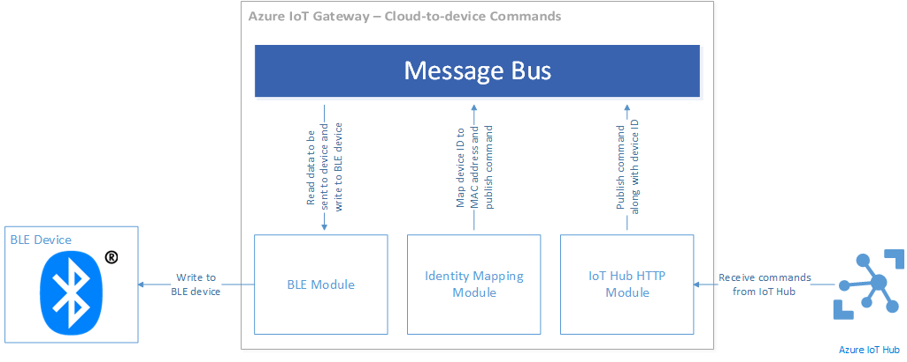

<properties
	pageTitle="通过网关 SDK 使用实际设备 | Azure"
	description="Azure IoT 中心网关 SDK 演练使用 Texas Instruments SensorTag 通过 Intel Edison 计算模块上运行的网关将数据发送到 IoT 中心"
	services="iot-hub"
	documentationCenter=""
	authors="chipalost"
	manager="timlt"
	editor=""/>  


<tags
     ms.service="iot-hub"
     ms.devlang="cpp"
     ms.topic="article"
     ms.tgt_pltfrm="na"
     ms.workload="na"
     ms.date="11/14/2016"
     wacn.date="12/12/2016"
     ms.author="andbuc"/>


# Azure IoT 网关 SDK - 使用 Linux 通过实际设备发送设备到云消息

本演练的蓝牙低功耗示例演示如何使用 [Microsoft Azure IoT 网关 SDK][lnk-sdk] 从物理设备将设备到云遥测转发到 IoT 中心以及如何从 IoT 中心将命令路由到物理设备。

本文介绍的内容包括：

* **体系结构**：与蓝牙低功耗示例有关的重要体系结构信息。
* **生成并运行**：生成并运行示例所需的步骤。

## 体系结构
本演练演示如何在运行 Raspbian Linux 的 Raspberry Pi 3 上生成和运行 IoT 网关。该网关是使用 IoT 网关 SDK 生成的。此示例使用 Texas Instruments SensorTag 蓝牙低功耗 (BLE) 设备收集温度数据。

当你运行网关时，它：

- 使用蓝牙低功耗 (BLE) 协议连接到 SensorTag 设备。
- 使用 HTTP 协议连接到 IoT 中心。
- 从 SensorTag 设备将遥测转发到 IoT 中心。
- 从 IoT 中心将命令路由到 SensorTag 设备。

该网关包含以下模块：

- *BLE 模块*，与 BLE 设备相连接，从设备接收温度数据并将命令发送到设备。
- *BLE 云到设备模块*，用于为 *BLE 模块*将来自云的 JSON 消息转换为 BLE 指令。
- *记录器模块*，用于将所有网关消息记录记录到本地文件中。
- *标识映射模块*，用于在 BLE 设备 MAC 地址和 Azure IoT 中心设备标识之间进行转换。
- *IoT 中心模块*，用于将遥测数据上传到 IoT 中心并接收来自 IoT 中心的设备命令。
- *BLE 打印机模块*，用于解释 BLE 设备的遥测，并将格式化数据输出到控制台，以启用故障排除和调试。

### 数据如何流经网关

以下块图说明了遥测上载数据流管道：

  


通过以下步骤将遥测项从 BLE 设备传输到 IoT 中心：

1. BLE 设备生成温度样本并将其通过蓝牙发送到网关的 BLE 模块。
2. BLE 模块接收该样本，并将其与设备的 MAC 地址一起发布到中转站。
3. 标识映射模块提取此消息，并使用内部表将设备的 MAC 地址转换为 IoT 中心设备标识（设备 ID 和设备密钥）。然后，它会发布新消息（包含温度样本数据、设备的 MAC 地址、设备 ID 和设备密钥）。
4. IoT 中心模块接收此新消息（由标识映射模块生成），并将其发布到 IoT 中心。
5. 记录器模块将中转站中的所有消息记录到本地文件中。

以下块图说明了设备命令数据流管道：

  


1. IoT 中心模块会定期在 IoT 中心中轮询新的命令消息。
2. 当 IoT 中心模块收到新的命令消息时，它会将其发布到中转站。
3. 标识映射模块提取该命令消息，并使用内部表将 IoT 中心设备 ID 转换为设备 MAC 地址。然后，它发布新消息（在消息的属性映射中包括目标设备的 MAC 地址）。
4. BLE 云到设备模块提取此消息，并为 BLE 模块将其转换为正确 BLE 指令。然后它发布新消息。
5. BLE 模块通过 BLE 设备进行通信提取该消息并执行 I/O 指令。
6. 记录器模块将中转站中的所有消息记录到磁盘文件中。

## 准备硬件
本教程假设使用的是已连接到运行 Raspbian 的 Raspberry Pi 3 的 [Texas Instruments SensorTag](http://www.ti.com/ww/en/wireless_connectivity/sensortag2015/index.html) 设备。

### 安装 Raspbian
可以使用以下任一选项在 Raspberry Pi 3 设备上安装 Raspbian。

* 使用 [NOOBS][lnk-noobs]（图形用户界面）安装 Raspbian 的最新版本。
* 手动[下载][lnk-raspbian] Raspbian 操作系统的最新映像，并写入 SD 卡中。

### 安装 BlueZ 5.37
BLE 模块通过 BlueZ 堆栈与蓝牙硬件通信。需要 BlueZ 5.37 版才能让模块正常运行。这些说明可确保安装 BlueZ 的正确版本。

1. 停止运行当前蓝牙守护程序：
   
    ```
    sudo systemctl stop bluetooth
    ```
2. 安装 BlueZ 依赖项。
   
    ```
    sudo apt-get update
    sudo apt-get install bluetooth bluez-tools build-essential autoconf glib2.0 libglib2.0-dev libdbus-1-dev libudev-dev libical-dev libreadline-dev
    ```
3. 从 bluez.org 下载 BlueZ 源代码。
   
    ```
    wget http://www.kernel.org/pub/linux/bluetooth/bluez-5.37.tar.xz
    ```
4. 解压缩源代码。
   
    ```
    tar -xvf bluez-5.37.tar.xz
    ```
5. 将目录更改为新创建的文件夹。
   
    ```
    cd bluez-5.37
    ```
6. 配置要生成的 BlueZ 代码。
   
    ```
    ./configure --disable-udev --disable-systemd --enable-experimental
    ```
7. 生成 BlueZ。
   
    ```
    make
    ```
8. 完成生成后安装 BlueZ。
   
    ```
    sudo make install
    ```
9. 更改蓝牙的 systemd 服务配置，使其指向文件 `/lib/systemd/system/bluetooth.service` 中的新蓝牙守护程序。使用以下文本替换“'ExecStart”行：
    
    ```
    ExecStart=/usr/local/libexec/bluetooth/bluetoothd -E
    ```

### 从 Raspberry Pi 3 设备启用到 SensorTag 设备的连接
运行示例前，需要确认 Raspberry Pi 3 可以连接到 SensorTag 设备。


1. 确保安装 `rfkill` 实用程序。
   
    ```
    sudo apt-get install rfkill
    ```
2. 打开 Raspberry Pi 3 上的蓝牙，确认版本号为 **5.37**。
   
    ```
    sudo rfkill unblock bluetooth
    bluetoothctl --version
    ```
3. 启动蓝牙服务并执行 **bluetoothctl** 命令，进入交互式蓝牙外壳。
   
    ```
    sudo systemctl start bluetooth
    bluetoothctl
    ```
4. 输入“启动”命令，打开蓝牙控制器。你应看到如下输出：
   
    ```
    [NEW] Controller 98:4F:EE:04:1F:DF C3 raspberrypi [default]
    ```

4. 在交互式蓝牙程序中时，输入“打开扫描”命令以扫描蓝牙命令。你应看到如下输出：
    
    ```
    Discovery started
    [CHG] Controller 98:4F:EE:04:1F:DF Discovering: yes
    ```
6. 通过按小按钮（绿色 LED 应闪烁）使 SensorTag 设备可检测到。Raspberry Pi 3 应发现 SensorTag 设备：
   
    ```
    [NEW] Device A0:E6:F8:B5:F6:00 CC2650 SensorTag
    [CHG] Device A0:E6:F8:B5:F6:00 TxPower: 0
    [CHG] Device A0:E6:F8:B5:F6:00 RSSI: -43
    ```
    
    在此示例中，可看到 SensorTag 设备的 MAC 地址为 **A0:E6:F8:B5:F6:00**。

6. 输入“关闭扫描”命令来关闭扫描。
    
    ```
    [CHG] Controller 98:4F:EE:04:1F:DF Discovering: no
    Discovery stopped
    ```

7. 输入 **connect <MAC address>**，利用 MAC 地址连接到 SensorTag 设备。请注意，下面的示例输出已节略：
    
    ```
    Attempting to connect to A0:E6:F8:B5:F6:00
    [CHG] Device A0:E6:F8:B5:F6:00 Connected: yes
    Connection successful
    [CHG] Device A0:E6:F8:B5:F6:00 UUIDs: 00001800-0000-1000-8000-00805f9b34fb
    ...
    [NEW] Primary Service
            /org/bluez/hci0/dev_A0_E6_F8_B5_F6_00/service000c
            Device Information
    ...
    [CHG] Device A0:E6:F8:B5:F6:00 GattServices: /org/bluez/hci0/dev_A0_E6_F8_B5_F6_00/service000c
    ...
    [CHG] Device A0:E6:F8:B5:F6:00 Name: SensorTag 2.0
    [CHG] Device A0:E6:F8:B5:F6:00 Alias: SensorTag 2.0
    [CHG] Device A0:E6:F8:B5:F6:00 Modalias: bluetooth:v000Dp0000d0110
    ```
   
    > 请注意，可使用 **list-attributes** 命令重新列出设备的 GATT 特征。
9. 现可使用“disconnect”断开与设备的连接，然后使用“quit”命令退出蓝牙程序：
   
    ```
    Attempting to disconnect from A0:E6:F8:B5:F6:00
    Successful disconnected
    [CHG] Device A0:E6:F8:B5:F6:00 Connected: no
    ```

现在，可在 Raspberry Pi 3 上运行 BLE 网关示例。

## 运行 BLE 网关示例
若要运行 BLE 示例，需要完成三个任务：

- 在 IoT 中心中配置两个示例设备。
- 在 Raspberry Pi 3 设备上生成 IoT 网关 SDK。
- 在 Raspberry Pi 3 设备上配置和运行 BLE 示例。

撰写本文时，IoT 网关 SDK 仅支持在 Linux 上使用 BLE 模块的网关。

### 在 IoT 中心中配置两个示例设备

- 若要在 Azure 订阅中[创建 IoT 中心][lnk-create-hub]，需要中心的名称来完成本演练。如果没有帐户，只需花费几分钟就能创建一个[帐户][lnk-free-trial]。
- 将名为 **SensorTag\_01** 的设备添加到 IoT 中心，记下其 ID 和设备密钥。可使用[设备资源管理器或 iothub-explorer][lnk-explorer-tools] 工具将此设备添加至上一步中创建的 IoT 中心，然后检索其密钥。配置网关时，可将此设备映射到 SensorTag 设备。

### 在 Raspberry Pi 3 上生成 Azure IoT 网关 SDK

安装 Azure IoT 网关 SDK 的依赖项。

``` 
sudo apt-get install cmake uuid-dev curl libcurl4-openssl-dev libssl-dev
```
使用以下命令将 IoT 网关 SDK 及其所有子模块克隆到主目录：

```
cd ~
git clone --recursive https://github.com/Azure/azure-iot-gateway-sdk.git 
cd azure-iot-gateway-sdk
git submodule update --init --recursive
```

Raspberry Pi 3 上有 IoT 网关 SDK 存储库的完整副本时，可以从包含该 SDK 的文件夹使用以下命令生成它：

```
./tools/build.sh --skip-unittests --skip-e2e-tests
```

### 在 Raspberry Pi 3 上配置和运行 BLE 示例
若要启动和运行示例，需要配置参与网关的每个模块。在 JSON 文件中提供了此配置，你需要配置所有五个参与模块。存储库中提供了名为 **gateway\_sample.json** 的示例 JSON 文件，可将它用作自行生成配置文件的起点。此文件位于 IoT 网关 SDK 存储库的本地副本的 **samples/ble\_gateway/src** 文件夹中。

以下部分介绍如何编辑 BLE 示例的此配置文件，并假设 IoT 网关 SDK 存储库位于 Raspberry Pi 3 的 **/home/pi/azure-iot-gateway-sdk/** 文件夹中。如果存储库在其他位置，则应相应地调整路径：

#### 记录器配置
假设网关存储库位于 **/home/pi/azure-iot-gateway-sdk/** 文件夹中，请按如下所示配置记录器模块：

```json
{
  "name": "Logger",
  "loader": {
    "name" : "native",
    "entrypoint" : {
      "module.path" : "build/modules/logger/liblogger.so"
    }
  },
  "args":
  {
    "filename": "<</path/to/log-file.log>>"
  }
}
```

#### BLE 模块配置
BLE 设备的示例配置假定使用 Texas Instruments SensorTag 设备。任何可以作为 GATT 外围设备运行的标准 BLE 设备都应可以使用，但你需要更新 GATT 特征 ID 和数据（用于编写说明）。添加 SensorTag 设备的 MAC 地址：

```json
{
  "name": "SensorTag",
  "loader": {
    "name" : "native",
    "entrypoint" : {
      "module.path": "build/modules/ble/libble.so"
    }
  },
  "args": {
    "controller_index": 0,
    "device_mac_address": "<<AA:BB:CC:DD:EE:FF>>",
    "instructions": [
      {
        "type": "read_once",
        "characteristic_uuid": "00002A24-0000-1000-8000-00805F9B34FB"
      },
      {
        "type": "read_once",
        "characteristic_uuid": "00002A25-0000-1000-8000-00805F9B34FB"
      },
      {
        "type": "read_once",
        "characteristic_uuid": "00002A26-0000-1000-8000-00805F9B34FB"
      },
      {
        "type": "read_once",
        "characteristic_uuid": "00002A27-0000-1000-8000-00805F9B34FB"
      },
      {
        "type": "read_once",
        "characteristic_uuid": "00002A28-0000-1000-8000-00805F9B34FB"
      },
      {
        "type": "read_once",
        "characteristic_uuid": "00002A29-0000-1000-8000-00805F9B34FB"
      },
      {
        "type": "write_at_init",
        "characteristic_uuid": "F000AA02-0451-4000-B000-000000000000",
        "data": "AQ=="
      },
      {
        "type": "read_periodic",
        "characteristic_uuid": "F000AA01-0451-4000-B000-000000000000",
        "interval_in_ms": 1000
      },
      {
        "type": "write_at_exit",
        "characteristic_uuid": "F000AA02-0451-4000-B000-000000000000",
        "data": "AA=="
      }
    ]
  }
}
```

#### IoT 中心模块
添加 IoT 中心的名称。后缀值通常是 **azure-devices.net**：

```json
{
  "name": "IoTHub",
  "loader": {
    "name" : "native",
    "entrypoint" : {
      "module.path": "build/modules/iothub/libiothub.so"
    }
  },
  "args": {
    "IoTHubName": "<<Azure IoT Hub Name>>",
    "IoTHubSuffix": "<<Azure IoT Hub Suffix>>",
    "Transport" : "amqp"
  }
}
```

#### 标识映射模块配置
添加 SensorTag 设备的 MAC 地址，以及添至 IoT 中心的 **SensorTag\_01** 设备的设备 ID 和密钥：

```json
{
  "name": "mapping",
  "loader": {
    "name" : "native",
    "entrypoint" : {
      "module.path": "build/modules/identitymap/libidentity_map.so"
    }
  },
  "args": [
    {
      "macAddress": "AA:BB:CC:DD:EE:FF",
      "deviceId": "<<Azure IoT Hub Device ID>>",
      "deviceKey": "<<Azure IoT Hub Device Key>>"
    }
  ]
}
```

#### BLE 打印机模块配置
```json
{
  "name": "BLE Printer",
  "loader": {
    "name" : "native",
    "entrypoint" : {
      "module.path": "build/samples/ble_gateway/ble_printer/libble_printer.so"
    }
  },
  "args": null
}
```

#### BLEC2D 模块配置
```json
{
  "name": "BLEC2D",
  "loader": {
    "name" : "native",
    "entrypoint" : {
      "module.path": "build/modules/ble/libble_c2d.so"
    }
  },
  "args": null
}
```

#### 路由配置
以下配置可确保以下各项：
- **Logger** 模块接收并记录所有消息。
- **SensorTag** 模块将消息发送到 **mapping** 和 **BLE Printer** 模块。
- **mapping** 模块将消息发送到 **IoTHub** 模块以向上发送到 IoT 中心。
- **IoTHub** 模块将消息发送回 **mapping** 模块。
- **mapping** 模块将消息发送到 **BLEC2D** 模块。
- **BLEC2D** 模块将消息发回 **SensorTag** 模块。


        "links" : [
            {"source" : "*", "sink" : "Logger" },
            {"source" : "SensorTag", "sink" : "mapping" },
            {"source" : "SensorTag", "sink" : "BLE Printer" },
            {"source" : "mapping", "sink" : "IoTHub" },
            {"source" : "IoTHub", "sink" : "mapping" },
            {"source" : "mapping", "sink" : "BLEC2D" },
            {"source" : "BLEC2D", "sink" : "SensorTag"}
         ]


若要运行示例，请将 JSON 配置文件的路径传递到 **ble\_gateway** 二进制文件。如果使用 **gateway\_sample.json** 文件，请执行如下命令。从 azure-iot-gateway-sdk 目录执行此命令


        ./build/samples/ble_gateway/ble_gateway ./samples/ble_gateway/src/gateway_sample.json


在运行示例前，可能需要按 SensorTag 设备上的小按钮，使其可被发现。

运行示例时，可使用[设备资源管理器或 iothub-explorer][lnk-explorer-tools] 工具来监视网关从 SensorTag 设备转发的消息。

## 发送云到设备的消息
BLE 模块还支持从 Azure IoT 中心将指令发送到设备。可使用 Azure IoT 中心设备资源管理器或 IoT 中心资源管理器将传递 BLE 网关模块的 JSON 消息发送到 BLE 设备。如果使用 Texas Instruments SensorTag 设备，则可以从 IoT 中心发送命令，打开红色 LED、绿色 LED 或蜂鸣器。为此，请首先按顺序发送以下两个 JSON 消息。然后，可以发送任何命令，打开指示灯或蜂鸣器。

- 重置所有 LED 和蜂鸣器（将它们关闭）
  
    ```json
    {
      "type": "write_once",
      "characteristic_uuid": "F000AA65-0451-4000-B000-000000000000",
      "data": "AA=="
    }
    ```

- 将 I/O 配置为“远程”

    ```json
    {
      "type": "write_once",
      "characteristic_uuid": "F000AA66-0451-4000-B000-000000000000",
      "data": "AQ=="
    }
    ```

- 打开红色 LED

    ```json
    {
      "type": "write_once",
      "characteristic_uuid": "F000AA65-0451-4000-B000-000000000000",
      "data": "AQ=="
    }
    ```

- 打开绿色 LED

    ```json
    {
      "type": "write_once",
      "characteristic_uuid": "F000AA65-0451-4000-B000-000000000000",
      "data": "Ag=="
    }
    ```

- 打开蜂鸣器

    ```json
    {
      "type": "write_once",
      "characteristic_uuid": "F000AA65-0451-4000-B000-000000000000",
      "data": "BA=="
    }
    ```

## 后续步骤
如果想要深入了解 IoT 网关 SDK 并尝试一些代码示例，请访问以下开发人员教程和资源：

- [Azure IoT 网关 SDK][lnk-sdk]

若要进一步探索 IoT 中心的功能，请参阅：

- [开发人员指南][lnk-devguide]

<!-- Links -->

[lnk-free-trial]: /pricing/1rmb-trial/
[lnk-explorer-tools]: https://github.com/Azure/azure-iot-sdks/blob/master/doc/manage_iot_hub.md
[lnk-sdk]: https://github.com/Azure/azure-iot-gateway-sdk/
[lnk-noobs]: https://www.raspberrypi.org/documentation/installation/noobs.md
[lnk-raspbian]: https://www.raspberrypi.org/downloads/raspbian/


[lnk-devguide]: /documentation/articles/iot-hub-devguide/
[lnk-create-hub]: /documentation/articles/iot-hub-create-through-portal/

<!---HONumber=Mooncake_1205_2016-->