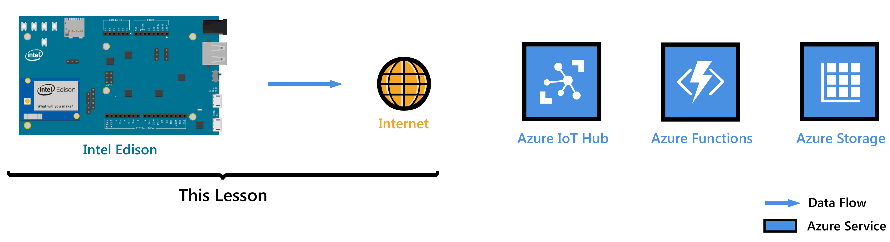
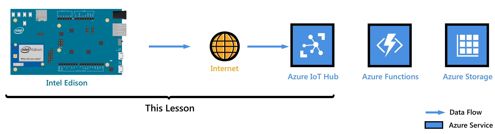
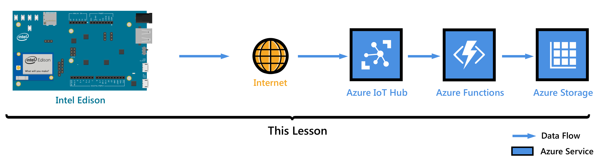
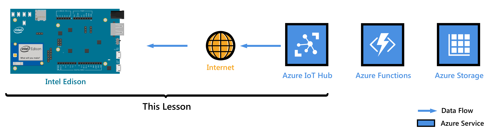

<properties
    pageTitle="将 Intel Edison (C) 连接到 Azure IoT - 入门 | Azure"
    description="开始使用 Intel Edison，创建 Azure IoT 中心，并将 Edison 连接到 IoT 中心"
    services="iot-hub"
    documentationcenter=""
    author="shizn"
    manager="timtl"
    tags=""
    keywords="intel edison 开发, azure iot 中心, 开始使用物联网, 物联网教程, adafruit 物联网, intel edison arduino, 开始使用 arduino"
    translationtype="Human Translation" />
<tags
    ms.assetid="4885fa2c-c2ee-4253-b37f-ccd55f92b006"
    ms.service="iot-hub"
    ms.devlang="c"
    ms.topic="article"
    ms.tgt_pltfrm="na"
    ms.workload="na"
    ms.date="3/21/2017"
    wacn.date="05/08/2017"
    ms.author="xshi"
    ms.sourcegitcommit="a114d832e9c5320e9a109c9020fcaa2f2fdd43a9"
    ms.openlocfilehash="26b23662b2b34baf4b06fe3ed53d2853461578de"
    ms.lasthandoff="04/14/2017" />

# 使用 C 将 Intel Edison 设备连接到 IoT 中心
>[AZURE.SELECTOR]
- [Node.JS](/documentation/articles/iot-hub-intel-edison-kit-node-get-started/)
- [C](/documentation/articles/iot-hub-intel-edison-kit-c-get-started/)

在本教程中，从学习如何使用 Intel Edison 的基础知识开始。 然后将学习如何使用 [Azure IoT 中心](/documentation/articles/iot-hub-what-is-iot-hub/)将设备无缝连接到云。

还没有工具包？ 从 [此处](/develop/iot/iot-starter-kits)

## 第 1 课：配置设备

在本课中，会为 Intel Edison 配置操作系统、设置开发环境，以及将应用程序部署到 Edison。

### 配置设备
首次配置 Intel Edison 进行使用的操作步骤如下：组装开发板，接通电源，在台式机操作系统中安装配置工具以刷写 Edison 固件、设置密码并将其连接到 Wi-Fi。  

*完成的估计时间：30 分钟*

转到[配置设备][configure-your-device]。

### 获取工具
下载相关工具和软件，为 Intel Edison 生成和部署第一个应用程序。

*估计完成时间：20 分钟*

转到 [获取工具][get-the-tools]。

### 创建和部署 blink 应用程序
克隆 GitHub 提供的示例 blink 应用程序，并使用 gulp 将此应用程序部署到 Intel Edison 板。 此示例应用程序每隔两秒让连接到板的 LED 闪烁一次。

*估计完成时间：5 分钟*

转到 [创建和部署 blink 应用程序][create-and-deploy-the-blink-application]。

## 第 2 课：创建 IoT 中心

在本课中，用户需创建免费的 Azure 帐户、预配 Azure IoT 中心，以及在 IoT 中心创建第一个设备。

开始本课之前，请完成第 1 课。

### 获取 Azure 工具
安装 Azure 命令行界面 (Azure CLI)。

*估计完成时间：10 分钟*

转到[获取 Azure 工具][get-azure-tools]。

### 创建 IoT 中心并注册 Intel Edison
使用 Azure CLI 创建资源组、预配第一个 Azure IoT 中心，并将第一个设备添加到 IoT 中心。

*估计完成时间：10 分钟*

转到[创建 IoT 中心并注册 Intel Edison](/documentation/articles/iot-hub-intel-edison-kit-c-lesson2-prepare-azure-iot-hub/)。

## 第 3 课：发送从设备到云的消息

在本课中，会将消息从 Edison 发送到 IoT 中心。此外还需创建一个 Azure 函数应用，以便获取 IoT 中心发出的传入消息并将其写入到 Azure 表存储。

开始本课之前，请完成第 1 课和第 2 课。

### 创建 Azure 函数应用和 Azure 存储帐户
使用 Azure Resource Manager 模板创建 Azure 函数应用和 Azure 存储帐户。

*估计完成时间：10 分钟*

转到[创建 Azure Function App 和 Azure 存储帐户][create-an-azure-function-app-and-azure-storage-account]。

### 运行示例应用程序，以便发送从设备到云的消息
在 Intel Edison 设备上部署并运行示例应用程序，将消息发送到 IoT 中心。

*估计完成时间：10 分钟*

转到[运行示例应用程序，以便发送从设备到云的消息][send-device-to-cloud-messages]。

### 读取保存在 Azure 存储中的消息
在将从设备到云的消息写入 Azure 存储时，对其进行监视。

*估计完成时间：5 分钟*

转到[读取保存在 Azure 存储中的消息][read-messages-persisted-in-azure-storage]。

## 第 4 课：发送从云到设备的消息

本课说明如何将消息从 Azure IoT 中心发送到 Intel Edison。这些消息控制连接到 Edison 的 LED 的开关行为。示例应用程序已准备就绪，你可以执行此任务了。

开始本课之前，请完成第 1 课、第 2 课和第 3 课。

### 运行示例应用程序，接收从云到设备的消息
第 4 课中的示例应用程序在 Edison 上运行，并监视来自 IoT 中心的传入消息。 新的 gulp 任务会将消息从 IoT 中心发送到 Edison，使 LED 闪烁。

*估计完成时间：10 分钟*

转到[运行示例应用程序，接收从云到设备的消息][receive-cloud-to-device-messages]。

### 可选部分：更改 LED 的开关行为
自定义这些消息，以便更改 LED 的开关行为。

*估计完成时间：10 分钟*

转到[可选部分：更改 LED 的开关行为][change-the-on-and-off-behavior-of-the-led]。

## 故障排除
如果在课程中遇到任何问题，可在 [故障排除][troubleshooting] 一文中查找解决方案。
<!-- Images and links -->

[configure-your-device]: /documentation/articles/iot-hub-intel-edison-kit-c-lesson1-configure-your-device/
[get-the-tools]: /documentation/articles/iot-hub-intel-edison-kit-c-lesson1-get-the-tools-win32/
[create-and-deploy-the-blink-application]: /documentation/articles/iot-hub-intel-edison-kit-c-lesson1-deploy-blink-app/
[get-azure-tools]: /documentation/articles/iot-hub-intel-edison-kit-c-lesson2-get-azure-tools-win32/
[create-an-azure-function-app-and-azure-storage-account]: /documentation/articles/iot-hub-intel-edison-kit-c-lesson3-deploy-resource-manager-template/
[send-device-to-cloud-messages]: /documentation/articles/iot-hub-intel-edison-kit-c-lesson3-run-azure-blink/
[read-messages-persisted-in-azure-storage]: /documentation/articles/iot-hub-intel-edison-kit-c-lesson3-read-table-storage/
[receive-cloud-to-device-messages]: /documentation/articles/iot-hub-intel-edison-kit-c-lesson4-send-cloud-to-device-messages/
[change-the-on-and-off-behavior-of-the-led]: /documentation/articles/iot-hub-intel-edison-kit-c-lesson4-change-led-behavior/
[troubleshooting]: /documentation/articles/iot-hub-intel-edison-kit-c-troubleshooting/

<!--Update_Description:update wording-->