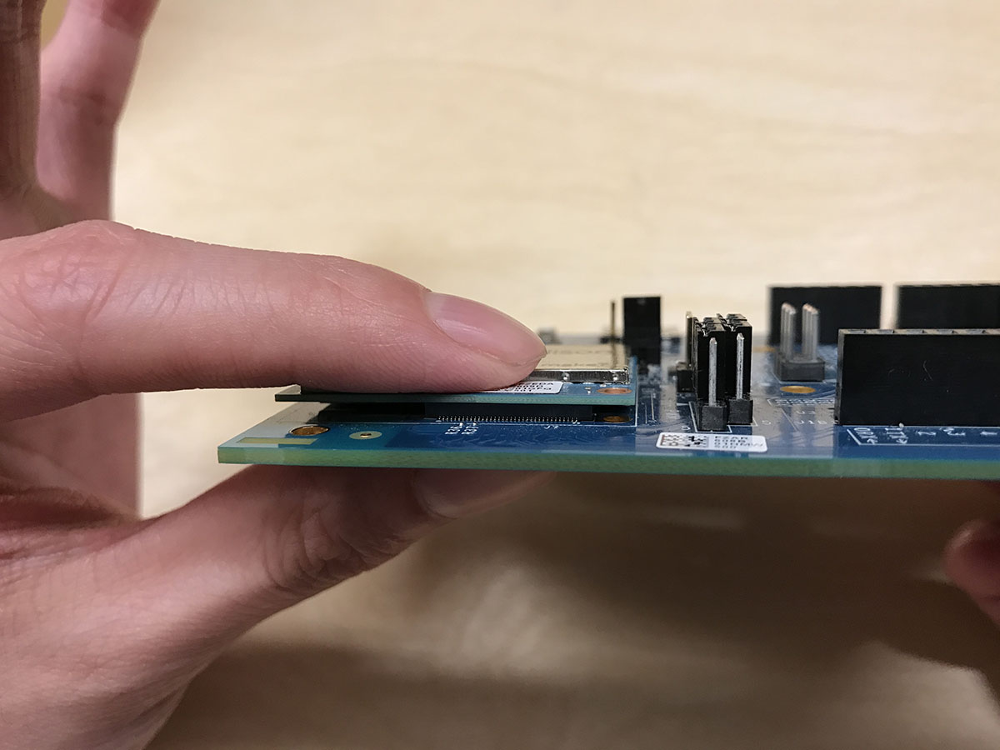
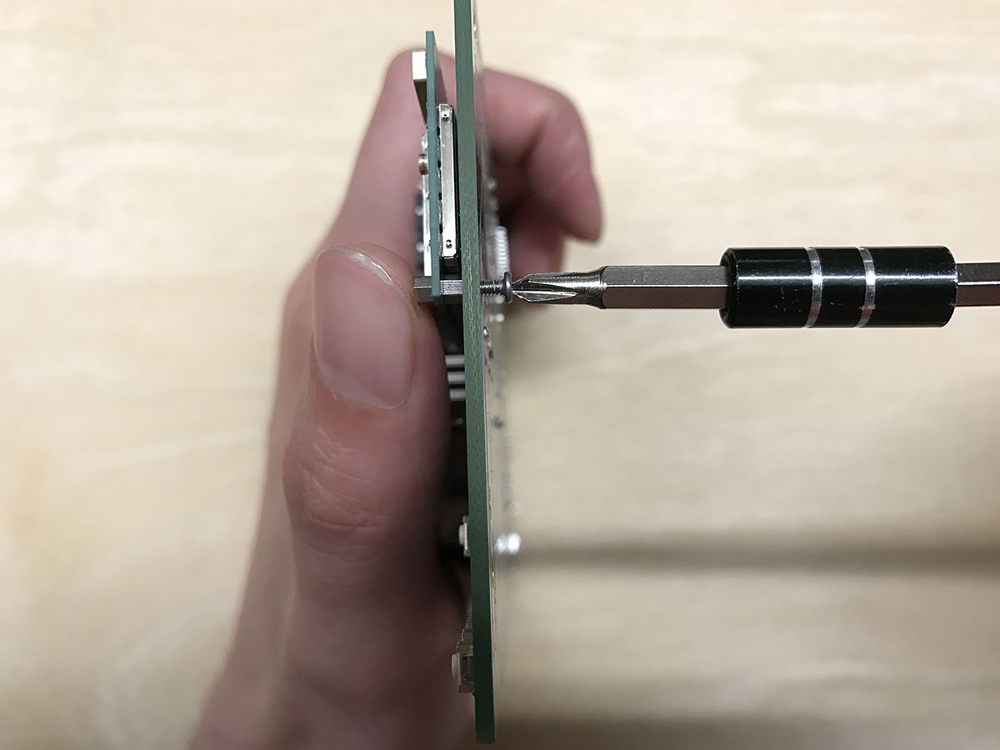
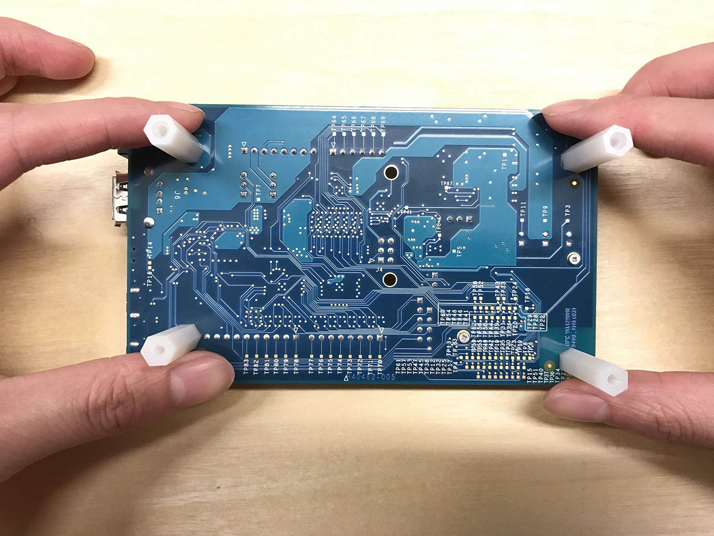
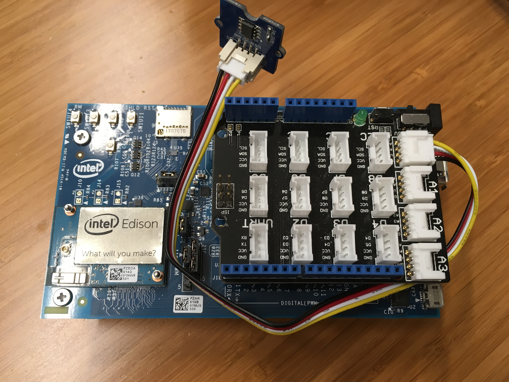
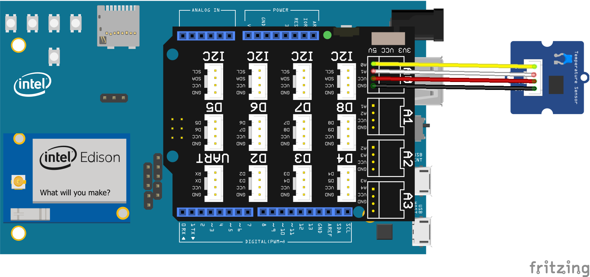
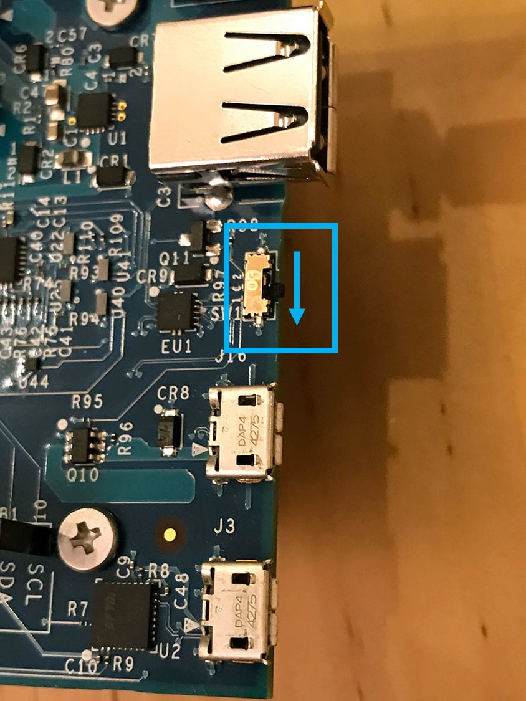
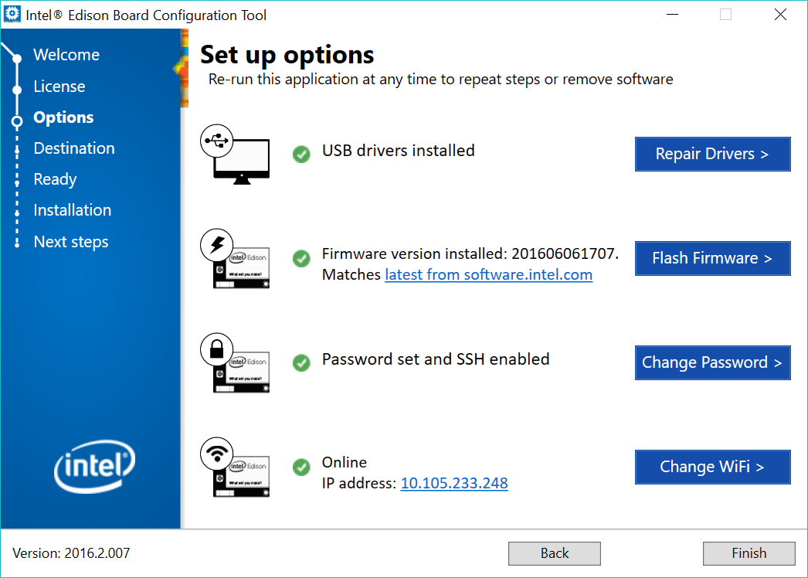
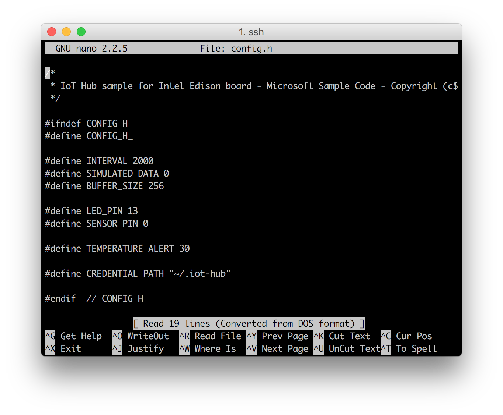
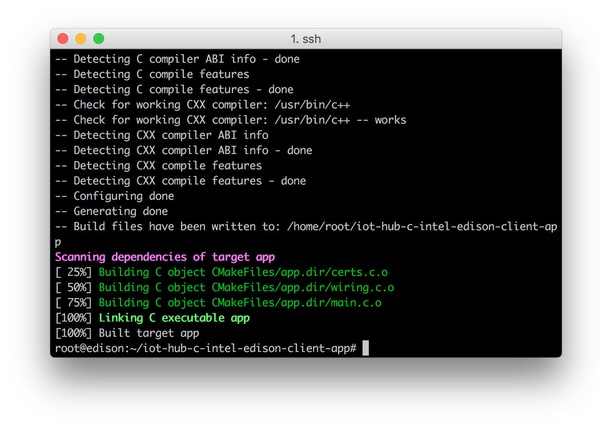
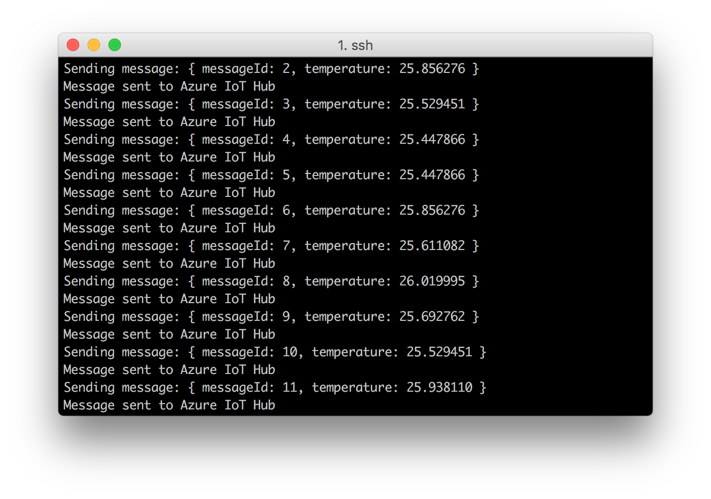

<properties
    pageTitle="Intel Edison 到云 (C) - 将 Intel Edison 连接到 Azure IoT 中心 | Azure"
    description="将 Intel Edison 连接到 Azure IoT 中心，以便 Intel Edison 向 Azure 云发送数据。"
    services="iot-hub"
    documentationcenter=""
    author="shizn"
    manager="timtl"
    tags=""
    keywords="azure iot intel edison, intel edison iot 中心, intel edison 发送数据到云, intel edison 到云" />
<tags
    ms.assetid="4885fa2c-c2ee-4253-b37f-ccd55f92b006"
    ms.service="iot-hub"
    ms.devlang="c"
    ms.topic="article"
    ms.tgt_pltfrm="na"
    ms.workload="na"
    ms.date="11/07/2016"
    wacn.date="06/05/2017"
    ms.author="v-yiso"
    ms.translationtype="Human Translation"
    ms.sourcegitcommit="08618ee31568db24eba7a7d9a5fc3b079cf34577"
    ms.openlocfilehash="82e414b0ee547bc4110bc80b768c077d950e3be4"
    ms.contentlocale="zh-cn"
    ms.lasthandoff="05/26/2017" />

# 将 Intel Edison 连接到 Azure IoT 中心 (C)

[AZURE.INCLUDE [iot-hub-get-started-device-selector](../../includes/iot-hub-get-started-device-selector.md)]

在本教程中，从学习如何使用 Intel Edison 的基础知识开始。 然后将学习如何使用 [Azure IoT 中心](/documentation/articles/iot-hub-what-is-iot-hub/)将设备无缝连接到云。

还没有工具包？ 从 [此处](/develop/iot/iot-starter-kits)

## 准备工作

* 安装 Intel Edison 和 Grove 模块。
* 创建 IoT 中心。
* 在 IoT 中心内为 Edison 注册设备。
* 在 Edison 上运行示例应用程序，以将传感器数据发送到 IoT 中心。

将 Intel Edison 连接到创建的 IoT 中心。 然后，在 Edison 上运行示例应用程序，以从 Grove 温度传感器收集温度和湿度数据。 最后，将传感器数据发送到 IoT 中心。

## 学习内容

* 如何创建 Azure IoT 中心以及如何获取新的设备连接字符串。
* 如何将 Edison 与 Grove 温度传感器连接起来。
* 如何通过在 Edison 上运行示例应用程序收集传感器数据。
* 如何将传感器数据发送到 IoT 中心。

## 需要什么

* Intel Edison 开发板
* Arduino 扩展板
* 一个有效的 Azure 订阅。 如果没有 Azure 帐户，只需花费几分钟就能创建一个 [Azure 试用帐户](/pricing/1rmb-trial/)。
* 运行 Windows 或 Linux 的 Mac 或 PC。
* Internet 连接。
* Micro B - Type A USB 线缆
* 直流 (DC) 电源。 电源应符合以下条件：
  - 7-15V DC
  - 至少 1500mA
  - 中心/内部插头应为电源的正极

以下项可选：

### 创建和部署 blink 应用程序
克隆 GitHub 提供的示例 blink 应用程序，并使用 gulp 将此应用程序部署到 Intel Edison 板。 此示例应用程序每隔两秒让连接到板的 LED 闪烁一次。

以下项可选：

* Grove Base Shield V2
* Grove - 温度传感器
* Grove 电缆
* 垫条或螺钉（随附在工具包内），其中包括两颗螺钉（用于将模块固定到扩展板上）以及四组螺钉和塑料垫片。

> [AZURE.NOTE] 
上述项可选，因为代码示例支持模拟的传感器数据。

[AZURE.INCLUDE [iot-hub-get-started-create-hub-and-device](../../includes/iot-hub-get-started-create-hub-and-device.md)]

## 安装 Intel Edison

### 组装开发板

本部分包括将 Intel® Edison 模块连接到扩展板的步骤。

1. 将 Intel® Edison 模块放在扩展板的白色区域内，将模块上的孔对准扩展板上的螺钉。

2. 将手指放在 `What will you make?` 文字上方，按压模板，直至感觉模块已就位。

   

3. 用两颗六角螺母（随附在工具包内）将模块固定到扩展板上。

   

4. 将一颗螺钉插入扩展板上的一个角孔（共四个）。 在螺钉上放置白色塑料垫片，转动并拧紧。

   

5. 重复上述步骤安装其他三个角垫。

   

现在，开发板就已组装完毕。

   

### 连接 Grove Base Shield 和温度传感器

1. 将 Grove Base Shield 放在板上。 确保所有引脚都紧紧插入板中。
   
   

2. 通过 Grove 电缆将 Grove 温度传感器连接到 Grove Base Shield **A0** 端口。

   
   

传感器现准备就绪。

### 为 Edison 接通电源

1. 插入电源。

   

2. 此时，绿色 LED（Arduino* 扩展板上标记为 DS1）应点亮并持续这一状态。

3. 稍等片刻，等待开发板完成启动。

   > [AZURE.NOTE]
   > 如果没有 DC 电源，仍可通过 USB 端口为开发板供电。 有关详细信息，请参阅 `Connect Edison to your computer` 部分。 采用这种方式为开发板供电可能会导致开发板出现异常，尤其是在使用 Wi-Fi 或驱动电机时。

### 将 Edison 连接到计算机

1. 向下扳动微动开关，使之朝向两个 micro USB 端口，将 Edison 设置为设备模式。 有关设备模式与主机模式的区别，请参阅 [此处](https://software.intel.com/en-us/node/628233#usb-device-mode-vs-usb-host-mode)。

   

2. 将 micro USB 线缆插入顶部的 micro USB 端口。

   

3. 将 USB 线缆的另一端插入计算机。

   

4. 如果计算机安装了新驱动器，则可确定开发板已完全初始化（就像将一张 SD 卡插入计算机）。

## 下载并运行配置工具
请从[此链接](https://software.intel.com/en-us/iot/hardware/edison/downloads)（在 `Installers` 标题下列出）获取最新配置工具。 运行该工具，并按照屏幕上的说明进行操作，在需要时单击“下一步”

### 刷写固件
1. 在 `Set up options` 页上，单击 `Flash Firmware`。
2. 执行以下操作之一选择要刷写到开发板上的映像：
   - 若要下载 Intel 提供的最新固件映像并使用该映像来刷写开发板，请选择 `Download the latest image version xxxx`。
   - 若要使用计算机上已保存的映像来刷写开发板，请选择 `Select the local image`。 浏览到要刷写到开发板的映像并选择。
3. 安装工具将尝试刷写开发板。 整个刷写过程最长可能需要 10 分钟。

### 设置密码
1. 在 `Set up options` 页上，单击 `Enable Security`。
2. 可为 Intel® Edison 开发板设置自定义名称。 这是可选的。
3. 为开发板键入密码，然后单击 `Set password`。
4. 记下密码，稍后会用到此密码。

### 连接 Wi-Fi
1. 在 `Set up options` 页上，单击 `Connect Wi-Fi`。 计算机将扫描可用的 Wi-Fi 网络，此过程最长可能需要 1 分钟。
2. 从 `Detected Networks` 下拉列表中，选择网络。
3. 从 `Security` 下拉列表中，选择网络的安全类型。
4. 提供登录名和密码信息，然后单击 `Configure Wi-Fi`。
5. 记下 IP 地址，稍后会用到此地址。

> [AZURE.NOTE]
> 确保 Edison 与计算机连接到同一网络。 计算机通过 IP 地址连接到 Edison。

   

祝贺你！ Edison 已配置成功。

## 在 Intel Edison 上运行示例应用程序

### 准备 Azure IoT 设备 SDK

1. 使用主计算机的以下任一 SSH 客户端连接到 Intel Edison。 IP 地址来自配置工具，密码与该工具中设置的相同。
    - [PuTTY](http://www.putty.org/) for Windows。
    - Ubuntu 或 macOS 上的内置 SSH 客户端。

2. 将示例客户端应用克隆到设备中。 

       git clone https://github.com/Azure-Samples/iot-hub-c-intel-edison-client-app.git

3. 然后导航到存储库文件夹，运行以下命令生成 Azure IoT SDK

       cd iot-hub-c-intel-edison-client-app
       sed -i -e 's/\r$//' buildSDK.sh
       chmod 755 buildSDK.sh
       ./buildSDK.sh

### 配置示例应用程序

1. 通过运行以下命令，打开配置文件：

       nano config.h

   

   此文件中有两个可配置的宏。 第一个是 `INTERVAL`，它确定发送到云的两条消息之间的时间间隔。 第二个是 `SIMULATED_DATA`，它是一个布尔值，指示是否使用模拟的传感器数据。

   如果**没有传感器**，请将 `SIMULATED_DATA` 值设置为 `1`，使示例应用程序创建和使用模拟的传感器数据。

2. 通过按“Ctrl-O”>“Enter”>“Ctrl-X”保存并退出。

### 生成并运行示例应用程序

1. 通过运行以下命令，生成示例应用程序：

       cmake . && make

   

1. 通过运行以下命令，生成示例应用程序：

       sudo ./app '<your Azure IoT hub device connection string>'

   > [AZURE.NOTE] 
   确保将设备连接字符串复制并粘贴到单引号中。

应看到以下输出，其中显示传感器数据以及发至 IoT 中心的消息。

## 后续步骤

此时已运行示例应用程序，收集传感器数据并将其发送到 IoT 中心。

[AZURE.INCLUDE [iot-hub-get-started-next-steps](../../includes/iot-hub-get-started-next-steps.md)]