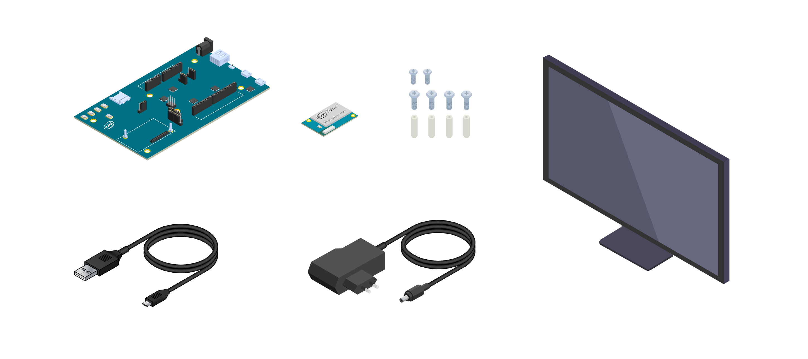
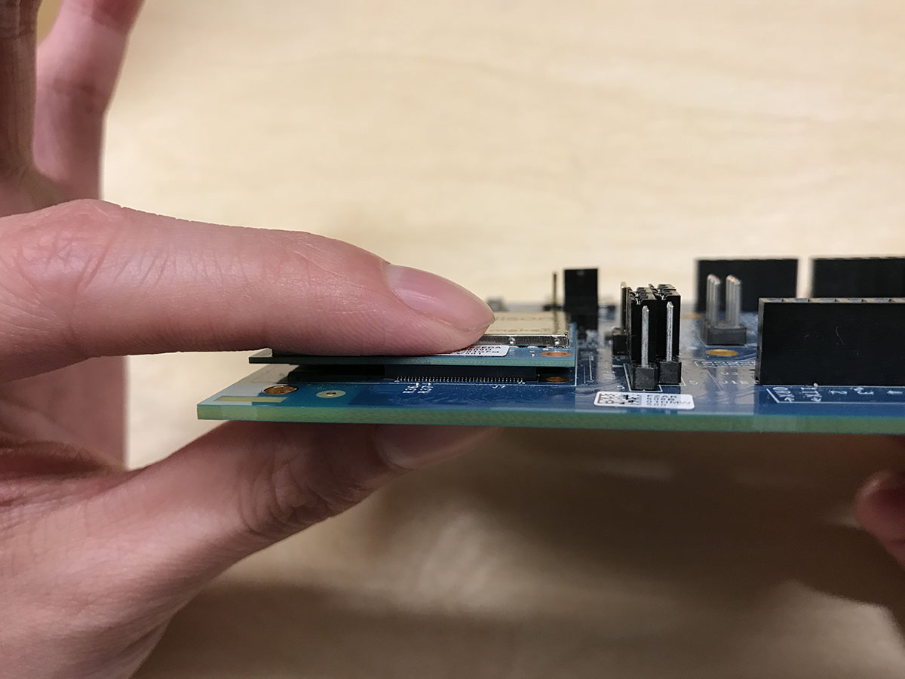
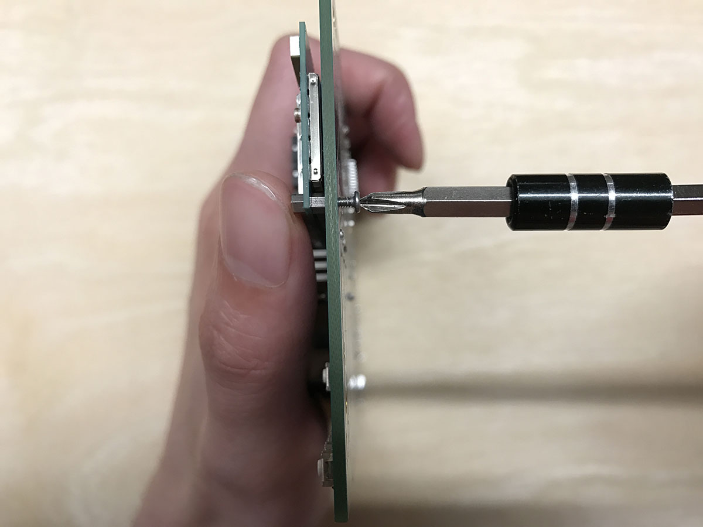
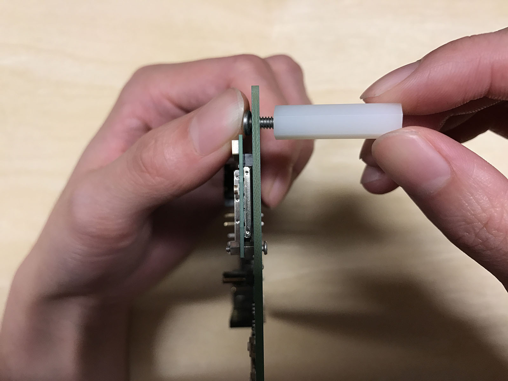
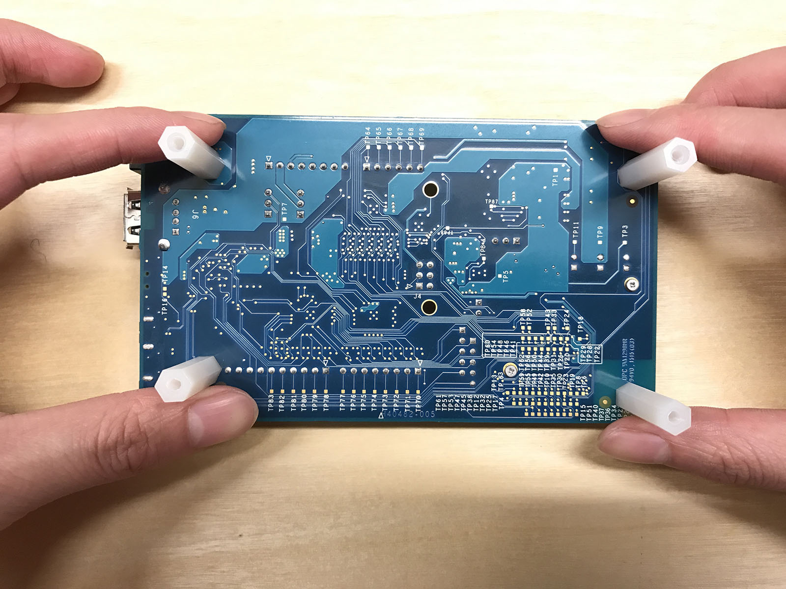
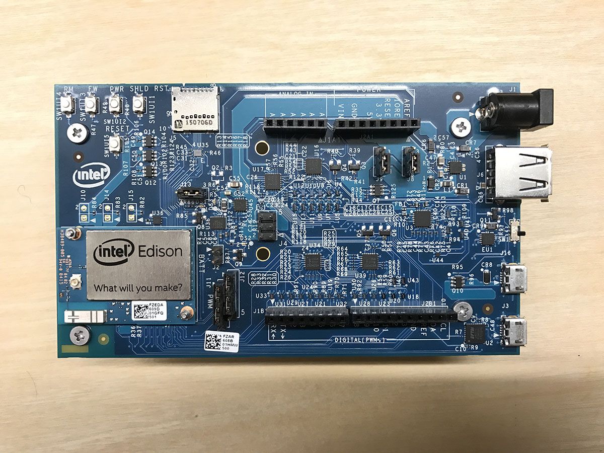
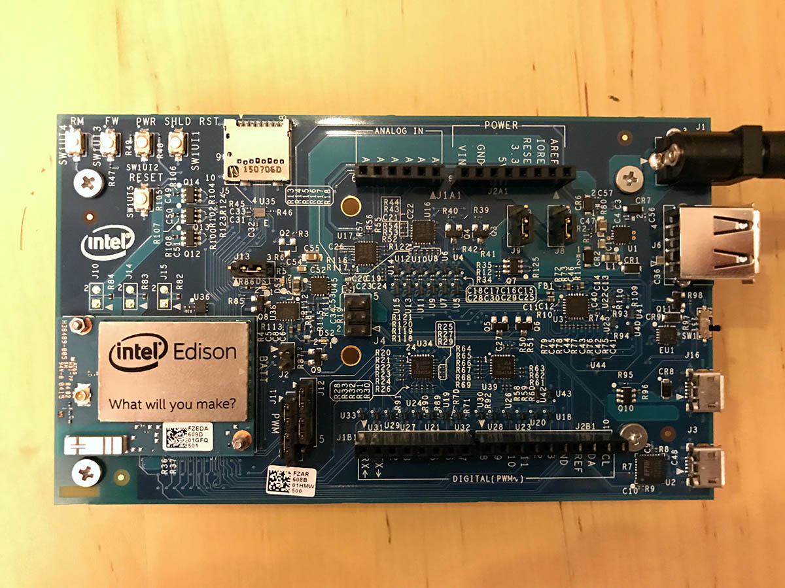
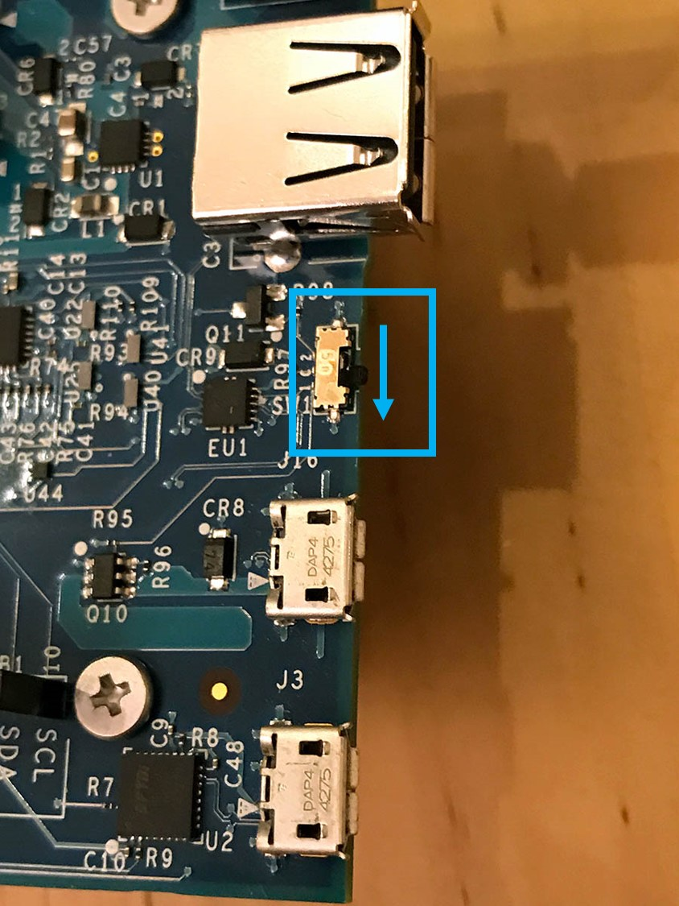
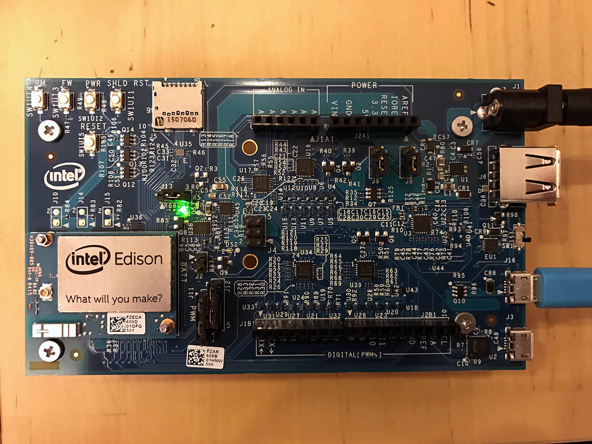
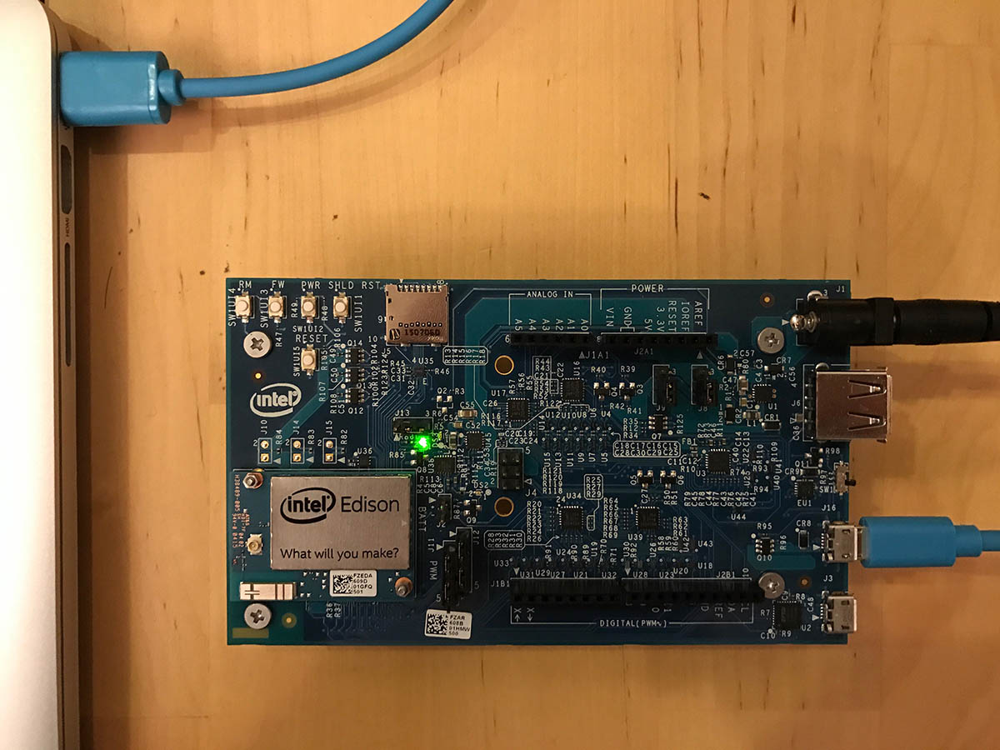

<properties
    pageTitle="配置 Edison Azure IoT 初学者工具包 | Azure"
    description="首次配置 Intel Edison 进行使用。"
    services="iot-hub"
    documentationcenter=""
    author="shizn"
    manager="timtl"
    tags=""
    keywords="arduino 安装, 将 arduino 连接到电脑, 安装 arduino, arduino 开发板" />
<tags
    ms.assetid="bb8aa45b-d3ff-4438-b9d6-a9725a45ade1"
    ms.service="iot-hub"
    ms.devlang="c"
    ms.topic="article"
    ms.tgt_pltfrm="na"
    ms.workload="na"
    ms.date="3/21/2017"
    wacn.date="05/08/2017"
    ms.author="xshi" />  

# 配置 Intel Edison
## 执行的操作
首次配置 Intel Edison 进行使用的操作步骤如下：组装开发板，接通电源，在台式机操作系统中安装配置工具以刷写 Edison 固件、设置密码并将其连接到 Wi-Fi。如果有问题，可在[故障排除页][troubleshooting]上查找解决方案。

## 你要学习的知识
本文介绍：

* 如何组装 Edison 开发板并接通电源。
* 如何刷写 Edison 固件、设置密码并连接 Wi-Fi。

## 需要什么
若要完成此操作，需要使用 Intel Edison 初学者工具包中的以下部件：

* Intel® Edison 模块
* Arduino 扩展板
* 垫条或螺钉（随附在工具包内），其中包括两颗螺钉（用于将模块固定到扩展板上）以及四组螺钉和塑料垫片。
* Micro B - Type A USB 线缆
* 直流 (DC) 电源。电源应符合以下条件：
  - 7-15V DC
  - 至少 1500mA
  - 中心/内部插头应为电源的正极

    

用户还需要：

* 运行 Windows、Mac 或 Linux 的计算机。
* 适合 Edison 连接的无线连接。
* Internet 访问权限（用于下载配置工具）。

## 组装开发板

本部分包括将 Intel® Edison 模块连接到扩展板的步骤。

1. 将 Intel® Edison 模块放在扩展板的白色区域内，将模块上的孔对准扩展板上的螺钉。

2. 将手指放在 `What will you make?` 文字上方，按压模板，直至感觉模块已就位。

      

3. 用两颗六角螺母（随附在工具包内）将模块固定到扩展板上。

      

4. 将一颗螺钉插入扩展板上的一个角孔（共四个）。在螺钉上放置白色塑料垫片，转动并拧紧。

      

5. 重复上述步骤安装其他三个角垫。

      

现在，开发板就已组装完毕。

     

## 为 Edison 接通电源

1. 插入电源。

      

2. 此时，绿色 LED（Arduino* 扩展板上标记为 DS1）应点亮并持续这一状态。

3. 稍等片刻，等待开发板完成启动。

    > [AZURE.NOTE]
    > 如果没有 DC 电源，仍可通过 USB 端口为开发板供电。有关详细信息，请参阅`Connect Edison to your computer`部分。采用这种方式为开发板供电可能会导致开发板出现异常，尤其是在使用 Wi-Fi 或驱动电机时。

## 将 Edison 连接到计算机

1. 向下扳动微动开关，使之朝向两个 micro USB 端口，将 Edison 设置为设备模式。有关设备模式与主机模式的区别，请参阅[此处](https://software.intel.com/zh-CN/node/628233#usb-device-mode-vs-usb-host-mode)。

      

2. 将 micro USB 线缆插入顶部的 micro USB 端口。

      

3. 将 USB 线缆的另一端插入计算机。

      

4. 如果计算机安装了新硬盘，则可确定开发板已完全初始化（就像将一张 SD 卡插入计算机）。

## 下载并运行配置工具
请从[此链接](https://software.intel.com/zh-cn/iot/hardware/edison/downloads)（在`Installers`标题下列出）获取最新配置工具。运行该工具，并按照屏幕上的说明进行操作，在需要时单击“下一步”

### 刷写固件
1. 在`Set up options`页面上，单击`Flash Firmware`。
2. 执行以下操作之一选择要刷写到开发板上的映像：
   - 若要下载 Intel 提供的最新固件映像并使用该映像来刷写开发板，请选择`Download the latest image version xxxx`。
   - 若要使用计算机上已保存的映像来刷写开发板，请选择`Select the local image`。浏览到要刷写到开发板的映像并选择。
3. 安装工具将尝试刷写开发板。整个刷写过程最长可能需要 10 分钟。

### 设置密码
1. 在`Set up options`页面上，单击`Enable Security`。
2. 可为 Intel® Edison 开发板设置自定义名称。这是可选的。
3. 为开发板键入密码，然后单击`Set password`。
4. 记下密码，稍后会用到此密码。

### 连接 Wi-Fi
1. 在`Set up options`页面上，单击`Connect Wi-Fi`。计算机将扫描可用的 Wi-Fi 网络，此过程最长可能需要 1 分钟。
2. 从`Detected Networks`下拉列表中，选择网络。
3. 从`Security`下拉列表中，选择网络的安全类型。
4. 提供登录名和密码信息，然后单击`Configure Wi-Fi`。
5. 记下 IP 地址，稍后会用到此地址。

> [AZURE.NOTE]
> 确保 Edison 与计算机连接到同一网络。计算机通过 IP 地址连接到 Edison。

祝贺你！ Edison 已配置成功。

## 摘要
在本文中，已经学习了如何组装 Edison 开发板，如何使用配置工具刷写其固件、设置密码以及将其连接到 Wi-Fi。请注意，LED 尚未亮起。下一任务是安装必要的工具和软件，准备在 Edison 上运行示例应用程序。

## 后续步骤
[获取工具][get-the-tools]
<!-- Images and links -->

[troubleshooting]: /documentation/articles/iot-hub-intel-edison-kit-c-troubleshooting/
[get-the-tools]: /documentation/articles/iot-hub-intel-edison-kit-c-lesson1-get-the-tools-win32/

<!---HONumber=Mooncake_0116_2017-->