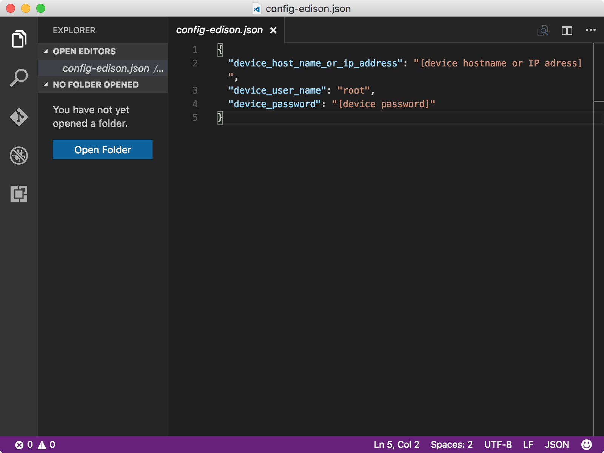

<properties
    pageTitle="将闪烁应用程序部署到 Azure IoT 初学者工具包中 | Azure"
    description="克隆 GitHub 提供的示例 C 应用程序，并使用 gulp 工具将此应用程序部署到 Intel Edison 开发板。此示例应用程序每隔两秒让连接到板的 LED 闪烁一次。"
    services="iot-hub"
    documentationcenter=""
    author="shizn"
    manager="timtl"
    tags=""
    keywords="arduino led 项目, arduino led 闪烁, arduino led 闪烁代码, arduino 闪烁程序, arduino 闪烁示例" />
<tags
    ms.assetid="b02dfd3f-28fd-4b52-8775-eb0eaf74d707"
    ms.service="iot-hub"
    ms.devlang="c"
    ms.topic="article"
    ms.tgt_pltfrm="na"
    ms.workload="na"
    ms.date="11/8/2016"
    wacn.date="01/23/2017"
    ms.author="xshi" />  

# 创建和部署 blink 应用程序
## 执行的操作
克隆 GitHub 提供的示例 C 应用程序，并使用 gulp 工具将该示例应用程序部署到 Intel Edison。此示例应用程序每隔两秒让连接到板的 LED 闪烁一次。如果有问题，可在[故障排除页][troubleshooting]上查找解决方案。

## 你要学习的知识
* 如何在 Edison 上部署和运行示例应用程序。

## 需要什么
必须成功完成以下操作：

* [配置设备][configure-your-device]
* [获取工具][get-the-tools]

## 打开示例应用程序
若要打开示例应用程序，请执行以下步骤：

1. 通过运行以下命令克隆 GitHub 中的示例存储库：

   
		git clone https://github.com/Azure-Samples/iot-hub-c-edison-getting-started.git
   
2. 通过运行以下命令在 Visual Studio Code 中打开示例应用程序：

   
		   cd iot-hub-c-edison-getting-started
		   cd Lesson1
		   code .
   

    ![存储库结构][repo-structure]  

    `app` 子文件夹中的文件是重要的源文件，其中包含用于控制 LED 的代码。

### 安装应用程序依赖项
运行以下命令，安装示例应用程序所需的库和其他模块：

		npm install

## 配置设备连接
若要配置设备连接，请执行以下步骤：

1. 运行以下命令，生成设备配置文件：

   
		gulp init
   

    配置文件 `config-edison.json` 包含用于登录到 Edison 的用户凭据。为了避免用户凭据泄漏，配置文件在计算机主文件夹的 `.iot-hub-getting-started` 子文件夹中生成。

2. 运行以下命令，在 Visual Studio Code 中打开设备配置文件：

   
		   # For Windows command prompt
		   code %USERPROFILE%\.iot-hub-getting-started\config-edison.json

		   # For MacOS or Ubuntu
		   code ~/.iot-hub-getting-started/config-edison.json
   

3. 将占位符 `[device hostname or IP address]` 和 `[device password]` 替换为上一课中记录的 IP 地址和密码。

      

祝贺你！ Edison 的第一个示例应用程序已创建成功。

## 部署并运行示例应用程序
### 在 Edison 上安装 Azure IoT 中心 SDK
运行以下命令，在 Edison 上安装 Azure IoT 中心 SDK：

		gulp install-tools

完成此任务可能耗时较长，具体取决于网络连接情况。一个 Edison 只能运行一次。

### 部署并运行示例应用
运行以下命令，部署并运行示例应用程序：

		gulp deploy && gulp run

### 确保应用正常运行
LED 闪烁 20 次后，示例应用程序会自动终止。如果看不到 LED 闪烁，请参阅[故障排除指南][troubleshooting]，了解常见问题的解决方案。

![LED 闪烁][led-blinking]  

## 摘要
已安装适用于 Edison 的必需工具，并已将使 LED 闪烁的示例应用程序部署到 Edison。现在可以创建、部署以及运行其他示例应用程序，以便将 Edison 连接到发送和接收消息的 Azure IoT 中心。

## 后续步骤
[获取 Azure 工具][get-the-azure-tools]

<!-- Images and links -->

[troubleshooting]: /documentation/articles/iot-hub-intel-edison-kit-c-troubleshooting/
[Configure-your-device]: /documentation/articles/iot-hub-intel-edison-kit-c-lesson1-configure-your-device/
[get-the-tools]: /documentation/articles/iot-hub-intel-edison-kit-c-lesson1-get-the-tools-win32/
[repo-structure]: ./media/iot-hub-intel-edison-lessons/lesson1/repo_structure_c.png
[led-blinking]: ./media/iot-hub-intel-edison-lessons/lesson1/led_blinking_c.jpg
[get-the-azure-tools]: /documentation/articles/iot-hub-intel-edison-kit-c-lesson2-get-azure-tools-win32/

<!---HONumber=Mooncake_0116_2017-->