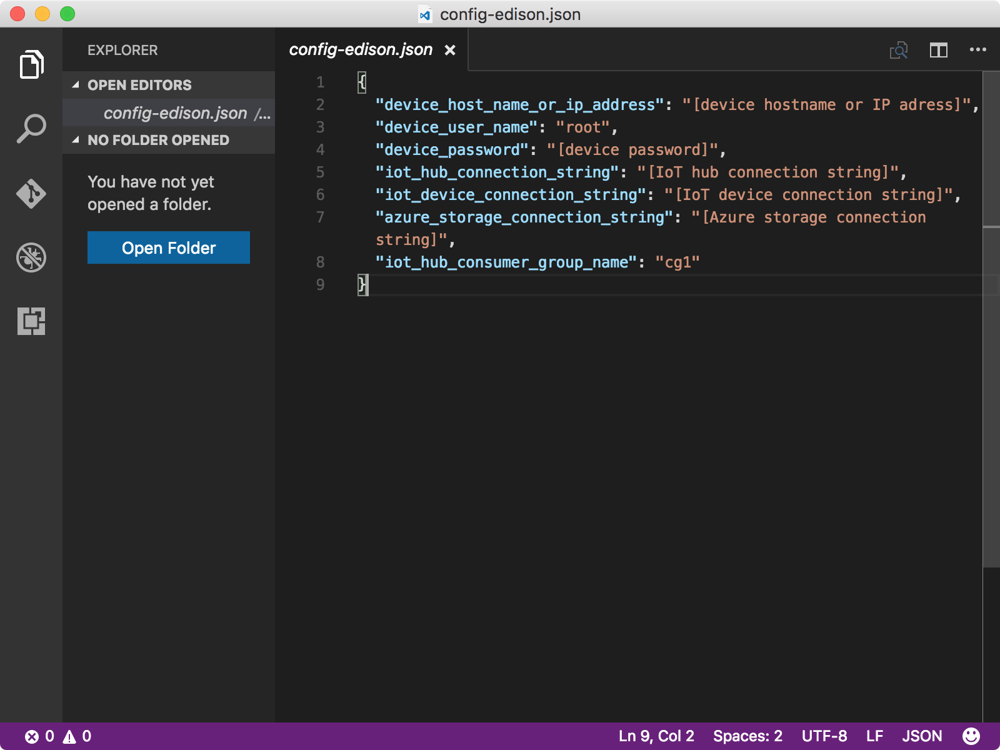

<properties
    pageTitle="运行示例应用程序，接收来自 Azure IoT 中心的云到设备消息 | Azure"
    description="示例应用程序在 Edison 上运行，监视来自 IoT 中心的传入消息。新的 gulp 任务会将消息从 IoT 中心发送到 Edison，使 LED 闪烁。"
    services="iot-hub"
    documentationcenter=""
    author="shizn"
    manager="timtl"
    tags=""
    keywords="arduino 从 web 控制 led, arduino 通过 web 控制 led" />
<tags
    ms.assetid="820d38f3-d3b8-4249-9e2b-f1b9b771e62f"
    ms.service="iot-hub"
    ms.devlang="c"
    ms.topic="article"
    ms.tgt_pltfrm="na"
    ms.workload="na"
    ms.date="3/21/2017"
    wacn.date="05/08/2017"
    ms.author="xshi" />  

# 运行示例应用程序，接收云到设备消息
在本文中，你将在 Intel Edison 上部署示例应用程序。示例应用程序监视来自 IoT 中心的传入消息。还会在计算机上运行 gulp 任务，将消息从 IoT 中心发送到 Edison。示例应用程序在收到这些消息后，就会让 LED 闪烁。如果有问题，可在[故障排除页][troubleshooting]上查找解决方案。

## 执行的操作
* 将示例应用程序连接到 IoT 中心。
* 部署并运行示例应用程序。
* 将消息从 IoT 中心发送到 Edison，使 LED 闪烁。

## 你要学习的知识
本文介绍：

 - 如何监视来自 IoT 中心的传入消息。
 - 如何将云到设备消息从 IoT 中心发送到 Edison。

## 需要什么
* Intel Edison，设置以供使用。若要了解如何设置 Edison，请参阅[配置设备][configure-your-device]。
* 一个 IoT 中心，已在 Azure 订阅中创建。若要了解如何创建 IoT 中心，请参阅[创建 Azure IoT 中心][create-your-azure-iot-hub]。

## 将示例应用程序连接到 IoT 中心
1. 确保位于存储库文件夹 `iot-hub-c-edison-getting-started` 中。通过运行以下命令在 Visual Studio Code 中打开示例应用程序：

   
		cd Lesson4
		code .
   

    `app` 子文件夹中的文件是重要的源文件，其中包含用于监视来自 IoT 中心的传入消息的代码。`blinkLED` 函数可使 LED 闪烁。

    ![示例应用程序中的存储库结构][repo-structure]  

2. 运行以下命令初始化配置文件：

   
		npm install
		gulp init
   

    如果已在此计算机上完成[创建 Azure Function App 和存储帐户][create-an-azure-function-app-and-storage-account]中的步骤，并继承了所有配置，则可跳过该步骤，转到部署并运行示例应用程序的任务。如果用户在另一计算机上完成了[创建 Azure 函数应用和存储帐户][create-an-azure-function-app-and-storage-account]中的步骤，则需替换 `config-edison.json` 文件中的占位符。`config-edison.json` 文件位于主文件夹的子文件夹中。

      

   * 将 **[设备主机名或 IP 地址]** 替换为配置设备时标记的设备 IP 地址。
   * 将 **[IoT 设备连接字符串]** 替换为通过运行 `az iot device show-connection-string --hub-name {my hub name} --device-id {device id}` 命令获取的设备连接字符串。
   * 将 **[IoT 中心连接字符串]** 替换为通过运行 `az iot hub show-connection-string --name {my hub name}` 命令获取的 IoT 中心连接字符串。

    > [AZURE.NOTE]
    > 如果尚未在第 1 课中完成，请同时运行 **gulp install-tools**。

## 部署并运行示例应用程序
运行以下命令，在 Edison 上部署并运行示例应用程序：

	gulp deploy && gulp run

gulp 命令会将示例应用程序部署到 Edison。然后，它会在 Edison 上运行该应用程序，并在主计算机上运行单独的任务，从 IoT 中心将 20 条闪烁消息发送到 Edison。

在示例应用程序运行以后，它会开始侦听 IoT 中心发出的消息。同时，gulp 任务会将多条“闪烁”消息从 IoT 中心发送到 Edison。Edison 每收到一条闪烁消息，示例应用程序就会调用一次 `blinkLED` 函数，使 LED 闪烁。

gulp 任务将 20 条消息从 IoT 中心发送到 Edison 时，应看到 LED 每隔两秒闪烁一次。最后一条为“停止”消息，会停止示例应用程序的运行。

![使用 gulp 命令和闪烁消息的示例应用程序][gulp-command-and-blink-messages]  

## 摘要
已成功将消息从 IoT 中心发送到 Edison，使 LED 闪烁。下一任务为可选任务：更改 LED 的开关行为。

## 后续步骤
[更改 LED 的开关行为][change-the-on-and-off-behavior-of-the-led]

<!-- Images and links -->

[troubleshooting]: /documentation/articles/iot-hub-intel-edison-kit-c-troubleshooting/
[configure-your-device]: /documentation/articles/iot-hub-intel-edison-kit-c-lesson1-configure-your-device/
[create-your-azure-iot-hub]: /documentation/articles/iot-hub-intel-edison-kit-c-lesson2-prepare-azure-iot-hub/
[repo-structure]: ./media/iot-hub-intel-edison-lessons/lesson4/repo_structure_c.png
[create-an-azure-function-app-and-storage-account]: /documentation/articles/iot-hub-intel-edison-kit-c-lesson3-deploy-resource-manager-template/
[gulp-command-and-blink-messages]: ./media/iot-hub-intel-edison-lessons/lesson4/gulp_blink_c.png
[change-the-on-and-off-behavior-of-the-led]: /documentation/articles/iot-hub-intel-edison-kit-c-lesson4-change-led-behavior/

<!---HONumber=Mooncake_0103_2017-->