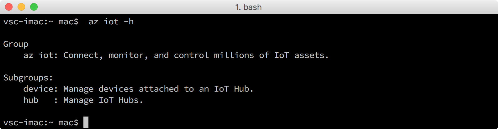

<properties
    pageTitle="获取用于 Azure IoT 初学者工具包 (macOS 10.10) 的 Azure 工具 | Azure"
    description="在 macOS 上安装 Python 和 Azure 命令行接口 (Azure CLI)。"
    services="iot-hub"
    documentationcenter=""
    author="shizn"
    manager="timtl"
    tags=""
    keywords="azure cli, iot 云服务, arduino 云" />
<tags
    ms.assetid="8a2a8031-b1a6-4219-b17d-2825550c35e1"
    ms.service="iot-hub"
    ms.devlang="nodejs"
    ms.topic="article"
    ms.tgt_pltfrm="na"
    ms.workload="na"
    ms.date="11/8/2016"
    wacn.date="01/06/2017"
    ms.author="xshi" />  

# 获取 Azure 工具 (macOS 10.10)
> [!div class="op_single_selector"]
> * [Windows 7 及更高版本][windows]
> * [Ubuntu 16.04][ubuntu]
> * [macOS 10.10][macos]

## 执行的操作
安装 Azure 命令行接口 (Azure CLI)。如果有问题，可在[故障排除页][troubleshooting]上查找解决方案。

## 你要学习的知识
本文介绍：
* 如何安装 Azure CLI。
* 如何添加 Azure CLI 的 IoT 子组。

## 需要什么
* 启用 Internet 连接的 Mac。
* 一个有效的 Azure 订阅。如果没有 Azure 帐户，只需花费几分钟就能创建一个 [Azure 试用帐户](/pricing/1rmb-trial/)。

## 安装 Python
虽然 macOS 随附现成的 Python 2.7，但建议通过 Homebrew 安装 Python。请参阅 [Installing Python on macOS](http://docs.python-guide.org/en/latest/starting/install/osx/)（在 macOS 上安装 Python）。

通过运行以下命令安装 Python 和 pip：

		brew install python

## 安装 Azure CLI
Azure CLI 提供适用于 Azure 的多平台命令行体验。可以直接通过命令行预配和管理资源。

若要安装最新 Azure CLI，请执行以下步骤：

1. 在终端窗口运行以下命令。安装 Azure CLI 可能需要五分钟。

   
		   pip install --upgrade azure-cli
		   pip install --upgrade azure-cli-iot
   
2. 运行以下命令，对安装进行验证：

   
		   az iot -h
   

如果安装成功，则会看到以下输出。

  

## 摘要
已安装 Azure CLI。下一任务是使用 Azure CLI 创建 Azure IoT 中心和设备标识。

## 后续步骤
[创建 IoT 中心并注册 Intel Edison][create-your-iot-hub-and-register-intel-edison]
<!-- Images and links -->

[troubleshooting]: /documentation/articles/iot-hub-intel-edison-kit-node-troubleshooting/
[create-your-iot-hub-and-register-intel-edison]: /documentation/articles/iot-hub-intel-edison-kit-node-lesson2-prepare-azure-iot-hub/
[windows]: /documentation/articles/iot-hub-intel-edison-kit-node-lesson2-get-azure-tools-win32/
[ubuntu]: /documentation/articles/iot-hub-intel-edison-kit-node-lesson2-get-azure-tools-ubuntu/
[macos]: /documentation/articles/iot-hub-intel-edison-kit-node-lesson2-get-azure-tools-mac/

<!---HONumber=Mooncake_0103_2017-->