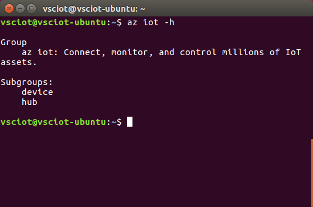

<properties
    pageTitle="获取用于 Azure IoT 初学者工具包 (Ubuntu 16.04) 的 Azure 工具 | Azure"
    description="在 Ubuntu 上安装 Python 和 Azure 命令行接口 (Azure CLI)。"
    services="iot-hub"
    documentationcenter=""
    author="shizn"
    manager="timtl"
    tags=""
    keywords="azure cli, iot 云服务, arduino 云" />
<tags
    ms.assetid="6dcb34bf-54a3-4af0-ba89-95d5cfafceff"
    ms.service="iot-hub"
    ms.devlang="nodejs"
    ms.topic="article"
    ms.tgt_pltfrm="na"
    ms.workload="na"
    ms.date="3/21/2017"
    wacn.date="05/08/2017"
    ms.author="xshi" />  

# 获取 Azure 工具 (Ubuntu 16.04)
> [AZURE.SELECTOR]
- [Windows 7 及更高版本][windows]
- [Ubuntu 16.04][ubuntu]
- [macOS 10.10][macos]

## 执行的操作
安装 Azure 命令行接口 (Azure CLI)。如果有问题，可在[故障排除页][troubleshooting]上查找解决方案。

## 你要学习的知识
本文介绍：

 - 如何安装 Azure CLI。
 - 如何添加 Azure CLI 的 IoT 子组。

## 需要什么
* 启用 Internet 连接的 Ubuntu 计算机。
* 一个有效的 Azure 订阅。如果没有帐户，只需花费几分钟就能创建一个[免费试用帐户](/pricing/1rmb-trial/)。

## 安装 Azure CLI
Azure CLI 提供适用于 Azure 的多平台命令行体验，让用户能够直接通过命令行完成资源的预配和管理。

若要安装最新 Azure CLI，请执行以下步骤：

1. 在终端窗口运行以下命令。安装 Azure CLI 可能需要五分钟。

		   sudo apt-get update
		   sudo apt-get install -y libssl-dev libffi-dev
		   sudo apt-get install -y python-dev
		   sudo apt-get install -y build-essential
		   sudo apt-get install -y python-pip
		   sudo pip install --upgrade azure-cli
		   sudo pip install --upgrade azure-cli-iot
		   
2. 运行以下命令，对安装进行验证：

		   az iot -h

    如果安装成功，则会看到以下输出。

      

## 摘要
已安装 Azure CLI。下一任务是使用 Azure CLI 创建 Azure IoT 中心和设备标识。

## 后续步骤
[创建 IoT 中心并注册 Intel Edison][create-your-iot-hub-and-register-intel-edison]

<!-- Images and links -->

[troubleshooting]: /documentation/articles/iot-hub-intel-edison-kit-node-troubleshooting/
[create-your-iot-hub-and-register-intel-edison]: /documentation/articles/iot-hub-intel-edison-kit-node-lesson2-prepare-azure-iot-hub/
[windows]: /documentation/articles/iot-hub-intel-edison-kit-node-lesson2-get-azure-tools-win32/
[ubuntu]: /documentation/articles/iot-hub-intel-edison-kit-node-lesson2-get-azure-tools-ubuntu/
[macos]: /documentation/articles/iot-hub-intel-edison-kit-node-lesson2-get-azure-tools-mac/

<!---HONumber=Mooncake_0103_2017-->