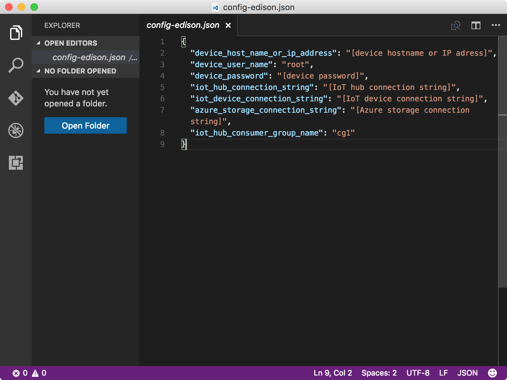

<properties
    pageTitle="运行示例应用程序，将设备到云消息发送到 Azure IoT 中心 | Azure"
    description="在 Intel Edison 上部署并运行示例应用程序，将消息发送到 IoT 中心并使 LED 闪烁。"
    services="iot-hub"
    documentationcenter=""
    author="shizn"
    manager="timtl"
    tags=""
    keywords="iot 云服务, arduino 向云发送数据" />
<tags
    ms.assetid="1b3b1074-f4d4-42ac-b32c-55f18b304b44"
    ms.service="iot-hub"
    ms.devlang="nodejs"
    ms.topic="article"
    ms.tgt_pltfrm="na"
    ms.workload="na"
    ms.date="11/8/2016"
    wacn.date="01/06/2017"
    ms.author="xshi" />  

# 运行示例应用程序，以便发送从设备到云的消息
## 执行的操作
本文说明如何在 Intel Edison 上部署和运行示例应用程序，以便将消息发送到 IoT 中心。如果有问题，可在[故障排除页][troubleshooting]上查找解决方案。

## 你要学习的知识
可学习如何使用 gulp 工具在 Edison 上部署和运行示例 C 应用程序。

## 需要什么
* 在开始此任务之前，用户必须已成功完成[创建 Azure 函数应用和存储帐户，以便处理和存储 IoT 中心消息][process-and-store-iot-hub-messages]。

## 获取 IoT 中心和设备连接字符串
设备连接字符串用于将 Edison 连接到 IoT 中心。IoT 中心连接字符串用于将 IoT 中心连接到在 IoT 中心代表 Edison 的设备标识。

* 运行以下 Azure CLI 命令，列出资源组中的所有 IoT 中心：

    	az iot hub list -g iot-sample --query [].name

使用 `iot-sample` 作为 `{resource group name}` 的值（如果尚未更改此值）。

* 运行以下 Azure CLI 命令，获取 IoT 中心连接字符串：

    	az iot hub show-connection-string --name {my hub name}

`{my hub name}` 是创建 IoT 中心和注册 Edison 时指定的名称。

* 运行以下命令，获取设备连接字符串：

    	az iot device show-connection-string --hub-name {my hub name} --device-id myinteledison

使用 `myinteledison` 作为 `{device id}` 的值（如果尚未更改此值）。

## 配置设备连接
1. 运行以下命令初始化配置文件：

   
		   npm install
		   gulp init
   

2. 运行以下命令，在 Visual Studio Code 中打开设备配置文件 `config-edison.json`：

   
		   # For Windows command prompt
		   code %USERPROFILE%\.iot-hub-getting-started\config-edison.json

		   # For MacOS or Ubuntu
		   code ~/.iot-hub-getting-started/config-edison.json
   

     

3. 在 `config-edison.json` 文件中进行以下替换：

   * 将 **[设备主机名或 IP 地址]** 替换为配置设备时标记的设备 IP 地址。
   * 将 **[IoT 设备连接字符串]** 替换为获得的 `device connection string`。
   * 将 **[IoT 中心连接字符串]** 替换为获得的 `iot hub connection string`。

   > [AZURE.NOTE]
   本文中不需要 `azure_storage_connection_string`。请保留该名称。

## 部署并运行示例应用程序
运行以下命令，在 Edison 上部署并运行示例应用程序：

	gulp deploy && gulp run

## 验证示例应用程序是否正常运行
应看到连接到 Edison 的 LED 每隔两秒闪烁一次。每次 LED 闪烁时，示例应用程序都会将消息发送到 IoT 中心，并验证该消息是否已成功发送到 IoT 中心。此外，IoT 中心收到的每条消息都会在控制台窗口输出。示例应用程序发送 20 条消息后会自动终止。

![包含已发送和已接收消息的示例应用程序][sample-application-with-sent-and-received-messages]  

## 摘要
已在 Edison 上部署和运行新的 blink 示例应用程序，目的是将设备到云消息发送到 IoT 中心。现可在将消息写入存储帐户时对其进行监视。

## 后续步骤
[读取保存在 Azure 存储中的消息][read-messages-persisted-in-azure-storage]
<!-- Images and links -->

[troubleshooting]: /documentation/articles/iot-hub-intel-edison-kit-node-troubleshooting/
[process-and-store-iot-hub-messages]: /documentation/articles/iot-hub-intel-edison-kit-node-lesson3-deploy-resource-manager-template/
[sample-application-with-sent-and-received-messages]: ./media/iot-hub-intel-edison-lessons/lesson3/gulp_run.png
[read-messages-persisted-in-azure-storage]: /documentation/articles/iot-hub-intel-edison-kit-node-lesson3-read-table-storage/

<!---HONumber=Mooncake_0103_2017-->