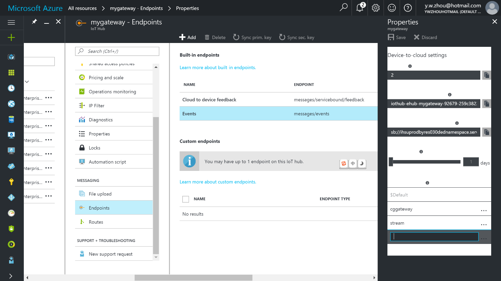
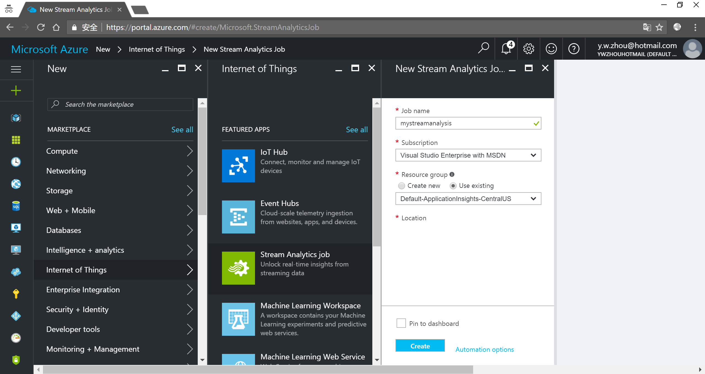
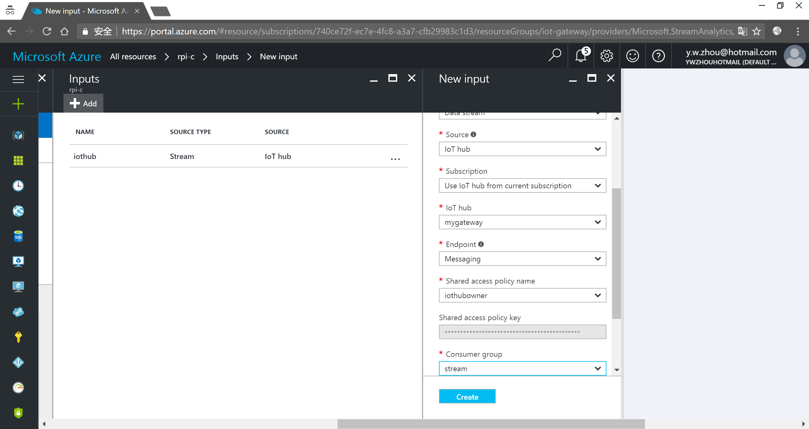
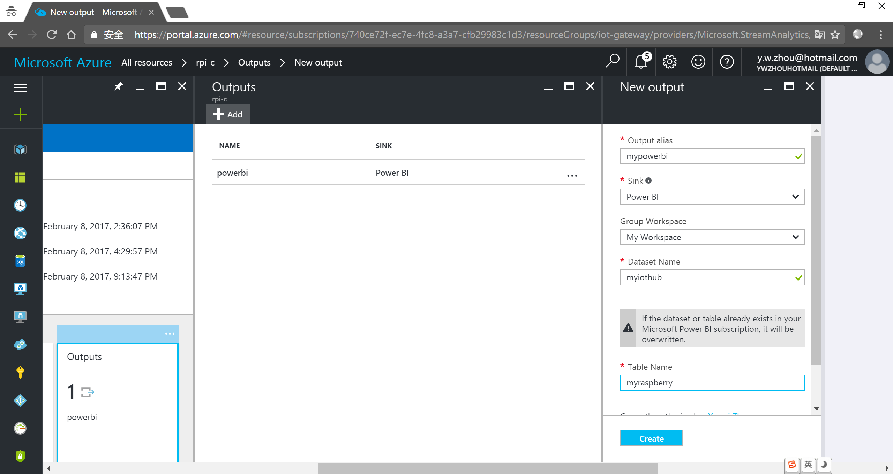
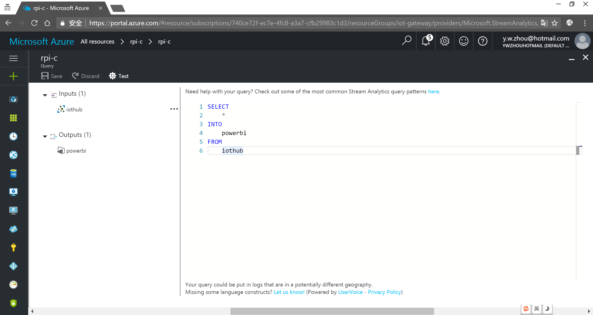
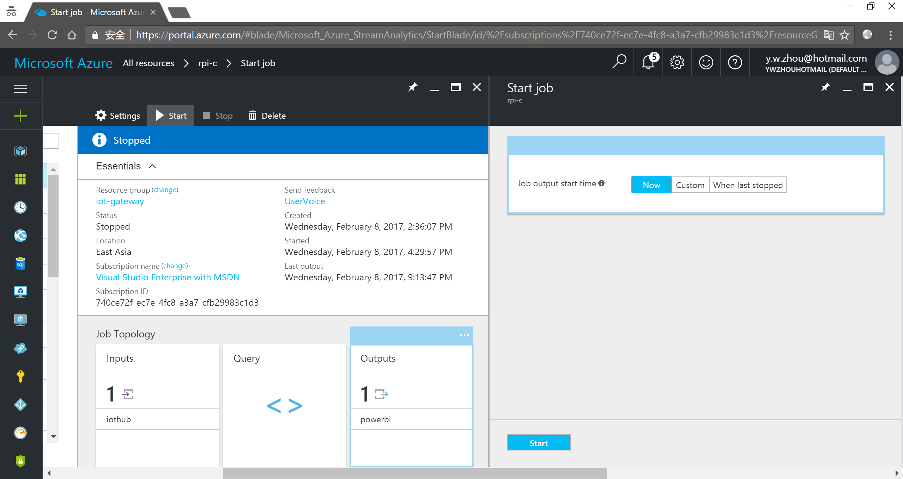
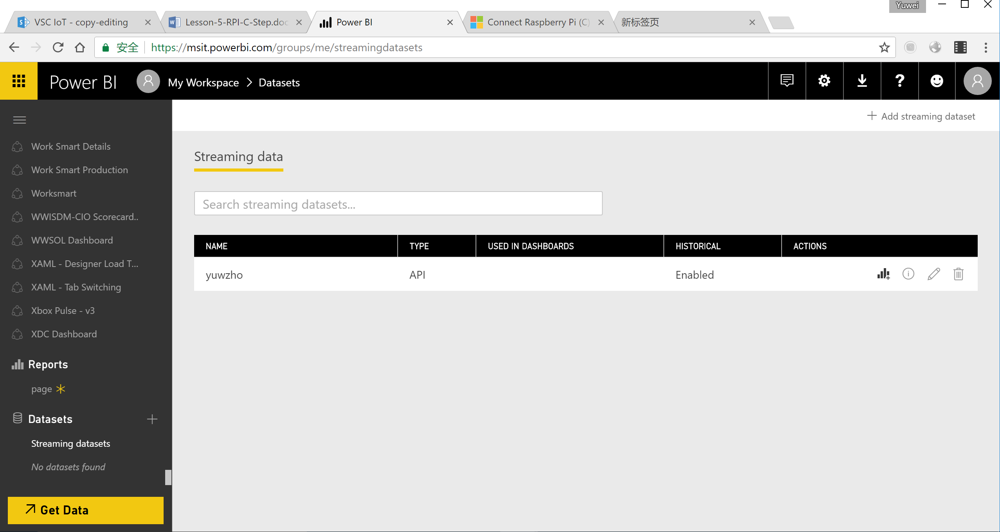
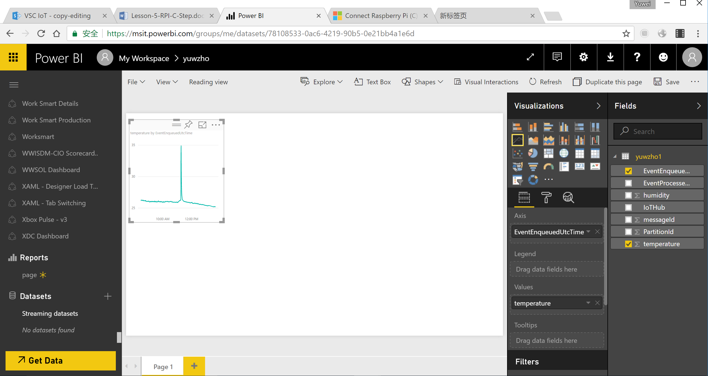
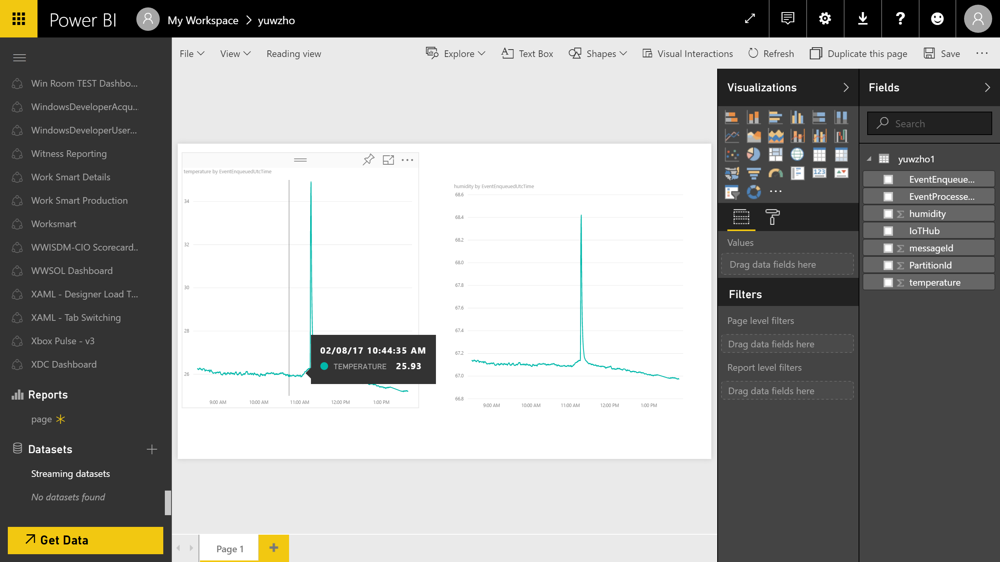
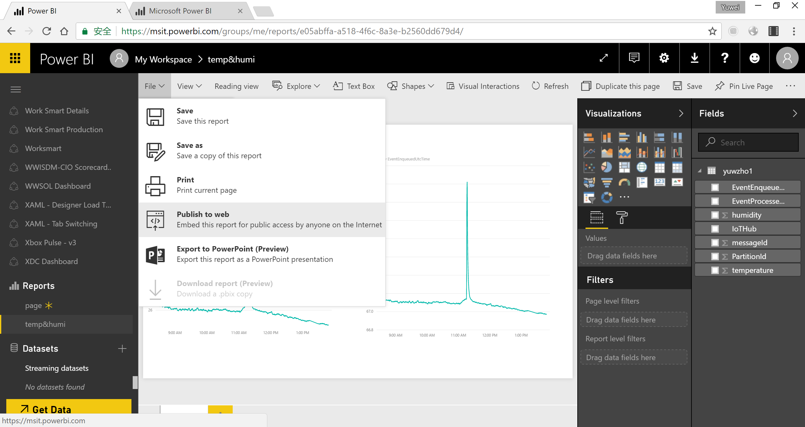

<properties
    pageTitle="Azure IoT 中心的实时传感器数据可视化 - Power BI | Azure"
    description="使用 Power BI 可视化从传感器收集的温度和湿度数据并将其发送到 Azure IoT 中心。"
    services="iot-hub"
    documentationcenter=""
    author="shizn"
    manager="timtl"
    tags=""
    keywords="实时数据可视化, 即时数据可视化, 传感器数据可视化" />
<tags
    ms.assetid="e67c9c09-6219-4f0f-ad42-58edaaa74f61"
    ms.service="iot-hub"
    ms.devlang="arduino"
    ms.topic="article"
    ms.tgt_pltfrm="na"
    ms.workload="na"
    ms.date="03/29/2017"
    wacn.date="05/15/2017"
    ms.author="xshi"
    ms.translationtype="Human Translation"
    ms.sourcegitcommit="457fc748a9a2d66d7a2906b988e127b09ee11e18"
    ms.openlocfilehash="e7bb991202d564cf34900e6e658fc860a910eeb9"
    ms.contentlocale="zh-cn"
    ms.lasthandoff="05/05/2017" />

# 使用 Power BI 可视化 Azure IoT 中心的实时传感器数据

[AZURE.INCLUDE [iot-hub-get-started-note](../../includes/iot-hub-get-started-note.md)]

## 学习内容

了解如何可视化 Azure IoT 中心通过 Power BI 接收的实时传感器数据。 若要尝试使用 Web 应用可视化 IoT 中心的数据，请参阅[使用 Azure Web 应用可视化 Azure IoT 中心的实时传感器数据](/documentation/articles/iot-hub-live-data-visualization-in-web-apps/)。

## 准备工作

- 添加一个使用者组，让 IoT 中心做好数据访问准备。
- 创建、配置和运行流分析作业，以便将数据从 IoT 中心传输到 Power BI 帐户。
- 创建并发布实现数据可视化的 Power BI 报表。

## 所需条件

- 满足已完成的教程[将 ESP8266 连接到 Azure IoT 中心](/documentation/articles/iot-hub-arduino-huzzah-esp8266-get-started/)所述的以下要求：
  - 一个有效的 Azure 订阅。
  - 已在订阅中创建一个 Azure IoT 中心。
  - 一个可向 Azure IoT 中心发送消息的客户端应用程序。
- 一个 Power BI 帐户。 （[免费试用 Power BI](https://powerbi.microsoft.com/)）

## 将使用者组添加到 IoT 中心

应用程序使用使用者组从 Azure IoT 中心提取数据。 在本课程中，你将创建一个使用者组，供流分析作业用来从 IoT 中心读取数据。

若要将使用者组添加到 IoT 中心，请执行以下步骤：

1. 在 [Azure 门户](https://ms.portal.azure.com/)中打开 IoT 中心。
1. 在左窗格中单击“终结点”，在中间窗格中选择“事件”，在右窗格的“使用者组”下面输入名称，然后单击“保存”。

    

## 创建、配置和运行流分析作业

### 创建流分析作业

1. 在 Azure 门户中，单击“新建”>“物联网”>“流分析作业”。
1. 为作业输入以下信息。

   **作业名称**：作业的名称。 该名称必须全局唯一。

   **资源组**：使用 IoT 中心所用的同一资源组。

   **位置**：与资源组使用同一位置。

   **固定仪表板**：选中此选项可以方便地从仪表板访问 IoT 中心。

    

1. 单击“创建”。

### 向流分析作业添加输入

1. 打开流分析作业。
1. 在“作业拓扑”下，单击“输入”。
1. 在“输入”窗格中单击“添加”，然后输入以下信息：

   **输入别名**：输入的唯一别名。

   **源**：选择“IoT 中心”。

   **使用者组**：选择刚创建的使用者组。
   
1. 单击“创建”。

    

### 向流分析作业添加输出

1. 在“作业拓扑”下，单击“输出”。
1. 在“输出”窗格中单击“添加”，然后输入以下信息：

   **输出别名**：输出的唯一别名。

   **接收器**：选择“Power BI”。
1. 单击“授权”，然后登录到 Power BI 帐户。
1. 获得授权后，请输入以下信息：

   **组工作区**：选择目标组工作区。

   **数据集名称**：输入数据集名称。

   **表名称**：输入表名称。
1. 单击“创建” 。

    

### 配置流分析作业的查询

1. 在“作业拓扑”下，单击“查询”。
1. 将 `[YourInputAlias]` 替换为作业的输入别名。
1. 将 `[YourOutputAlias]` 替换为作业的输出别名。
1. 单击“保存” 。

    

### 运行流分析作业

在流分析作业中，单击“启动” > “现在” > “启动”。 成功启动作业以后，作业状态将从“已停止”更改为“正在运行”。

## 创建并发布实现数据可视化的 Power BI 报表

1. 确保示例应用程序正在运行。 否则请运行以下命令，以便在 Pi 上运行该应用程序：

        gulp run

1. 登录到 [Power BI](https://powerbi.microsoft.com/en-us/) 帐户。
1. 转到组工作区，该工作区是在为流分析作业创建输出时设置的。
1. 单击“流式处理数据集”。

   此时会看到列出的数据集，该数据集是在为流分析作业创建输出时指定的。
1. 在“操作”下，单击第一个用于创建报表的图标。

    

1. 创建折线图，显示某段时间的实时温度。
   1. 在报表创建页面上，添加折线图。
   1. 在“字段”窗格中展开一个表，该表是在为流分析作业创建输出时指定的。
   1. 将 **EventEnqueuedUtcTime** 拖至“可视化效果”窗格中的“轴”。
   1. 将“温度”拖至“值”。

      现在创建了一个折线图。 图表的 X 轴显示 UTC 时区的日期和时间。 Y 轴显示来自传感器的温度。

      

1. 创建另一个折线图，显示某段时间的实时湿度。 为此，请执行上述相同步骤，将 **EventEnqueuedUtcTime** 置于 X 轴，将“湿度”置于 Y 轴。

    

1. 单击“保存”以保存该报表。
1. 单击“文件” > “发布到 Web”。
1. 单击“创建嵌入代码”，然后单击“发布”。

系统会为你提供一个报表链接，方便你将其共享给任何需要进行报表访问的人；同时还会为你提供一个代码片段，方便你将报表集成到博客或网站中。

Microsoft 还提供 [Power BI 移动应用](https://powerbi.microsoft.com/en-us/documentation/powerbi-power-bi-apps-for-mobile-devices/)，用于在移动设备上查看 Power BI 仪表板和报表并进行交互。

## 后续步骤

现已成功使用 Power BI 可视化 Azure IoT 中心的实时传感器数据。
还可以通过另一种方法可视化 Azure IoT 中心的数据。 请参阅[使用 Azure Web 应用可视化 Azure IoT 中心的实时传感器数据](/documentation/articles/iot-hub-live-data-visualization-in-web-apps/)。

[AZURE.INCLUDE [iot-hub-get-started-next-steps](../../includes/iot-hub-get-started-next-steps.md)]