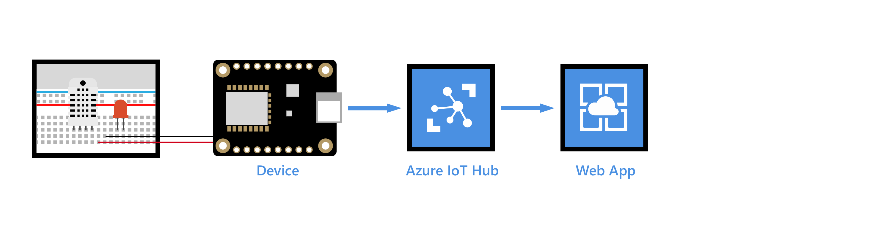
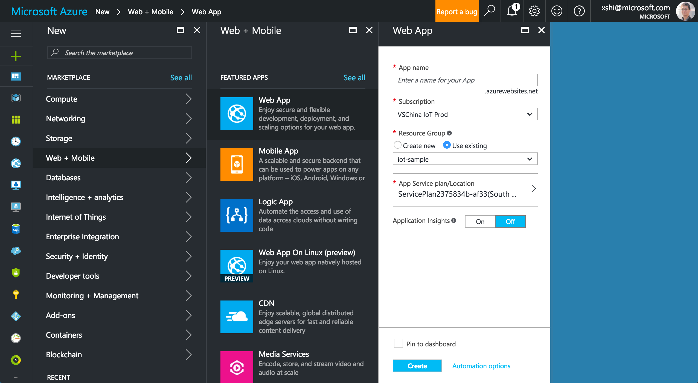
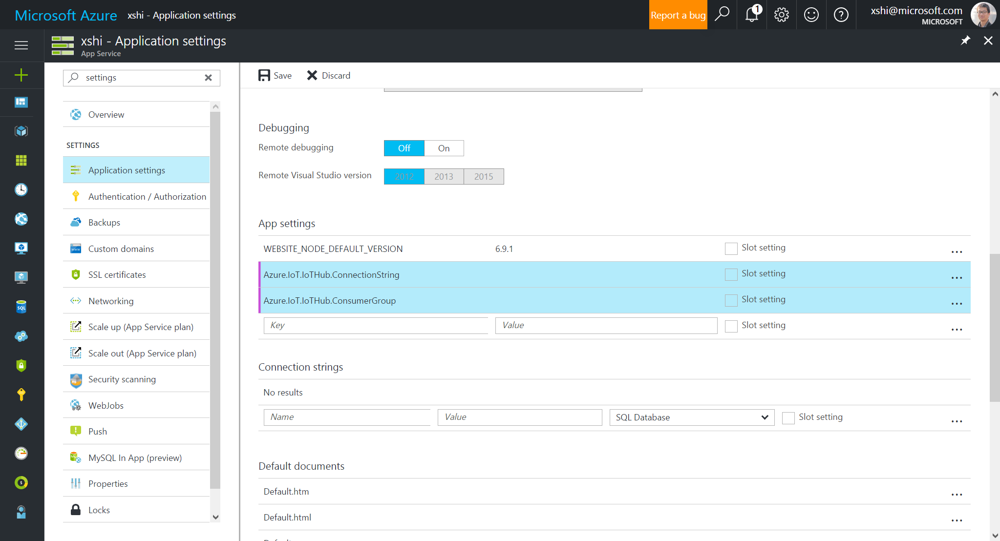
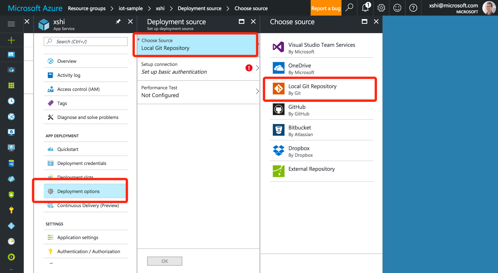
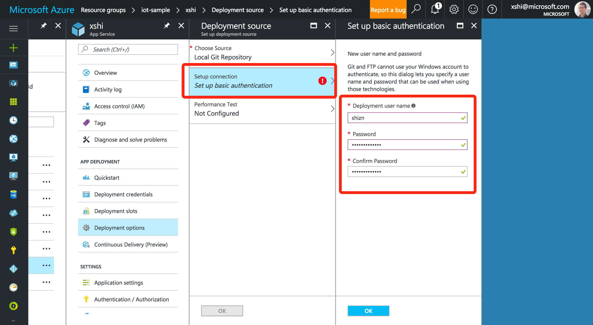
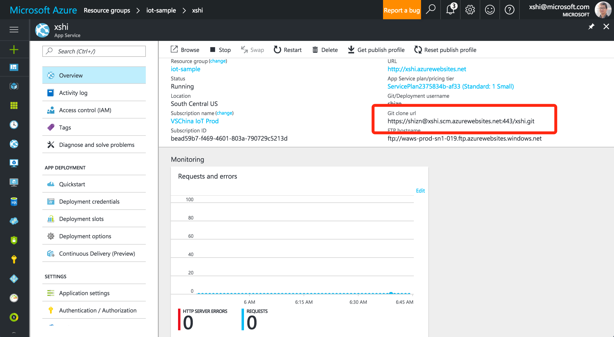
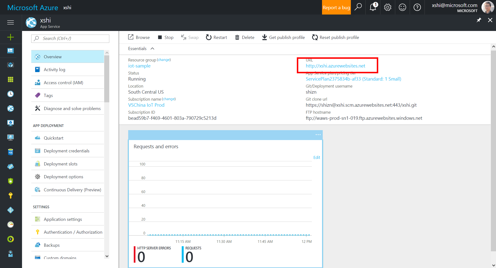
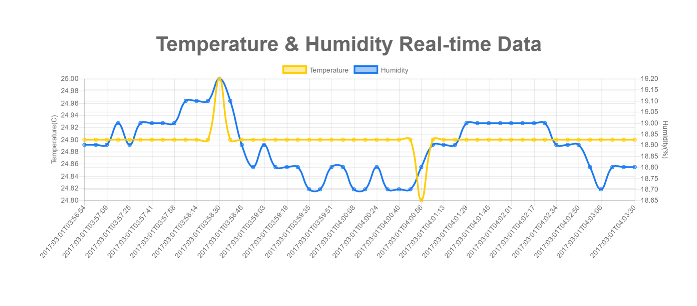

<properties
    pageTitle="Azure IoT 中心的实时传感器数据可视化 – Web 应用 | Azure"
    description="使用 Azure Web 应用可视化从传感器收集的温度和湿度数据并将其发送到 Azure IoT 中心。"
    services="iot-hub"
    documentationcenter=""
    author="shizn"
    manager="timtl"
    tags=""
    keywords="实时数据可视化, 即时数据可视化, 传感器数据可视化" />
<tags
    ms.assetid="e42b07a8-ddd4-476e-9bfb-903d6b033e91"
    ms.service="iot-hub"
    ms.devlang="arduino"
    ms.topic="article"
    ms.tgt_pltfrm="na"
    ms.workload="na"
    ms.date="03/29/2017"
    wacn.date="06/05/2017"
    ms.author="v-yiso"
    ms.translationtype="Human Translation"
    ms.sourcegitcommit="08618ee31568db24eba7a7d9a5fc3b079cf34577"
    ms.openlocfilehash="8dfcf9a033f9ad18c84f33b93dfd5792be13475f"
    ms.contentlocale="zh-cn"
    ms.lasthandoff="05/26/2017" />

# 使用 Azure Web 应用可视化 Azure IoT 中心的实时传感器数据

[AZURE.INCLUDE [iot-hub-get-started-note](../../includes/iot-hub-get-started-note.md)]

## 学习内容

本课程讲解如何通过运行一个托管在 Azure Web 应用上的 Web 应用程序来可视化 Azure IoT 中心接收的实时传感器数据。 如果你想要尝试使用 Power BI 可视化 IoT 中心的数据，请参阅[使用 Power BI 可视化 Azure IoT 中心的实时传感器数据](/documentation/articles/iot-hub-live-data-visualization-in-power-bi/)。

## 准备工作

- 在 Azure 门户中创建一个 Azure Web 应用。
- 添加一个使用者组，让 IoT 中心做好数据访问准备。
- 将 Web 应用配置为从 IoT 中心读取传感器数据。
- 上传要在 Web 应用中托管的 Web 应用程序。
- 打开该 Web 应用，查看 IoT 中心的实时温度和湿度数据。

## 需要什么

- 已完成教程[设置设备](/documentation/articles/iot-hub-raspberry-pi-kit-node-get-started/)，其中涵盖以下要求：
  - 一个有效的 Azure 订阅。
  - 已在订阅中创建一个 Azure IoT 中心。
  - 一个可向 Azure IoT 中心发送消息的客户端应用程序。
- Git。 （[下载 Git](https://www.git-scm.com/downloads)）。

## 创建 Azure Web 应用

1. 在 [Azure 门户](https://portal.azure.cn/)中，单击“新建” > “Web + 移动” > “Web 应用”。
1. 输入唯一的作业名称，验证订阅，指定资源组和位置，选择“固定到仪表板”，然后单击“创建”。

    建议选择资源组所在的同一位置。 这有助于加快处理速度，降低数据传输费用。

    

[AZURE.INCLUDE [iot-hub-get-started-create-consumer-group](../../includes/iot-hub-get-started-create-consumer-group.md)]

## 将 Web 应用配置为从 IoT 中心读取数据

1. 打开刚刚预配的 Web 应用。
1. 单击“应用程序设置”，然后在“应用设置”下面添加以下键/值对：

   | 键                                   | 值                                                        |
   |---------------------------------------|--------------------------------------------------------------|
   | Azure.IoT.IoTHub.ConnectionString     | 从 iothub-explorer 获取                                |
   | Azure.IoT.IoTHub.DeviceId             | 从 iothub-explorer 获取                                |
   | Azure.IoT.IoTHub.ConsumerGroup        | 添加到 IoT 中心的使用者组的名称  |

    

## 上传要在 Web 应用中托管的 Web 应用程序

我们在 GitHub 中提供了一个 Web 应用程序，它可以显示 IoT 中心的实时传感器数据。 你只需将 Web 应用配置为使用 Git 存储库，从 GitHub 下载该 Web 应用程序，然后将它上传到 Azure，以便在 Web 应用中托管。

1. 在 Web 应用中，单击“部署选项” > “选择源” > “本地 Git 存储库”。

    

1. 单击“设置连接”，创建用于连接到 Azure 中 Git 存储库的用户名和密码，然后单击“确定”。

    

1. 单击“确定”完成配置。
1. 单击“概述”并记下“Git 克隆 URL”的值。

    

1. 在本地计算机上打开命令提示符或终端窗口。
1. 从 GitHub 下载 Web 应用程序并将它上传到 Azure，以便在 Web 应用中托管。 为此，请运行以下命令：

        git clone https://github.com/Azure-Samples/web-apps-node-iot-hub-data-visualization.git
        git remote add webapp <Git clone URL>
        git push webapp master:master

   > [AZURE.NOTE]
   > “Git 克隆 URL”是 Web 应用的“概述”页中显示的 Git 存储库的 URL。\<\>

## 打开该 Web 应用，查看 IoT 中心的实时温度和湿度数据

在 Web 应用的“概述”页上，单击 URL 打开 Web 应用。

此时应会看到 IoT 中心的实时温度和湿度数据。

## 后续步骤
现已成功使用 Azure Web 应用可视化 Azure IoT 中心的实时传感器数据。

还可以通过另一种方法可视化 Azure IoT 中心的数据。 请参阅[使用 Power BI 可视化 Azure IoT 中心的实时传感器数据](/documentation/articles/iot-hub-live-data-visualization-in-power-bi/)。

[AZURE.INCLUDE [iot-hub-get-started-next-steps](../../includes/iot-hub-get-started-next-steps.md)]